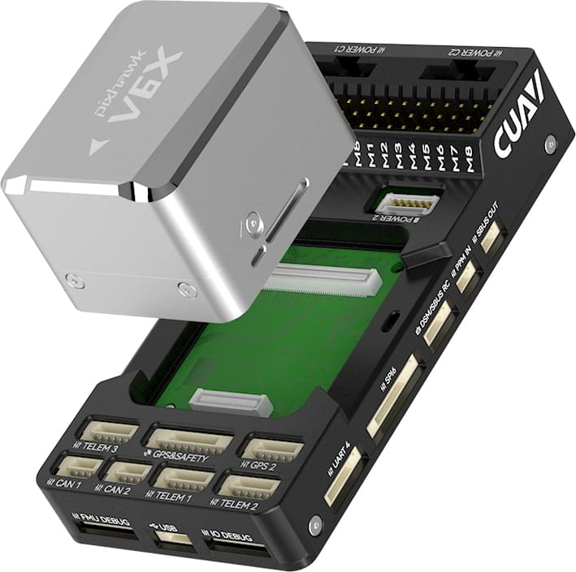

# 기본 개념

This topic provides a basic introduction to drones and using PX4 (it is meant mostly for novice users but is also a good introduction for more experienced users).

기본 개념에 익숙하시면, [기본 조립](../assembly/README.md)편에서 자동비행장치의 배선 방법을 공부할 수 있습니다. To load firmware and set up the vehicle with _QGroundControl_, see [Basic Configuration](../config/index.md).

## 드론의 정의

A drone, or Unmanned Vehicles (UV), is an unmanned "robotic" vehicle that can be manually or autonomously controlled. They can travel in air, on the ground, on/under the water, and are used for many [consumer, industrial, government and military applications](https://px4.io/ecosystem/commercial-systems/), including aerial photography/video, carrying cargo, racing, search and surveying, and so on.

Drones are more formally referred to as Unmanned Aerial Vehicles (UAV), Unmanned Ground Vehicles (UGV), Unmanned Surface Vehicles (USV), Unmanned Underwater Vehicles (UUV).

::: info
The term Unmanned Aerial System (UAS) typically refers to a UAV and all of the other components of a complete system, including a ground control station and/or radio controller, and any other systems used to control the drone, capture, and process data.
:::

## Drone Types

There are many different vehicle frames (types), and within the types there are many variations. Some of the types, along with the use cases for which they are most suited are listed below.

- [Multicopters](../frames_multicopter/index.md) — Multi-rotors offer precision hovering and vertical takeoff, at the cost of shorter and generally slower flight. They are the most popular type of flying vehicle, in part because they are easy to assemble, and PX4 has modes that make them easy to fly and very suitable as a camera platform.
- [Helicopters](../frames_helicopter/index.md) — Helicopters similar benefits to Multicopters but are mechanically more complex and more efficient. They are also much harder to fly.
- [Planes (Fixed-wing)](../frames_plane/index.md) — Fixed-wing vehicles offer longer and faster flight than multicopters, and hence better coverage for ground surveys etc. However they are harder to fly and land than multicopters, and aren't suitable if you need to hover or fly very slowly (e.g. when surveying vertical structures).
- [VTOL](../frames_vtol/index.md) (Vertical Takeoff and Landing) - Hybrid Fixed-wing/Multicopter vehicles offer the best of both worlds: take off in vertical mode and hover like a multicopter but transition to forward flight like an airplane to cover more ground. VTOL are often more expensive than either multicopters and fixed-wing aircraft, and harder to build and tune. They come in a number of types: tiltrotors, tailsitters, quadplanes etc.
- [Airships](../frames_airship/index.md)/[Balloons](../frames_balloon/index.md) — Lighter-than-air vehicles that typically offer high altitude long duration flight, often at the cost of having limited (or no) control over speed and direction of flight.
- [Rovers](../frames_rover/index.md) — Car-like ground vehicles. They are simple to control and often fun to use. They can't travel as fast as most aircraft, but can carry heavier payloads, and don't use much power when still.
- **Boats** — Water-surface vehicles.
- [Submersibles](../frames_sub/index.md) — Underwater vehicles.

더 자세한 정보는 다음을 참고하십시오.

- [Vehicle Types & Setup](../airframes/index.md)
- [Airframe setup](../config/airframe.md)
- [Airframe Reference](../airframes/airframe_reference.md).

## Autopilots

자율비행장치(오토파일럿)는 드론의 두뇌에 해당하는 장치입니다.

It minimally consists of _flight stack_ software running on a real time OS ("RTOS") on _flight controller_ (FC) hardware. The flight stack provides essential stabilisation and safety features, and usually also some level of pilot assistance for manual flight and automating common tasks, such as taking off, landing, and executing predefined missions.

Some autopilots also include a general-purpose computing system that can provide "higher level" command and control, and that can support more advanced networking, computer vision, and other features. This might be implemented as a separate [companion computer](#offboard-companion-computer), but in future it is increasingly likely to be a fully integrated component.

## PX4 자동비행장치

[PX4](https://px4.io/) is powerful open source autopilot _flight stack_ running on the NuttX RTOS.

PX4의 주요 특징들은 아래와 같습니다.

- Supports many different vehicle frames/types, including: [multicopters](../frames_multicopter/index.md), [fixed-wing aircraft](../frames_plane/index.md) (planes), [VTOLs](../frames_vtol/index.md) (hybrid multicopter/fixed-wing), [ground vehicles](../frames_rover/index.md), and [underwater vehicles](../frames_sub/index.md).
- Great choice of drone components for [flight controller](#flight-controller), [sensors](#sensors), [payloads](#payloads), and other peripherals.
- 유연하고 강력한 [비행 모드](#flight-modes)와 [안전 기능](#safety-settings-failsafe)을 지원합니다.
- Robust and deep integration with [companion computers](#offboard-companion-computer) and [robotics APIs](../robotics/index.md) such as [ROS 2](../ros/ros2_comm.md) and [MAVSDK](http://mavsdk.mavlink.io)).

PX4 is a core part of a broader drone platform that includes the [QGroundControl](#qgc) ground station, [Pixhawk hardware](https://pixhawk.org/), and [MAVSDK](http://mavsdk.mavlink.io) for integration with companion computers, cameras and other hardware using the MAVLink protocol. PX4는 [드론코드 프로젝트](https://www.dronecode.org/)의 지원을 받고 있습니다.

## Ground Control Stations

Ground Control Stations (GCS) are ground based systems that allow UV operators to monitor and control a drone and its payloads. A subset of the products that are known to work with PX4 are listed below.

### QGroundControl {#qgc}

The Dronecode GCS software is called [QGroundControl](http://qgroundcontrol.com/) ("QGC"). It runs on Windows, Android, MacOS or Linux hardware, and supports a wide range of screen form factors. You can download it (for free) from [here](http://qgroundcontrol.com/downloads/).

QGroundControl communicates with the drone using a telmetry radio (a bidirectional data link), which allows you to get real-time flight and safety information, and to control the vehicle, camera, and other payloads using a point-and-click interface. On hardware that supports them, you can also manually fly the vehicle using joystick controllers. QGC can also be used to visually plan, execute, and monitor autonomous missions, set geofences, and much more.

QGroundControl desktop versions are also used to install (flash) PX4 firmware and configure PX4 on the drone's autopilot/flight controller hardware.

### Auterion Mission Control (AMC) {#amc}

[Auterion Mission Control](https://auterion.com/product/mission-control/) is a powerful and fully featured ground control station application that is optimized for _pilots_ rather than vehicle configuration. While designed to work with Auterion products, it can be used with "vanilla" PX4.

For more information see:

- [AMC docs](https://docs.auterion.com/vehicle-operation/auterion-mission-control)
- [Download from Auterion Suite](https://suite.auterion.com/)

## Drone Components & Parts

### Flight Controller

Flight controllers (FC) are the hardware onto which the PX4 flight stack firmware is loaded and run. They are connected to sensors from which PX4 determines its state, and to the actuators/motors that it uses to stabilise and move the vehicle.

PX4 can run on many different types of [Flight Controller Hardware](../flight_controller/index.md), ranging from [Pixhawk Series](../flight_controller/pixhawk_series.md) controllers to Linux computers. These include [Pixhawk Standard](../flight_controller/autopilot_pixhawk_standard.md) and [manufacturer-supported](../flight_controller/autopilot_manufacturer_supported.md) boards. You should select a board that suits the physical constraints of your vehicle, the activities you wish to perform, and cost.

For more information see: [Flight Controller Selection](flight_controller_selection.md)

### 센서

PX4 uses sensors to determine vehicle state, which it needs in order to stablise the vehicle and enable autonomous control. The vehicle states include: position/altitude, heading, speed, airspeed, orientation (attitude), rates of rotation in different axes, battery level, and so on.

PX4 _minimally requires_ a [gyroscope](../sensor/gyroscope.md), [accelerometer](../sensor/accelerometer.md), [magnetometer](../gps_compass/magnetometer.md) (compass) and [barometer](../sensor/barometer.md). A [GNSS/GPS](../gps_compass/index.md) or other source of global position is needed to enable all automatic modes, and some manual/assisted modes. Fixed-wing and VTOL-vehicles should additionally include an [airspeed sensor](../sensor/airspeed.md) (highly recommended).

The minimal set of sensors is incorporated into [Pixhawk Series](../flight_controller/pixhawk_series.md) flight controllers (and may also be in other controller platforms). Additional/external sensors can be attached to the controller.

For more information see: [Sensor Hardware & Setup](../sensor/index.md)

### 출력 장치: 모터, 서보, 액츄에이터

PX4 uses _outputs_ to control: motor speed (e.g. via [ESC](#escs-motors)), flight surfaces like ailerons and flaps, camera triggers, parachutes, grippers, and many other types of payloads.

The outputs may be PWM ports or DroneCAN nodes (e.g. DroneCAN [motor controllers](../dronecan/escs.md)). 아래 그림은 [Pixhawk 4](../flight_controller/pixhawk4.md)와 [Pixhawk 4 미니](../flight_controller/pixhawk4_mini.md)의 PWM 출력 포트를 설명합니다.

 

출력 장치는 크게 `MAIN` 포트와 `AUX` 포트로 나누며,  포트는 번호로 구분됩니다. `MAINn`과 `AUXn`의 `n`에는 1 ~ 6 또는 1 ~ 8까지의 번호가 부여됩니다. They might also be marked as `IO PWM Out` and `FMU PWM OUT` (or similar).

:::warning
A flight controller may only have `MAIN` PWM outputs (like the _Pixhawk 4 Mini_), or may have only 6 outputs on either `MAIN` or `AUX`. Ensure that you select a controller that has enough ports/outputs for your [airframe](../airframes/airframe_reference.md).
:::

You can connect almost any output to any motor or other actuator, by assigning the associated function ("Motor 1") to the desired output ("AUX1") in QGroundControl: [Actuator Configuration and Testing](../config/actuators.md). Note that the functions (motor and control surface actuator positions) for each frame are given in the [Airframe Reference](../airframes/airframe_reference.md).

**참고:**

- Pixhawk controllers have an FMU board and _may_ have a separate IO board. 별도의 입출력 보드가 있을 경우에는, `AUX` 포트는 FMU 보드에 연결하고, `MAIN` 포트는 입출력 보드에 연결합니다. 다른 경우로는 `MAIN` 포트를 FMU 보드에 연결하고, `AUX` 포트가 없을 수도 있습니다.
- The FMU output ports can use [D-shot](../peripherals/dshot.md) or _One-shot_ protocols (as well as PWM), which provide much lower-latency behaviour. FMU 출력 포트는 레이싱 드론처럼  높은 성능이 요구되는 기체에 사용됩니다.
- `MAIN` 포트와 `AUX` 포트에는 PWM/Dshot/OneShot 출력 제어에 충분한 6개에서 8개의 출력 포트를 가지고 있습니다. 이론적으로는,  보드 버스에서 더 많은 출력 포트를 제공할 수 있습니다. UAVCAN 버스에는 이러한 제한이 없습니다.

### 전기변속기(ESC)와 모터

Many PX4 drones use brushless motors that are driven by the flight controller via an Electronic Speed Controller (ESC) (the ESC converts a signal from the flight controller to an appropriate level of power delivered to the motor).

PX4가 지원하는 전기변속기와 모터 정보는 여기를 참고하십시오.

- [전기변속기와 모터](../peripherals/esc_motors.md)
- [전기변속기 보정](../advanced_config/esc_calibration.md)
- [전기변속기 펌웨어와 프로토콜 개요](https://oscarliang.com/esc-firmware-protocols/)(oscarliang.com)

### 배터리와 전원

PX4 드론은 리튬-폴리머(LiPo) 배터리를 가장 많이 사용합니다. The battery is typically connected to the system using a [Power Module](../power_module/index.md) or _Power Management Board_, which provide separate power for the flight controller and to the ESCs (for the motors).

배터리와 배터리 설정 정보는 [배터리 설정](../config/battery.md)과 [ 기본 조립](../assembly/README.md)(예: [픽스호크 4 배선 빠른 시작 &gt; 전원](../assembly/quick_start_pixhawk4.md#power))를 참고하십시오.

### Manual Control

Pilots can control a vehicle manually using either a [Radio Control (RC) System](../getting_started/rc_transmitter_receiver.md) or a [Joystick/Gamepad](../config/joystick.md) controller connected via QGroundControl.

 

RC systems use a dedicated ground-based radio transmitter and vehicle-based receiver for sending control information. They should always be used when first tuning/testing a new frame design, or when flying racers/acrobatically (and in other cases where low latency is important).

Joystick systems use QGroundControl to encode the control information from a "standard" computer gaming joystick into MAVLink messages, and sent it to the vehicle using the (shared) telemetry radio channel. They can be used for most manual flight use cases such as taking off, surveys, and so on, provided your telemetry channel has a high enough bandwidth/low latency.

Joysticks are often used in integrated GCS/manual control systems because it is cheaper and easier to integrate a joystick than a separate radio system, and for the majority of use cases, the lower latency does not matter. 일부 RC에서는 자동조종장치에서 전송한 텔레메트리를 수신할 수 있습니다.

::: info PX4 does not _require_ a manual control system for autonomous flight modes.
:::

### 안전 스위치

Vehicles may include a _safety switch_ that must be engaged before the vehicle can be [armed](#arming-and-disarming) (when armed, motors are powered and propellers can turn).

This switch is almost always integrated into the [GPS](../gps_compass/index.md) module that is connected to the Pixhawk `GPS1` port — along with the [buzzer](#buzzer) and [UI LED](#leds).

The switch may be disabled by default, though this depends on the particular flight controller and airframe configuration. You can disable/enable use of the switch with the [CBRK_IO_SAFETY](../advanced_config/parameter_reference.md#CBRK_IO_SAFETY) parameter.

::: info
Safety switches are optional.
Many argue that it is safer for users never to approach a powered system, even to enable/disable this interlock.
:::

### Buzzer

Vehicles commonly include a buzzer for providing audible notification of vehicle state and readiness to fly (see [Tune meanings](../getting_started/tunes.md)).

This buzzer is almost always integrated into the [GPS](../gps_compass/index.md) module that is connected to the Pixhawk `GPS1` port — along with the [safety switch](#safety-switch) and [UI LED](#leds). You can disable the notification tunes using the parameter [CBRK_BUZZER](../advanced_config/parameter_reference.md#CBRK_BUZZER).

### LEDs

Vehicles should have a superbright [UI RGB LED](../getting_started/led_meanings.md#ui-led) that indicates the current readiness for flight.

Historically this was included in the flight controller board. On more recent flight controllers this is almost always an [I2C peripheral](../sensor_bus/i2c_general.md) integrated into the [GPS](../gps_compass/index.md) module that is connected to the Pixhawk `GPS1` port — along with the [safety switch](#safety-switch) and [buzzer](#buzzer).

### 텔레메트리 무선 통신

[Data/Telemetry Radios](../telemetry/index.md) can provide a wireless MAVLink connection between a ground control station like _QGroundControl_ and a vehicle running PX4. 비행중인 기체의 매개변수 변경, 실시간 텔레메트로 통신, 임무 변경 등의 작업을 수행할 수 있습니다.

### 외부 보조 컴퓨터

A [Companion Computer](../companion_computer/index.md) (also referred to as "mission computer" or "offboard computer"), is a separate on-vehicle computer that communicates with PX4 to provide higher level command and control.

The companion computer usually runs Linux, as this is a much better platform for "general" software development, and allows drones to leverage pre-existing software for computer vision, networking, and so on.

The flight controller and companion computer may be pre-integrated into a single baseboard, simplifying hardware development, or may be separate, and are connected via a serial cable, Ethernet cable, or wifi. The companion computer typically communicates with PX4 using a high level Robotics API such as [MAVSDK](https://mavsdk.mavlink.io/) or [ROS 2](../ros/ros2_comm.md).

관련 주제는 다음과 같습니다:

- [Companion Computers](../companion_computer/index.md)
- [오프보드 모드](../flight_modes/offboard.md) - PX4 외부의 지상 통제국이나 보조 컴퓨터로 제어하는 비행 모드
- [로보틱스 API](../robotics/index.md)

### SD 카드 (휴대용 저장 장치)

PX4는 [비행 로그](../getting_started/flight_reporting.md)를 SD 카드에 저장합니다. UAVCAN 주변 장치를 사용하거나 비행 임무 수행에는 SD 카드가 필수입니다.

기본적으로, PX4는 부팅 과정에 SD 카드가 없으면, [포맷 실패](../getting_started/tunes.md#format-failed) 경고음을 두 번 울립니다. 그리고, 위에서 설명한 다수의 기능들이 작동하지 않습니다.

:::tip
픽스호크 보드에서 지원하는 SD 카드의 최대 용량은 32GB입니다. The _SanDisk Extreme U3 32GB_ and _Samsung EVO Plus 32_ are [highly recommended](../dev_log/logging.md#sd-cards).
:::

SD 카드는 선택 사항입니다. SD 카드가 없는 비행 콘트롤어는 다음의 작업들을 수행하여야 합니다.

- [CBRK_BUZZER](../advanced_config/parameter_reference.md#CBRK_BUZZER) 매개변수로 알림음을 껍니다.
- [스트림 로그](../dev_log/logging.md#log-streaming)를 다른 보조 장치에 기록합니다.
- 비행 임무를 RAM/플래시에 저장합니다.
  <!-- Too low-level for this. But see FLASH_BASED_DATAMAN in  Intel Aero: https://github.com/PX4/PX4-Autopilot/blob/main/boards/intel/aerofc-v1/src/board_config.h#L115 -->

## Payloads

Payloads are equipment carried by the vehicle to meet user or mission objectives, such as cameras in surveying missions, instruments used in for inspections such as radiation detectors, and cargo that needs to be delivered. PX4 supports many cameras and a wide range of payloads.

Payloads are connected to [Fight Controller outputs](#outputs-motors-servos-actuators), and can be triggered automatically in missions, or manually from an RC Controller or Joystick, or from a Ground Station (via MAVLink/MAVSDK commands).

For more information see: [Payloads & Cameras](../payloads/index.md)

## 시동 및 해제

A vehicle is said to be _armed_ when all motors and actuators are powered, and _disarmed_ when nothing is powered. There is also a _prearmed_ state when only actuators are powered.

:::warning
Armed vehicles can be dangerous as propellors will be spinning.
:::

Arming is triggered by default (on Mode 2 transmitters) by holding the RC throttle/yaw stick on the _bottom right_ for one second (to disarm, hold stick on bottom left). PX4에서 무선 조종 스위치로 시동을 걸 수 있도록 설정할 수 있습니다. 또한, 지상통제국에서 시동 명령을 MAVLink로 전송할 수 있습니다.

To reduce accidents, vehicles should be armed as little as possible when the vehicle is on the ground. By default, vehicles are:

- _Disarmed_ or _Prearmed_ (motors unpowered) when not in use, and must be explicitly _armed_ before taking off.
- Automatically disarm/prearm if the vehicle does not take off quickly enough after arming (the disarm time is configurable).
- Automatically disarm/prearm shortly after landing (the time is configurable).
- 기체는 정상 상태가 아니면, 시동은 걸리지 않습니다.
- Arming is prevented if the vehicle has a [safety switch](#safety-switch) that has not been engaged.
- 수직이착륙기는 고정익 모드에서는 시동이 걸리지 않습니다([기본 설정](../advanced_config/parameter_reference.md#CBRK_VTOLARMING)).

When prearmed you can still use actuators, while disarming unpowers everything. Prearmed and disarmed should both be safe, and a particular vehicle may support either or both.

:::tip
Sometimes a vehicle will not arm for reasons that are not obvious. QGC v4.2.0 (Daily build at time of writing) and later provide an arming check report in [Fly View > Arming and Preflight Checks](https://docs.qgroundcontrol.com/master/en/qgc-user-guide/fly_view/fly_view.html#arm). From PX4 v1.14 this provides comprehensive information about arming problems along with possible solutions.
:::

시동 및 해제에 관한 자세한 내용은 [시동 준비, 시동, 시동 해제](../advanced_config/prearm_arm_disarm.md)를 참고하십시오.

## 비행 모드

비행 모드는 다양한 유형과 수준의 차량 자동화 기능을 제공합니다. _Autonomous modes_ are fully controlled by the autopilot, and require no pilot/remote control input. 예를 들어 이륙, 복귀 및 착륙 등의 작업을 자동으로 제어할 수 있습니다. 또 다른 자율 모드에는 사전 프로그래밍된 임무 수행, GPS 위치 정보 비행, 외부 컴퓨터 또는 지상제어S/W 명령에 의한 비행 작업이 가능합니다.

_Manual modes_ are controlled by the user (via the RC control sticks/joystick) with assistance from the autopilot. Different manual modes enable different flight characteristics - for example, some modes enable acrobatic tricks, while others are impossible to flip and will hold position/course against wind.

:::tip
모든 기체마다 모든 비행 모드가 적용되지 않습니다. 비행 모드는 조건이 충족된 기체에만 적용할 수 있습니다. 대부분의 모드에서는 GPS 위치 정보가 필요합니다.
:::

An overview of the available flight modes for each vehicle can be found below:

- [Flight Modes (Multicopter)](../flight_modes_mc/index.md)
- [Flight Modes (Fixed-Wing)](../flight_modes_fw/index.md)
- [Flight Modes (VTOL)](../flight_modes_vtol/index.md)
- [Flight Modes (Rover)](../flight_modes_rover/index.md)

Instructions for how to set up your remote control switches to enable different flight modes is provided in [Flight Mode Configuration](../config/flight_mode.md).

## 안전 설정(사고 방지)

PX4는 시스템 사고시에 기체을 보호하고 복구할 수 있는 안전 시스템이 있으며, 이와 관련된 여러가지 설정들이 있습니다. 안정 설정으로 안전 비행 지역과 조건을 지정하고, 안전 장치에서 수행하는 작업(예: 착륙, 위치 유지 또는 지정된 지점으로 복귀)을 설정할 수 있습니다.

::: info You can only specify the action for the _first_ failsafe event. 이벤트가 발생하면, 시스템은 특별한 처리 코드를 실행하여 안전 장치 트리거가 분리된 시스템에서 기체별 코드에 의해 관리되도록 합니다.
:::

주요 안전장치는 다음과 같습니다.

- 배터리 부족
- RC(원격 제어) 신호 상실
- 위치 상실(GPS 전역 위치 추정 품질이 너무 낮음)
- 외부 보드 연결 손실(예: 보조 컴퓨터와의 연결이 끊어짐)
- 데이터 링크 손실(예: GCS에 대한 텔레메트리 연결이 끊어짐)
- 지리적 경계 위반(가상 실린더 내부로 기체 비행을 제한합니다)
- 미션 안전장치(재 이륙 시 이전 미션이 실행되는 것을 방지합니다)
- 트래픽 회피(예: ADSB 응답기에 의해 작동됩니다)

더 자세한 내용은 [안전](../config/safety.md)편을 참고하십시오.

## 전진 방향

차량, 보트 및 항공기에는 전진 방향이 정해져 있습니다.

::: info
For a VTOL Tailsitter the heading is relative to the multirotor configuration (i.e. vehicle pose during takeoff, hovering, landing).
:::

차량의 전진 방향을 알아야만 차량의 이동 벡터와 정렬할 수 있습니다. 멀티콥터는 모든 방향에서 대칭인 경우에도 전진 방향이 정의됩니다. 제조사에서는 일반적으로 프로펠러나 팔(프레임)에 색깔을 사용하여 차량의 전진 방향을 표시합니다.

위 그림에서 전진 방향은 멀티콥터의 프로펠러에 빨간색으로 표시되어 있습니다.

[비행 콘트롤러 방향](../config/flight_controller_orientation.md)에서 전진 방향에 대한 자세한 정보를 참고하십시오.
