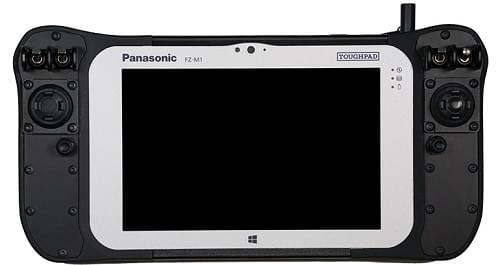

# 기본 개념

무인 항공기에 대한 소개와 PX4 사용법에 대해 설명합니다. 초보자와 전문가 모두에게 유익한 자료입니다.

기본 개념에 익숙하시면 [기본 조립](../assembly/README.md)편으로 이동하여 비행 제어기 조립에 대해서 공부하실 수 있습니다. *QGroundControl*을 사용하여 PX4 펌웨어를 설치하고 기체를 설정하려면 [기본 설정](../config/README.md)을 참조하십시오.

## 드론이란?

드론은 수동이나 자동으로 제어 가능한 무인 로봇 입니다.

드론은 [개인, 산업체, 공공기관, 국방 분야에서 다양하게 적용](https://px4.io/ecosystem/commercial-systems/).되고 있습니다. 응용분야는 항공 측량, 화물 운송, 레이싱, 수색 등이 있습니다.

드론 적용 분야는 항공, 지상, 바다, 수중 등 다양한 분야가 있습니다. 드론을 지칭하는 공식적인 용어에는 Unmanned Aerial Vehicles (UAV), Unmanned Aerial Systems (UAS), Unmanned Ground Vehicles (UGV), Unmanned Surface Vehicles (USV), Unmanned Underwater Vehicles (UUV) 등이 있습니다.
:::

자율비행 프로그램은 드론을 움직이는 두되에 해당합니다. 자율 비행 프로그램은 비행 제어기에서 동작하는 각종 비행 모듈로 구성되어 있습니다.

## PX4 자율비행 프로그램

[PX4](http://px4.io/) 는 다양한 기능을 가진 오픈 소스 자율 비행 프로그램입니다. 

PX의 주요기능

- 항공기 (멀티콥터, 고정익 및 수직이착륙기), 지상 운송체및 잠수함을 포함하여 [ 다양한 기체 유형](../airframes/airframe_reference.md)을 제어 
- [운송체 컨트롤러](#vehicle_controller), 센서 및 다양한 주변 장치 지원
- 강력한 [비행 기능](#flight_modes) 및 [안전 기능](#safety)

PX4는 [QGroundControl](#qgc) 지상 제어 프로그램, [Pixhawk 하드웨어](https://pixhawk.org/) 그리고 보조 컴퓨터, 카메라 및 하드웨어(MAVLink 프로토콜을 지원)를 통합하는 [MAVSDK](http://mavsdk.mavlink.io)를 포함하는 플랫폼 중에서 핵심적인 요소입니다. PX4는 [드론코드 프로젝트](https://www.dronecode.org/)의 지원을 받고 있습니다.

## QGroundControl

Dronecode에서 지원하는 지상 관제 프로그램은 [QGroundControl](http://qgroundcontrol.com/)입니다. *QGroundControl*을 사용하여 PX4를 [비행 제어기](flight_controller_selection.md)에 업로드할 수 있으며, 해당 기체 비행에 필요한 각종 변수를 설정하고, 자율 비행의 실시간 정보를 조회할 수 있습니다.

*QGroundControl*은 윈도우, 안드로이드, MacOS 그리고 리눅스에서 실행 가능합니다. [여기](http://qgroundcontrol.com/downloads/)에서 다운로드하고 설치할 수 있습니다.

## 비행 제어기 보드

PX4는 초기에 [Pixhawk 시리즈](../flight_controller/pixhawk_series.md)에서만 실행되었으나, 현재는 리눅스 및 여러 하드웨어에서도 실행되어집니다. 기체의 물리적인 조건과 비행의 목적과 비용에 적절한 하드웨어를 선택해야 합니다.

자세한 내용은 [비행 컨트롤러 선택하기](flight_controller_selection.md)를 참조하십시오.

## 센서

PX4는 센서를 사용하여 기체의 상태를 결정합니다 (자율 비행의 기체 안정화에 필요한 과정입니다). 자이로스코프 센서, 가속도 센서, 지자기 센서 및 기압 센서는 * 시스템 구동을 위한 최소 요구사항입니다*. 자동 [모드](../getting_started/flight_modes.md#categories) 와 기타 모드를 사용하기 위해서는 GPS나 이와 유사한 위치 확인 시스템이 필요합니다. 고정익 및 수직이착륙기에는 대기속도 센서가 반드시 추가되어야 합니다.

더 자세한 정보는 다음을 참고하세요.

- [센서](../getting_started/sensor_selection.md) 
- [주변 장치](../peripherals/README.md)

## 출력 장치: 모터, 서보, 액츄에이터

PX4에서 사용하는 *출력 장치*에는 모터(예 : [ ESC](#esc_and_motors)를 통해), 에일러론 및 플랩과 같은 비행 표면, 카메라 트리거, 낙하산, 그리퍼 및 기타 여러 가지 페이로드 등이 있습니다.

아래의 그림은 [Pixhawk 4](../flight_controller/pixhawk4.md)와 [Pixhawk 4 미니](../flight_controller/pixhawk4_mini.md)의 PWM 출력 포트를 나타냅니다.

 

The outputs are divided into `MAIN` and `AUX` outputs, and individually numbered (i.e. `MAINn` and `AUXn`, where `n` is 1 to usually 6 or 8).

:::tip
The specific purpose for each output is hard coded on a per-airframe basis. The output mapping for all airframes is given in the [Airframe Reference](../airframes/airframe_reference.md).
:::

:::warning
A flight controller may only have `MAIN` outputs (like the *Pixhawk 4 Mini*), or may have only 6 outputs on either `MAIN` or `AUX`. Ensure that you select a controller that has enough of the right types of ports/outputs for your [airframe](../airframes/airframe_reference.md).
:::

Typically the `MAIN` port is used for core flight controls while `AUX` is used for non-critical actuators/payloads (though `AUX` may be used for flight controls if there aren't enough `MAIN` ports for the vehicle type- e.g. VTOL). For example, in a [Generic Quadcopter](../airframes/airframe_reference.md#copter_quadrotor_x_generic_quadcopter) the `MAIN` outputs 1-4 are used for corresponding motors, while the remaining `MAIN` and some `AUX` outputs are used for RC passthrough.

The actual ports/bus used for the outputs on the [flight controller](#vehicle_controller) depends on the hardware and PX4 configuration. *Usually* the ports are mapped to PWM outputs as shown above, which are commonly screen printed `MAIN OUT` and `AUX OUT`.

They might also be marked as `FMU PWM OUT` or `IO PWM Out` (or similar). Pixhawk controllers have a "main" FMU board and *may* have a separate IO board. If there is an IO board, the `AUX` ports are connected directly to the FMU and the `MAIN` ports are connected to the IO board. Otherwise the `MAIN` ports are connected to the FMU, and there are no `AUX` ports. The FMU output ports can use [D-shot](../peripherals/dshot.md) or *One-shot* protocols (as well as PWM), which provide much lower-latency behaviour. This can be useful for racers and other airframes that require better performance.

The output ports may also be mapped to UAVCAN nodes (e.g. UAVCAN [motor controllers](../peripherals/uavcan_escs.md)). The (same) airframe mapping of outputs to nodes is used in this case.

**Notes:**

- There are only 6-8 outputs in `MAIN` and `AUX` because most flight controllers only have this many PWM/Dshot/Oneshot outputs. In theory there can be many more outputs if the bus supports it (i.e. a UAVCAN bus is not limited to this few nodes).

## ESCs & Motors

Many PX4 drones use brushless motors that are driven by the flight controller via an Electronic Speed Controller (ESC) (the ESC converts a signal from the flight controller to an appropriate level of power delivered to the motor).

For information about what ESC/Motors are supported by PX4 see:

- [ESC & Motors](../peripherals/esc_motors.md)
- [ESC Calibration](../advanced_config/esc_calibration.md)
- [ESC Firmware and Protocols Overview](https://oscarliang.com/esc-firmware-protocols/) (oscarliang.com)

## Battery/Power

PX4 drones are mostly commonly powered from Lithium-Polymer (LiPo) batteries. The battery is typically connected to the system using a *Power Module* or *Power Management Board*, which provide separate power for the flight controller and to the ESCs (for the motors).

Information about batteries and battery configuration can be found in [Battery Configuration](../config/battery.md) and the guides in [Basic Assembly](../assembly/README.md) (e.g. [Pixhawk 4 Wiring Quick Start > Power](../assembly/quick_start_pixhawk4.md#power)).

## Radio Control (RC)

A [Radio Control \(RC\)](../getting_started/rc_transmitter_receiver.md) system is used to *manually* control the vehicle. It consists of a remote control unit that uses a transmitter to communicate stick/control positions with a receiver based on the vehicle. Some RC systems can additionally receive telemetry information back from the autopilot.

:::note PX4 does not require a remote control system for autonomous flight modes.
:::

[RC System Selection](../getting_started/rc_transmitter_receiver.md) explains how to choose an RC system. Other related topics include:

- [Radio/Remote Control Setup](../config/radio.md) - Remote control configuration in *QGroundControl*.
- [Flying 101](../flying/basic_flying.md) - Learn how to fly with a remote control.
- [FrSky Telemetry](../peripherals/frsky_telemetry.md) - Set up the RC transmitter to receive telemetry/status updates from PX4.

## GCS Joystick Controller

A [computer joystick](../config/joystick.md) connected through *QGroundControl* can also be used to manually control PX4 (QGC converts joystick movements into MAVLink messages that are sent over the telemetry link). This approach is used by ground control units that have an integrated ground control station, like the *Auterion* [Skynav](https://auterion-gs.com/skynav/) or *UAVComponents* [MicroNav](https://www.uavcomp.com/command-control/micronav/). Joysticks are also commonly used to fly the vehicle in simulation.

## Safety Switch

It is common for vehicles to have a *safety switch* that must be engaged before the vehicle can be [armed](#arming) (when armed, motors are powered and propellers can turn). Commonly the safety switch is integrated into a GPS unit, but it may also be a separate physical component.

:::warning
A vehicle that is armed is potentially dangerous. The safety switch is an additional mechanism that prevents arming from happening by accident.
:::

## Data/Telemetry Radios

[Data/Telemetry Radios](../telemetry/README.md) can provide a wireless MAVLink connection between a ground control station like *QGroundControl* and a vehicle running PX4. This makes it possible to tune parameters while a vehicle is in flight, inspect telemetry in real-time, change a mission on the fly, etc.

## Offboard/Companion Computer

PX4 can be controlled from a separate on-vehicle companion computer via a serial cable or wifi. The companion computer will usually communicate using a MAVLink API like the MAVSDK or MAVROS.

Relevent topics include:

- [Off-board Mode](../flight_modes/offboard.md) - Flight mode for offboard control of PX4 from a GCS or companion computer. 
- [Robotics APIs](../robotics/README.md)

## SD Cards (Removable Memory)

PX4 uses SD memory cards for storing [flight logs](../getting_started/flight_reporting.md), and they are also required in order to use UAVCAN peripherals and fly [missions](../flying/missions.md).

By default, if no SD card is present PX4 will play the [format failed (2-beep)](../getting_started/tunes.md#format-failed) tune twice during boot (and none of the above features will be available).

:::tip
The maximum supported SD card size on Pixhawk boards is 32GB. The *SanDisk Extreme U3 32GB* is [highly recommended](../dev_log/logging.md#sd-cards).
:::

SD cards are never-the-less optional. Flight controllers that do not include an SD Card slot may:

- Disable notification beeps are disabled using the parameter [CBRK_BUZZER](../advanced_config/parameter_reference.md#CBRK_BUZZER).
- [Stream logs](../dev_log/logging.md#log-streaming) to another component (companion).
- Store missions in RAM/FLASH. <!-- Too low-level for this. But see FLASH_BASED_DATAMAN in  Intel Aero: https://github.com/PX4/PX4-Autopilot/blob/master/boards/intel/aerofc-v1/src/board_config.h#L115 -->

## Arming and Disarming

Vehicles may have moving parts, some of which are potentially dangerous when powered (in particular motors and propellers)!

To reduce the chance of accidents:

- PX4 vehicles are *disarmed* (unpowered) when not in use, and must be explicitly *armed* before taking off.
- Some vehicles also have a [safety switch](#safety_switch) that must be disengaged before arming can succeed (often this switch is part of the GPS).
- Arming is prevented if the vehicle is not in a "healthy" state.
- Arming is prevented if a VTOL vehicle is in fixed-wing mode ([by default](../advanced_config/parameter_reference.md#CBRK_VTOLARMING)).
- A vehicle will also usually revert to the disarmed state after landing or if a pilot does not take off quickly enough.

Arming is triggered by default (Mode 2 transmitters) by holding the RC throttle/yaw stick on the *bottom right* for one second (to disarm, hold stick on bottom left). It is alternatively possible to configure PX4 to arm using an RC switch or button (and arming MAVLink commands can also be sent from a ground station).

A detailed overview of arming and disarming configuration can be found here: [Prearm, Arm, Disarm Configuration](../advanced_config/prearm_arm_disarm.md).

## Flight Modes

Flight modes provide different types/levels of vehicle automation and autopilot assistance to the user (pilot). *Autonomous modes* are fully controlled by the autopilot, and require no pilot/remote control input. These are used, for example, to automate common tasks like takeoff, returning to the home position, and landing. Other autonomous modes execute pre-programmed missions, follow a GPS beacon, or accept commands from an offboard computer or ground station.

*Manual modes* are controlled by the user (via the RC control sticks/joystick) with assistance from the autopilot. Different manual modes enable different flight characteristics - for example, some modes enable acrobatic tricks, while others are impossible to flip and will hold position/course against wind.

:::tip
Not all flight modes are available on all vehicle types, and some modes can only be used when specific conditions have been met (e.g. many modes require a global position estimate).
:::

An overview of the available flight modes [can be found here](../getting_started/flight_modes.md). Instructions for how to set up your remote control switches to turn on different flight modes is provided in [Flight Mode Configuration](../config/flight_mode.md).

## Safety Settings (Failsafe)

PX4 has configurable failsafe systems to protect and recover your vehicle if something goes wrong! These allow you to specify areas and conditions under which you can safely fly, and the action that will be performed if a failsafe is triggered (for example, landing, holding position, or returning to a specified point).

:::note
You can only specify the action for the *first* failsafe event. Once a failsafe occurs the system will enter special handling code, such that subsequent failsafe triggers are managed by separate system level and vehicle specific code.
:::

The main failsafe areas are listed below:

- Low Battery
- Remote Control (RC) Loss
- Position Loss (global position estimate quality is too low).
- Offboard Loss (e.g. lose connection to companion computer)
- Data Link Loss (e.g. lose telemetry connection to GCS).
- Geofence Breach (restrict vehicle to flight within a virtual cylinder).
- Mission Failsafe (prevent a previous mission being run at a new takeoff location).
- Traffic avoidance (triggered by transponder data from e.g. ADSB transponders).

For more information see: [Safety](../config/safety.md) (Basic Configuration).

## Heading and Directions

All the vehicles, boats and aircraft have a heading direction or an orientation based on their forward motion.

:::note
For a VTOL Tailsitter the heading is relative to the multirotor configuration (i.e. vehicle pose during, takeoff, hovering, landing).
:::

It is important to know the vehicle heading direction in order to align the autopilot with the vehicle vector of movement. Multicopters have a heading even when they are symmetrical from all sides! Usually manufacturers use a colored props or colored arms to indicate the heading.

In our illustrations we will use red coloring for the front propellers of multicopter to show heading.

You can read in depth about heading in [Flight Controller Orientation](../config/flight_controller_orientation.md)