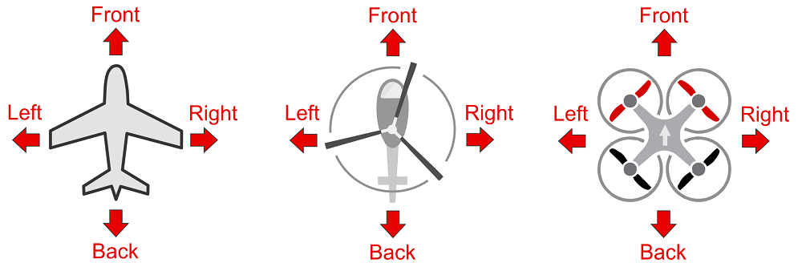

# 기본 개념

이 주제에서는 무인 항공기에 대한 기본적인 소개와 PX4 사용에 대해 설명합니다. (초보자를 위한 것이지만 숙련된 사용자에게도 좋은 소개 자료입니다.)

기본 개념을 이미 잘 알고 있다면 [기본 조립](../assembly/README.md)으로 이동하여 특정 자동 조종 장치 하드웨어를 연결하는 방법을 배울 수 있습니다. *QGroundControl*을 사용하여 펌웨어를 설치하고 이동체를 설정하려면 [기본 설정](../config/README.md)을 참조하십시오.

## 드론이란?

드론은 원격 또는 자율적으로 제어될 수 있는 무인 "로봇" 이동체입니다.

드론은 많은 소비자 그리고 산업 및 군사적 목적으로 [활용](http://px4.io/applications/)됩니다. 여기에는 (대략) 항공 사진/비디오, 화물 운송, 레이싱, 검색 및 측량 등 내용이 포함됩니다.

> ** 팁 ** 항공기, 지상, 해상 및 수중에서 사용하기 위해 다양한 유형의 무인 항공기가 존재합니다. 무인 항공기(UAV), 무인 항공 시스템(UAS), 무인 지상 차량(UGV), 무인 수면함(USV), 무인 수중함(UUV) 이라고 합니다.

드론의 "두뇌"는 오토파일럿 또는 자동 조종 장치라고 합니다. 112/5000 이 장치는 * 기체 컨트롤러 * ( "비행 컨트롤러") 하드웨어에서 실행되는 * 비행 스택 * 소프트웨어로 구성됩니다.

## 드론코드 플랫폼 {#dronecode}

PX4는 일반 산업 친화적 오픈 소스 라이선스에 따라 제공되는 드론 개발을 위한 완벽한 플랫폼인 [ Dronecode 플랫폼](https://www.dronecode.org/platform/)의 일부입니다. Dronecode는 [ PX4 비행 스택 ](#autopilot), [ QGroundControl ](#qgc) 지상 제어 스테이션, [ Dronecode SDK ](https://www.dronecode.org/sdk/) 및 [ Dronecode Camera Manager](https://camera-manager.dronecode.org/en/)를 포함합니다.

## PX4 오토파일럿 {#autopilot}

[ PX4](http://px4.io/)는 강력한 오픈 소스 오토파일럿 * 비행 스택 *입니다. (역주: 비행 스택이란 여러 기능을 갖는 모듈들의 집합체를 의미합니다.)

몇 가지 PX4의 주요 특징은 다음과 같습니다:

- 항공기 (멀티콥터, 고정익 항공기 및 VTOL), 지상 차량 및 수중함을 포함하여 [ 많은 다양한 차량 프레임/유형](../airframes/airframe_reference.md)을 제어합니다. 
- [ 이동체 컨트롤러](#vehicle_controller), 센서 및 기타 주변 장치 하드웨어 선택 시 가장 좋습니다.
- 유연하고 강력한 [ 비행 모드 ](#flight_modes) 및 [ 안전 기능](#safety)을 갖고 있습니다.

## QGroundControl {#qgc}

Dronecode 지상 관제소는 [ QGroundControl](http://qgroundcontrol.com/)이라고 합니다. You can use *QGroundControl* to load (flash) PX4 onto the [vehicle control hardware](flight_controller_selection.md), you can setup the vehicle, change different parameters, get real-time flight information and create and execute fully autonomous missions.

*QGroundControl* runs on Windows, Android, MacOS or Linux. Download and install it from [here](http://qgroundcontrol.com/downloads/).

## Vehicle/Flight Controller Board {#vehicle_controller}

PX4 was initially designed to run on [Pixhawk Series](../flight_controller/pixhawk_series.md) controllers, but can now run on Linux computers and other hardware. You should select a board that suits the physical constraints of your vehicle, the activities you wish to perform, and of course cost.

For more information see: [Flight Controller Selection](flight_controller_selection.md).

## Sensors

PX4 uses sensors to determine vehicle state (needed for stabilization and to enable autonomous control). The system *minimally requires* a gyroscope, accelerometer, magnetometer (compass) and barometer. A GPS or other positioning system is needed to enable all automatic [modes](../getting_started/flight_modes.md#categories), and some assisted modes. Fixed wing and VTOL-vehicles should additionally include an airspeed sensor (very highly recommended).

For more information see:

- [Sensors](../getting_started/sensor_selection.md) 
- [Peripherals](../peripherals/README.md)

## ESCs & Motors

Many PX4 drones use brushless motors that are driven by the flight controller via an Electronic Speed Controller (ESC) (the ESC converts a signal from the flight controller to an appropriate level of power delivered to the motor).

For information about what ESC/Motors are supported by PX4 see:

- [ESC & Motors](../peripherals/esc_motors.md)
- [ESC Calibration](../advanced_config/esc_calibration.md)
- [ESC Firmware and Protocols Overview](https://oscarliang.com/esc-firmware-protocols/) (oscarliang.com)

## Battery/Power

PX4 drones are mostly commonly powered from Lithium-Polymer (LiPo) batteries. The battery is typically connected to the system using a *Power Module* or *Power Management Board*, which provide separate power for the flight controller and to the ESCs (for the motors).

Information about batteries and battery configuration can be found in [Battery Configuration](../config/battery.md) and the guides in [Basic Assembly](../assembly/README.md) (e.g. [Pixhawk 4 Wiring Quick Start > Power](../assembly/quick_start_pixhawk4.md#power)).

## Radio Control (RC) {#rc_systems}

A [Radio Control \(RC\)](../getting_started/rc_transmitter_receiver.md) system is used to *manually* control the vehicle. It consists of a remote control unit that uses a transmitter to communicate stick/control positions with a receiver based on the vehicle. Some RC systems can additionally receive telemetry information back from the autopilot.

> **Note** PX4 does not require a remote control system for autonomous flight modes.

[RC System Selection](../getting_started/rc_transmitter_receiver.md) explains how to choose an RC system. Other related topics include:

- [Radio/Remote Control Setup](../config/radio.md) - Remote control configuration in *QGroundControl*.
- [Flying 101](../flying/basic_flying.md) - Learn how to fly with a remote control.
- [FrSky Telemetry](../peripherals/frsky_telemetry.md) - Set up the RC transmitter to receive telemetry/status updates from PX4.

## Data/Telemetry Radios

[Data/Telemetry Radios](../telemetry/README.md) can provide a wireless MAVLink connection between a ground control station like *QGroundControl* and a vehicle running PX4. This makes it possible to tune parameters while a vehicle is in flight, inspect telemetry in real-time, change a mission on the fly, etc.

## Offboard/Companion Computer

PX4 can be controlled from a separate on-vehicle companion computer via a serial cable or wifi. The companion computer will usually communicate using a MAVLink API like the Dronecode SDK or MAVROS.

> **Note** Using a Robotics API requires software development skills, and is outside the scope of this guide.

- [Off-board Mode](../flight_modes/offboard.md) - Flight mode for offboard control of PX4 from a GCS or companion computer. 
- [Robotics APIs](https://dev.px4.io/en/robotics/) (PX4 Developer Guide)

## Removable Memory/Logging

PX4 uses SD memory cards for storing [flight logs](../getting_started/flight_reporting.md) (SD support may not be present on every flight controller).

> **Tip** The maximum supported SD card size on Pixhawk boards is 32GB.

A number of recommended cards are listed in: [Developer Guide > Logging](http://dev.px4.io/en/log/logging.html#sd-cards)

## Flight Modes {#flight_modes}

Flight modes provide different types/levels of vehicle automation and autopilot assistance to the user (pilot). *Autonomous modes* are fully controlled by the autopilot, and require no pilot/remote control input. These are used, for example, to automate common tasks like takeoff, returning to the home position, and landing. Other autonomous modes execute pre-programmed missions, follow a GPS beacon, or accept commands from an offboard computer or ground station.

*Manual modes* are controlled by the user (via the RC control sticks/joystick) with assistance from the autopilot. Different manual modes enable different flight characteristics - for example, some modes enable acrobatic tricks, while others are impossible to flip and will hold position/course against wind.

> **Tip** Not all flight modes are available on all vehicle types, and some modes can only be used when specific conditions have been met (e.g. many modes require a global position estimate).

An overview of the available flight modes [can be found here](../getting_started/flight_modes.md). Instructions for how to set up your remote control switches to turn on different flight modes is provided in [Flight Mode Configuration](../config/flight_mode.md).

## Safety Settings (Failsafe) {#safety}

PX4 has configurable failsafe systems to protect and recover your vehicle if something goes wrong! These allow you to specify areas and conditions under which you can safely fly, and the action that will be performed if a failsafe is triggered (for example, landing, holding position, or returning to a specified point).

> **Note** You can only specify the action for the *first* failsafe event. Once a failsafe occurs the system will enter special handling code, such that subsequent failsafe triggers are managed by separate system level and vehicle specific code.

The main failsafe areas are listed below:

- Low Battery
- Remote Control (RC) Loss
- Position Loss (global position estimate quality is too low).
- Offboard Loss (e.g. lose connection to companion computer)
- Data Link Loss (e.g. lose telemetry connection to GCS).
- Geofence Breach (restrict vehicle to flight within a virtual cylinder).
- Mission Failsafe (prevent a previous mission being run at a new takeoff location).
- Traffic avoidance (triggered by transponder data from e.g. ADSB transponders).

For more information see: [Safety](../config/safety.md) (Basic Configuration).

## Heading and Directions

All the vehicles, boats and aircraft have a heading direction or an orientation based on their forward motion.

It is important to know the vehicle heading direction in order to align the autopilot with the vehicle vector of movement. Multicopters have a heading even when they are symmetrical from all sides! Usually manufacturers use a colored props or colored arms to indicate the heading.

In our illustrations we will use red coloring for the front propellers of multicopter to show heading.

You can read in depth about heading in [Flight Controller Orientation](../config/flight_controller_orientation.md)