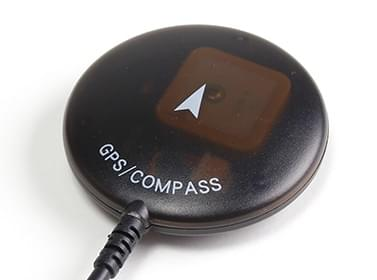

# 센서

PX4 시스템은 안정화나 자율제어를  위하여 센서를 사용하여 기체의 상태를 파악합니다. The vehicle states include: position/altitude, heading, speed, airspeed, orientation (attitude), rates of rotation in different directions, battery level, and so on.

PX4 *minimally requires* a gyroscope, accelerometer, magnetometer (compass) and barometer. 자동 [모드](../getting_started/flight_modes.md#categories)와  기타 모드에는 GPS나 이와 유사한 위치 확인 시스템이 요구됩니다. 고정익과 수직이착륙기에는 대기속도 센서가 필요합니다.

[Pixhawk 시리즈](../flight_controller/pixhawk_series.md) 비행 콘트롤러에 최소한의 센서들이 내장되어 있습니다. Additional/external sensors, in particular a GPS, can be attached to the controller.

Below we describe some of the more important external sensors.

## GPS와 나침반

PX4 supports a number of Global Navigation Satellite System (GNSS) receivers and compasses (magnetometers). It also supports Real Time Kinematic (RTK) GPS Receivers, which extend GPS systems to centimetre-level precision.

나침반이나 GPS 수신기는 모터나 ESC 전원에서 가능한 멀리 장착하여 사용하는 것이 좋습니다. 일반적으로 받침대나 고정 날개에 설치하는 것이 좋습니다.

GPS/compass hardware options are listed in:
- [GPS/Compass](../gps_compass/README.md)
- [RTK GPS](../gps_compass/rtk_gps.md)

:::note
[픽스호크 시리즈](../flight_controller/pixhawk_series.md) 콘트롤러에는 *내부* 나침반이 포함되어 있습니다. Pixhawk를 배터리나 전선에서 가능하면 멀리 장착하여 전자기 간섭을 최소화하는 것이 좋습니다. 소형 운송체에서는 대부분 외부 나침반이 필수 요구사항입니다. :::

## 대기속도  센서

고정익과 VTOL에는 대기속도센서를 *사용*이 적극 권장됩니다.

자동조종장치에는 실속을 감지하는 다른 수단이 없으므로,  비행 속도 측정은는 매우 중요합니다. 고정익의 양력을 발생시키는 것은 대지속도가 아니라 대기속도입니다.

더 자세한 정보와 권장 하드웨어는 [대기속도 센서](../sensor/airspeed.md)를 참고하십시오.

## 거리 센서

정확한 착지, 장애물 회피와 등고 비행 등을 위하여 거리 센서가 필요합니다.

여러가지 기술을 사용하여 다양한 범위와 기능을 지원하는 저렴한 거리 센서를 PX4에서 지원합니다. 더 자세한 정보는 [거리 센서](../sensor/rangefinders.md)를 참고하십시오.

## 광류 센서

[Optical Flow sensors](../sensor/optical_flow.md) use a downward facing camera and a downward facing distance sensor for velocity estimation. PX4는 센서 데이터와 다른 위치 정보(예 : GPS)를 연계하여 정확한 위치를 측정합니다. 광류 센서는 GPS 신호가 잡히지 않는 실내에서도 사용할 수 있습니다.

## See Also

- [Peripheral Hardware](../peripherals/README.md) contains documentation for other sensors, such as [Battery/Power Monitors](../power_module/README.md)), [Air traffic warning systems](../peripherals/adsb_flarm.md), [Tachometers](../sensor/tachometers.md).
- [기초 초립법](../assembly/README.md)에는 비행 콘틀롤러에 관한 시작 가이드가 포함되어 있습니다. These explain how to connect the core sensors to specific flight controller hardware.
- [비행 콘트롤러](../flight_controller/README.md) 항목에서는 배선 정보를 설명합니다.
