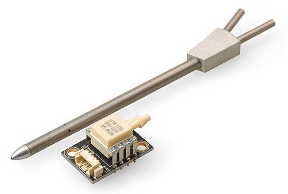

# 센서

PX4 기반 시스템은 센서를 사용하여 기체의 상태를 결정합니다 (안정화 및 자율 제어 활성화에 필요). 기체 상태에는 위치, 고도, 방향, 속도, 대기 속도, 방향 (태도), 회전 속도와 배터리 잔량 등이 포함됩니다.

자이로스코프 센서, 가속도 센서, 지자기 센서와 기압 센서는 *시스템 구동에 필요한 최소 요구사항입니다*. 자동 [모드](../getting_started/flight_modes.md#categories)와 기타 모드에는 GPS나 유사한 위치 확인 시스템이 필요합니다. 고정익과 수직이착륙기에는 대기속도 센서가 필요합니다.

최소한의 센서 세트가 [ Pixhawk 시리즈 ](../flight_controller/pixhawk_series.md) 비행 콘트롤러에 내장되어 있습니다 (다른 컨트롤러 플랫폼에도있을 수 있음). 콘트롤러에 필요한 센서를 추가할 수 있습니다.

주요 센서에 대하여 설명합니다. 마지막에는 [센서 배선](#wiring)에 대한 자료가 있습니다.

## GPS와 나침반

PX4는 여러 GNSS(Global Navigation Satellite System) 수신기와 나침반(자기계)을 지원합니다. PX4는 센티미터 정밀도 GPS 시스템인 [실시간 운동학(RTK) GPS 수신기](../gps_compass/rtk_gps.md)를 지원합니다.

:::note
[픽스호크 시리즈](../flight_controller/pixhawk_series.md) 컨트롤러에는 *내부* 나침반이 포함되어 있습니다. Pixhawk를 가능하면 배터리나 전선에서 멀리 장착하여 전자기 간섭을 최소화하는 것이 좋습니다. 대부분의 소형 운송체에서는 외부 나침반이 필수적인 요구사항입니다.
:::

모터나 ESC 전원에서 가능한 멀리 떨어진 곳에 장착된 외부 나침반/GPS 수신기을 사용하는 것이 좋습니다. 일반적으로 받침대 또는 고정 날개에 설치합니다.

GPS/나침반의 일반적 옵션은 [ GPS/나침반](../gps_compass/README.md)에 기술되어 있습니다.

## 대기속도 센서

고정이나 수직이착륙기에는 대기속도센서를 *사용하는 것이 좋습니다.*

자동 조종 장치에는 실속을 감지 할 수있는 다른 수단이 없으므로이 비행 속도는 매우 중요한 항목입니다. 고정익 비행의 경우 양력을 발생시키는 것은 대지속도가 아니라 대기속도입니다.

더 자세한 정보와 권장 하드웨어는 [대기속도 센서](../sensor/airspeed.md)편을 참조하십시오.

## 타코미터

타코미터([회전 카운터 센서](https://en.wikipedia.org/wiki/Tachometer#In_automobiles,_trucks,_tractors_and_aircraft))는 자동 조종 장치가 실속 또는 다른 로터 고장을 감지할 수 있기 때문에 로터 윙 프레임에 *적극 권장*합니다 (로터 윙 비행의 경우 양력을 발생시키는 것은 대지속도나 지면 속도가 아닌 블레이드의 회전입니다).

더 자세한 정보와 권장 하드웨어는 [센서 > 타코미터](../sensor/tachometers.md)편을 참조하십시오.

## 거리 센서

거리 센서는 정확한 착지, 장애물 회피와 등고 비행 등에 필요합니다.

PX4는 여러가지 기술을 사용하여 다양한 범위의 기능을 지원하는 저렴한 거리 센서를 지원합니다. 더 자세한 정보는 [거리 센서](../sensor/rangefinders.md)를 참고하십시오.

## 광류 센서

[ 광류 센서 ](../sensor/optical_flow.md) 센서는 속도 추정을 위해 하향 카메라와 하향 거리 센서를 사용합니다. PX4는 센서 출력을 다른 위치 소스 (예 : GPS)의 정보와 연계하여 정확한 위치 잠금을 제공합니다. 이 센서는 GPS 신호를 사용할 수없는 실내에서 사용할 수 있습니다.

다른 옵션은 다음과 같습니다:

* 통합 소나 센서가있는 [ PX4Flow ](../sensor/px4flow.md) 기반 유량 센서.
* 광학 마우스 트랙 패드와 유사한 센서가있는 [ PMW3901 ](../sensor/pmw3901.md) 기반 유량 센서

## 센서 배선

센서 배선 정보는 일반적으로 비행 제어기 및 센서 자체에 관하여 제조사에서 매뉴얼을 제공한다.

추가:

* [ 기초 초립법 ](../assembly/README.md)에는 비행 제어기에 관한 빠른 시작 가이드가 포함되어 있습니다. 여기에는 특정 비행 컨트롤러 하드웨어에 대한 코어 센서의 배선이 포함됩니다.
* [ 비행 제어기 ](../flight_controller/README.md) 항목에는 종종 배선 정보가 포함됩니다.
* [ 주변 하드웨어 ](../peripherals/README.md)에는 다른 센서에 대한 문서가 포함되어 있습니다.