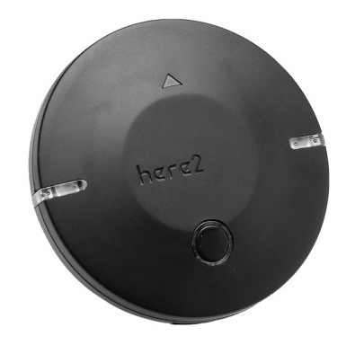
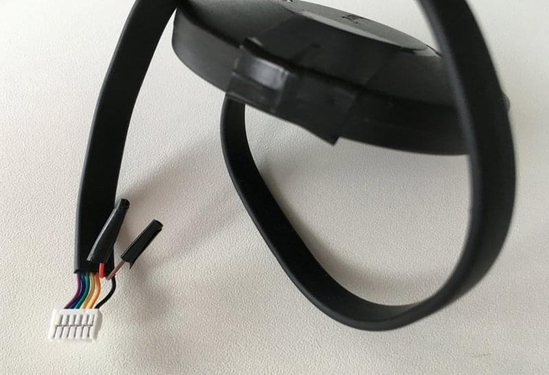

# HEX/ProfiCNC Here2 GPS

[Here2 GPS 수신기](http://www.proficnc.com/all-products/152-gps-module.html)는 HEX의 Here GPS 모듈에 대한 업데이트입니다.

주요 특징은 다음과 같습니다.
- Concurrent reception of up to 3 GNSS (GPS, Galileo, GLOSNASS, BeiDou)
- 업계 최고의 - 167dBm 탐색 감도
- 보안 및 무결성 보호
- 모든 위성 증강 시스템 지원
- 고급 재밍 및 스푸핑 감지

## 구매처

* [ProfiCNC](http://www.proficnc.com/all-products/152-gps-module.html) (오스트레일리아)
* [기타 리셀러](http://www.proficnc.com/stores)

## 설정

PX4의 설정과 사용법은 대부분 플러그앤플레이입니다.

:::note GPS가 *감지되지 않으면* [Here2 펌웨어를 업데이트](https://docs.cubepilot.org/user-guides/here-2/updating-here-2-firmware) 합니다.
:::

## 배선

Here2 GPS는 [Pixhawk 2](http://www.hex.aero/wp-content/uploads/2016/07/DRS_Pixhawk-2-17th-march-2016.pdf) GPS UART 포트에 직접 삽입할 수있는 8 핀 커넥터와 함께 제공됩니다.

Pixhawk 3 Pro와 Pixracer에는 6 핀 GPS 포트 커넥터가 있습니다. 이러한 컨트롤러에서는 GPS 케이블 (아래 그림 참조)을 수정하여 핀 6과 7을 제거할 수 있습니다.

핀 6과 7은 안전 버튼용이며 필요한 경우 부착 가능합니다.

### 핀배열

Here2 GPS 핀배열은 아래에서 제공합니다. 이것은 다른 자동조종보드용 커넥터를 수정할 수 있습니다.

| 핀 | Here2 GPS  | 핀 | Pixhawk 3 Pro GPS |
| - | ---------- | - | ----------------- |
| 1 | VCC_5V     | 1 | VCC               |
| 2 | GPS_RX     | 2 | GPS_TX            |
| 3 | GPS_TX     | 3 | GPS_RX            |
| 4 | SCL        | 4 | SCL               |
| 5 | SDA        | 5 | SDA               |
| 6 | BUTTON     | - | -                 |
| 7 | BUTTON_LED | - | -                 |
| 8 | GND        | 6 | GND               |

## 사양

- **프로세서:** STM32F302
- **센서**
  - **나침반, 자이로, 가속도계:** ICM20948
  - **기압계:** MS5611
- **수신기 유형:** 72-채널 u-blox M8N 엔진, GPS/QZSS L2 C/A, GLONASS L10F, BeiDou B11, Galileo E1B/C, SBAS L1 C/A: WAAS, EGNOS, MSAS, GAGAN
- **내비게이션 업데이트 속도:** 최대 : 10Hz
- **위치 정확도:** 3D 수정
- **최초 수정 시간 :**
  - **콜드 스타트:** 26 초
  - **지원 시작:** 2 초
  - **재 획득:** 1 초
- **감도:**
  - **추적 및 탐색:** -167dBm
  - **핫 스타트:** -148dBm
  - **콜드 스타트:** - 157 dBm
- **보조 GNSS**
  - AssistNow GNSS 온라인
  - AssistNow GNSS 오프라인 (최대 35 일)
  - AssistNow Autonomous (최대 6 일)
  - OMA 공급 및 GPP 준수
- **발진기:** TCXO (NEO-8MN/Q)
- **RTC 크리스탈:** 빌드 인
- **ROM:** Flash (NEO-8MN)
- **사용 가능한 안테나:** Active Antenna 및 패시브 안테나
- **신호 무결성:** SHA 256을 사용한 서명 기능
- **프로토콜 및 인터페이스:**
  - **UART/I2C/CAN:** JST_GH 메인 인터페이스, 내부 스위치.
  - **STM32 기본 프로그래밍 인터페이스:** JST_SUR
