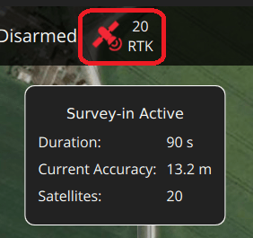
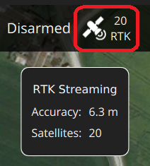
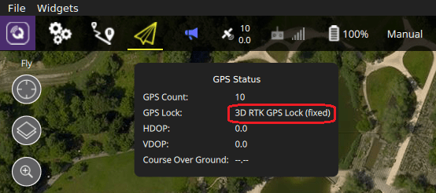
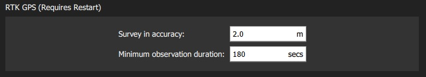

# RTK GPS

PX4에서는 *RTK GPS* 장치의 센티미터 수준의 정확도로 정밀측량이 가능합니다.

:::note GPS는 요/방향 정보의 소스로 사용할 수 있습니다.
- [듀얼 u-blox F9P를 사용한 RTK GPS 헤딩](../gps_compass/u-blox_f9p_heading.md).
- 일부 GPS 출력 요 (아래 표 참조).
:::

## 지원되는 RTK 장치

PX4는 [u-blox M8P](https://www.u-blox.com/en/product/neo-m8p), [u-blox F9P](https://www.u-blox.com/en/product/zed-f9p-module) 및 [Trimble MB-Two](https://www.trimble.com/Precision-GNSS/MB-Two-Board.aspx) GPS와 통합 제품을 지원합니다.

PX4에서 작동하는 RTK 호환 장치(단종 된 장치 제외)는 아래와 같습니다. 표는 편요각를 출력하는 장치를 나타내며 두 개의 장치를 사용하여 편요각를 제공할 수 있습니다. It also highlights devices that connect via the CAN bus, and those which support PPK (Post-Processing Kinematic).

| GPS                                                                                        | 편요각 출력  | [Dual F9P GPS Heading](../gps_compass/u-blox_f9p_heading.md) | [CAN](../uavcan/README.md) |   PPK   |
|:------------------------------------------------------------------------------------------ |:-------:|:------------------------------------------------------------:|:--------------------------:|:-------:|
| [ARK RTK GPS](../uavcan/ark_rtk_gps.md)                                                    |         |                           &check;                            |          &check;           |         |
| [CUAV C-RTK GPS](../gps_compass/rtk_gps_cuav_c-rtk.md)                                     |         |                                                              |                            |         |
| [CUAV C-RTK2 ](../gps_compass/rtk_gps_cuav_c-rtk2.md)                                      |         |                                                              |                            | &check; |
| [CUAV C-RTK 9Ps GPS](../gps_compass/rtk_gps_cuav_c-rtk-9ps.md)                             |         |                           &check;                            |                            |         |
| [Drotek XL RTK GPS](../gps_compass/rtk_gps_drotek_xl.md)                                   |         |                                                              |                            |         |
| [Femtones MINI2 Receiver](../gps_compass/rtk_gps_fem_mini2.md)                             |         |                                                              |                            |         |
| [Freefly RTK GPS](../gps_compass/rtk_gps_freefly.md) (F9P)                                 |         |                                                              |                            |         |
| [CubePilot Here3](https://www.cubepilot.org/#/here/here3)                                  |         |                                                              |          &check;           |         |
| [Holybro H-RTK F9P Helical or Base](../gps_compass/rtk_gps_holybro_h-rtk-f9p.md)           |         |                           &check;                            |                            |         |
| [Holybro H-RTK F9P Rover Lite](../gps_compass/rtk_gps_holybro_h-rtk-f9p.md)                |         |                                                              |                            |         |
| [Holybro H-RTK M8P GNSS](../gps_compass/rtk_gps_holybro_h-rtk-m8p.md)                      |         |                                                              |                            |         |
| [SparkFun GPS-RTK2 Board - ZED-F9P](https://www.sparkfun.com/products/15136)               |         |                           &check;                            |                            |         |
| [SIRIUS RTK GNSS ROVER (F9P)](https://store-drotek.com/911-sirius-rtk-gnss-rover-f9p.html) |         |                           &check;                            |                            |         |
| [mRo u-blox ZED-F9 RTK L1/L2 GPS](https://store.mrobotics.io/product-p/m10020d.htm)        |         |                           &check;                            |                            |         |
| [Trimble MB-Two](../gps_compass/rtk_gps_trimble_mb_two.md)                                 | &check; |                                                              |                            |         |

:::note
일부 RTK 모듈은 특정 기능(베이스 또는 로버)으로만 사용할 수 있는 반면, 다른 모듈은 서로 교환하여 사용할 수 있습니다.
:::

## 포지셔닝 설정

RTK GPS 설정은 *QGroundControl* [일반 설정](https://docs.qgroundcontrol.com/en/SettingsView/General.html#rtk_gps) (**SettingsView &gt; 일반 설정 &gt; RTK GPS **)에서 지정됩니다.

추가로 다음과 같은 것들이 필요합니다.
- QGroundControl 실행 가능한 *노트북/PC* (Android/iOS 용 QGroundControl은 RTK를 지원하지 않음)
- 노트북에 WiFi 또는 원격 텔레메트리 링크가 있는 기체.

:::note
기본 모듈이있는 *QGroundControl*은 이론적으로 여러 기체/로버 모듈에 RTK GPS를 활성화 가능합니다. 이 문서 작성 시점에서 이것의 사용 사례는 테스트되지 않았습니다.
:::

### 하드웨어 설정

#### 로버 RTK 모듈 (차량)

필요한 연결 방법과 케이블/커넥터는 선택한 RTK 모듈과 [비행 콘트롤러](../flight_controller/README.md)에 따라 달라집니다.

대부분은 다른 GPS 모듈과 같은 방식으로 비행 콘트롤러의 GPS 포트를 통해 연결됩니다. 일부는 [UAVCAN](../uavcan/README.md) 버스에 연결됩니다.

배선과 설정 방법에 대한 자세한 내용은 [선택한 장치에 대한 문서](#supported-rtk-devices)와 [UAVCAN](../uavcan/README.md)을 참고하십시오.

#### 기본 RTK 모듈 (접지)

USB를 통해 기본 모듈을 *QGroundControl*에 연결합니다. 기본 모듈을 사용하는 동안 이동하면 안됩니다.

:::tip
기본 모듈을 이동할 필요가 없는 하늘이 잘 보이고 건물과 잘 분리된 위치를 선택하십시오.
삼각대를 사용하거나 지붕에 장착하여 기본 GPS의 위치를 높이는 것이 도움이되는 경우가 많이 있습니다.
:::

#### 텔레메트리 라디오/WiFi

기체 지상제어용 노트북은 [wifi 또는 무선 텔레메트리 링크](../telemetry/README.md)를 통하여 연결하여야 합니다.

링크는 채널을 보다 효율적으로 사용할 수 있도록 *반드시* MAVLink 2 프로토콜을 사용하여야 합니다. 기본적으로 설정되어야 하지만, 그렇지 않은 경우에는 아래 [MAVLink2 설정 방법](#mavlink2)을 따르십시오.

### RTK 연결 프로세스

RTK GPS 연결은 기본적으로 플러그앤플레이입니다.

1. *QGroundControl*을 실행하고 USB를 통하여 기본 RTK GPS를 지상국에 연결합니다. 장치가 자동으로 인식됩니다.
1. 차량의 시동을 걸고 *QGroundControl*에 연결되어 있는지 확인하십시오.

:::tip
*QGroundControl*은 RTK GPS 장치가 연결되어 있는 동안 상단 아이콘 표시줄에 RTK GPS 상태 아이콘을 표시합니다 (일반 GPS 상태 아이콘 추가). RTK가 설정되는 동안 아이콘은 빨간색으로 표시되고, RTK GPS가 활성화되면 흰색으로 바뀝니다. 아이콘을 클릭하여 현재 상태와 RTK 정확도를 확인할 수 있습니다.
:::
1. 그런 다음 *QGroundControl*은 RTK 설정 프로세스( "Survey-In"이라고 함)를 시작합니다.

   Survey-In은 기지국의 정확한 위치 추정치를 획득을 위한 시작 절차입니다. 이 프로세스는 일반적으로 몇 분 정도 걸립니다 ([RTK 설정](#rtk-gps-settings)에 지정된 최소 시간 및 정확도에 도달하면 종료됨).

   RTK GPS 상태 아이콘을 클릭하여 진행 상황을 추적할 수 있습니다.

   

1. Survey-in이 완료되면 :

   - RTK GPS 아이콘이 흰색으로 변경되고, *QGroundControl*이 위치 데이터를 기체에 스트리밍하기 시작합니다.

     

   - 기체의 GPS가 RTK 모드로 전환됩니다. 새 모드는 *일반* GPS 상태 아이콘 (`3D RTK GPS 잠금`)에 표시됩니다.

     

### 선택적 PX4 구성

The following settings may need to be changed (using *QGroundControl*).

#### RTK GPS 설정

다음 설정을 변경해야 할 수 있습니다 (*QGroundControl* 사용).

이러한 설정은 RTK GPS 설정 프로세스 ( "Survey-In) 완료를 위한 최소 기간과 최소 정확도를 정의합니다.

:::tip
시간을 절약하기 위해 기본 위치를 저장하고 재사용 할 수 있습니다. Survey-In을 한 번 수행하고 *지정된 기본 위치 사용*을 선택한 다음 **현재 기본 위치 저장**을 눌러 값을 복사합니다. 그러면 값이 변경시까지 QGC 재부팅시에도 유지됩니다.
:::

#### MAVLink2

MAVLink2 프로토콜은 낮은 대역폭 채널을 보다 효율적으로 사용하기 때문에 사용하여야합니다. 이것은 최근 빌드에서 기본적으로 활성화되어야 합니다.

MAVLink2가 사용되는 지 확인하려면 :
* 텔레메트리 모듈 펌웨어를 최신 버전으로 업데이트합니다 ([ QGroundControl &gt; 설정&gt; 펌웨어](https://docs.qgroundcontrol.com/en/SetupView/Firmware.html) 참조).
* [MAV_PROTO_VER](../advanced_config/parameter_reference.md#MAV_PROTO_VER)를 2로 설정합니다 ([QGroundControl 설정 &gt; 매개 변수](https://docs.qgroundcontrol.com/en/SetupView/Parameters.html) 참조).

#### 튜닝

GPS 정확도를 센티미터가 아닌 미터 단위로 가정하여 기본 매개변수가 조정되므로 일부 매개변수를 조정하여야 할 수도 있습니다. 예를 들어 [EKF2_GPS_V_NOISE](../advanced_config/parameter_reference.md#EKF2_GPS_V_NOISE)와 [EKF2_GPS_P_NOISE](../advanced_config/parameter_reference.md#EKF2_GPS_P_NOISE)를 0.2로 줄일 수 있습니다.

#### 이중 수신기

두 번째 GPS 수신기는 백업으로 사용할 수 있습니다 (RTK 또는 비 RTK). [EKF2 GPS 설정](../advanced_config/tuning_the_ecl_ekf.md#gps) 섹션을 참고하십시오.

<!--
- Video demonstration would be nice.
- something that shows positioning of base, connection of RTK rover, survey in process. Some sort of short precision survey.
-->

### 기체 설정 예

[거리 센서 및 RTK GPS가 있는 DJI Flamewheel 450](../frames_multicopter/dji_flamewheel_450.md)에서는 Here + RTK GPS와 Pixhawk 3 Pro를 사용한 기체 설정 방법에 대하여 설명합니다.

## 추가 정보

- [RTK-GPS (PX4-Integration)](../advanced/rtk_gps.md) : RTK-GPS 지원을 PX4에 통합에 대한 개발자 정보입니다.
- [실시간 운동학](https://en.wikipedia.org/wiki/Real_Time_Kinematic) (Wikipedia)
