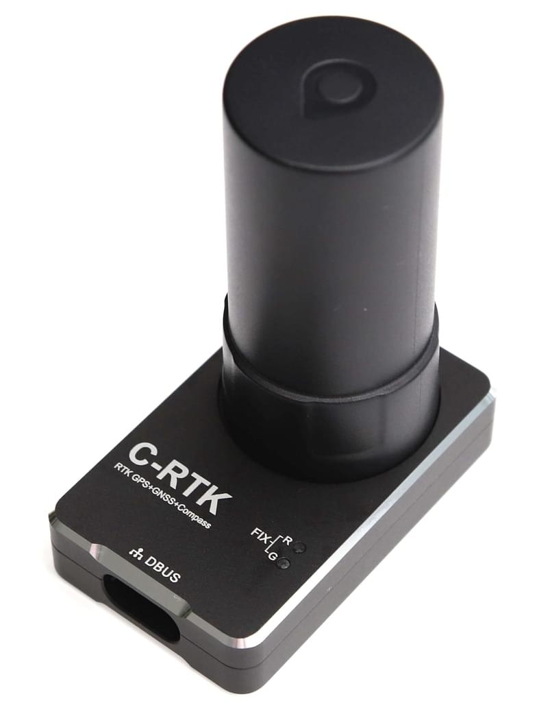

# CUAV C-RTK

[CUAV C-RTK GPS 수신기](http://doc.cuav.net/gps/c-rtk/en/)는 일반 사용자를 위한 [RTK GPS 모듈](../gps_compass/rtk_gps.md)입니다. 완전한 RTK 시스템은 2개 이상의 C-RTK 모듈 \(하나는 기지국용, 다른 하나는 항공기용\)으로 구성됩니다. RTK를 사용하면 PX4는 일반 GPS에서 제공하는 것 보다 훨씬 더 정확한 센티미터 수준의 정확도로 위치를 파악할 수 있습니다.

## 구매처

* [cuav taobao](https://item.taobao.com/item.htm?id=565380634341&spm=2014.21600712.0.0)
* [cuav aliexpress](https://www.aliexpress.com/store/product/CUAV-NEW-Flight-Controller-GPS-C-RTK-differential-positioning-navigation-module-GPS-for-PIX4-Pixhawk-pixhack/3257035_32853894248.html?spm=2114.12010608.0.0.75592fadQKPPEn)

## 설정

*QGroundControl*을 통한 PX4의 RTK 설정 및 사용은 대부분 플러그앤플레이입니다 \(자세한 내용은 [RTK GPS](../advanced_features/rtk-gps.md) 참조\).

## 배선

C-RTK GPS는 [Pixhack v3](http://doc.cuav.net/gps/c-rtk/en/c-rtk/hardware-connection.html)과 호환되는 6핀 커넥터 및 4핀 커넥터로 종단되는 케이블과 함께 제공됩니다. 6핀 커넥터는 RTK GPS 용 인터페이스를 제공하며 비행 콘트롤러의 GPS 포트에 연결하여야합니다. 4핀 커넥터는 두 번째 GPS로 사용하기 위한 (옵션) m8n (표준) GPS 인터페이스입니다.

:::tip
이 문서 작성시에는 PX4는 아직 두 번째 GPS를 완전하게 지원하지 않습니다. 4핀 포트는 연결할 필요 없습니다.
:::

다른 비행 콘트롤러 보드에 연결하려면 케이블/커넥터를 수정하여야 하는 경우도 있습니다. *Pixhawk 3 Pro*와 *Pixracer*의 핀 매핑은 다음과 같습니다.

### 핀배열

C-RTK GPS 핀배열은 아래와 같습니다. 이것은 다른 자동조종보드용 커넥터를 수정할 수 있습니다.

| 핀 | C-RTK GPS 6P | 핀 | Pixhawk 3 Pro GPS | C-RTK GPS 4P |
| - | ------------ | - | ----------------- | ------------ |
| 1 | SDA          | 1 | VCC               |              |
| 2 | SCL          | 2 | GPS_TX            |              |
| 3 | GPS_RX       | 3 | GPS_RX            | GPS_RX       |
| 4 | GPS_TX       | 4 | SCL               | GPS_TX       |
| 5 | VCC_5V       | 5 | SDA               | VCC_5V       |
| 6 | GND          | 6 | GND               | GND          |