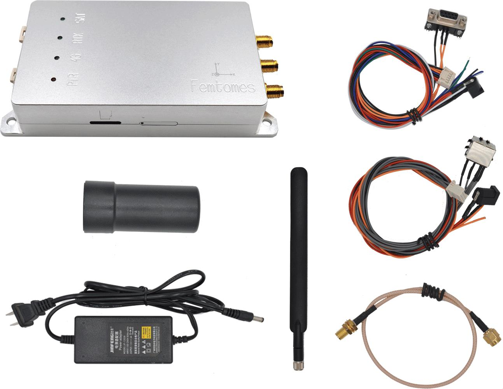
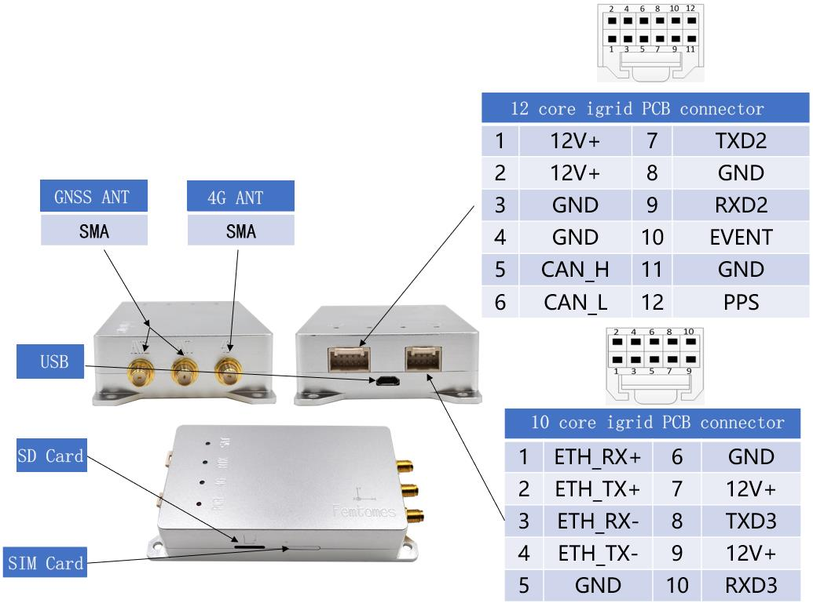
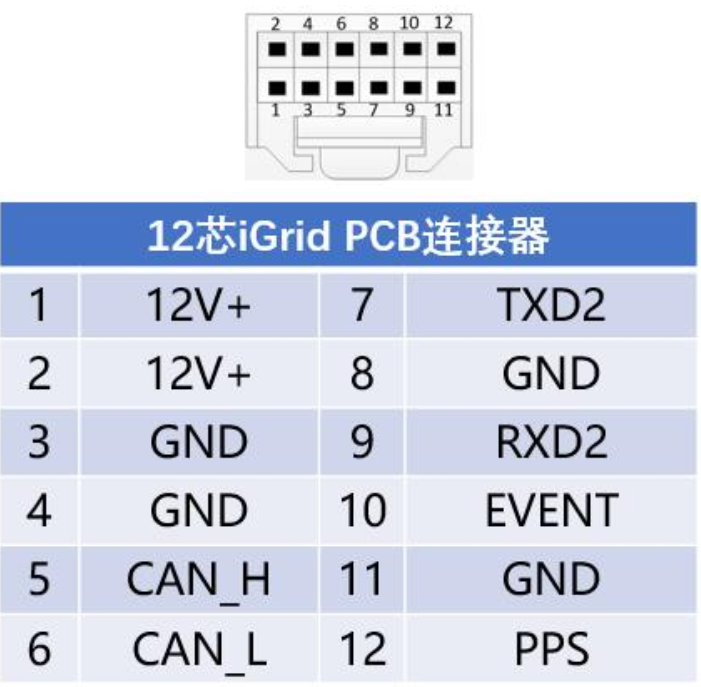
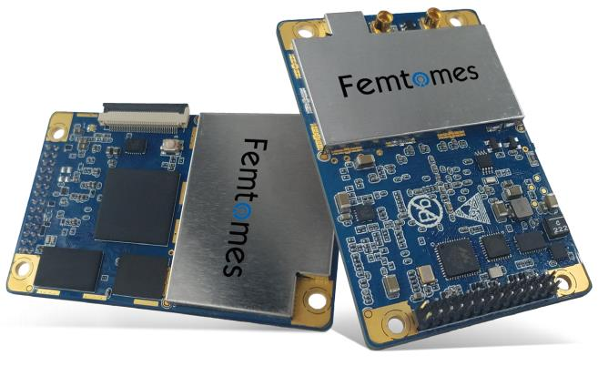
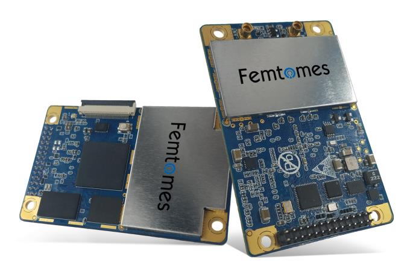

# Femtones MINI2 수신기

[MINI2 수신기](http://www.femtomes.com)는 센티미터 레벨 포지셔닝을 위하여 빠르고 안정적인 RTK 초기화를 제공하는 RTK GPS 수신기입니다. 고정밀 위치 지정(예 : 내비게이션 및 매핑 등)이 필요한 애플리케이션을 위하여 개발되었습니다.

수신기는 직렬 포트 (UART)를 통하여 PX4에 연결되며, 표준 웹 브라우저를 사용하여 설정할 수 있습니다.

:::note
이더넷, CAN 및 USB용 PX4 드라이버는 현재 개발 중입니다.
:::

## 필수 펌웨어 옵션

장치 구매시 다음 펌웨어 옵션을 선택하여야 합니다.
- 5Hz, 10Hz, 20Hz
- INS
- HEADING
- OBS
- RTK
- BASE

## 구매처

판매 견적은 [Femtones](http://www.femtomes.com)에 문의하십시오.
- **전자메일:** [sales@femtomes.com](mailto:sales@femtomes.com)
- **전화:** +86-10-53779838

## 기능성 포트

## 배선

[MINI2 수신기](http://www.femtomes.com)는 데이터용 비행 콘트롤러(GPS 포트)의 UART에 연결됩니다. 모듈에 전원을 공급하기 위하여, 별도의 12V 전원공급장치가 필요합니다. 12핀 커넥터 핀은 아래와 같이 번호가 지정됩니다.

## 설정

방향 추정을 위해 두 안테나는 같은 높이에 있어야하고, 서로 최소 30cm 떨어져 있어야합니다. 두 GPS가 향하는 방향은 [GPS_YAW_OFFSET](../advanced_config/parameter_reference.md#GPS_YAW_OFFSET) 매개변수로 설정할 수 있습니다.

[GPS_1_CONFIG](../advanced_config/parameter_reference.md#GPS_1_CONFIG)를 사용하여 [MINI2 수신기](http://www.femtomes.com)의 실행 직렬 포트를 설정하고, [SER_GPS1_BAUD](../advanced_config/parameter_reference.md#SER_GPS1_BAUD)에서 전송 속도를 115200으로 설정합니다.

설정후에는 수신기는 다른 [RTK GPS](../gps_compass/rtk_gps.md)와 동일한 방식으로 사용됩니다 (즉, Survey-in 프로세스와 관련하여).

## 추가 정보

MINI2는 다음 구성 요소를 통합합니다.

- [FB672](http://www.femtomes.com/en/FB672.php) : 소형, 이중 안테나, 이중 주파수 GNSS OEM 보드(센티미터 수준의 정확한 위치와 정확한 방향 제공).

  

- [FB6A0](http://www.femtomes.com/en/FB6A0.php) : 컴팩트한 4 중 주파수 GNSS OEM 보드(센티미터 단위로 정확한 위치 제공)

  

자세한 제품 매뉴얼은 공식 웹 사이트와 제조사에 문의하십시오.
