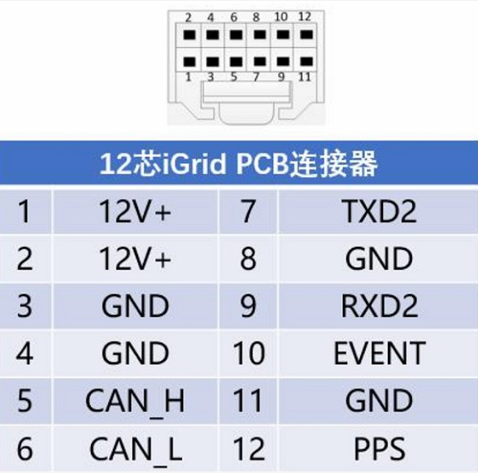

# Femtones MINI2 수신기

[MINI2 Receiver](http://www.femtomes.com/#/MiniII?type=0) is an RTK GPS receiver that delivers high-rate and reliable RTK initialization for centimeter level positioning. It is intended for applications that require high-precision positioning (e.g. navigation and mapping, etc.).

수신기는 직렬 포트 (UART)를 통하여 PX4에 연결되며, 표준 웹 브라우저를 사용하여 설정할 수 있습니다.

:::note
이더넷, CAN 및 USB용 PX4 드라이버는 현재 개발 중입니다.
:::

## 필수 펌웨어 옵션

장치 구매시 다음 펌웨어 옵션을 선택하여야 합니다.
- 5Hz, 10Hz, 20Hz
- INS
- HEADING
- OBS
- RTK
- BASE

## Where to Buy

Contact [Femtones](http://www.femtomes.com/) directly for sales quote:
- **전자메일:** [sales@femtomes.com](mailto:sales@femtomes.com)
- **전화:** +86-10-53779838

## 기능성 포트

## 배선

[MINI2 수신기](http://www.femtomes.com)는 데이터용 비행 콘트롤러(GPS 포트)의 UART에 연결됩니다. 모듈에 전원을 공급하기 위하여, 별도의 12V 전원공급장치가 필요합니다. 12핀 커넥터 핀은 아래와 같이 번호가 지정됩니다.

## 설정

방향 추정을 위해 두 안테나는 같은 높이에 있어야하고, 서로 최소 30cm 떨어져 있어야합니다. 두 GPS가 향하는 방향은 [GPS_YAW_OFFSET](../advanced_config/parameter_reference.md#GPS_YAW_OFFSET) 매개변수로 설정할 수 있습니다.

Configure the serial port on which the [MINI2 Receiver](http://www.femtomes.com/#/MiniII?type=0) will run using [GPS_1_CONFIG](../advanced_config/parameter_reference.md#GPS_1_CONFIG), and set the baud rate to 115200 using [SER_GPS1_BAUD](../advanced_config/parameter_reference.md#SER_GPS1_BAUD).

설정후에는 수신기는 다른 [RTK GPS](../gps_compass/rtk_gps.md)와 동일한 방식으로 사용됩니다 (즉, Survey-in 프로세스와 관련하여).

## 추가 정보

MINI2는 다음 구성 요소를 통합합니다.

- [FB672](http://www.femtomes.com/#/FB672): Compact, dual antenna, dual frequency GNSS OEM board (delivers centimeter accurate position and precise heading).

  

- [FB6A0](http://www.femtomes.com/#/FB6A0): Compact, quadruple frequency GNSS OEM board (delivers centimeter-accurate positioning)

  

자세한 제품 매뉴얼은 공식 웹 사이트와 제조사에 문의하십시오.
