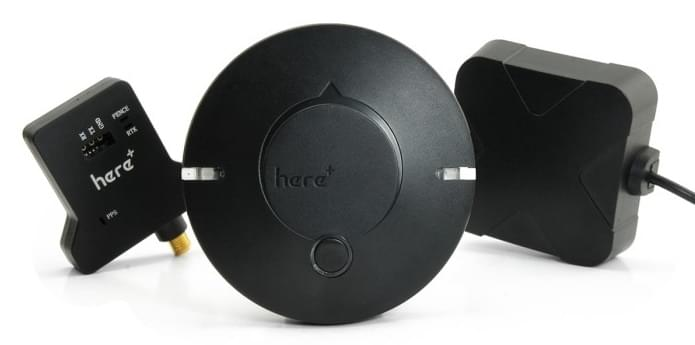

# HEX/ProfiCNC Here+ RTK GPS (단종됨)

::::note 이 GPS는 더 이상 구매할 수 없지만, PX4에 호환됩니다.

사용 문서는 [PX4v1.11 문서](https://docs.px4.io/v1.11/en/gps_compass/rtk_gps_hex_hereplus.html)를 참고하십시오.
:::

**Here + RTK GPS 수신기**는 u-blox M8P를 기반으로 한 작고 가볍고 에너지 효율적인 [RTK GPS 모듈](../gps_compass/rtk_gps.md)입니다. RTK를 사용하면 PX4는 일반 GPS에서 제공하는 것 보다 훨씬 더 정확한 센티미터 수준의 정확도로 위치를 파악할 수 있습니다.

