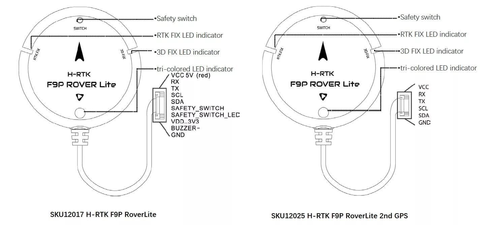
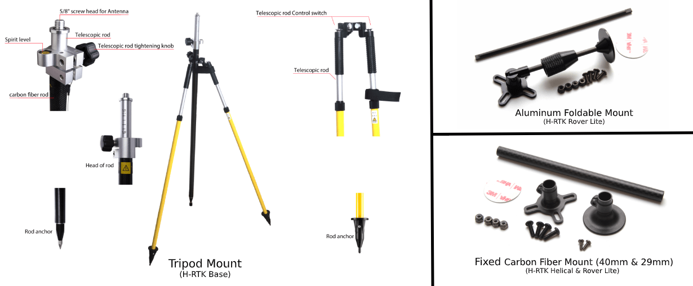

# Holybro H-RTK F9P GNSS

[Holybro H-RTK F9P GNSS](http://www.holybro.com/product/h-rtk-f9p/)는 Holybro에서 출시한 다중 대역 고정밀 [RTK GNSS 시스템](../gps_compass/rtk_gps.md) 시리즈입니다. 이 제품군은 [H-RTK M8P](../gps_compass/rtk_gps_holybro_h-rtk-m8p.md) 시리즈와 유사하지만, 더 빠른 수렴 시간과 안정적인 성능, GPS, GLONASS, Galileo 및 BeiDou의 동시 수신, 높은 업데이트 속도를 제공하는 다중 대역 RTK를 사용합니다. 센티미터 정확도의 동적 대용량 애플리케이션에 적용 가능합니다. u-blox F9P 모듈, IST8310 나침반과 3색 LED 표시기를 사용합니다. 또한, 간단하고 편리하게 작동할 수 있는 통합 안전 스위치가 있습니다.

Holybro H-RTK F9P에는 세 가지 모델이 있으며, 각 모델은 다른 요구 사항을 충족하기 위하여 각각 다른 안테나 설계를 사용합니다. 자세한 내용은 [사양 및 모델 비교 섹션](#specification-and-model-comparison)을 참고하십시오.

RTK를 사용하여 PX4는 일반 GPS 보다 훨씬 더 정확한 센티미터 수준에서 위치를 파악할 수 있습니다.

## 구매

* [H-RTK F9P (Holybro 웹사이트)](https://shop.holybro.com/h-rtk-f9p_p1226.html?)
* [H-RTK Accessories (Holybro 웹사이트)](https://shop.holybro.com/c/h-rtk_0512)

## 설정

_QGroundControl_을 통한 PX4의 RTK 설정 및 사용 방법은 대부분 플러그앤플레이입니다 \(자세한 내용은 [RTK GPS](../advanced_features/rtk-gps.md) 참조\).

## 배선

H-RTK Helical models come with both GH 10-pin & 6-pin cables that are compatible with the GPS1 & GPS2 ports on flight controllers that use the Pixhawk Connector Standard, such as [Pixhawk 4](../flight_controller/pixhawk4.md) and [Pixhawk 5x](../flight_controller/pixhawk5x.md).

The H-RTK Rover Lite comes in two version. The standard version comes with 10 pin connector for the `GPS1` port. The "2nd GPS" version comes with 6 pin connector for the `GPS2` port. This is used as a secondary GPS for [Dual GPS Systems](../gps_compass/README.md#dual_gps).

:::note
The cables/connectors may need to be modified in order to connect to other flight controller boards (see [Pin Map](#pin-map) below).
:::

## 핀 맵

## 사양 및 모델 비교

## GPS 소품

[H-RTK Mount (Holybro Website)](https://shop.holybro.com/spare-parts-gps-mount_p1228.html)

