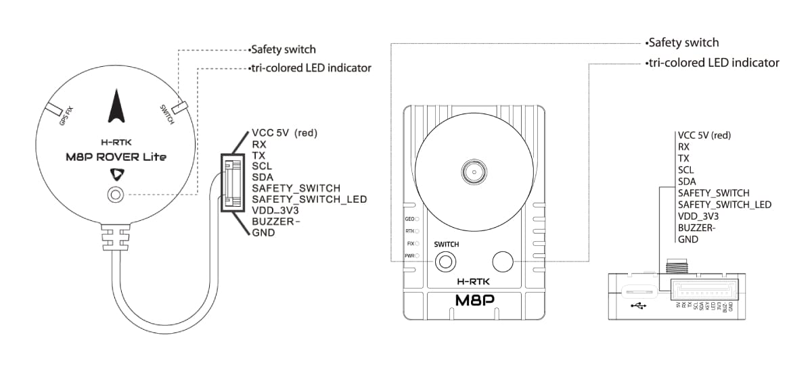
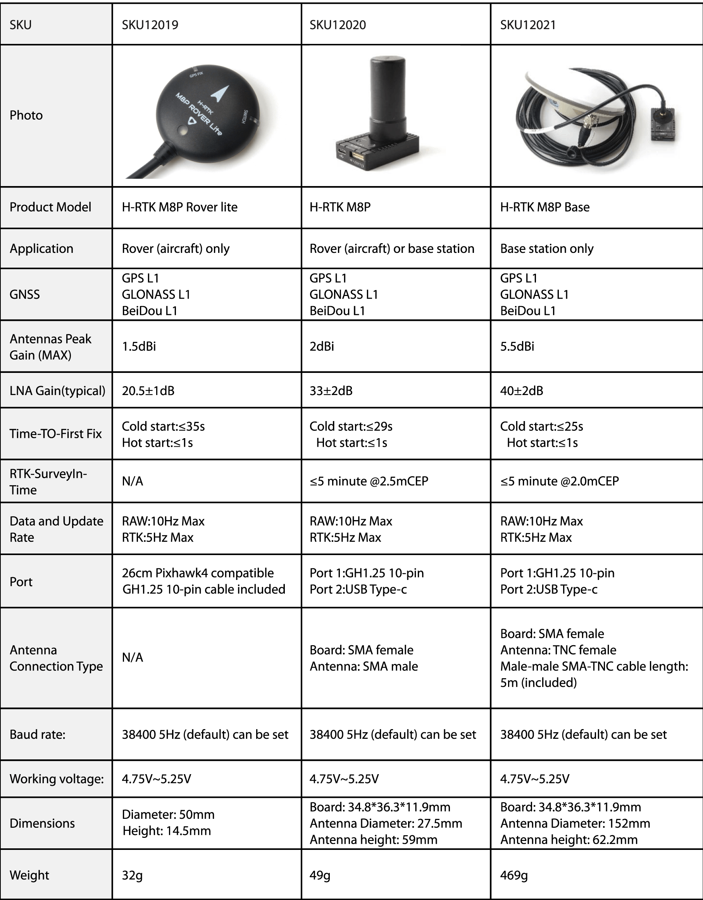

# Holybro H-RTK M8P GNSS (Discontinued)

:::warning
This GNSS has been discontinued, and is no longer commercially available.
:::

The [Holybro H-RTK M8P GNSS](https://holybro.com/collections/standard-h-rtk-series/products/h-rtk-m8p-gnss-series) is an [RTK GNSS module](../gps_compass/rtk_gps.md) series for the mass market. 이 제품군은 [H-RTK M9P](../gps_compass/rtk_gps_holybro_h-rtk-f9p.md) 시리즈와 유사하지만, 더 작고 가볍고 저렴한 M8P u-blox RTK GNSS 모듈을 사용합니다 (이전 세대보다 훨씬 우수한 위치 해상도를 제공합니다).

Holybro H-RTK M8P에는 세 가지 모델이 있으며, 각각 다른 요구 사항을 충족하기 위해 서로 다른 안테나 디자인을 사용합니다. 자세한 내용은 [사양 및 모델 비교 섹션](#specification-and-model-comparison)을 참고하십시오.

RTK를 사용하면 PX4는 일반 GPS에서 제공하는 것 보다 훨씬 더 정확한 센티미터 수준의 정확도로 위치를 파악할 수 있습니다.

## Where to Buy

* [H-RTK M8P (GPS RTK Mounts)](https://holybro.com/products/vertical-mount-for-h-rtk-helical)

## 설정

RTK setup and use on PX4 via _QGroundControl_ is largely plug and play \(see [RTK GPS](../gps_compass/rtk_gps.md) for more information\).

## 배선

모든 H-RTK GNSS 모델에는 [Pixhawk 4](../flight_controller/pixhawk4.md)와 호환되는 GH 10 핀 커넥터/케이블이  제공됩니다.

:::note
다른 비행 콘트롤러에 연결하기 위하여 케이블/커넥터를 수정하는 경우도 있습니다 (아래 [핀 맵](#pin_map) 참조).
:::

## 핀 맵

## 사양과 모델 비교

## GPS 소품

[GPS Accessories (Holybro Website)](https://holybro.com/collections/gps-accessories)

