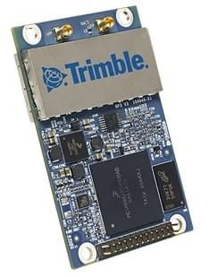
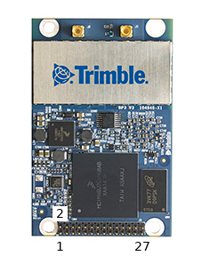

# Trimble MB-Two

[Trimble MB-Two RTK GPS 수신기](https://www.trimble.com/Precision-GNSS/MB-Two-Board.aspx)는 베이스 또는 로버로 구성할 수있는 하이엔드 듀얼 주파수 [RTK GPS 모듈](../gps_compass/rtk_gps.md)입니다.

정확한 위치 정보를 제공하는 것만 아니라, MB-Two는 방향 각도를 추정할 수 있습니다 (이중 안테나 지원이 있음). 이것은 금속 구조물 근처에서 비행시 나침반 정보가 부정확한 상황에서 매우 유용합니다.

## 필수 펌웨어 옵션

장치 구매시 다음 펌웨어 옵션을 선택하여야 합니다.

- \[X\] \[2\] \[N\] \[G\] \[W\] \[Y\] \[J\] : 20Hz 위치 업데이트 및 RTK 지원, 수평 1cm 및 수직 2cm 위치 정확도
- \[L\] LBAND
- \[D\] DUO - 이중 안테나 방향각
- \[B\] BEIDOU + \[O\] GALILEO, 필요시

## 안테나 케이블

Trimble MB-Two에는 2개의 이중 주파수(L1/L2) 안테나가 필요합니다. 좋은 예는 [Maxtenna M1227HCT-A2-SMA](http://www.maxtena.com/products/helicore/m1227hct-a2-sma/) 입니다. [Farnell](https://uk.farnell.com/maxtena/m1227hct-a2-sma/antenna-1-217-1-25-1-565-1-61ghz/dp/2484959)에서 구매 가능합니다.

장치의 안테나 커넥터 유형은 MMCX입니다. 위의 안테나(SMA 커넥터)에 적합한 케이블은 아래에서 참고하십시오.

- [30 cm version](https://www.digikey.com/products/en?mpart=415-0073-012&v=24)
- [45 cm version](https://www.digikey.com/products/en?mpart=415-0073-018&v=24)

## 배선

Trimble MB-Two는 비행 콘트롤러(GPS 포트)의 UART에 연결됩니다.

모듈에 전원을 공급용 3.3V 전원공급장치가 별도로 필요합니다 (최대 소비량은 360mA).

:::note
모듈은 Pixhawk에서 전원을 공급 받을 수 없습니다.
:::

28핀 커넥터 핀은 아래와 같은 번호가 지정됩니다:

| 핀  | 명칭       | 설명                             |
| -- | -------- | ------------------------------ |
| 6  | Vcc 3.3V | 전원 공급                          |
| 14 | GND      | Autopilot의 전원과 GND에 전원을 연결합니다. |
| 15 | TXD1     | Autopilot의 RX에 연결              |
| 16 | RXD1     | Autopilot의 TX에 연결              |

## 설정

먼저 GPS 프로토콜을 Trimble([GPS_x_PROTOCOL=3](../advanced_config/parameter_reference.md#GPS_1_PROTOCOL))로 설정합니다.

방향 추정을 위해 두 안테나는 같은 높이에 있어야하고, 서로 최소 30cm 이상 떨어져야 합니다. 두 GPS가 향하는 방향은 [GPS_YAW_OFFSET](../advanced_config/parameter_reference.md#GPS_YAW_OFFSET) 매개변수로 설정할 수 있습니다.

::::note `GPS_YAW_OFFSET`는 기체 x 축([여기](../config/flight_controller_orientation.md#calculating-orientation)에 표시된 앞/뒤 축)을 기준으로 *기준선* (두 GPS 안테나 사이의 선)이 이루는 각도입니다.
:::

[GPS_1_CONFIG](../advanced_config/parameter_reference.md#GPS_1_CONFIG)를 사용하여 Trimple이 실행될 [직렬 포트를 설정](../peripherals/serial_configuration.md)하고 [SER_GPS1_BAUD](../advanced_config/parameter_reference.md#SER_GPS1_BAUD)에서 전송 속도를 115200로 설정합니다.

자세 추정을위한 방향 융합을 활성화하려면 [EKF2_AID_MASK](../advanced_config/parameter_reference.md#EKF2_AID_MASK) 매개변수를 *GPS 요 융합*을 활성화하도록 설정합니다.

:::note
참조 : [GPS &gt; 구성 &gt; 요/방향 소스로서의 GPS](../gps_compass/README.md#configuring-gps-as-yaw-heading-source)
:::