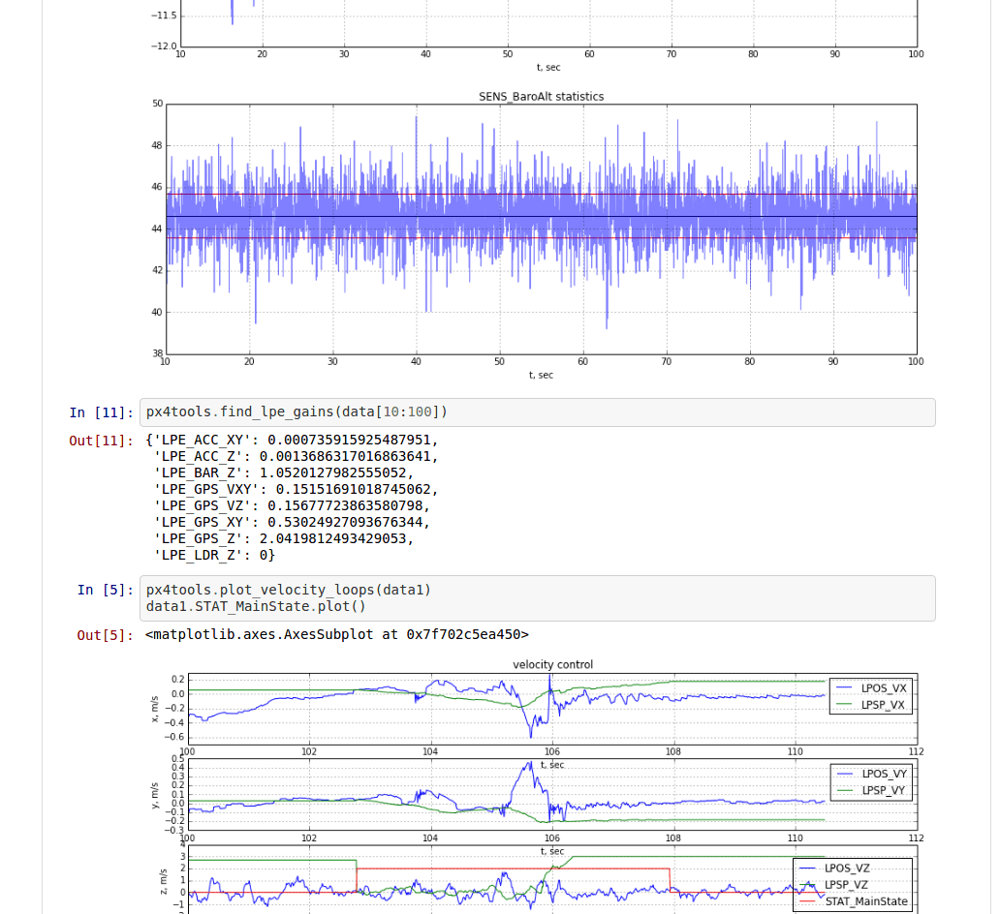
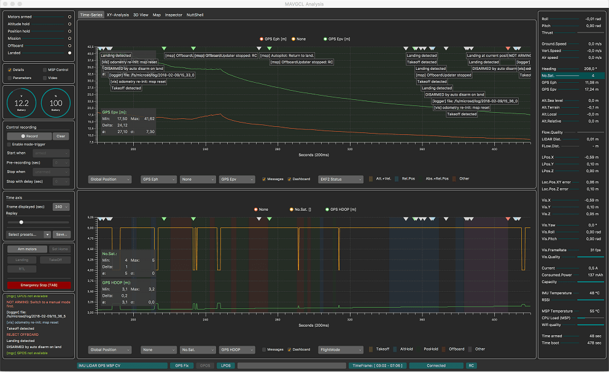
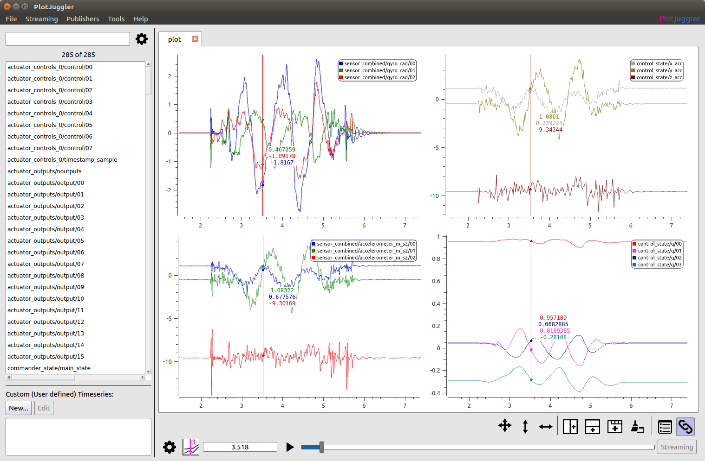

# 비행 로그 분석

PX4 비행 로그 분석 소프트웨어와 방법에 대하여 설명합니다.

## 비행 보고서

[비행 보고서](../getting_started/flight_reporting.md)에서는 로그를 다운로드하여 개발팀과 함께 비행 문제를 보고하고 토론하는 방법을 설명합니다.

## 구조 분석

비행 로그를 분석하기 전에 상황 파악이 더 중요합니다.

* 오작동 후 분석이 수행되면 로그에 충돌이 캡처 되었습니까 아니면 공중에서 중지 되었습니까?
* 모든 컨트롤러가 사건들을 추적 했습니까? 이를 설정하는 가장 쉬운 방법은 자세의 롤 및 피치 속도를 설정 포인트와 비교하는 것입니다.
* 센서 데이터가 유효합니까? 매우 강한 진동이 있었습니까? (강한 진동에 대한 합리적인 임계 값은 피크 대 피크가 2-3m/s/ s 이상인 모든 것입니다.)
* 근본 원인이 차량에 국한되지 않은 경우 [PX4 문제 추적기 ](https://github.com/PX4/PX4-Autopilot/issues/new)의 로그 파일 \ (존재하는 경우 동영상 포함)\에 대한 링크와 함께 보고해야합니다.

## 정전 방지

로그 파일이 비행중에 중단되는 경우는 두 가지 주요 원인일 수 있습니다. 정전 *또는* 운영 체제의 심각한 오류입니다.

[STM32 시리즈](http://www.st.com/en/microcontrollers/stm32-32-bit-arm-cortex-mcus.html?querycriteria=productId=SC1169) 기반 자동 조종 장치에서는 운영 체제의 하드 오류가 SD 카드에 기록됩니다. [STM32 시리즈](http://www.st.com/en/microcontrollers/stm32-32-bit-arm-cortex-mcus.html?querycriteria=productId=SC1169) 기반 자동 조종 장치에서는 운영 체제의 하드 오류가 SD 카드에 기록됩니다. 비행 로그가 갑자기 종료되는 경우 항상이 파일이 있는지 확인하십시오.

## 분석 도구

### Flight Review (온라인 도구)

[Flight Review](http://logs.px4.io)는 *Log Muncher*의 후속 제품입니다. 새로운 [ULog](../dev_log/ulog_file_format.md) 로깅 형식과 함께 사용됩니다.

주요 기능:
* 웹 기반으로 되어 있어며, 일반 사용자에게 적합합니다.
* 사용자는 보고서를 업로드하고 다른 사람과 공유 할 수 있습니다.
* 대화형 플롯.


입분용 [비행 검토를 사용한 로그 분석 ](flight_review.md)을 참조하세요.

### pyulog

[pyulog](https://github.com/PX4/pyulog)는 ULog 정보를 추출/표시하고 다른 파일 형식으로 변환하는 일련의 명령 줄 스크립트와 함께 ULog 파일을 구문 분석하는 Python 패키지입니다.

주요 기능:
* ULog 파일을 구문 분석하기위한 Python 라이브러리입니다. 다른 여러 ULog 분석 및 시각화 도구에서 사용하는 기본 라이브러리입니다.
* ULog 정보를 추출/표시하는 스크립트 :
  * *ulog_info* : ULog 파일의 정보를 표시합니다.
  * *ulog_messages* : ULog 파일에서 기록된 메시지를 표시합니다.
  * *ulog_params* : ULog 파일에서 매개 변수를 추출합니다.
* ULog 파일을 다른 포맷으로 변환하는 스크립트 :
  * *ulog2csv* : ULog를 (여러) CSV 파일로 변환합니다.
  * *ulog2kml* : ULog를 (여러) KML 파일로 변환합니다.

모든 스크립트는 시스템 전체 애플리케이션으로 설치되며 (즉, Python이 설치된 경우 명령 줄에서 호출 됨) 도움말을 `-h` 옵션을 사용하여 볼 수 있습니다. 예:
```
$ ulog_info -h
usage: ulog_info [-h] [-v] file.ulg

ULog 파일의 정보 표시

위치 인수 :
  file.ulg       ULog input file

선택적 인수 :
  -h, --help    이 도움말 메시지를 표시하고 종료
  -v, --verbose 자세한 출력
```

다음은 *ulog_info*를 사용하여 샘플 파일에서 내보내기한 정보의 종류입니다.
```
$ ulog_info sample.ulg
Logging start time: 0:01:52, duration: 0:01:08
Dropouts: count: 4, total duration: 0.1 s, max: 62 ms, mean: 29 ms
Info Messages:
 sys_name: PX4
 time_ref_utc: 0
 ver_hw: AUAV_X21
 ver_sw: fd483321a5cf50ead91164356d15aa474643aa73

Name (multi id, message size in bytes)    number of data points, total bytes
 actuator_controls_0 (0, 48)                 3269     156912
 actuator_outputs (0, 76)                    1311      99636
 commander_state (0, 9)                       678       6102
 control_state (0, 122)                      3268     398696
 cpuload (0, 16)                               69       1104
 ekf2_innovations (0, 140)                   3271     457940
 estimator_status (0, 309)                   1311     405099
 sensor_combined (0, 72)                    17070    1229040
 sensor_preflight (0, 16)                   17072     273152
 telemetry_status (0, 36)                      70       2520
 vehicle_attitude (0, 36)                    6461     232596
 vehicle_attitude_setpoint (0, 55)           3272     179960
 vehicle_local_position (0, 123)              678      83394
 vehicle_rates_setpoint (0, 24)              6448     154752
 vehicle_status (0, 45)                       294      13230 
```


### pyFlightAnalysis

[pyFlightAnalysis](https://github.com/Marxlp/pyFlightAnalysis)는 [FlightPlot](#flightplot)에서 영감을 얻은 크로스 플랫폼 PX4 비행 로그 (ULog) 비쥬얼 분석 도구입니다.

주요 기능:
* 데이터 표시를위한 동적 필터
* 드론의 자세와 위치에 대한 3D 시각화
* pyqtgraph의 ROI (관심 지역)로 쉽게 재생
* Python 기반, 다양한 플랫폼 지원.


### FlightPlot

[FlightPlot](https://github.com/PX4/FlightPlot)은 로그 분석을 위한 데스크톱 기반 도구입니다. [FlightPlot 다운로드](https://github.com/PX4/FlightPlot/releases) (Linux, MacOS, Windows)에서 다운로드 할 수 있습니다.

주요 기능:
* Java 기반, 다양한 플랫폼 지원.
* 직관적인 GUI, 프로그래밍 지식이 필요하지 않습니다.
* 신규 및 기존 PX4 로그 형식 (.ulg, .px4log, .bin) 모두 지원
* 그래프를 이미지로 저장할 수 있습니다.


### PX4Tools

[PX4Tools](https://github.com/dronecrew/px4tools)는 Python으로 작성된 PX4 자동 조종 장치 로그 분석도구입니다. 권장되는 설치 절차는 [anaconda3](https://conda.io/docs/index.html)를 사용하는 것입니다. 자세한 내용은 [px4tools github 페이지](https://github.com/dronecrew/px4tools)를 참조하세요.

주요 기능:
* 공유하기 쉽고 사용자는 Github 노트북을 조회할 수 있습니다(예: [15-09-30 Kabir Log.ipynb](https://github.com/jgoppert/lpe-analysis/blob/master/15-09-30%20Kabir%20Log.ipynb)).
* Python based, cross platform, works with anaconda 2 and anaconda3
* iPython/jupyter 노트북을 사용하여 분석과 공유가 편리합니다.
* 상세한 분석이 가능한 고급 플로팅 기능




### MAVGCL

[MAVGC](https://github.com/ecmnet/MAVGCL)은 PX4 용 기내 로그 분석기입니다. 다운로드한 uLog 파일로 오프라인 모드에서도 사용 가능합니다.

주요 기능:
* MAVLink 메시지 또는 MAVLink를 통한 ULOG 데이터에 기반한 실시간 데이터 수집 (50ms 샘플링, 100ms 롤링 디스플레이)
* 메시지 (MAVLink 및 ULog) 및 매개 변수 변경 (MAVLink 전용)으로 주석이 추가 된 타임 차트
* 선택한 주요 수치에 대한 XY 분석
* 3D보기(차량 및 관찰자 관점)
* MAVLink 검사기 (원시 MAVLink 메시지 보고)
* 오프라인 모드 : PX4Log / ULog에서 키 그림 가져오기 (WiFi를 통해 장치에서 파일 또는 마지막 로그)
* Java 기반. macOS 및 Ubuntu에서 작동하는 것으로 알려져 있습니다.
* 그리고 더 많은 기능들 ...




### PlotJuggler

[PlotJuggler](https://github.com/facontidavide/PlotJuggler)는 Qt5 데스크톱 애플리케이션입니다. 사용자가 시계열 형태의 데이터를 시각화하고 분석할 수 있습니다.

2.1.4 버전부터 **ULog 파일** (. ulg)을 지원합니다.

주요 기능:

* 직관적인 드래그 앤 드롭 인터페이스.
* 여러 플롯, 탭과 창에서 데이터를 정렬합니다.
* 데이터를 정렬 후 "레이아웃" 파일에 저장하고 다시 로드할 수 있습니다.
* 사용자 지정 "데이터 변환"을 사용하여 PlotJuggler 자체 내에서 데이터를 처리합니다.

소스 코드 다운로드는 [Github](https://github.com/facontidavide/PlotJuggler)에서 제공합니다.




### Data Comets

[Data Comets](https://github.com/dsaffo/DataComets)는 비행 데이터를 비행 경로에 인코딩하고 시간별로 데이터 필터링과 브러싱 할 수있는 대화형 PX4 비행로그 분석도구입니다.

작은 로그 파일(32Mb 이하)에 대한 도구의 온라인 버전을 사용하거나, 장시간 비행 분석은 로컬에서 실행할 수 있습니다.


