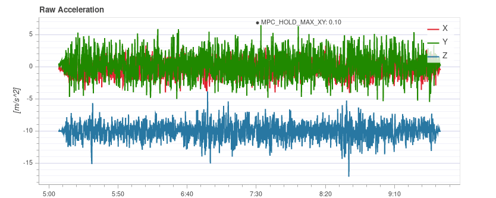
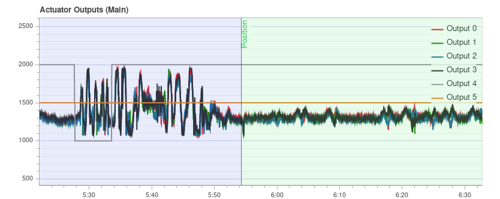
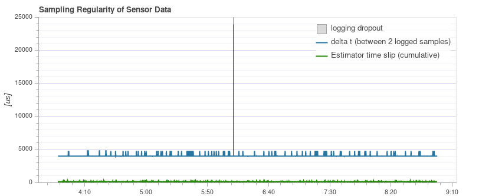

# Flight Review를 이용한 로그 분석

[Flight Review](http://logs.px4.io) 는 기체 상태 점검에 사용할 수 있습니다.

플롯은 자명하지만, 허용 범위와 폴롯은 어떤 모양이어야 하는 지를 알기 위해서는 약간의 경험이 필요합니다. 이 페이지에서는 챠트을 해석하고 일반적인 문제를 식별하는 방법을 설명합니다.

## 일반적인 사용법

여러 플롯에 공통적 인 기능 :

- 플롯 배경색은 기록 중 비행 모드를 나타내는 데 사용됩니다 (그래프는 모드에 따라 다름).  
    - **비행 모드 :** 플롯 본문의 배경색은 비행 모드를 나타냅니다. 플롯 위로 마우스를 가져 가면 비행 모드 레이블이 표시됩니다.
    - **VTOL 비행 모드 :** VTOL 기체는 추가로 플롯 하단에 VTOL 모드를 배경색으로 표시합니다 (멀티콥터의 경우 파란색, 고정익의 경우 노란색, 전환의 경우 빨간색).
- 특정 플롯 축을 마우스로 스크롤 하면 해당 축이 확대됩니다 (수평 또는 수직).
- 플롯 내에서 마우스를 스크롤 하면 두 축이 모두 확대됩니다.

## PID 추적 성능

비행 모드에 따라 비행 컨트롤러는 위치, 속도, 고도 또는 속도 설정 값을 추적할 수 있습니다 (추적된 설정 값은 모드에 따라 다릅니다. 예 : 안정화 모드에서는 속도 설정 값이 없음).

**예상** 라인 (빨간색)은 **설정 값** (녹색)과 거의 일치하여야 합니다. 그렇지 않은 경우 대부분의 경우 해당 컨트롤러의 PID 게인을 조정해야합니다.

[멀티콥터 PID 튜닝 가이드](../config_mc/pid_tuning_guide_multicopter.md)에는 추적 성능 분석에 대한 예제 플롯과 정보가 포함되어 있습니다.

:::tip
특히 속도 컨트롤러의 경우 확대 할 때 더 자세한 정보를 얻으려면 고속 로깅 프로필 ([SDLOG_PROFILE](../advanced_config/parameter_reference.md#SDLOG_PROFILE))을 활성화하는 것이 유용합니다.
:::

## 진동

진동은 멀티콥터의 가장 일반적인 문제중 하나입니다. 높은 진동은 아래의 결과들을 초래할 수 있습니다.

- 비효율적인 비행 및 비행 시간 감소
- 모터가 가열될 수 있습니다.
- 재료들의 마모 증가
- 기체을 단단히 고정할 수 없어, 비행 성능이 저하됩니다.
- 센서 클리핑
- 위치 추정 실패로 인하여 잠재적으로 오비행이 발생할 수 있습니다.

따라서 진동 수준을 주시하고 필요한 경우 설정을 개선하여야 합니다.

진동 수준이 너무 높은 시점이 있으며, 일반적으로 진동 수준이 낮을수록 좋습니다. 그러나 '모든 것이 정상'과 '레벨이 너무 높습니다' 사이에는 넓은 범위가 있습니다. 이 범위는 기체 크기를 포함한 여러 요인에 따라 달라집니다. 대형 기체는 더 높은 관성을 갖고 더 많은 소프트웨어 필터링을 허용합니다 (동시에 대형 차량의 진동은 더 낮은 주파수임).

다음 섹션에서는 진동 수준을 확인에 사용할 플롯과 이를 분석하는 방법을 설명합니다.

:::tip
진동을 분석시에는 여러 차트를 살펴 보는 것이 좋습니다 (다른 차트가 일부 문제를 더 잘 강조할 수 있음).
:::

### 액추에이터 FFT 제어 

:::note
이 플롯을 보려면 고속 로깅 프로필 ([SDLOG_PROFILE](../advanced_config/parameter_reference.md#SDLOG_PROFILE))을 활성화하여야 합니다.
:::

이 그래프는 액추에이터 제어 신호 (속도 컨트롤러의 PID 출력)를 기반으로 롤, 피치 및 요 축에 대한 주파수 플롯을 보여줍니다. 주파수 피크를 식별하고 소프트웨어 필터를 구성하는 데 도움이됩니다. 가장 낮은 끝 (약 20Hz 미만)에는 단일 피크 만 있어야하며 나머지는 낮고 평평하여야 합니다.

y 축 스케일링은 기체마다 다르지만, 동일한 기체의 로그를 서로 직접 비교할 수 있습니다.

#### 예: 양호한 진동

[QAV-R 5 "Racer](../frames_multicopter/qav_r_5_kiss_esc_racer.md) 프레임 (양호한 진동).

:::note
위 프레임의 뛰어난 진동 특성은 [소프트웨어 필터](../config_mc/racer_setup.md#filters)의 차단 주파수를 상당히 증가시킬 수 있음을 의미합니다 (제어 지연 시간 감소).
:::

DJI F450 프레임(양호한 진동).

S500 프레임:

:::note
위의 플롯이 좋아 보이지만 [동일한 비행에 대한 원시 가속도 그래프](#raw_acc_s500)는 진동 수준이 x와 y에 대해 약간 높다는 것을 보여줍니다. 이것은 여러 그래프를 확인할 가치가 있는 이유에 대한 좋은 예입니다!
:::

#### 예: 불량 진동

이 예는 50Hz에 가까운 주파수의 피크를 보여줍니다 (이 경우 "느슨한"랜딩 기어로 인해).

### 가속 전력 스펙트럼 밀도

이것은 시간에 따른 원시 가속도계 데이터의 주파수 응답을 보여주는 2D 주파수 플롯입니다 (x, y 및 z 축의 합계를 표시함). 노란색 영역이 많을수록 해당 시간 및 주파수에서 주파수 응답이 높아집니다.

이상적으로는 몇 Hz까지의 가장 낮은 부분만 노란색이고 나머지는 대부분 녹색 또는 파란색입니다.

#### 예: 양호한 진동

[QAV-R 5 "Racer](../frames_multicopter/qav_r_5_kiss_esc_racer.md) 프레임 (양호한 진동).

 <!-- https://logs.px4.io/plot_app?log=cd88b091-ec89-457c-85f6-e63e4fa0f51d -->

DJI F450 프레임(양호한 진동).

:::note
위에서는 약 100Hz에서 프로펠러의 블레이드 통과 주파수를 볼 수 있습니다.
:::

S500 프레임:

#### 예: 불량 진동

약 100Hz의 강한 노란색 선은 추가 조사가 필요한 잠재적인 문제를 나타냅니다 (다른 차트 검토부터 시작).

이 플롯은 50Hz에 가까운 주파수의 피크를 보여줍니다 (이 경우 "느슨한"랜딩 기어로 인해).

:::tip
이것은 기체 역학에 가까운 강력한 단일 저주파이기 때문에 가능한 문제를 나타냅니다. 기본 필터 설정인 80Hz 진동은 50Hz에서 필터링되지 않습니다.
:::

매우 높은 (안전하지 않은) 진동! 그래프는 거의 완전히 노란색입니다.

:::warning
높은 진동 수준으로 비행하여서는 안됩니다.
:::

### 원시 가속

이 그래프는 x, y 및 z 축에 대한 원시 가속도계 측정을 보여줍니다. 이상적으로 각 선은 가늘고 기체의 가속도를 보여줍니다.

경험상 z 축 그래프가 호버링 또는 느린 비행 중에 x/y 축 그래프에 닿으면, 진동 수준이 너무 높은 것입니다.

:::tip
이 그래프를 사용하는 가장 좋은 방법은 차량이 호버링하는 부분을 약간 확대하는 것입니다.
:::

#### 예: 양호한 진동

[QAV-R 5 "Racer](../frames_multicopter/qav_r_5_kiss_esc_racer.md) 프레임 (양호한 진동).

DJI F450 프레임(양호한 진동).

<!-- https://logs.px4.io/plot_app?log=cd88b091-ec89-457c-85f6-e63e4fa0f51d -->

#### 예: 불량 진동

S500 프레임. 경계선 진동 수준-x 및 y에 대해 약간 높음 (S500 기체의 경우 일반적임). 이것은 비행 성능에 부정적인 영향을 미치기 시작하는 한계입니다.

너무 강한 진동 z 축의 그래프가 x/y 축 그래프와 어떻게 겹치는 지 확인하십시오.

진동 수준이 너무 높습니다. z 축의 그래프가 x/y 축 그래프와 어떻게 겹치는 지 확인하십시오.

매우 높은 (안전하지 않은) 진동 수준.

:::warning
높은 진동 수준으로 비행하여서는 안 됩니다.
:::

### 원시 고속 IMU 데이터 플롯

심층 분석을 위해 원시 IMU 데이터를 전체 속도 (IMU에 따라 몇 kHz)로 기록하는 옵션이 있습니다. 이를 통해 일반 로깅보다 훨씬 더 높은 주파수를 검사할 수 있으므로 진동 마운트를 선택하거나 저역 통과 및 노치 필터를 적절하게 구성시에 도움이 될 수 있습니다.

이를 사용하려면 일부 매개 변수를 변경하여야 합니다.

- [IMU_GYRO_RATEMAX](../advanced_config/parameter_reference.md#IMU_GYRO_RATEMAX)를 400으로 설정합니다. 이렇게하면 원시 센서 데이터가 센서에서 시스템의 나머지 부분으로 전송될 때보다 효율적으로 압축되고 로그 크기가 줄어듭니다 (유용한 데이터를 줄이지 않고). <!-- Explanation in https://github.com/PX4/px4_user_guide/pull/751/files#r440509688
  Data is sent in a fixed size array that will largely empty if sent at higher rate. The "empty data" is also logged.-->

- IMU 데이터에는 높은 로깅 대역폭이 필요하므로, 좋은 SD 카드를 사용하여야 합니다(로깅 속도가 너무 높으면 Flight Review에서 드롭 아웃이 표시됨).
    
:::tip
많이 사용하는 SD 카드를 비교하려면 [로깅> SD 카드](../dev_log/logging.md#sd-cards)를 참조하세요.
:::

- [SDLOG_PROFILE](../advanced_config/parameter_reference.md#SDLOG_PROFILE)에서 자이로 또는 가속 고속 FIFO 프로필을 활성화하고 나머지 항목은 비활성화 합니다. 정말 좋은 SD 카드를 사용하면 (드롭 아웃이 적거나 없음) 다음 작업을 수행 할 수 있습니다.
    
    - 가속 및 자이로 프로필 모두 활성화
    - 또는 가속/자이로와 기본 로깅 프로필을 활성화합니다.

프롯 예:

:::note
첫 번째 IMU의 데이터가 기록되며, 비행에 사용되는 데이터와 반드시 동일하지는 않습니다. 이는 IMU가 다르게 장착된 경우에만 중요합니다 (예 : 하드 장착형과 소프트 장착).
:::

:::note
테스트 후 매개 변수를 복원하는 것을 잊지 마십시오.
:::

### 진동 문제 해결

진동의 원인(또는 여러 원인의 조합)을 로그만으로는 알 수 없는 경우가 많이 있습니다.

이러한 경우에는 기체를 검사하여야 합니다. [진동 방지](../assembly/vibration_isolation.md)은 진동을 줄이기 위하여 확인할 수있는 (및 수행 할) 몇 가지 기본적인 사항들에 대하여 설명합니다.

## 액추에이터 출력

The *Actuator Outputs* graph shows the signals that are sent to the individual actuators (motors/servos). Generally it is in the range between the minimum and maximum configured PWM values (e.g. from 1000 to 2000).

This is an example for a quadrotor where everything is OK (all of the signals are within the range, approximately overlap each other, and are not too noisy): 

The plot can help to identify different problems:

- If one or more of the signals is at the maximum over a longer time, it means the controller runs into **saturation**. It is not necessarily a problem, for example when flying at full throttle this is expected. But if it happens for example during a mission, it's an indication that the vehicle is overweight for the amount of thrust that it can provide.
- For a multicopter the plot can be a good indication if the vehicle is **imbalanced**. It shows in the plot that one or more neighboring motors (two in case of a quadrotor) need to run at higher thrust on average. Note that this can also be the case if some motors provide more thrust than others or the ESCs are not calibrated. An imbalanced vehicle is generally not a big problem as the autopilot will automatically account for it. However it reduces the maximum achievable thrust and puts more strain on some motors, so it is better to balance the vehicle.
- An imbalance can also come from the yaw axis. The plot will look similar as in the previous case, but opposite motors will run higher or lower respectively. The cause is likely that one or more motors are tilted.
    
    This is an example from a hexarotor: motors 1, 3 and 6 run at higher thrust:  <!-- https://logs.px4.io/plot_app?log=9eca6934-b657-4976-a32f-b2e56535f05f -->

- If the signals look very **noisy** (with high amplitudes), it can have two causes: sensor noise or vibrations passing through the controller (this shows up in other plots as well, see previous section) or too high PID gains. This is an extreme example: 

## GPS Uncertainty

The *GPS Uncertainty* plot shows information from the GPS device:

- Number of used satellites (should be around 12 or higher)
- Horizontal position accuracy (should be below 1 meter)
- Vertical position accuracy (should be below 2 meters)
- GPS fix: this is 3 for a 3D GPS fix, 4 for GPS + Dead Reckoning, 5 for RTK float and 6 for RTK fixed type

## GPS Noise & Jamming

The GPS Noise & Jamming plot is useful to check for GPS signal interferences and jamming. The GPS signal is very weak and thus it can easily be disturbed/jammed by components transmitting (via cable) or radiating in a frequency used by the GPS.

:::tip USB
3 is [known to be](https://www.intel.com/content/www/us/en/io/universal-serial-bus/usb3-frequency-interference-paper.html) an effective GPS jamming source.
:::

The **jamming indicator** should be around or below 40. Values around 80 or higher are too high and the setup must be inspected. Signal interference is also noticeable as reduced accuracy and lower number of satellites up to the point where no GPS fix is possible.

This is an example without any interference:

## Thrust and Magnetic Field

The *Thrust and Magnetic Field* plot shows the thrust and the norm of the magnetic sensor measurement vector.

The norm should be constant over the whole flight and uncorrelated with the thrust. This is a good example where the norm is very close to constant: 

*If it is correlated*, it means that the current drawn by the motors (or other consumers) is influencing the magnetic field. This must be avoided as it leads to incorrect yaw estimation. The following plot shows a strong correlation between the thrust and the norm of the magnetometer: 

Solutions to this are:

- Use an external magnetometer (avoid using the internal magnetometer)
- If using an external magnetometer, move it further away from strong currents (i.e. by using a (longer) GPS mast).

If the norm is uncorrelated but not constant, most likely it is not properly calibrated. However it could also be due to external disturbances (for example when flying close to metal constructs).

This example shows that the norm is non-constant, but it does not correlate with the thrust: 

## Estimator Watchdog

The *Estimator Watchdog* plot shows the health report of the estimator. It should be constant zero.

This is what it should look like if there are no problems: 

If one of the flags is non-zero, the estimator detected a problem that needs to be further investigated. Most of the time it is an issue with a sensor, for example magnetometer interferences. It usually helps to look at the plots of the corresponding sensor. <!-- TODO: separate page for estimator issues? -->

Here is an example with magnetometer problems: 

## Sampling Regularity of Sensor Data

The sampling regularity plot provides insights into problems with the logging system and scheduling.

The amount of **logging dropouts** start to increase if the log buffer is too small, the logging rate is too high or a low-quality SD card is used.

:::note
Occasional dropouts can be expected on medium quality cards.
:::

The **delta t** shows the time difference between two logged IMU samples. It should be close to 4 ms because the data publishing rate is 250Hz. If there are spikes that are a multiple of that (and the estimator time slip does not increase), it means the logger skipped some samples. Occasionally this can happen because the logger runs at lower priority. If there are spikes that are not a multiple, it indicates an irregular sensor driver scheduling, which needs to be investigated.

The **estimator timeslip** shows the difference between the current time and the time of the integrated sensor intervals up to that time. If it changes it means either the estimator missed sensor data or the driver publishes incorrect integration intervals. It should stay at zero, but it can increase slightly for in-flight parameter changes, which is generally not an issue.

This is a good example: 

The following example contains too many dropouts, the quality of the used SD card was too low in that case (see [here](../dev_log/logging.md#sd-cards) for good SD cards):

## Logged Messages

This is a table with system error and warning messages. For example they show when a task becomes low on stack size.

The messages need to be examined individually, and not all of them indicate a problem. For example the following shows a kill-switch test: 

## Flight/Frame Log Review Examples

It is often worth looking at multiple charts for a particular flight when analyzing vehicle condition (different charts can better highlight some issues). This is particularly important when reviewing for possible vibration problems.

The section below groups a few (previously presented) charts by flight/vehicle.

### QAV-R 5" Racer

These charts are all from the same flight of a [QAV-R 5" Racer](../frames_multicopter/qav_r_5_kiss_esc_racer.md). <!-- https://logs.px4.io/plot_app?log=cd88b091-ec89-457c-85f6-e63e4fa0f51d -->

They show a vehicle that has very low vibration:

- Actuator Controls FFT shows only a single peak at the lowest end, with the rest low and flat.
- Spectral density is mostly green, with only a little yellow at the low frequencies.
- Raw Acceleration has z-axis trace well separated from the x/y-axis traces.

### DJI F450

These charts are all from the same flight of a *DJI F450*. <!-- https://logs.px4.io/plot_app?log=cd88b091-ec89-457c-85f6-e63e4fa0f51d -->

They show a vehicle that has low vibration (but not as low as the QAV-R above!):

- Actuator Controls FFT shows a peak at the lowest end. Most of the rest is flat, except for a bump at around 100Hz (this is the blade passing frequency of the propellers).
- Spectral density is mostly green. The blade passing frequency is again visible.
- Raw Acceleration has z-axis trace well separated from the x/y-axis traces.

### S500

These charts are all from the same flight of an S500.

They show a vehicle that has borderline-acceptable vibration:

- Actuator Controls FFT shows a peak at the lowest end. Most of the rest is flat, except for a bump at around 100Hz.
- Spectral density is mostly green, but more yellow than for the DJI F450 at 100Hz.
- Raw Acceleration has z-axis trace fairly close to the x/y-axis traces. This is at the limit where it starts to negatively affect flight performance.

