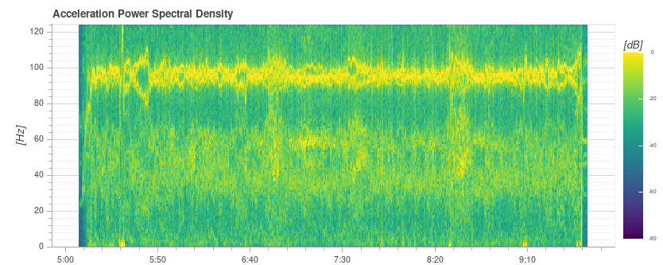
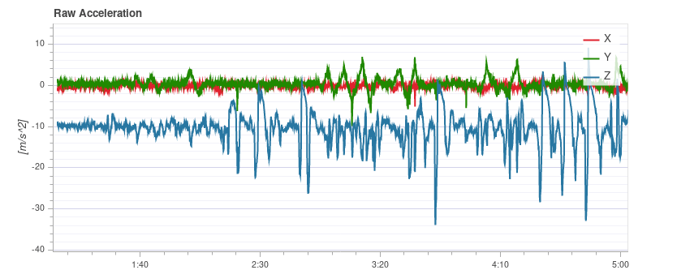
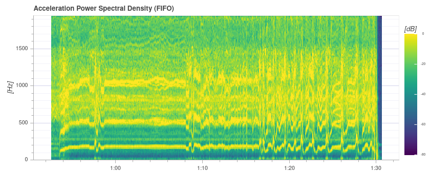
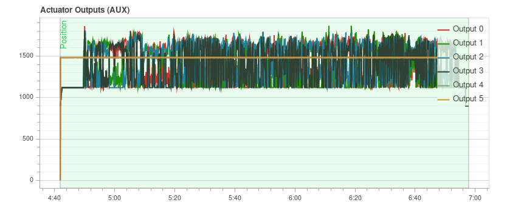
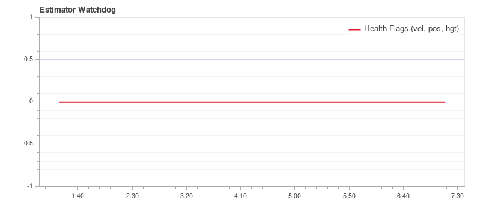

# Flight Review를 이용한 로그 분석

[Flight Review](http://logs.px4.io) 는 기체 상태 점검에 사용할 수 있습니다.

그래프 자체는 어렵지 않지만, 허용 범위와 적절한 그래프 모양을 파악하기 위해서는 약간의 경험이 필요합니다. 이 페이지에서는 그래프를 해석하고 문제점을 식별하는 방법을 설명합니다.

## 일반적인 사용법

그래프에 공통적인 기능 :

- 그래프의 배경색은 기록 중 비행 모드를 나타내는 데 사용됩니다 (그래프는 모드에 따라 다름).
  - **비행 모드 :** 그래프 본문의 배경색은 비행 모드를 나타냅니다. 그래프 위로 마우스를 가져 가면 비행 모드 레이블이 표시됩니다.
  - **VTOL 비행 모드 :** VTOL 기체는 추가로 그래프 하단에 VTOL 모드를 배경색으로 표시합니다 (멀티콥터의 경우 파란색, 고정익의 경우 노란색, 전환의 경우 빨간색).
- 특정 그래프 축을 마우스로 스크롤 하면 해당 축이 확대됩니다 (수평 또는 수직).
- 그래프 내에서 마우스를 스크롤 하면 두 축이 모두 확대됩니다.

## PID 추적 성능

비행 모드에 따라 비행 컨트롤러는 위치, 속도, 고도 또는 속도 설정 값을 추적할 수 있습니다 (추적된 설정 값은 모드에 따라 다릅니다. 예 : 안정화 모드에서는 속도 설정 값이 없음).

**예상** 라인 (빨간색)은 **설정 값** (녹색)과 거의 일치하여야 합니다. 그렇지 않은 경우 대부분의 경우 해당 컨트롤러의 PID 게인을 조정해야합니다.

[멀티콥터 PID 튜닝 가이드](../config_mc/pid_tuning_guide_multicopter.md)에는 추적 성능 분석에 대한 예제 플롯과 정보가 포함되어 있습니다.

:::tip
특히 속도 컨트롤러의 경우 확대 할 때 더 자세한 정보를 얻으려면 고속 로깅 프로필 ([SDLOG_PROFILE](../advanced_config/parameter_reference.md#SDLOG_PROFILE))을 활성화하는 것이 유용합니다.
:::

## 진동

진동은 멀티콥터의 가장 일반적인 문제중 하나입니다. 높은 진동은 아래의 결과들을 초래할 수 있습니다.
- 비효율적인 비행과 비행 시간 감소
- 모터가 가열될 수 있습니다.
- 재료들의 마모 증가
- 기체을 단단히 고정할 수 없어, 비행 성능이 저하됩니다.
- 센서 클리핑
- 위치 추정 실패로 인하여 잠재적으로 오비행이 발생할 수 있습니다.

따라서 진동 수준을 주시하고 필요한 경우 설정을 개선하여야 합니다.

진동이 너무 높은 시점이 있으며, 일반적으로 진동은 낮을수록 좋습니다. 그러나 '모든 것이 정상'과 '레벨이 너무 높습니다' 사이에는 넓은 범위가 있습니다. 이 범위는 기체 크기를 포함한 여러 요인에 따라 달라집니다. 대형 기체는 더 높은 관성을 갖고 더 많은 소프트웨어 필터링을 허용합니다 (동시에 대형 차량의 진동은 더 낮은 주파수임).

다음 섹션에서는 진동 수준을 확인에 사용할 그래프와 분석 방법을 설명합니다.

:::tip
진동을 분석시에는 여러 차트를 살펴 보는 것이 좋습니다 (다른 차트가 일부 문제를 더 잘 강조할 수 있음).
:::

### 액추에이터 FFT 제어

:::note
이 그래프를 조회하려면 고속 로깅 프로필 ([SDLOG_PROFILE](../advanced_config/parameter_reference.md#SDLOG_PROFILE))을 활성화하여야 합니다.
:::

이 그래프는 액추에이터 제어 신호 (속도 컨트롤러의 PID 출력)를 기반으로 롤, 피치 및 요 축에 대한 주파수 플롯을 보여줍니다. 주파수 피크를 식별하고 소프트웨어 필터를 구성하는 데 도움이됩니다. 가장 낮은 끝 (약 20Hz 미만)에는 단일 피크 만 있어야하며 나머지는 낮고 평평하여야 합니다.

y 축 스케일링은 기체마다 다르지만, 동일한 기체의 로그를 서로 직접 비교할 수 있습니다.

#### 예: 양호한 진동

[QAV-R 5 "Racer](../frames_multicopter/qav_r_5_kiss_esc_racer.md) 프레임 (양호한 진동).

:::note
위 프레임의 뛰어난 진동 특성은 [소프트웨어 필터](../config_mc/filter_tuning.md)의 차단 주파수를 상당히 증가시킬 수 있음을 의미합니다 (제어 지연 시간 감소).
:::

DJI F450 프레임(양호한 진동).

S500 프레임:

:::note
위의 그래프가 좋아 보이지만 [동일한 비행에 대한 원시 가속도 그래프](#raw_acc_s500)는 진동 수준이 x와 y에 대해 약간 높다는 것을 보여줍니다. 이것은 여러 그래프를 확인할 가치가 있는 이유에 대한 좋은 예입니다!
:::

#### 예: 불량 진동

이 예는 50Hz에 가까운 주파수의 피크를 보여줍니다 (이 경우 "느슨한"랜딩 기어로 인해).

### 가속 전력 스펙트럼 밀도

이것은 시간에 따른 원시 가속도계 데이터의 주파수 응답을 보여주는 2D 주파수 플롯입니다 (x, y 및 z 축의 합계를 표시함). 노란색 영역이 많을수록 해당 시간 및 주파수에서 주파수 응답이 높아집니다.

이상적으로는 몇 Hz까지의 가장 낮은 부분만 노란색이고 나머지는 대부분 녹색 또는 파란색입니다.

#### 예: 양호한 진동

[QAV-R 5 "Racer](../frames_multicopter/qav_r_5_kiss_esc_racer.md) 프레임 (양호한 진동).

<!-- https://logs.px4.io/plot_app?log=cd88b091-ec89-457c-85f6-e63e4fa0f51d -->

DJI F450 프레임(양호한 진동).

:::note
위에서는 약 100Hz에서 프로펠러의 블레이드 통과 주파수를 볼 수 있습니다.
:::

S500 프레임:

#### 예: 불량 진동

약 100Hz의 강한 노란색 선은 추가 조사가 필요한 잠재적인 문제를 나타냅니다 (다른 차트 검토부터 시작).

이 그래프는 50Hz에 가까운 주파수의 피크를 보여줍니다 (이 경우 "느슨한"랜딩 기어로 인해).

:::tip
이것은 기체 역학에 가까운 강력한 단일 저주파이기 때문에 가능한 문제를 나타냅니다.
기본 필터 설정인 80Hz 진동은 50Hz에서 필터링되지 않습니다.
:::

매우 높은 (안전하지 않은) 진동! 그래프는 거의 완전히 노란색입니다.

:::warning
높은 진동 수준으로 비행하여서는 안됩니다.
:::

### 원시 가속

이 그래프는 x, y 및 z 축에 대한 원시 가속도계 측정을 보여줍니다. 이상적으로 각 선은 가늘고 기체의 가속도를 보여줍니다.

경험상 z 축 그래프가 호버링 또는 느린 비행 중에 x/y 축 그래프에 닿으면, 진동 수준이 너무 높은 것입니다.

:::tip
이 그래프를 사용하는 가장 좋은 방법은 차량이 호버링하는 부분을 약간 확대하는 것입니다.
:::

#### 예: 양호한 진동

[QAV-R 5 "Racer](../frames_multicopter/qav_r_5_kiss_esc_racer.md) 프레임 (양호한 진동).

DJI F450 프레임(양호한 진동).

<!-- https://logs.px4.io/plot_app?log=cd88b091-ec89-457c-85f6-e63e4fa0f51d -->

#### 예: 불량 진동

S500 프레임. 경계선 진동 수준-x 및 y에 대해 약간 높음 (S500 기체의 경우 일반적임). 이것은 비행 성능에 부정적인 영향을 미치기 시작하는 한계입니다.

너무 강한 진동 z 축의 그래프가 x/y 축 그래프와 어떻게 겹치는 지 확인하십시오.

진동 수준이 너무 높습니다. z 축의 그래프가 x/y 축 그래프와 어떻게 겹치는 지 확인하십시오.

매우 높은 (안전하지 않은) 진동 수준.

:::warning
높은 진동 수준으로 비행하여서는 안됩니다.
:::

### 원시 고속 IMU 데이터 플롯

심층 분석을 위해 원시 IMU 데이터를 전체 속도 (IMU에 따라 몇 kHz)로 기록하는 옵션이 있습니다. 이를 통해 일반 로깅보다 훨씬 더 높은 주파수를 검사할 수 있으므로 진동 마운트를 선택하거나 저역 통과 및 노치 필터를 적절하게 구성시에 도움이 될 수 있습니다.

이를 사용하려면 일부 매개 변수를 변경하여야 합니다.
- [IMU_GYRO_RATEMAX](../advanced_config/parameter_reference.md#IMU_GYRO_RATEMAX)를 400으로 설정합니다. 이렇게하면 원시 센서 데이터가 센서에서 시스템의 나머지 부분으로 전송될 때보다 효율적으로 압축되고 로그 크기가 줄어듭니다 (유용한 데이터를 줄이지 않고). 
  <!-- Explanation in https://github.com/PX4/PX4-user_guide/pull/751/files#r440509688
  Data is sent in a fixed size array that will largely empty if sent at higher rate. The "empty data" is also logged.-->
- IMU 데이터에는 높은 로깅 대역폭이 필요하므로, 좋은 SD 카드를 사용하여야 합니다(로깅 속도가 너무 높으면 Flight Review에서 드롭 아웃이 표시됨).

:::tip
많이 사용하는 SD 카드를 비교하려면 [로깅> SD 카드](../dev_log/logging.md#sd-cards)를 참조하세요.
:::
- [SDLOG_PROFILE](../advanced_config/parameter_reference.md#SDLOG_PROFILE)에서 자이로 또는 가속 고속 FIFO 프로필을 활성화하고 나머지 항목은 비활성화 합니다. 정말 좋은 SD 카드를 사용하면 (드롭 아웃이 적거나 없음) 다음 작업을 수행 할 수 있습니다.
  - 가속 및 자이로 프로필 모두 활성화
  - 또는 가속/자이로와 기본 로깅 프로필을 활성화합니다.

그래프 예:

:::note
첫 번째 IMU의 데이터가 기록되며, 비행에 사용되는 데이터와 반드시 동일하지는 않습니다.
:::note
첫 번째 IMU의 데이터가 기록되며, 비행에 사용되는 데이터와 반드시 동일하지는 않습니다.
:::

:::note
테스트 후 매개 변수를 복원하는 것을 잊지 마십시오.
:::

### 진동 문제 해결

진동의 원인(또는 여러 원인의 조합)을 로그만으로는 알 수 없는 경우가 많이 있습니다.

이러한 경우에는 기체를 검사하여야 합니다. [진동 방지](../assembly/vibration_isolation.md)은 진동을 줄이기 위하여 확인할 수있는 (및 수행 할) 몇 가지 기본적인 사항들에 대하여 설명합니다.

## 액추에이터 출력

*액추에이터 출력* 그래프는 개별 액추에이터 (모터/서보)로 전송되는 신호를 나타냅니다. 일반적으로 최소 및 최대 구성된 PWM 값 사이의 범위입니다 (예 : 1000 ~ 2000).

다음은 정상적인 쿼드로터의 예입니다 (모든 신호가 범위 내에 있고, 서로 거의 겹치며, 너무 시끄럽지 않음).

그래프 여러가지 문제점을 식별에 매우 유용합니다.
- 하나 이상의 신호가 오랜 시간에 걸쳐 최대 값에 도달하면 컨트롤러가 **포화**에 도달 함을 의미합니다. 예를 들어, 최대 출력 비행시 예상되는 문제점은 아닙니다. 그러나, 예를 들어 임무중에 발생하는 것은 기체가 제공할 수있는 추력의 양에 비해 과체중임을 나타냅니다.
- 멀티콥터의 경우 그래프는 기체는 **불균형**인 경우 좋은 표시가 될 수 있습니다. 그래프에서 하나 이상의 인접 모터(쿼드 로터의 경우 2 개)가 평균적으로 더 높은 추력으로 작동해야 함을 보여줍니다. 일부 모터가 다른 모터보다 더 많은 추력을 제공하거나 ESC가 보정되지 않은 경우에도 마찬가지입니다. 불균형 차량은 일반적으로 자동 조종 장치가 자동으로 설명하므로 큰 문제는 아닙니다. 그러나, 최대 달성 가능한 추력을 줄이고 일부 모터에 더 많은 부담을 주므로 기체의 균형을 맞추는 것이 좋습니다.
- 요 축에서도 불균형이 발생할 수 있습니다. 그래프는 이전 사례와 비슷하게 보이지만 반대 모터는 각각 더 높거나 낮게 작동합니다. 원인은 하나 이상의 모터가 기울어 졌기 때문일 수 있습니다.

  다음은 헥사 로터의 예입니다. 모터 1, 3, 6은 더 높은 추력으로 작동합니다.
  <!-- https://logs.px4.io/plot_app?log=9eca6934-b657-4976-a32f-b2e56535f05f -->
- 신호가 **잡음**이 심한 (진폭이 높음) 경우에는 두 가지 원인이 있을 수 있습니다. 컨트롤러를 통과하는 센서 노이즈 또는 진동 (다른 플롯에도 표시됨, 이전 섹션 참조) 또는 PID 이득이 너무 높은 경우 입니다. 이것은 극단적인 경우의 예입니다. 

## GPS 불확실성

그래프 여러가지 문제점을 식별에 매우 유용합니다.
- 사용된 위성 수 (약 12 개 이상이어야 함)
- 수평 위치 정확도 (1 미터 미만이어야 함)
- 수직 위치 정확도 (2 미터 미만이어야 함)
- GPS 수정 : 3D GPS 수정의 경우 3, GPS + Dead Reckoning의 경우 4, RTK 플로트의 경우 5, RTK 고정 유형의 경우 6입니다.

## GPS 잡음과 방해 전파

GPS 노이즈와 방해 전파 그래프로 GPS 신호 간섭 및 방해 전파를 확인할 수 있습니다. GPS 신호는 매우 약하므로 GPS에서 사용하는 주파수를 사용하는 (케이블을 통해) 부품으로 인하여  방해를 받기 쉽습니다.

:::tip USB
3 is [known to be](https://www.usb.org/sites/default/files/327216.pdf) an effective GPS jamming source.
:::

**방해 표시기**는 약 40 이하이어야 합니다. 약 80 이상의 값은 너무 높으므로 설정을 검사하여야 합니다. 신호 간섭은 정확도가 떨어지고 GPS 수정이 불가능한 지점까지 위성 수가 적기 때문에 현저하게 나타납니다.

이것은 간섭이없는 예입니다.

## 추력 및 자기장

*추력 및 자기장* 그래프는 자기 센서 측정 벡터의 추력과 표준을 나타냅니다.

표준은 전체 비행에 걸쳐 일정해야하며 추력과 관련이 없어야합니다. 이것은 표준이 상수에 매우 가까운 좋은 예입니다. 

*상관 관계가 있는 경우* 모터 (또는 다른 소비자)에서 끌어온 전류가 자기장에 영향을 미치고 있음을 의미합니다. 이것은 부정확한 요 추정으로 이어지므로 피해야 합니다. 다음 플롯은 자력계의 추력과 표준 사이의 강한 상관 관계를 나타냅니다. 

이에 대한 해결책은 다음과 같습니다:
- 외부 자력계를 사용하십시오 (내부 자력계는 사용하지 마십시오).
- 외부 자력계를 사용하는 경우 강한 전류에서 먼 곳에 장착하여야 합니다.(예 : 더 긴 GPS 마스트 사용).

표준이 상관 관계가 없지만 일정하지 않은 경우 제대로 보정되지 않았을 가능성이 높습니다. 그러나, 외부 방해로 인한 것일 수도 있습니다 (예 : 금속 구조물 가까이에서 비행 할 때).

이 예는 표준이 일정하지 않지만 추력과 관련이 없음을 보여줍니다.

## Estimator Watchdog

*Estimator Watchdog* 플롯은 추정기의 상태 보고서를 보여줍니다. 상수 0 이어야합니다.

문제가 없는 경우 다음과 같이 표시됩니다.

플래그 중 하나가 0이 아니면 추정기는 조사가 필요한 문제를 감지한 것입니다. 대부분의 경우 이것은 자력계 간섭과 같은 센서의 문제입니다. 일반적으로 해당 센서의 플롯을 보면 도움이 됩니다.
<!-- TODO: separate page for estimator issues? -->

다음은 자력계 문제가 있는 경우의 예입니다.

## 센서 데이터의 샘플링 규칙

샘플링 규칙 그래프는 로깅 시스템 및 스케줄링 문제에 대한 통찰력을 제공합니다.

샘플링 규칙 그래프는 로깅 시스템 및 스케줄링 문제에 대한 통찰력을 제공합니다.

:::note
중간 품질의 카드에서는 가끔 드롭 아웃이 발생할 수 있습니다.
:::

**델타 t**는 로깅된 두 IMU 샘플 간의 시간 차이를 보여줍니다. 데이터 게시 속도가 250Hz이므로 4ms에 가까워야 합니다. 그 배수의 스파이크가 있는 경우 (추정기 타임 슬립이 증가하지 않음) 이는 로거가 일부 샘플을 건너 뛴 것을 의미합니다. 로거가 낮은 우선 순위로 실행되기 때문에 가끔 이런 현상이 발생할 수 있습니다. 배수가 아닌 스파이크가 있는 경우 조사해야하는 불규칙한 센서 드라이버 스케줄링을 나타냅니다.

**추정기 타임 슬립**은 현재 시간과 해당 시간까지의 통합 센서 간격 시간 간의 차이를 나타냅니다. 변경되면 추정기가 센서 데이터를 놓쳤거나 드라이버가 잘못된 통합 간격을 게시함을 의미합니다. 0으로 유지되어야하지만, 비행중 매개 변수 변경에 대해 약간 증가할 수 있으며 일반적으로 문제가 되지는 않습니다.

이것은 좋은 예입니다.

다음 예는 너무 많은 드롭 아웃이 나타나고 있으며, 이 경우 사용 된 SD 카드의 품질이 좋지 않았습니다. (좋은 SD 카드는 [여기](../dev_log/logging.md#sd-cards) 참조) :

## 로그 메시지

시스템 오류와 경고 메시지에 관한 표입니다. 예를 들어 작업이 스택 크기가 낮으면 표시됩니다.

메시지는 개별적으로 검사하여야 하며, 모든 메시지가 문제를 나타내는 것은 아닙니다. 예를 들어 다음은 kill-switch 테스트를 나타냅니다. 

## 비행/기체 로그 검토 예

기체 상태를 분석시 특정 기체의 여러 그래프를 분석하는 것이 좋습니다 (다른 그래프가 일부 문제를 더 잘 나타낼 수 있음). 이것은 진동 문제를 검토시 특히 중요합니다.

아래 섹션은 비행/기체별로 몇 가지 (이전에 제시된) 그래프를 그룹화합니다.

### QAV-R 5" Racer

이 그래프는 모두 [QAV-R 5 "Racer](../frames_multicopter/qav_r_5_kiss_esc_racer.md)의 동일한 비행에서 가져온 것입니다.
<!-- https://logs.px4.io/plot_app?log=cd88b091-ec89-457c-85f6-e63e4fa0f51d -->

진동이 매우 낮은 기체임을 나타냅니다.
- 액추에이터 제어 FFT는 가장 낮은 끝에서 단일 피크 만 표시하고 나머지는 낮고 평평합니다.
- 스펙트럼 밀도는 대부분 녹색이며 저주파에서 약간의 노란색만 있습니다.
- Raw Acceleration에는 x/y 축 트레이스와 잘 분리된 z 축 트레이스가 있습니다.

### DJI F450

These charts are all from the same flight of a *DJI F450*.
<!-- https://logs.px4.io/plot_app?log=cd88b091-ec89-457c-85f6-e63e4fa0f51d -->

진동이 적은 기체임을 나타냅니다 (하지만 위의 QAV-R만큼 낮지는 않습니다!).
- 액추에이터 제어 FFT는 가장 낮은 끝에서 피크를 보여줍니다. 약 100Hz (프로펠러의 블레이드 통과 주파수)에서 범프를 제외하고 나머지 대부분은 평평합니다.
- 스펙트럼 밀도는 대부분 녹색입니다. 블레이드 통과 주파수가 다시 표시됩니다.
- Raw Acceleration에는 x/y 축 트레이스와 잘 분리된 z 축 트레이스가 있습니다.

### S500

이 차트는 S550의 동일한 비행에서 가져온 것입니다.

경계선 허용 진동이 있는 기체임을 나타냅니다.
- 액추에이터 제어 FFT는 가장 낮은 끝에서 피크를 보여줍니다. 약 100Hz의 범프를 제외하고는, 나머지 대부분은 평평합니다.
- 스펙트럼 밀도는 대부분 녹색이지만, 100Hz에서 DJI F450보다 노란색이 더 많습니다.
- Raw Acceleration에는 x/y 축 트레이스에 근접한 z 축 트레이스가 있습니다. 이것은 비행 성능에 부정적인 영향을 미치기 시작하는 한계입니다.

