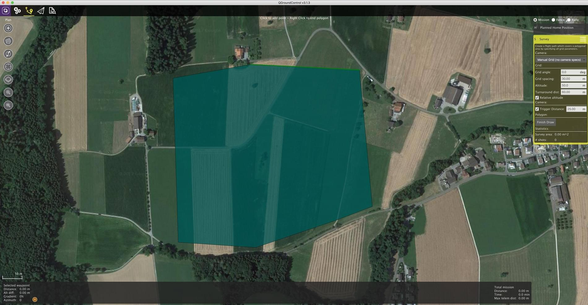

# 카메라 트리거

카메라 트리거 드라이버는 AUX 포트를 사용하여 카메라를 트리거하기 위해 펄스를 전송합니다. 이것은 항공 측량 및 재구성을위한 타임 스탬핑 사진, 멀티 카메라 시스템 동기화 또는 시각 관성 내비게이션을 포함한 여러 애플리케이션에 사용될 수 있습니다

펄스가 보내지는 것 외에도 시퀀스 번호 (따라서 현재 세션의 이미지 시퀀스 번호)와 해당 타임 스탬프가 포함 된 MAVLink 메시지가 게시됩니다.

## 트리거 설정 {#trigger_setup_qgc}

Camera triggering is usually configured from the *QGroundControl* [Vehicle Setup > Camera](https://docs.qgroundcontrol.com/en/SetupView/Camera.html#px4-camera-setup) section.


The different [trigger modes](#trigger_mode), [backend interfaces](#trigger_backend) and [hardware setup](#hardware_setup) are described below (these can also be set directly from [parameters](../advanced_config/parameters.md)).

> **Note** The camera settings section is not available by default for FMUv2-based flight controllers (e.g. 3DR Pixhawk) because the camera module is not automatically included in firmware. For more information see [Finding/Updating Parameters > Parameters Not In Firmware](../advanced_config/parameters.md#parameter-not-in-firmware).

## 트리거 모드 {#trigger_mode}

Four different modes are supported, controlled by the [TRIG_MODE](../advanced_config/parameter_reference.md#TRIG_MODE) parameter:

MAVLink 명령 ` MAV_CMD_DO_TRIGGER_CONTROL </ 0>을 사용하여 활성화 및 비활성화 할 수있는 기본 간격계와 같은 기능을합니다. 자세한 내용은 <a href="#command_interface"> 명령 인터페이스 </ 0>를 참조하십시오.
</td>
</tr>
<tr>
  <td>2</td>
  <td>자동 노출계를 지속적으로 켭니다.

</td>
</tr>
<tr>
  <td>3</td>
  <td>거리를 기반으로 트리거합니다. 설정 한 수평 거리를 초과 할 때마다 촬영됩니다. 그러나 두 샷 사이의 최소 시간 간격은 설정된 트리거 간격에 의해 제한됩니다.</td>
</tr>
<tr>
  <td>4</td>
  <td>임무 모드에서 측량을 비행 할 때 자동으로 트리거됩니다.</td>
</tr>
</tbody>
</table>

<blockquote>
  <p><strong>Info</strong> If it is your first time enabling the camera trigger app, remember to reboot after changing the <code>TRIG_MODE` parameter.</p> </blockquote> 

## 트리거 하드웨어 설정 {#hardware_setup}

You can choose which pins to use for triggering using the [TRIG_PINS](../advanced_config/parameter_reference.md#TRIG_PINS) parameter. The default is 56, which means that trigger is enabled on *FMU* pins 5 and 6.

> **Note** On a Pixhawk flight controller that has both FMU and I/O boards these FMU pins map to `AUX5` and `AUX6` (e.g. Pixhawk 4, CUAV v5+). On a controller that only has an FMU, the pins map to `MAIN5` and `MAIN6` (e.g. Pixhawk 4 mini, CUAV v5 nano). At time of writing triggering only works on FMU pins - you can't trigger a camera using pins on the I/O board.

<span></span>

> **Warning** With `TRIG_PINS` set to its **default** value of 56, you can use the AUX pins 1, 2, 3 and 4 as actuator outputs (for servos/ESCs). Due to the way the hardware timers are handled (1234 and 56 are 2 different groups handled by 2 timers), this is the ONLY combination which allows the simultaneous usage of camera trigger and FMU actuator outputs. **DO NOT CHANGE THE DEFAULT VALUE OF `TRIG_PINS` IF YOU NEED ACTUATOR OUTPUTS.**

## 트리거 인터페이스 백엔드 {#trigger_backend}

The camera trigger driver supports several backends - each for a specific application, controlled by the [TRIG_INTERFACE](../advanced_config/parameter_reference.md#TRIG_INTERFACE) parameter:

enables the GPIO interface. AUX 출력은 매  TRIG_INTERVAL </ 1> 지속 시간마다 (` TRIG_POLARITY </ 0> 매개 변수에 따라) 높거나 낮게 펄스됩니다. 이것은 대부분의 표준 머신 비전 카메라를 직접 트리거하는 데 사용될 수 있습니다. PX4FMU 시리즈 하드웨어 (Pixhawk, Pixracer 등)에서 AUX 핀의 신호 레벨은 3.3v입니다.</td>
</tr>
<tr>
  <td>2</td>
  <td>Seagull MAP2 인터페이스를 활성화합니다. 이를 통해 <a href="http://www.seagulluav.com/product/seagull-map2/"> Seagull MAP2 </ 0>를 사용하여 지원되는 여러 카메라에 연결할 수 있습니다. MAP2의 핀 1은 <code> TRIG_PINS </ 0>의 하위 AUX 핀에 연결되어야합니다 (따라서 기본적으로 핀 1 ~ AUX 5 및 핀 2 ~ AUX 6). 이 모드에서 PX4는 QX-1과 같은 Sony Multiport 카메라의 자동 전원 제어 및 연결 유지 기능도 지원합니다.</td>
</tr>
<tr>
  <td>3</td>
  <td>MAVLink 인터페이스를 사용합니다. 이 모드에서는 실제 하드웨어 출력이 사용되지 않습니다. <code> CAMERA_TRIGGER </ 0> MAVLink 메시지는 자동 조종 장치에 의해 전송됩니다 (MAVLink 응용 프로그램이 <code> 온보드 </ 0> 모드 인 경우 기본적으로). 그렇지 않으면 맞춤 스트림을 사용해야합니다.</td>
</tr>
<tr>
  <td>4</td>
  <td>범용 PWM 인터페이스를 사용합니다. 이렇게하면 <a href="https://hobbyking.com/en_us/universal-remote-control-infrared-shutter-ir-rc-1g.html"> 적외선 트리거 </ 0> 또는 서보가 카메라를 트리거 할 수 있습니다.</td>
</tr>
</tbody>
</table>

<h2>기타 패러미터들</h2>

<table>
<thead>
<tr>
  <th>Parameter</th>
  <th>Description</th>
</tr>
</thead>
<tbody>
<tr>
  <td><a href="../advanced_config/parameter_reference.md#TRIG_POLARITY">TRIG_POLARITY</a></td>
  <td>GPIO 인터페이스를 사용하는 동안에 만 관련됩니다. 트리거 핀의 극성을 설정합니다. 액티브 하이는 핀이 로우로 정상적으로 당겨지고 트리거 이벤트에서 하이로 풀링됨을 의미합니다. 액티브 로우는 반대의 경우도 마찬가지입니다.</td>
</tr>
<tr>
  <td><a href="../advanced_config/parameter_reference.md#TRIG_INTERVAL">TRIG_INTERVAL</a></td>
  <td>두 개의 연속 트리거 이벤트 사이의 시간을 밀리 초 단위로 정의합니다.</td>
</tr>
<tr>
  <td><a href="../advanced_config/parameter_reference.md#TRIG_ACT_TIME">TRIG_ACT_TIME</a></td>
  <td>트리거 핀이 "활성"상태로 유지되어 중립으로 돌아 가기 전의 시간을 밀리 초 단위로 정의합니다. PWM 모드에서는 50Hz PWM 신호에 항상 활성화 펄스를 맞출 수 있도록 최소값이 40ms로 제한됩니다.</td>
</tr>
</tbody>
</table>

<p>The full list of parameters pertaining to the camera trigger module can be found on the <a href="../advanced_config/parameter_reference.md#camera-trigger">parameter reference</a> page.</p>

<h2 id="command_interface">Command Interface</h2>

<p><strong>TODO : NEEDS UPDATING updating</strong></p>

<p>The camera trigger driver supports several commands:</p>

<p><a href="https://mavlink.io/en/messages/common.html#MAV_CMD_DO_TRIGGER_CONTROL">MAV_CMD_DO_TRIGGER_CONTROL</a> - Accepted in "command controlled" mode (<code>TRIG_MODE` 1).</p> 

트리거 사이클 시간 (밀리 초 단위) (` TRIG_INTERVAL </ 0> 매개 변수 설정)</td>
</tr>
<tr>
  <td>Param #3</td>
  <td>시퀀스 재설정 (이미지 시퀀스 번호를 재설정하려면 1로 설정하고 현재 시퀀스 번호를 유지하려면 0으로 설정)</td>
</tr>
</tbody>
</table>

<p><a href="https://mavlink.io/en/messages/common.html#MAV_CMD_DO_DIGICAM_CONTROL">MAV_CMD_DO_DIGICAM_CONTROL</a> - Accepted in all modes.
This is used by the GCS to test-shoot the camera from the user interface.
The trigger driver does not yet support all camera control parameters defined by the MAVLink spec.</p>

<table>
<thead>
<tr>
  <th>Command Parameter</th>
  <th>Description</th>
</tr>
</thead>
<tbody>
<tr>
  <td>Param #5</td>
  <td>원샷 명령을 트리거합니다 (단일 이미지 프레임을 트리거하려면 1로 설정).</td>
</tr>
</tbody>
</table>

<p><a href="https://mavlink.io/en/messages/common.html#MAV_CMD_DO_SET_CAM_TRIGG_DIST">MAV_CMD_DO_SET_CAM_TRIGG_DIST</a> - Accepted in "mission controlled" mode (<code>TRIG_MODE` 4)</p> 

This command is autogenerated during missions to trigger the camera based on survey missions from the GCS.

## Testing Trigger Functionality

1. PX4 콘솔에서 : ```카메라_트리거 테스트```
2. From *QGroundControl*:
    
    Click on **Trigger Camera** in the main instrument panel. 이러한 샷은 위치 정보 태그 지정을 위해 기록되거나 계산되지 않습니다.
    
    

## Sony QX-1 example (Photogrammetry)


In this example, we will use a Seagull MAP2 trigger cable to interface to a Sony QX-1 and use the setup to create orthomosaics after flying a fully autonomous survey mission.

### 트리거 설정

The recommended camera settings are:

* `TRIG_INTERFAC=2` (Seagull MAP2).
* `TRIG_MODE=4` (Mission controlled).
* Leave the remaining parameters at their defaults.

You will need to connect the Seagull MAP2 to the auxiliary/FMU pins on your autopilot. Pin 1 goes to `AUX 5`, and Pin 2 to `AUX 6`. The other end of the MAP2 cable will go into the QX-1's "MULTI" port.

### 카메라 구성

We use a Sony QX-1 with a 16-50mm f3.5-5.6 lens for this example.

To avoid autofocus and metering lag when the camera is triggered, the following guidelines should be followed:

* 무한대까지 수동 초점
* 카메라를 연속 촬영 모드로 설정하십시오.
* 노출 및 조리개를 수동으로 설정합니다.
* ISO는 가능한 한 낮게 설정해야합니다.
* 장면에 적합한 수동 화이트 밸런스

### Mission Planning




### 위치 정보 태그 지정

Download/copy the logfile and images from the flight and point QGroundControl to them. Then click on "Start Tagging".


You can verify the geotagging using a free online service like [Pic2Map](https://www.pic2map.com/). Note that Pic2Map is limited to only 40 images.

### 재건

We use [Pix4D](https://pix4d.com/) for 3D reconstruction.


## Camera-IMU sync example (VIO)

In this example, we will go over the basics of synchronising IMU measurements with visual data to build a stereo Visual-Inertial Navigation System (VINS). To be clear, the idea here isn't to take an IMU measurement exactly at the same time as we take a picture but rather to correctly time stamp our images so as to provide accurate data to our VIO algorithm.

The autopilot and companion have different clock bases (boot-time for the autopilot and UNIX epoch for companion), so instead of skewing either clock, we directly observe the time offset between the clocks. This offset is added or subtracted from the timestamps in the MAVLink messages (e.g `HIGHRES_IMU`) in the cross-middleware translator component (e.g MAVROS on the companion and `mavlink_receiver` in PX4). The actual synchronisation algorithm is a modified version of the Network Time Protocol (NTP) algorithm and uses an exponential moving average to smooth the tracked time offset. This synchronisation is done automatically if MAVROS is used with a high-bandwidth onboard link (MAVLink mode `onboard`).

For acquiring synchronised image frames and inertial measurements, we connect the trigger inputs of the two cameras to a GPIO pin on the autopilot. The timestamp of the inertial measurement from start of exposure and a image sequence number is recorded and sent to the companion computer (`CAMERA_TRIGGER` message), which buffers these packets and the image frames acquired from the camera. They are matched based on the sequence number (first image frame is sequence 0), the images timestamped (with the timestamp from the `CAMERA_TRIGGER` message) and then published.

The following diagram illustrates the sequence of events which must happen in order to correctly timestamp our images.


<!-- Could generate using Mermaid: https://mermaidjs.github.io/mermaid-live-edito
{/% mermaid %/}
sequenceDiagram
  Note right of PX4 : Time sync with mavros is done automatically
  PX4 ->> mavros : Camera Trigger ready
  Note right of camera driver : Camera driver boots and is ready
  camera driver ->> mavros : mavros_msgs::CommandTriggerControl
  mavros ->> PX4 : MAVLink::MAV_CMD_DO_TRIGGER_CONTROL
  loop Every TRIG_INTERVAL milliseconds
  PX4 ->> mavros : MAVLink::CAMERA_TRIGGER
  mavros ->> camera driver : mavros_msgs::CamIMUStamp
  camera driver ->> camera driver : Match sequence number
  camera driver ->> camera driver : Stamp image and publish
end
{/% endmermaid %/}
-->

### 1 단계

First, set the TRIG_MODE to 1 to make the driver wait for the start command and reboot your FCU to obtain the remaining parameters.

### 2 단계

For the purposes of this example we will be configuring the trigger to operate in conjunction with a Point Grey Firefly MV camera running at 30 FPS.

* `TRIG_INTERVAL`: 33.33 ms
* `TRIG_POLARITY`: 0 (active low)
* `TRIG_ACT_TIME`: 0.5 ms. 설명서에 따르면 최소 1 마이크로 초 만 있으면됩니다.
* ` TRIG_MODE </ 0> : 1, 왜냐하면 카메라 드라이버가 트리거를 시작하기 전에 이미지를받을 준비가되기 때문입니다. 이는 일련 번호를 올바르게 처리하는 데 필수적입니다.</li>
<li><code>TRIG_PINS`: 56, Leave default.

### 3 단계

Wire up your cameras to your AUX port by connecting the ground and signal pins to the appropriate place.

### 4 단계

You will have to modify your driver to follow the sequence diagram above. Public reference implementations for [IDS Imaging UEye](https://github.com/ProjectArtemis/ueye_cam) cameras and for [IEEE1394 compliant](https://github.com/andre-nguyen/camera1394) cameras are available.