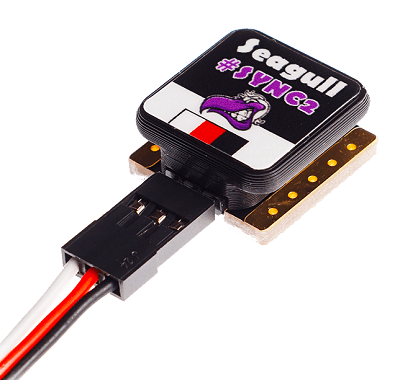

# 카메라 설정

PX4 can be configured to connect physical outputs to trigger a camera, or it can be used with a [MAVLink camera](#mavlink-cameras).

:::note
We recommend that you use a MAVLink camera as this allows comprehensive control of cameras via the [camera protocol](https://mavlink.io/en/services/camera.html). Directly connected cameras only support [a small subset](#mavlink-command-interface-directly-connected-cameras) of MAVLink camera commands.
:::

Whenever a camera is triggered, the MAVLink [CAMERA_TRIGGER](https://mavlink.io/en/messages/common.html#CAMERA_TRIGGER) message is published containing a sequence number (i.e. the current session's image sequence number) and the corresponding timestamp. 이 타임스탬프는 항공 측량을 위한 타임 스탬프 사진, 다중 카메라 시스템 동기화 또는 시각적 관성 내비게이션을 포함한 여러 응용 프로그램에 사용할 수 있습니다.

Cameras can also (optionally) signal PX4 at the exact moment that a photo/frame is taken using a camera capture pin. 이를 통하여 지오 태깅을위한 GPS 위치 또는 VIO 동기화를 위한 올바른 IMU 샘플 등에 이미지를 보다 정확하게 매핑할 수 있습니다.


<!-- Camera trigger driver: https://github.com/PX4/PX4-Autopilot/tree/release/1.14/src/drivers/camera_trigger -->
<!-- Camera capture driver: https://github.com/PX4/PX4-Autopilot/tree/release/1.14/src/drivers/camera_capture -->

## 트리거 설정

Camera triggering is usually configured from the *QGroundControl* [Vehicle Setup > Camera](https://docs.qgroundcontrol.com/master/en/SetupView/Camera.html#px4-camera-setup) section.


The different [trigger modes](#trigger-modes), [backend interfaces](#trigger-interface-backends) and [trigger output configuration](#trigger-output-pin-configuration) are described below (these can also be set directly from [parameters](../advanced_config/parameters.md)).

:::note
카메라 모듈이 펌웨어에 자동으로 포함되지 않기 때문에 FMUv2 기반 비행 콘트롤러 (예 : 3DR Pixhawk)의 경우 기본적으로 카메라 설정 섹션을 사용할 수 없습니다. 자세한 내용은 [매개변수 검색/업데이트 &gt; 펌웨어에 없는 매개변수](../advanced_config/parameters.md#parameter-not-in-firmware)를 참고하십시오.
:::

### 트리거 모드

네 가지 모드가 지원되며 [TRIG_MODE](../advanced_config/parameter_reference.md#TRIG_MODE) 매개변수로 설정됩니다.

| 모드 | 설명                                                                                                                                                                               |
| -- | -------------------------------------------------------------------------------------------------------------------------------------------------------------------------------- |
| 0  | 카메라 트리거가 비활성화됩니다.                                                                                                                                                                |
| 1  | MAVLink 명령 `MAV_CMD_DO_TRIGGER_CONTROL`을 사용하여 활성화 및 비활성화 할 수 있는 기본 간격계처럼 작동합니다. See [command interface](#mavlink-command-interface-directly-connected-cameras) for more details. |
| 2  | 간격계를 계속 켭니다.                                                                                                                                                                     |
| 3  | 거리를 기반으로 트리거합니다.  설정 수평 거리를 초과시 마다 촬영됩니다. 그러나, 두 샷 사이의 최소 시간 간격은 설정된 트리거 간격에 의해 제한됩니다.                                                                                           |
| 4  | 임무 모드에서 비행시 측량은 자동으로 트리거됩니다.                                                                                                                                                     |

:::note
카메라 트리거 앱을 처음 활성화하는 경우 `TRIG_MODE` 매개변수를 변경 후 재부팅하여야 합니다.
:::

### 트리거 인터페이스 백엔드

카메라 트리거 드라이버는 여러 백엔드를 지원합니다. 각 백엔드는 [TRIG_INTERFACE](../advanced_config/parameter_reference.md#TRIG_INTERFACE) 매개변수에 의해 제어되는 특정 애플리케이션을 위한 것입니다.

| 번호 | 설명                                                                                                                                                                                                                                                                                                                                                                                                          |
| -- | ----------------------------------------------------------------------------------------------------------------------------------------------------------------------------------------------------------------------------------------------------------------------------------------------------------------------------------------------------------------------------------------------------------- |
| 1  | Enables the GPIO interface. AUX 출력은 [TRIG_INTERVAL](../advanced_config/parameter_reference.md#TRIG_INTERVAL) 시간마다 (`TRIG_POLARITY` 매개변수에 따라) 높거나 낮게 펄스됩니다. 이것은 대부분의 표준 머신비전 카메라를 직접 트리거 할 수 있습니다. PX4FMU 시리즈 하드웨어 (Pixhawk, Pixracer 등)에서 AUX 핀의 신호 레벨은 3.3v입니다.                                                                                                                                            |
| 2  | Seagull MAP2 인터페이스를 활성화합니다. 이를 통해 [Seagull MAP2](http://www.seagulluav.com/product/seagull-map2/)를 사용하여 지원되는 여러 카메라에 연결할 수 있습니다. Pin/Channel 1 (camera trigger) and Pin/Channel 2 (mode selector) of the MAP2 should be connected to the lower and higher mapped [camera trigger pins](#trigger-output-pin-configuration). Seagull MAP2를 사용하는 PX4는 QX-1과 같은 Sony Multiport 카메라의 자동 전원 제어 및 연결 유지 기능도 지원합니다. |
| 3  | MAVLink 인터페이스를 사용합니다. 이 모드에서는 실제 하드웨어 출력이 사용되지 않습니다. `CAMERA_TRIGGER` MAVLink 메시지는 자동 조종 장치에 의해 전송됩니다 (MAVLink 응용 프로그램이 `온보드` 모드인 경우 기본적으로). 그렇지 않으면, 사용자 정의 스트림을 활성화하여야 합니다.                                                                                                                                                                                                                               |
| 4  | 범용 PWM 인터페이스를 사용합니다. [적외선 트리거](https://hobbyking.com/en_us/universal-remote-control-infrared-shutter-ir-rc-1g.html) 또는 서보가 카메라를 트리거 할 수 있습니다.                                                                                                                                                                                                                                                               |


### Trigger Output Pin Configuration

Camera trigger pins are set in the *QGroundControl* [Actuators](../config/actuators.md) configuration screen.

The trigger pins can be set by assigning the `Camera_Trigger` function on any FMU output. If using trigger setup that requires two pins (e.g. Seagull MAP2) you can assign to any two outputs.

Note however that once an output has been used for camera triggering, the whole PWM group cannot be used for anything else (you can't use another output in the group for an actuator or motor, say).

:::note
At time of writing triggering only works on FMU pins:
- On a Pixhawk flight controller that has both FMU and I/O boards FMU pins map to `AUX` outputs (e.g. Pixhawk 4, CUAV v5+) .
- A controller that only has an FMU, the pins map to `MAIN` outputs (e.g. Pixhawk 4 mini, CUAV v5 nano).
:::

### 기타 매개변수

| 매개변수                                                                       | 설명                                                                                                                          |
| -------------------------------------------------------------------------- | --------------------------------------------------------------------------------------------------------------------------- |
| [TRIG_POLARITY](../advanced_config/parameter_reference.md#TRIG_POLARITY)   | GPIO 인터페이스를 사용하는 동안에만 관련됩니다. 트리거 핀의 극성을 설정합니다. 액티브 하이는 핀이 로우로 정상적으로 당겨지고 트리거 이벤트에서 하이로 풀링됨을 의미합니다. 액티브 로우는 반대의 경우도 마찬가지입니다. |
| [TRIG_INTERVAL](../advanced_config/parameter_reference.md#TRIG_INTERVAL)   | 두 개의 연속 트리거 이벤트 사이의 시간을 밀리 초 단위로 정의합니다.                                                                                     |
| [TRIG_ACT_TIME](../advanced_config/parameter_reference.md#TRIG_ACT_TIME) | 트리거 핀이 "활성"상태로 유지되어 중립으로 돌아가기 전의 시간을 밀리 초 단위로 정의합니다. PWM 모드에서는 50Hz PWM 신호에 항상 활성화 펄스를 맞출 수 있도록 최소값이 40ms로 제한됩니다.           |

카메라 트리거 모듈과 관련 전체 매개변수 목록은 [매개변수 참조](../advanced_config/parameter_reference.md#camera-trigger) 페이지를 참고하십시오.

## 카메라 캡처

Cameras can also (optionally) use a camera capture pin to signal the exact moment when a photo/frame is taken. 이를 통하여 지오 태깅을위한 GPS 위치 또는 VIO 동기화를 위한 올바른 IMU 샘플 등에 이미지를 보다 정확하게 매핑할 수 있습니다.

PX4에서 [CAM_CAP_FBACK=1](../advanced_config/parameter_reference.md#CAM_CAP_FBACK)을 설정하면 카메라 캡처/피드백이 활성화됩니다. The pin used for camera capture is then set in the *QGroundControl* [Actuators](../config/actuators.md) configuration screen by assigning the `Camera_Capture` function on any FMU output.

:::note
At time of writing camera capture only works on FMU pins:
- On a Pixhawk flight controller that has both FMU and I/O boards FMU pins map to `AUX` outputs (e.g. Pixhawk 4, CUAV v5+).
- A controller that only has an FMU, the pins map to `MAIN` outputs (e.g. Pixhawk 4 mini, CUAV v5 nano).
:::

PX4는 카메라 캡처 핀에서 적절한 전압 레벨로 상승 에지를 감지합니다 (Pixhawk 비행 콘트롤러의 경우 일반적으로 3.3V). If the camera isn't outputting an appropriate voltage, then additional circuitry will be required to make the signal compatible.

핫슈 커넥터 (플래시 연결 용)가 있는 카메라는 일반적으로 핫슈 어댑터를 통하여 연결할 수 있습니다. 예를 들어, [Seagull # SYNC2 범용 카메라 핫슈 어댑터](https://www.seagulluav.com/product/seagull-sync2/)는 플래시 전압을 Pixhawk 전압으로 분리하고 이동하는 옵토 커플러입니다. 이것은 카메라 상단의 플래시 슬롯에 삽입됩니다. 빨간색 및 검은 색 출력은 서보 레일/접지에 연결되고, 흰색 와이어는 입력 캡처 핀에 연결됩니다.



:::note PX4는 카메라 트리거와 카메라 캡처 모두에서 MAVLink [CAMERA_TRIGGER](https://mavlink.io/en/messages/common.html#CAMERA_TRIGGER) 메시지를 전송합니다. 카메라 캡처가 구성된 경우 카메라 캡처 드라이버의 타임스탬프가 사용되며 그렇지 않으면 트리거링 타임스탬프가 사용됩니다.
:::

## MAVLink Command Interface (Directly Connected Cameras)

When using a camera connected to the flight controller as described in this document (e.g. using the GPIO, PWM or seagull backend interfaces) the camera driver supports the following subset of MAVLink commands:

[MAV_CMD_DO_TRIGGER_CONTROL](https://mavlink.io/en/messages/common.html#MAV_CMD_DO_TRIGGER_CONTROL) - "명령 제어" 모드에서 허용됩니다 (`TRIG_MODE` 1).

| 명령어 매개변수 | 설명                                                                                                 |
| -------- | -------------------------------------------------------------------------------------------------- |
| Param #1 | Trigger enable/disable. `1`: enable (start), `0`: disable.                                         |
| Param #2 | Reset trigger sequence. `1`: reset, any other value does nothing.                                  |
| Param #3 | Pause triggering, but without switching the camera off or retracting it. `1`: pause, `0`: restart. |

<!-- https://github.com/PX4/PX4-Autopilot/blob/release/1.14/src/drivers/camera_trigger/camera_trigger.cpp#L549 -->

[MAV_CMD_DO_DIGICAM_CONTROL](https://mavlink.io/en/messages/common.html#MAV_CMD_DO_DIGICAM_CONTROL) - 모든 모드에서 허용됩니다.

이것은 GCS에서 사용자 인터페이스에서 카메라를 테스트 촬영시에 사용됩니다. The trigger driver does not support all camera control parameters defined by the MAVLink spec.

| 명령어 매개변수 | 설명                                        |
| -------- | ----------------------------------------- |
| Param #5 | 원샷 명령을 트리거합니다 (단일 이미지 프레임을 트리거하려면 1로 설정). |

 MAV_CMD_DO_SET_CAM_TRIGG_DIST </ 0> - "임무 통제"모드에서 허용됨 (` TRIG_MODE </> 4)</p>

<p spaces-before="0">이 명령은 GCS의 조사 임무에 따라 카메라를 트리거하기 위해 임무중 자동 생성됩니다.</p>

<p spaces-before="0"><a href="https://mavlink.io/en/messages/common.html#MAV_CMD_OBLIQUE_SURVEY">MAV_CMD_OBLIQUE_SURVEY</a> - Mission command to set a camera auto mount pivoting oblique survey.</p>

<p spaces-before="0">This accepts <code>param1` to `param4` as defined in the MAVLink message definition. The shutter integration setting (`param2`) is only obeyed with a GPIO backend.</p>

<!-- https://github.com/PX4/PX4-Autopilot/blob/release/1.14/src/drivers/camera_trigger/camera_trigger.cpp#L632 -->

## MAVLink Cameras

PX4 can also be configured to use a [MAVLink trigger interface backend](#trigger-interface-backends) with a MAVLink camera.

In this case MAVLink camera messages are forwarded to a MAVLink camera for handling (although PX4 will still emit the `CAMERA_TRIGGER` when a trigger command is received).

MAVLink cameras are recommended because directly connected cameras only support [a small subset](#mavlink-command-interface-directly-connected-cameras) of the available MAVLink camera messages and commands. MAVLink cameras potentially offer much more control over a camera using the [MAVLink Camera Protocol](https://mavlink.io/en/services/camera.html).


## 트리거 기능 테스트

:::warning
The following sections are out of date and need retesting.
:::

1. PX4 콘솔에서 : 
   
   

   ```
   camera_trigger test
   ```


1. *QGroundControl* 에서:
   
   기본 계기판에서 **트리거 카메라**를 클릭합니다. 이러한 샷은 위치 정보 태그 지정을 위하여 기록되거나 계산되지 않습니다.
   
   


## Sony QX-1 예제 (사진 측량)


이 예에서는 Seagull MAP2 트리거 케이블로 Sony QX-1에 연결하여 자율 측량 임무를 수행한 후 정사 투영을 만드는 것입니다.


### 트리거 설정

권장되는 카메라 설정은 다음과 같습니다.

* `TRIG_INTERFACE=2` (Seagull MAP2).
* `TRIG_MODE=4` (임무 제어).
* 나머지 매개 변수는 기본값으로 설정합니다.

You will need to connect the Seagull MAP2 to FMU pins on your autopilot. MAP2 케이블의 다른 쪽 끝은 QX-1의 "MULTI" 포트에 연결합니다.


### 카메라 설정

이 예제에서는 Sony QX-1에 16-50mm f3.5-5.6 렌즈를 사용합니다.

카메라가 트리거시 자동 초점과 측광 지연을 방지하려면 다음 지침을 따르십시오.

* 수동으로 초점을 무한대로 설정합니다.
* 카메라를 연속 촬영 모드로 설정합니다.
* 노출과 조리개를 수동으로 설정합니다.
* ISO는 가능한 한 낮게 설정합니다.
* 풍경에 적합한 수동 화이트 밸런스를 설정합니다.


### 임무 계획


### 지오태깅

비행 로그 파일과 이미지를 다운로드 QGroundControl을 지정합니다. Then click on **Start Tagging**.


[Pic2Map](https://www.pic2map.com/)과 같은 무료 온라인 서비스를 사용하여 지오 태깅을 확인할 수 있습니다. Pic2Map은 40 개의 이미지 제한이 있습니다.


### 재구성

3D 재구성을 위해 [Pix4D](https://pix4d.com/)를 사용합니다.


## 카메라-IMU 동기화 예 (VIO)

이 예에서는 스테레오 VINS(Visual-Inertial Navigation System)를 구축하기 위하여 IMU 측정을 시각적 데이터와 동기화에 관련된 기본 사항을 설명합니다. 사진을 찍는 것과 동시에 IMU 측정을하는 것이 아니라 VIO 알고리즘에 정확한 데이터를 제공하기 위해 이미지에 정확한 타임 스탬프를 찍는 것입니다.

자동비행장치와 보조 컴퓨터는 서로 다른 클럭 기반 (자동비행장치의 경우 부팅 시간, 보조 컴퓨터의 경우 UNIX epoch)을 갖기 때문에 시계를 보종하는 대신, 시계 간의 시간 오프셋을 관찰합니다. This offset is added or subtracted from the timestamps in the MAVLink messages (e.g. `HIGHRES_IMU`) in the cross-middleware translator component (e.g. MAVROS on the companion and `mavlink_receiver` in PX4). 실제 동기화 알고리즘은 NTP(Network Time Protocol) 알고리즘의 수정 버전이며, 지수 이동 평균을 사용하여 추적 시간 오프셋을 평활화합니다. 이 동기화는 MAVROS가 고대역폭 온보드 링크(MAVLink 모드 `온보드`)와 함께 사용되는 경우 자동으로 수행됩니다.

동기화 된 이미지 프레임과 관성 측정을 획득 하기 위하여, 두 카메라의 트리거 입력을 자동조종장치의 GPIO 핀에 연결합니다. 노출 시작부터 관성 측정의 타임스탬프와 이미지 시퀀스 번호가 기록되어 보조 컴퓨터(`CAMERA_TRIGGER` 메시지)로 전송되어 패킷과 카메라 이미지 프레임을 버퍼링합니다. 시퀀스 번호(첫 번째 이미지 프레임은 시퀀스 0), 이미지 타임스탬프 (`CAMERA_TRIGGER` 메시지의 타임스탬프 포함)에 따라 일치후에 게시됩니다.

다음 다이어그램은 이미지에 정확한 타임스탬프를 찍기 위하여 발생하는 일련의 이벤트를 나타냅니다.

[](https://mermaid.live/edit#pako:eNqNUs9rwjAU_lceOW-3nXIQpIoIVkftZIdCeTbPNqxJXJI6ivi_L1Er6Dzs9kK-H3lfviOrjCDGmaPvjnRFE4m1RVVogKXxBFbWjQezg_fPN-CQS0Xgel3Bj_QNKDxY40A6EEYTYOeNQi8rbNs-SkTS62g04DgkqMgi5EG2JguWUPR_vaoLSlh5CKAb63reGuMdoBbR96Zwz7kzvQylcrXjPDFKBe71BYnR3po2ClzhkXnZNR1vFlJ_cR6GMkkn5WRV5tl8NptmZbJa5tlqEXmtMXuYBtMe4m05X-bTbDNegJJtKx1VRgv3NIybQTJOp9l4EH94zGMY99ugmqcfa49q_zyER3aKvmpg-G3QndqS_R_17AJSYU3n9PfdNuzXFJq0YC8sgBVKEbp0jHoF8w0pKhgPo6Addq0vWKFPARp7sg4lYtzbjl5Ytxfoh-oxvsPW0ekXb8TjxQ)

<!-- Original 

{/% mermaid %/}
sequenceDiagram
  Note right of PX4 : Time sync with mavros is done automatically
  PX4 ->> mavros : Camera Trigger ready
  Note right of camera driver : Camera driver boots and is ready
  camera driver ->> mavros : mavros_msgs::CommandTriggerControl
  mavros ->> PX4 : MAVLink::MAV_CMD_DO_TRIGGER_CONTROL
  loop Every TRIG_INTERVAL milliseconds
  PX4 ->> mavros : MAVLink::CAMERA_TRIGGER
  mavros ->> camera driver : mavros_msgs::CamIMUStamp
  camera driver ->> camera driver : Match sequence number
  camera driver ->> camera driver : Stamp image and publish
end
{/% endmermaid %/}
-->

### 1 단계

먼저 TRIG_MODE를 1로 설정하여 드라이버가 시작 명령을 기다리도록하고, 나머지 매개변수를 얻기 위해 FCU를 재부팅합니다.


### 2 단계

이 예제의 목적을 위하여 30 FPS에서 실행되는 Point Grey Firefly MV 카메라와 함께 작동하도록 트리거를 설정합니다.

* `TRIG_INTERVAL`: 33.33 ms
* `TRIG_POLARITY`: 0 (active low)
* `TRIG_ACT_TIME`: 0.5 ms. 매뉴얼에는 최소 1 마이크로 초면 충분하다고 명시되어 있습니다.

* `TRIG_MODE` : 1, 트리거 시작전에 카메라 드라이버가 이미지를 수신할 준비가 되는 것이 좋습니다. 이것은 일련 번호를 처리에 필수적입니다.


### 3 단계

접지 및 신호 핀을 적절한 위치에 연결하여 카메라를 AUX 포트에 연결합니다.


### 4 단계

위의 시퀀스 다이어그램을 따르려면 드라이버를 수정하여 합니다. [IDS Imaging UEye](https://github.com/ProjectArtemis/ueye_cam) 카메라와 [IEEE1394 호환](https://github.com/andre-nguyen/camera1394) 카메라에 대한 공개 참조 구현을 사용하십시오.
