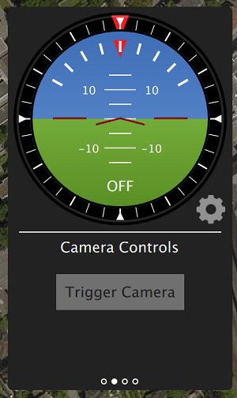

# 카메라 트리거

카메라 트리거 드라이버는 AUX 포트를 사용하여 카메라를 트리거하기 위해 펄스를 전송합니다. 이것은 항공 측량 및 재구성을위한 타임 스탬핑 사진, 멀티 카메라 시스템 동기화 또는 시각 관성 내비게이션을 포함한 여러 애플리케이션에 사용될 수 있습니다

펄스가 보내지는 것 외에도 시퀀스 번호 (따라서 현재 세션의 이미지 시퀀스 번호)와 해당 타임 스탬프가 포함 된 MAVLink 메시지가 게시됩니다.

## 트리거 모드

 TRIG_MODE </ 0> 매개 변수로 제어되는 네 가지 모드가 지원됩니다. </p> 

MAVLink 명령 ` MAV_CMD_DO_TRIGGER_CONTROL </ 0>을 사용하여 활성화 및 비활성화 할 수있는 기본 간격계와 같은 기능을합니다. 자세한 내용은 <a href="#command_interface"> 명령 인터페이스 </ 0>를 참조하십시오.
</td>
</tr>
<tr>
  <td>2</td>
  <td>자동 노출계를 지속적으로 켭니다.

</td>
</tr>
<tr>
  <td>3</td>
  <td>거리를 기반으로 트리거합니다. 설정 한 수평 거리를 초과 할 때마다 촬영됩니다. 그러나 두 샷 사이의 최소 시간 간격은 설정된 트리거 간격에 의해 제한됩니다.</td>
</tr>
<tr>
  <td>4</td>
  <td>임무 모드에서 측량을 비행 할 때 자동으로 트리거됩니다.</td>
</tr>
</tbody>
</table>

<blockquote>
  <p><strong> 정보 </ 0> 처음 카메라 트리거 응용 프로그램을 사용하는 경우 <code> TRIG_MODE </ 1> 매개 변수를 변경 한 후 다시 부팅해야합니다.</p>
</blockquote>

<h2>하드웨어 구성 트리거</h2>

<p><a href="../advanced_config/parameter_reference.md#TRIG_PINS"> TRIG_PINS </ 0> 매개 변수를 사용하여 트리거링에 사용할 AUX 핀을 선택할 수 있습니다. 기본값은 56이며, 이는 트리거가 AUX 5 및 AUX 6에서 작동 함을 의미합니다.</p>

<blockquote>
  <p><strong> 경고 </ 0> <code> TRIG_PINS </ 1>의 <strong> 기본 </ 0> 값을 56으로 설정하면 AUX 핀 1, 2, 3 및 4를 액추에이터 출력으로 사용할 수 있습니다 (서보/ESC용). Due to the way the hardware timers are handled (1234 and 56 are 2 different groups handled by 2 timers), this is the ONLY combination which allows the simultaneous usage of camera trigger and FMU actuator outputs. <strong> 액추에이터 출력이 필요한 경우 <code> TRIG_PINS </ 1>의 기본 값을 변경하지 마십시오. </ 0></p>
</blockquote>

<h2>트리거 인터페이스 백엔드</h2>

<p>


카메라 트리거 드라이버는 <a href="../advanced_config/parameter_reference.md#TRIG_INTERFACE"> TRIG_INTERFACE </ 0> 매개 변수로 제어되는 특정 응용 프로그램에 대한 각각의 백엔드를 지원합니다.</p>

<table>
<thead>
<tr>
  <th>번호</th>
  <th>Description</th>
</tr>
</thead>
<tbody>
<tr>
  <td>1</td>
  <td>enables the GPIO interface. AUX 출력은 매 <a href="../advanced_config/parameter_reference.md#TRIG_INTERVAL"> TRIG_INTERVAL </ 1> 지속 시간마다 (<code> TRIG_POLARITY </ 0> 매개 변수에 따라) 높거나 낮게 펄스됩니다. 이것은 대부분의 표준 머신 비전 카메라를 직접 트리거하는 데 사용될 수 있습니다. PX4FMU 시리즈 하드웨어 (Pixhawk, Pixracer 등)에서 AUX 핀의 신호 레벨은 3.3v입니다.</td>
</tr>
<tr>
  <td>2</td>
  <td>Seagull MAP2 인터페이스를 활성화합니다. 이를 통해 <a href="http://www.seagulluav.com/product/seagull-map2/"> Seagull MAP2 </ 0>를 사용하여 지원되는 여러 카메라에 연결할 수 있습니다. MAP2의 핀 1은 <code> TRIG_PINS </ 0>의 하위 AUX 핀에 연결되어야합니다 (따라서 기본적으로 핀 1 ~ AUX 5 및 핀 2 ~ AUX 6). 이 모드에서 PX4는 QX-1과 같은 Sony Multiport 카메라의 자동 전원 제어 및 연결 유지 기능도 지원합니다.</td>
</tr>
<tr>
  <td>3</td>
  <td>MAVLink 인터페이스를 사용합니다. 이 모드에서는 실제 하드웨어 출력이 사용되지 않습니다. <code> CAMERA_TRIGGER </ 0> MAVLink 메시지는 자동 조종 장치에 의해 전송됩니다 (MAVLink 응용 프로그램이 <code> 온보드 </ 0> 모드 인 경우 기본적으로). 그렇지 않으면 맞춤 스트림을 사용해야합니다.</td>
</tr>
<tr>
  <td>4</td>
  <td>범용 PWM 인터페이스를 사용합니다. 이렇게하면 <a href="https://hobbyking.com/en_us/universal-remote-control-infrared-shutter-ir-rc-1g.html"> 적외선 트리거 </ 0> 또는 서보가 카메라를 트리거 할 수 있습니다.</td>
</tr>
</tbody>
</table>

<h2>Other Parameters</h2>

<table>
<thead>
<tr>
  <th>Parameter</th>
  <th>Description</th>
</tr>
</thead>
<tbody>
<tr>
  <td><a href="../advanced_config/parameter_reference.md#TRIG_POLARITY">TRIG_POLARITY</a></td>
  <td>GPIO 인터페이스를 사용하는 동안에 만 관련됩니다. 트리거 핀의 극성을 설정합니다. 액티브 하이는 핀이 로우로 정상적으로 당겨지고 트리거 이벤트에서 하이로 풀링됨을 의미합니다. 액티브 로우는 반대의 경우도 마찬가지입니다.</td>
</tr>
<tr>
  <td><a href="../advanced_config/parameter_reference.md#TRIG_INTERVAL">TRIG_INTERVAL</a></td>
  <td>두 개의 연속 트리거 이벤트 사이의 시간을 밀리 초 단위로 정의합니다.</td>
</tr>
<tr>
  <td><a href="../advanced_config/parameter_reference.md#TRIG_ACT_TIME">TRIG_ACT_TIME</a></td>
  <td>트리거 핀이 "활성"상태로 유지되어 중립으로 돌아 가기 전의 시간을 밀리 초 단위로 정의합니다. PWM 모드에서는 50Hz PWM 신호에 항상 활성화 펄스를 맞출 수 있도록 최소값이 40ms로 제한됩니다.</td>
</tr>
</tbody>
</table>

<p>카메라 트리거 모듈과 관련된 전체 매개 변수 목록은 <a href="../advanced_config/parameter_reference.md#camera-trigger"> 매개 변수 참조 </ 0> 페이지에서 확인할 수 있습니다.</p>

<h2 id="command_interface">명령 인터페이스</h2>

<p><strong>TODO : 업데이트 필요 업데이트</strong></p>

<p>카메라 트리거 드라이버는 몇 가지 명령을 지원합니다.</p>

<p>
<a href="https://mavlink.io/en/messages/common.html#MAV_CMD_DO_TRIGGER_CONTROL"> MAV_CMD_DO_TRIGGER_CONTROL </ 0> - "명령 제어"모드에서 허용됩니다 (<code> TRIG_MODE </ 1> 1).</p>

<table>
<thead>
<tr>
  <th>명령 매개 변수</th>
  <th>Description</th>
</tr>
</thead>
<tbody>
<tr>
  <td>Param #1</td>
  <td>트리거 활성화 / 비활성화 (비활성화의 경우 0으로 설정하고 시작의 경우 1로 설정)</td>
</tr>
<tr>
  <td>Param #2</td>
  <td>트리거 사이클 시간 (밀리 초 단위) (<code> TRIG_INTERVAL </ 0> 매개 변수 설정)</td>
</tr>
<tr>
  <td>Param #3</td>
  <td>시퀀스 재설정 (이미지 시퀀스 번호를 재설정하려면 1로 설정하고 현재 시퀀스 번호를 유지하려면 0으로 설정)</td>
</tr>
</tbody>
</table>

<p><a href="https://mavlink.io/en/messages/common.html#MAV_CMD_DO_DIGICAM_CONTROL"> MAV_CMD_DO_DIGICAM_CONTROL </ 0> - 모든 모드에서 허용됩니다. 이것은 GCS가 사용자 인터페이스에서 카메라를 테스트하기 위해 사용합니다. 트리거 드라이버는 아직 MAVLink 사양에 정의 된 모든 카메라 제어 매개 변수를 지원하지 않습니다.</p>

<table>
<thead>
<tr>
  <th>Command Parameter</th>
  <th>Description</th>
</tr>
</thead>
<tbody>
<tr>
  <td>Param #5</td>
  <td>원샷 명령을 트리거합니다 (단일 이미지 프레임을 트리거하려면 1로 설정).</td>
</tr>
</tbody>
</table>

<p><a href="https://mavlink.io/en/messages/common.html#MAV_CMD_DO_SET_CAM_TRIGG_DIST"> MAV_CMD_DO_SET_CAM_TRIGG_DIST </ 0> - "임무 통제"모드에서 허용됨 (<code> TRIG_MODE </> 4)</p>

<p>이 명령은 GCS의 조사 임무에 따라 카메라를 트리거하기 위해 임무 중 자동 생성됩니다.</p>

<h2>테스트 트리거 기능</h2>

<ol start="1">
<li>PX4 콘솔에서 : 
```카메라_트리거 테스트```</li>
<li><p>From <em>QGroundControl</em>:</p>

<p>메인 인스트루먼트 패널에서 "Trigger Camera"를 클릭하십시오. 이러한 샷은 위치 정보 태그 지정을 위해 기록되거나 계산되지 않습니다.</p>

<p></p></li>
</ol>

<h2>Sony QX-1 예제 (사진 측량법)</h2>

<p></p>

<p>이 예에서는 Seagull MAP2 트리거 케이블을 사용하여 Sony QX-1에 인터페이스하고 완전히 자율적 인 조사 임무를 수행 한 후 orthomosaics를 만드는 데 사용합니다.</p>

<h3>트리거 설정</h3>

<p>카메라 트리거는 QGroundControl의 "카메라"페이지에서 설정 탭 아래에 구성 할 수 있습니다</p>

<ul>
<li><code>TRIG_INTERFACE`: 2, Seagull MAP2. </li> 

* `TRIG_MODE`: 4, Mission controlled. </ul> 

나머지 매개 변수는 기본값으로 두십시오.


Seagull MAP2를 자동 조종 장치의 보조 / FMU 핀에 연결해야합니다. 핀 1은 AUX 5에 연결되고, 핀 2는 AUX 6에 연결됩니다. MAP2 케이블의 다른 쪽 끝은 QX-1의 "MULTI"포트로 들어갑니다.

### 카메라 구성

우리는이 예제를 위해 16-50mm f3.5-5.6 렌즈가있는 Sony QX-1을 사용합니다.

카메라가 작동 할 때 자동 초점 및 측광 지연을 방지하려면 다음 지침을 따라야합니다.

* 무한대까지 수동 초점
* 카메라를 연속 촬영 모드로 설정하십시오.
* 노출 및 조리개를 수동으로 설정합니다.
* ISO는 가능한 한 낮게 설정해야합니다.
* 장면에 적합한 수동 화이트 밸런스

### Mission Planning


### 위치 정보 태그 지정

비행에서 로그 파일과 이미지를 다운로드 / 복사하고 QGroundControl을 가리켜 복사하십시오. 그런 다음 "태깅 시작"을 클릭하십시오.


위치 정보 태그 지정은  Pic2Map </ 0>과 같은 무료 온라인 서비스를 사용하여 확인할 수 있습니다. Pic2Map은 40 개의 이미지로 제한됩니다.</p> 

### 재건

우리는 3D 재구성을 위해  Pix4D </ 0>를 사용합니다.</p> 


## 카메라 -IMU 동기화 예 (VIO)

이 예에서는 IMU 측정을 시각적 데이터와 동기화하는 기본 사항을 검토하여 스테레오 Visual-Inertial Navigation System (VINS)을 구축합니다. 명확한 것은 여기에서 우리가 사진을 찍는 것과 정확히 동시에 IMU 측정을하는 것이 아니라 VIO 알고리즘에 정확한 데이터를 제공하기 위해 이미지를 정확하게 타임 스탬프하는 것입니다.

오토 파일럿과 컴패니언은 서로 다른 클럭베이스 (자동 파일럿의 부팅 시간과 함께 제공되는 유닉스 시대)를 가지므로 두 클록을 왜곡하는 대신 클럭 간의 시간 오프셋을 직접 관찰합니다. 이 오프셋은 교차 미들웨어 변환기 구성 요소 (예 : 동료의 MAVROS 및 PX4의 ` mavlink_receiver </ 0>)에서 MAVLink 메시지 (예 : <code> HIGHRES_IMU </ 0>)의 타임 스탬프에 더하거나 뺍니다. 실제 동기화 알고리즘은 NTP (Network Time Protocol) 알고리즘의 수정 된 버전이며 지수 이동 평균을 사용하여 추적 된 시간 오프셋을 원활하게합니다. 이 동기화는 MAVROS가 고 대역폭 온보드 링크 (MAVLink 모드 <code> 온보드 </ 0>)와 함께 사용되는 경우 자동으로 수행됩니다.</p>

<p>동기화 된 이미지 프레임과 관성 측정을 얻기 위해 두 카메라의 트리거 입력을 자동 조종 장치의 GPIO 핀에 연결합니다. 노출 시작과 이미지 시퀀스 번호에서 관성 측정의 타임 스탬프가 기록되어 카메라와 카메라로부터 획득 한 이미지 프레임을 버퍼링하는 컴패니언 컴퓨터 (<code> CAMERA_TRIGGER </ 0> 메시지)로 전송됩니다. 시퀀스 번호 (첫 번째 이미지 프레임은 시퀀스 0)를 기준으로 일치되며 이미지는 <code> CAMERA_TRIGGER </ 0> 메시지의 타임 스탬프와 함께 타임 스탬프가 적용되어 게시됩니다.</p>

<p>다음 다이어그램은 이미지를 올바르게 타임 스탬프하기 위해 발생해야하는 이벤트의 순서를 보여줍니다.</p>

<p></p>

<!-- Could generate using Mermaid: https://mermaidjs.github.io/mermaid-live-edito
{/% mermaid %/}
sequenceDiagram
  Note right of PX4 : Time sync with mavros is done automatically
  PX4 ->> mavros : Camera Trigger ready
  Note right of camera driver : Camera driver boots and is ready
  camera driver ->> mavros : mavros_msgs::CommandTriggerControl
  mavros ->> PX4 : MAVLink::MAV_CMD_DO_TRIGGER_CONTROL
  loop Every TRIG_INTERVAL milliseconds
  PX4 ->> mavros : MAVLink::CAMERA_TRIGGER
  mavros ->> camera driver : mavros_msgs::CamIMUStamp
  camera driver ->> camera driver : Match sequence number
  camera driver ->> camera driver : Stamp image and publish
end
{/% endmermaid %/}
-->

<h3>1 단계</h3>

<p>먼저 드라이버가 시작 명령을 기다릴 수 있도록 TRIG_MODE를 1로 설정하고
FCU를 재부팅하여 나머지 매개 변수를 얻으십시오.</p>

<h3>2 단계</h3>

<p>이 예제의 목적을 위해 우리는 작동 할 트리거를 구성 할 것입니다.
30 FPS에서 작동하는 Point Gray Firefly MV 카메라와 함께 사용됩니다.</p>

<ul>
<li><code>TRIG_INTERVAL`: 33.33 ms</li> 

* `TRIG_POLARITY`: 0 (active low)
* `TRIG_ACT_TIME`: 0.5 ms. 설명서에 따르면 최소 1 마이크로 초 만 있으면됩니다.
* ` TRIG_MODE </ 0> : 1, 왜냐하면 카메라 드라이버가 트리거를 시작하기 전에 이미지를받을 준비가되기 때문입니다. 이는 일련 번호를 올바르게 처리하는 데 필수적입니다.</li>
<li><code>TRIG_PINS`: 56, Leave default.</ul> 

### 3 단계

지상과 신호 핀을 적절한 위치에 연결하여 카메라를 AUX 포트에 연결하십시오.

### 4 단계

위의 시퀀스 다이어그램을 따르려면 드라이버를 수정해야합니다.  IDS 이미징 UEye </ 0> 카메라 및  IEEE1394 호환 </ 1> 카메라에 대한 공개 참조 구현을 사용할 수 있습니다.</p>