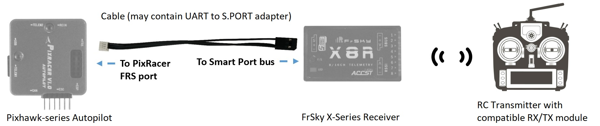
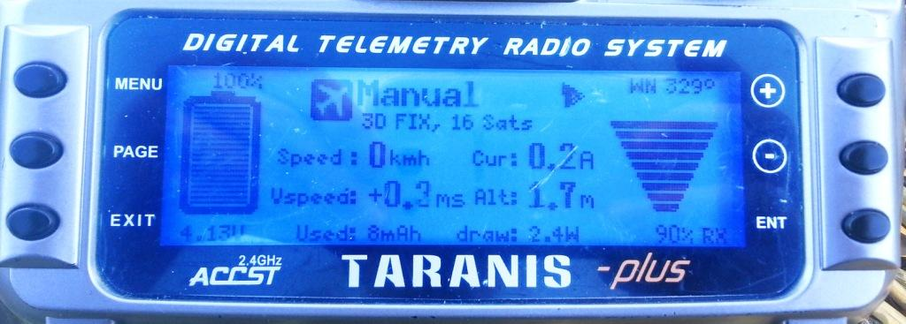
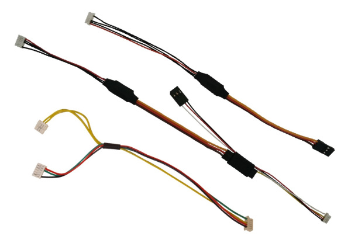
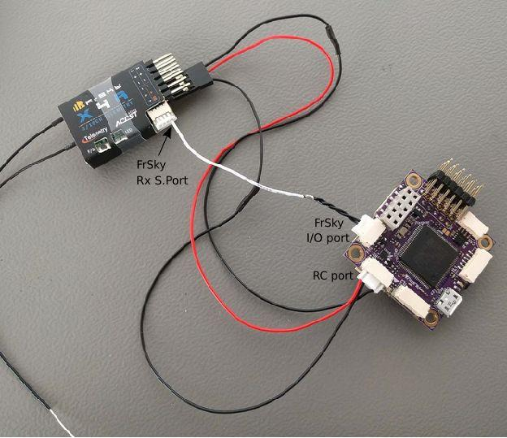

# FrSky 텔레메트리

FrSky 텔레메트리는 호환 RC 송신기의 기체 [텔레메트리](#messages) 정보에 접근할 수 있습니다.

사용 가능한 [텔레메트리 목록](#messages)에는 비행 모드, 배터리 잔량, RC 신호 강도, 속도, 고도 등이 기술되어 있습니다. 일부 송신기는 가청 및 진동 피드백을 추가로 제공 할 수 있으며, 이는 배터리부족과 기타 안전 관련 경고시에 매우 유용합니다.

PX4는 [S.Port](#s_port) (신규) 및 D (이전) FrSky 텔레메트리 포트를 모두 지원합니다.

## 하드웨어 설정

FrSky 텔레메트리의 요구사항은 다음과 같습니다.

* FrSky Taranis X9D Plus와 같은 [FrSky 호환 RC 송신기](#transmitters).
* XSR와 X8R과 같은 [FrSky 텔레메트리 수신기](#receivers).
* FrSky 수신기 스마트 포트(SPort)는 비행 콘트롤러 UART에 연결 케이블입니다.

먼저 [RC 채널용 수신기를 연결](../getting_started/rc_transmitter_receiver.md#connecting-receivers)합니다. 수신기와 비행 컨트롤러 S.Bus 포트를 연결합니다.

그런 다음, 수신기의 SPort를 비행 콘트롤러의 무료 UART에 별도로 연결하여 FrSky 텔레메트리를 설정후, [해당 UART에서 FrSky 원격 측정을 실행하도록 PX4를 설정](#configure)합니다.

이것은 SPort 수신기에 반전되지 않은 출력용 핀 유무와 Pixhawk 버전에 따라 약간 다르게 수행됩니다.

### Pixhawk FMUv4 (및 이전)

Pixhawk FMUv4와 이전 버전의 경우 UART 포트와 수신기 텔레메트리 포트는 일반적으로 호환되지 않습니다 ([Pixracer](../flight_controller/pixracer.md) 제외).

일반적으로 SPort 수신기에는 *반전* S.Port 신호가 있으며, Pixhawk UART에 연결하려면 변환 케이블을 사용하여 S.Port를 반전되지 않은 TX 및 RX로 분할하여야 합니다. 예시는 다음과 같습니다.

:::tip
반전된 S.Port에 연결시에는 일반적으로이 어댑터를 포함하고 자동조종장치 및 수신기에 적합한 커넥터가 있는 [케이블](#ready_made_cable)을 구매하는 것이 저렴하고 편리합니다. [DIY 케이블](#diy_cables)을 만들려면 전기/전자 조립에 관한 전문적인 지식이 필요합니다.
:::

*무반전 출력*용 핀이있는 S.Port 수신기에는 UART TX핀 중 하나에 간단히 연결할 수 있습니다. <!-- FYI only: The uninverted output can be used in single-wire mode so you don't need both RX and TX wires.
Discussion of that here: https://github.com/PX4/px4_user_guide/pull/755#pullrequestreview-464046128 -->

그런 다음 [PX4를 설정](#configure)합니다. 

### Pixhawk FMUv5/STM32F7 이후

Pixhawk FMUv5와 이후 버전에서는 PX4는 반전된(또는 반전되지 않은) S.Port 신호를 직접 읽을 수 있으며, 특별한 케이블이 필요하지 않습니다.

:::note
보다 일반적으로 이것은 STM32F7 이상을 사용하는 자동 조종 장치에서 해당됩니다 (예 : [Durandal](../flight_controller/durandal.md)에는 STM32H7이 있으며 반전되거나 반전되지 않은 S.Port 신호를 직접 읽을 수 있음).
:::

UART의 TX핀중 하나를 SPort 반전 또는 비반전 핀에 연결하면됩니다 (PX4는 두 유형 중 하나를 자동으로 감지합니다). 그런 다음 [PX4를 설정](#configure)합니다. 

## PX4 설정

[TEL_FRSKY_CONFIG](../advanced_config/parameter_reference.md#TEL_FRSKY_CONFIG)를 사용하여 FrSky 실행 모듈 [직렬 포트를 설정](../peripherals/serial_configuration.md)합니다. 포트 전송속도는 드라이버에 의해 설정되므로, 추가로 설정하지 않아도 됩니다.

:::note
무료 UART를 사용할 수 있지만 일반적으로 FrSky 텔레메트리에는 `TELEM 2`가 사용됩니다 (*FrSky* 포트를 사용하도록 사전 설정된 [Pixracer](../flight_controller/pixracer.md) 제외)
:::

:::note
*QGroundControl*에서 설정 매개변수를 사용할 수 없는 경우에는 [펌웨어에 드라이버를 추가](../peripherals/serial_configuration.md#parameter_not_in_firmware)하여야 합니다.

    drivers/telemetry/frsky_telemetry
    

:::

추가 설정이 필요하지 않습니다. FrSky 텔레메트리는 연결되면 자동으로 시작되고 D 또는 S 모드를 감지합니다.

## 호환 RC 송신기

텔레메트리 스트림을 수신 기능한 (FrSky 수신기에 바인딩된) RC 송신기가 필요합니다.

많이 사용되는 제품들은 다음과 같습니다.

* FrSky Taranis X9D Plus (추천)
* FrSky Taranis X9D
* FrSky Taranis X9E
* FrSky Taranis Q X7
* Turnigy 9XR Pro

위의 송신기는 추가 설정없이, 텔레메트리 데이터를 출력합니다. 다음 섹션에서는 텔레메트리 디스플레이를 설정 방법(예 : 더 나은 UI/UX 생성)을 설명합니다.

### Taranis - LuaPilot 설정

OpenTX 2.1.6 이상을 실행하는 Taranis 호환 수신기(예 : X9D Plus)는 LuaPilot 스크립트를 사용하여 원격 측정 출력을 수정할 수 있습니다 (아래 스크린 샷 참조).

스크립트 설치 방법은 [LuaPilot Taranis Telemetry 스크립트 &gt; Taranis Setup OpenTX 2.1.6 이상](http://ilihack.github.io/LuaPilot_Taranis_Telemetry/)을 참고하십시오.

텍스트 편집기로 `LuaPil.lua` 스크립트를 열어 설정을 편집할 수 있습니다. 제안된 수정 사항은 다음과 같습니다.

* `local BattLevelmAh = -1` - 기체 배터리 잔량을 계산합니다.
* `local SayFlightMode = 0` - PX4 비행 모드 WAV 파일이 없습니다.

## 텔레메트리 메시지

FrSky Telemetry는 PX4 유용한 상태 정보 대부분을 전송합니다. S-Port 및 D-Port 수신기는 다음 섹션에 나열된대로 서로 다른 메시지 세트를 전송합니다.

### S-Port

S-Port 수신기는 PX4([여기](https://github.com/iNavFlight/inav/blob/master/docs/Telemetry.md#available-smartport-sport-sensors)에서)에서 다음 메시지들을 전송합니다.

* **AccX, AccY, AccZ:** 가속도
* **Alt:** 홈 위치를 기준 기압계 기반 고도.
* **Curr:** 실제 전류 소비 (Amps).
* **Fuel:** `battery_capacity` 변수 세트 및 변수 `smartport_fuel_percent = ON`인 경우 남은 배터리 비율, 그렇지 않으면 mAh가 표시됩니다.
* **GAlt:** GPS 고도, 해수면은 0입니다.
* **GPS:** GPS 좌표.
* **GSpd:** GPS로 계산된 현재 수평 지면속도입니다.
* **Hdg:** 방향 (도-북쪽은 0 °).
* **VFAS:** 실제 배터리 전압(Voltage FrSky Ampere Sensor).
* **VSpd:** 수직 속도 (cm/s).
* **Tmp1:** [비행 모드](../getting_started/flight_modes.md), 정수로 전송 : 18 - Manual, 23 - Altitude, 22 - Position, 27 - Mission, 26 - Hold, 28 - Return, 19 - Acro, 24 0 오프 보드, 20 - 안정화됨, 25 - 이륙, 29 - Land, 30 - Follow Me.
* **Tmp2:** GPS 정보. 가장 오른쪽 숫자는 GPS 수정 유형입니다 (0 = 없음, 2 = 2D, 3 = 3D). 다른 숫자는 위성의 수입니다.

:::note
다음 "표준" S-Port 메시지는 PX4에서 지원되지 않습니다 : **ASpd**, **A4**.
:::

<!-- FYI: 
Values of FRSKY_ID_TEMP1 and FRSKY_ID_TEMP1 set: 

- https://github.com/PX4/PX4-Autopilot/blob/master/src/drivers/telemetry/frsky_telemetry/frsky_telemetry.cpp#L85  (get_telemetry_flight_mode)
- https://github.com/PX4/PX4-Autopilot/blob/master/src/drivers/telemetry/frsky_telemetry/frsky_data.cpp#L234-L237 
Lua map of flight modes:
- https://github.com/ilihack/LuaPilot_Taranis_Telemetry/blob/master/SCRIPTS/TELEMETRY/LuaPil.lua#L790
-->

### D-port

D-Port 수신기는 다음 메시지를 전송합니다 ([여기](https://github.com/cleanflight/cleanflight/blob/master/docs/Telemetry.md)에서).

* **AccX, AccY, AccZ:** 가속도
* **Alt:** 기압계 기반 고도, 초기화 수준은 0입니다.
* **셀:** 평균 셀 전압 (배터리 전압을 셀 번호로 나눈 값).
* **Curr:** 실제 전류 소비 (Amps).
* **Fuel:** 용량이 설정된 경우 남은 배터리 비율, 그렇지 않으면 mAh가 표시됩니다.
* **Date:** 전원 공급 이후 시간입니다.
* **GAlt:** GPS 고도, 해수면은 0입니다.
* **GPS:** GPS 좌표.
* **GSpd:** GPS로 계산된 현재 속도입니다.
* **Hdg:** 방향 (도-북쪽은 0 °).
* **RPM:** 장착된 경우 스로틀 값, 그렇지 않으면 배터리 용량. Taranis에서 블레이드 번호는 12로 설정하여야 합니다.
* **Tmp1:** 비행 모드 (S-Port의 경우).
* **Tmp2:** GPS 정보 (S-Port의 경우).
* **VFAS:** 실제 배터리 전압(Voltage FrSky Ampere Sensor).
* **VSpd:** 수직 속도 (cm/s).

## FrSky 텔레메트리 수신기

Pixhawk/PX4는 D (이전) 및 S (신규) FrSky 텔레메트리를 지원합니다. 아래 표는 D/S.PORT 텔레메트리를 지원하는 FrSky 수신기들입니다 (이론상 모두 작동함).

:::tip
아래 나열된 X 시리즈 수신기를 권장합니다 (예 : XSR, X8R). R 및 G 시리즈는 테스트팀에 의해 검증되지 않았지만 작동하여야 합니다.
:::

| 수신기         | 범위    | 복합 출력                 | 디지털 텔레메트리 입력                  | 크기                    | 중량    |
| ----------- | ----- | --------------------- | ----------------------------- | --------------------- | ----- |
| D4R-II      | 1.5km | CPPM (8)              | D.Port                        | 40x22.5x6mm           | 5.8g  |
| D8R-XP      | 1.5km | CPPM (8)              | D.Port                        | 55x25x14mm            | 12.4g |
| D8R-II Plus | 1.5km | 없음                    | D.Port                        | 55x25x14mm            | 12.4g |
| X4R         | 1.5km | CPPM (8)              | Smart Port                    | 40x22.5x6mm           | 5.8g  |
| X4R-SB      | 1.5km | S.Bus (16)            | Smart Port                    | 40x22.5x6mm           | 5.8g  |
| X6R / S6R   | 1.5km | S.Bus (16)            | Smart Port                    | 47.42×23.84×14.7mm    | 15.4g |
| X8R / S8R   | 1.5km | S.Bus (16)            | Smart Port                    | 46.25 x 26.6 x 14.2mm | 16.6g |
| XSR / XSR-M | 1.5km | S.Bus (16) / CPPM (8) | Smart Port                    | 26x19.2x5mm           | 3.8g  |
| RX8R        | 1.5km | S.Bus (16)            | Smart Port                    | 46.25x26.6x14.2mm     | 12.1g |
| RX8R PRO    | 1.5km | S.Bus (16)            | Smart Port                    | 46.25x26.6x14.2mm     | 12.1g |
| R-XSR       | 1.5km | S.Bus (16) / CPPM (8) | Smart Port                    | 16x11x5.4mm           | 1.5g  |
| G-RX8       | 1.5km | S.Bus (16)            | Smart Port + integrated vario | 55.26*17*8mm          | 5.8g  |
| R9          | 10km  | S.Bus (16)            | Smart Port                    | 43.3x26.8x13.9mm      | 15.8g |
| R9 slim     | 10km  | S.Bus (16)            | Smart Port                    | 43.3x26.8x13.9mm      | 15.8g |

:::note
위의 표는 http://www.redsilico.com/frsky-receiver-chart 및 FrSky [제품 문서](https://www.frsky-rc.com/product-category/receivers/)에서 참조하였습니다.
:::

## 기성품 케이블

Pixhawk FMUv4와 이전 버전 (Pixracer 제외)의 기성품 케이블은 아래에서 구매가능합니다.

* [Craft and Theory](http://www.craftandtheoryllc.com/telemetry-cable). 버전은 DF-13 호환 *PicoBlade 커넥터*(FMUv2/3DR Pixhawk, FMUv2/HKPilot32 용) 및 *JST-GH 커넥터*(FMUv3/Pixhawk 2, "The Cube" 및 FMUv4/PixRacer v1 용)와 함께 제공됩니다.
    
    

## DIY 케이블

자신만의 어댑터 케이블을 만들 수 있습니다. 자동조종장치에 적합한 커넥터(예 : FMUv3/Pixhawk 2 "The Cube" 및 FMUv4/PixRacer v1 용 *JST-GH 커넥터* 및 DF-13 호환 *PicoBlade 커넥터* 이전 자동 조종 장치의 경우).

Pixracer에는 S.PORT와 UART 간의 신호 변환 장치가 포함되어 있지만, 다른 보드의 경우 UART-S.PORT 어댑터가 필요합니다. 아래에서 구매 가능합니다.

* [FrSky FUL-1](https://www.frsky-rc.com/product/ful-1/): [unmannedtech.co.uk](https://www.unmannedtechshop.co.uk/frsky-transmitter-receiver-upgrade-adapter-ful-1/)
* SPC: [getfpv.com](http://www.getfpv.com/frsky-smart-port-converter-cable.html), [unmannedtechshop.co.uk](https://www.unmannedtechshop.co.uk/frsky-smart-port-converter-spc/) 

다른 보드에서의 연결 방법은 아래에 기술되어 있습니다.

### Pixracer to S-port 변환 수신기

Pixracer FrSky TX와 RX 라인을 X 시리즈 수신기의 S.port 핀에 함께 연결합니다 (전선을 함께 납땜). GND는 S.Bus(일반 RC 연결)에 연결시 수행되므로 연결할 필요가 없습니다.

S-port 연결은 아래와 같습니다 (제공된 I/O 커넥터 사용).

### Pixracer to D-port 변환 수신기

:::tip
대부분의 사용자는 S.PORT를 선호합니다.
:::

Pixracer FrSky TX 라인 (FS 출력)을 수신기의 RX 라인에 연결합니다. Pixracer FrSky RX 라인 (FS 입력)을 수신기 TX 라인에 연결합니다. GND는 RC/SBus (일반 RC의 경우)에 연결할 때 수행되므로 연결할 필요 없습니다.

<!-- Image would be nice -->

### Pixhawk Pro

[Pixhawk 3 Pro](../flight_controller/pixhawk3_pro.md)는 TELEM4에 연결할 수 있습니다 (추가 소프트웨어 설정 필요없음). UART-S.PORT 어댑터나 [기성품 케이블](#ready_made_cable)로 연결하여 합니다.

### Pixhawk FMUv5 이후

UART의 TX핀중 하나를 SPort 반전 또는 비반전 핀에 연결하면됩니다 (PX4는 두 유형 중 하나를 자동으로 감지합니다).

### 기타 보드

대부분의 다른 보드는 TELEM2 UART를 통해 FrSky 텔레메트리 수신기에 연결합니다. 여기에는 [Pixhawk 1](../flight_controller/pixhawk.md), [mRo Pixhawk](../flight_controller/mro_pixhawk.md), Pixhawk2 등이 포함됩니다.

UART-S.PORT 어댑터나 [기성품 케이블](#ready_made_cable)로 연결합니다.

<!-- ideally add diagram here -->

## 추가 정보

추가 정보는 다음 링크를 참고하십시오.

* [FrSky Taranis 텔레메트리](https://github.com/Clooney82/MavLink_FrSkySPort/wiki/1.2.-FrSky-Taranis-Telemetry)
* [Taranis X9D : 텔레메트리 설정](https://www.youtube.com/watch?v=x14DyvOU0Vc) (동영상 자습서)
* [Pxhawk2와 X8R 수신기를 사용한 Px4 FrSky 텔레메트리 설정](https://discuss.px4.io//t/px4-frsky-telemetry-setup-with-pixhawk2-and-x8r-receiver/6362) (DIY 케이블)