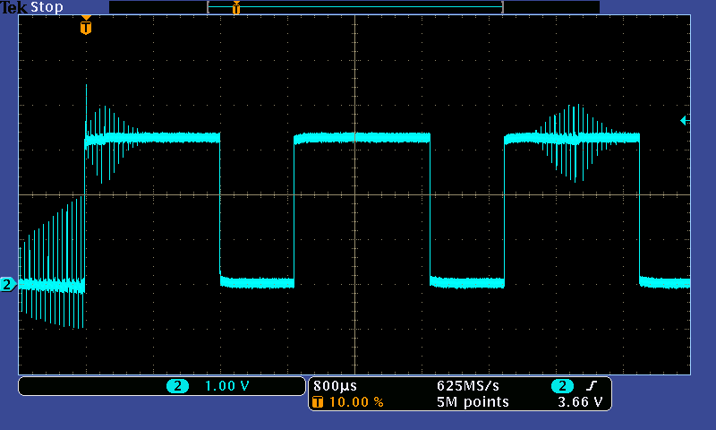

# PWM 서보 및 ESC (모터 컨트롤러)

PWM 기반 브러시리스 모터 컨트롤러, 서보를 연결 방법과 전원 공급 방법을 설명합니다.

## ESC 연결 개요

각 PWM ESC에는 최소한 다음과 같은 전선들을 가지고 있습니다.

- Power VBAT (일반적으로 두껍고 빨간색)
- Power GND (보통 두껍고 검정색)

그리고 서보 플러그에서:

- PWM 신호 (일반적으로 흰색 또는 노란색)
- GND (일반적으로 검정색 또는 갈색)

서보 플러그에는 +5V 와이어 (일반적으로 빨간색 또는 주황색)도 *있을 수 있습니다*. 이 와이어의 목적과 연결 방법은 ESC와 기체 유형에 따라 달라집니다.

:::tip
일부 경우 (아래 참조) +5V 라인이 필요하지 않습니다. +5V 라인을 절단하는 대신 해당 핀용 서보 커넥터 플라스틱 하우징의 잠금 탭을 부드럽게 들어 올린 다음 (예 : 커터 블레이드 또는 소형 스크루 드라이버 사용) 핀을 빼낼 수 있습니다. 전기 절연 테이프로 분리하고 서보 케이블에 테이프로 붙입니다. 이렇게하면 나중에 필요한 경우 와이어를 쉽게 취소할 수 있습니다.
:::

## 전원 연결

항상 Power VBAT 및 GND를 배터리에 연결하고, PWM 신호 및 GND를 서보 플러그에서 모터로 연결하십시오.

:::tip
신호 접지를 연결할 필요가 없는 **설정은 없습니다**.
:::

+5V 와이어 (있는 경우)에 대한 연결은 ESC/기체에 따라 달라집니다.

### 고정익 / VTOL

고정익(또는 VTOL) ESC에서 +5V 라인은 일반적으로 배터리제거회로(BEC)의 출력을 제공합니다.

- 이것은 Pixhawk 서보 레일에 연결되어 플랩, 에일러론 등의 서보에 전원을 공급에 사용할 수 있습니다.
    
:::note
자동조종장치의 전원공급장치에서 서보 또는 ESC에 전원을 공급하는 것은 안전하지 않습니다. 이것은 **Pixhawk 시리즈** 비행 콘트롤러가 서보 레일에 전원을 제공하지 않는 이유입니다 (AUX 서보 레일은 전원이 공급되지 않고 1A로 제한됨).
:::

- 경험상, Pixhawk 서보 레일에는 *하나의 BEC 출력*만 연결하여야 합니다. 여러 +5V 출력을 레일에 연결할 수 있지만, ESC 모델에 따라 다릅니다.

### 멀티콥터

멀티 콥터에서 +5V 라인이 없거나 (있는 경우) 연결되지 않을 수 있습니다.

- 멀티 콥터는 종종 서보가 필요하지 않으므로, Pixhawk 서보 레일에 전원을 공급할 필요가 없습니다 (모터는 일반적으로 배전 보드에서 별도로 전원이 공급됨).
- 와이어를 서보 레일에 연결하여도 단점이나 장점은 없습니다.
- DJI ESC는 일반적으로 이 와이어가 포함되어 있지만, 연결되어 있지는 않습니다.

### 광절연 ESC

BEC가 **없는** 광절연 ESC에서 +5V 라인을 연결하고 전원을 공급해야 할 수 있습니다 (ESC 마이크로 컨트롤러에 전원을 공급하기 위하여). 이 경우 와이어는 일반적으로 비행 콘트롤러 서보 레일에 연결되며, 서보 레일은 추가 BEC에서 전원을 공급하여야 합니다.

## PWM 설정

PX4 PWM 설정 매개변수는 [PWM 출력](../advanced_config/parameter_reference.md#pwm-outputs)을 참고하십시오.

## 문제 해결

Pixhawk는 시중의 모든 *PWM ESC*와 호환됩니다. 특정 ESC가 작동하지 않으면, 연결이나 설정이 잘못된 것입니다.

### 접지 연결

ESC 서보 커넥터의 접지(검은 색 와이어)가 Pixhawk에 연결되어 있는 지 확인합니다 (접지 참조가 없는 유효한 배선 설정이 없음).

:::warning
접지없이 비행하는 것은 안전하지 않습니다. 이는 모든 포지티브 펄스(ESC 신호)에 대해 깨끗한 신호 형태를 위하여, 인접한 접지 복귀 경로가 있어야하기 때문입니다.

아래 이미지는 GND가 연결되지 않은 경우, 신호에 발생하는 노이즈를 보여줍니다.

:::

### 전원 연결 / 광절연 ESC

BEC/전원 출력을 제공하지 않는 광절연 ESC를 사용하는 경우, ESC에 광절연기에 전원이 공급되는 +5V 라인이 필요 여부를 확인하십시오.

다른 전원 연결 고려 사항에 대한 설명은이 페이지의 첫 번째 섹션을 참조하십시오.

### 잘못된 최소치

일부 ESC는 전원을 켤 때, 스로틀 스틱이 중간 위치에 있는 사용자를 보호하기 위하여 전원을 켜기 전에 특별한 낮은 값 펄스를 확인하여야 합니다.

PX4는 차량이 무장 해제될 때 [PWM_MAIN_DISARM](../advanced_config/parameter_reference.md#PWM_MAIN_DISARM) 펄스 값을 전송하여 무장 해제시 ESC를 무음으로 설정하고 ESC가 올바르게 초기화 합니다.

이 값은 ESC에 대해 올바르게 설정되어야 합니다 (올바른 값은 대략 1200에서 900 us 사이입니다).

### 시간 초과

일부 ESC는 전원을 켠 후 몇 초 이내에 유효한 로우 펄스를 받지 못하면 시간 초과 (모터 활성화 방지)될 수 있습니다.

PX4는 전원이 켜진 직후 [PWM_MAIN_DISARM](../advanced_config/parameter_reference.md#PWM_MAIN_DISARM) 펄스 유휴/비무장 해제 펄스를 전송합니다. 이것이 올바르게 설정되면, ESC 시간 초과가 되지 않습니다.

### 유효한 펄스 모양, 전압 및 업데이트 속도

:::note
이것은 문제가되지 않지만, 완전성을 위해 사용됩니다.
:::

Pixhawk는 모든 주요 브랜드(Futaba, Spektrum, FrSky)에서 사용하는 활성 고펄스를 사용합니다.

PWM 인터페이스는 공식적으로 표준화되어 있지 않지만, 일반 마이크로 컨트롤러는 모두 TTL 또는 CMOS 전압 레벨을 사용합니다. TTL은 낮은 <0.8V 및 높은> 2.0V로 정의되며, 일부 제조업체는 추가 노이즈 마진을 위해 2.4V 이상의 전압을 사용합니다. CMOS 로직은 유사한 전압 레벨로 정의됩니다. 5V 레벨은 *켜짐* 상태로 성공적으로 전환에는 **절대** 필요하지 않습니다.

:::tip
Futaba, FrSky 및 Spektrum 수신기는 2.4V보다 훨씬 높은 3.3V 또는 3.0V 전압 레벨을 출력합니다. Pixhawk는 이러한 일반적인 산업 패턴을 채택하고, 최근 보드에서 3.3V 레벨을 출력합니다.
:::