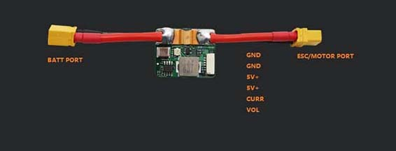

# CUAV HV PM (고전압 전원 모듈)

CUAV&reg; *HV_PM* 전원 모듈은 CUAV에서 개발한 "고전압" 전원 모듈입니다.
> **팁** *HV_PM*은 CUAV V5+/V5 나노 키트에 포함되어 있으며, 별도로 판매됩니다. 비행 콘트롤러(Pixhack v3, V5 + / V5 nano, Pixhawk)에 따라 케이블이 다릅니다. 다른 비행 컨트롤러에 사용시에는 케이블 핀을 수정하는 경우도 있습니다.

## 사양

- **고전압 입력:** 10V ~ 60V (3s ~ 14s 배터리)
- **정확한 배터리 모니터:**
  - **전압 감지 정확도:** +- 0.1v
  - **전류 감지 정확도:** +- 0.2A
- **BEC (5v) 최대 전류:** 5A
- **최대 (감지) 전류:** 60A
- **최대 출력 전류 (ESC/MOTOR PORT):** 60A

## 구매

[CUAV aliexpress 상점](https://www.aliexpress.com/item/32841805115.html?spm=2114.12010615.8148356.1.64165998hPvTKQ)

## 핀배열

## HV PM 활성화

[배터리 및 전원 모듈 설정](../config/battery.md)은 배터리와 전원 모듈 설정 방법을 설명합니다.

`HV_PM`의 주요 설정은 다음과 같습니다.
- **전압 분배기:** 18
- **볼트 당 암페어:** 24 A/V