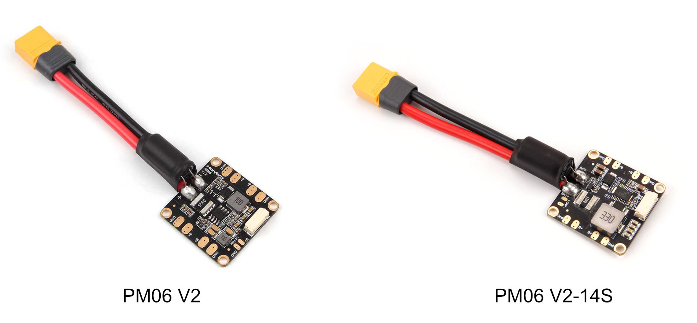

# Holybro Micro 전원 모듈 (PM06)

This power module has integrated power distribution board and provides regulated power for a flight controller and ESCs, and sends information to the autopilot about the battery’s voltage and current draw.

## 사양

- **PCB 전류:** 120A 연속
- **UBEC 전류:** 최대 3A
- **Power input:** 2S~10S (standard version)
- **Power input:** 2S~14S (14S version)
- **Power output:** DC 5.1V~5.3V
- **Voltage Divider:** 18.182
- **Amperes per Volt:** 36.364

## Mechanical Specifications

- **Dimensions:** 35x35x5mm
- **Mounting hole:** 30.5mm*30.5mm
- **Weight:** 24g

## Where to Buy

[PM06 V2 Power Module](https://holybro.com/collections/power-modules-pdbs/products/micro-power-module-pm06-v2)

## 배선

배선 예제는 [Pixhawk 4 Mini &gt; 전원](../assembly/quick_start_pixhawk4_mini.md#power)을 참고하십시오.

