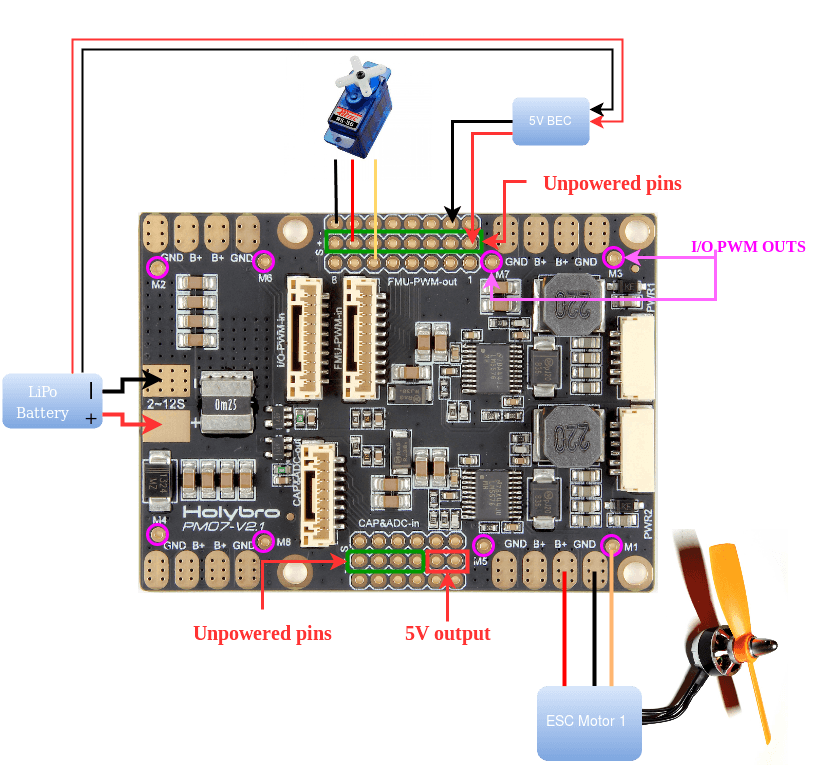

# Holybro Pixhawk 4 전원 모듈 (PM07)

전원 관리 보드(PM 보드)는 전원 모듈과 배전 보드 용도로 사용됩니다. Pixhawk 4와 ESC에 조정 전력을 제공하고, 비행 콘트롤러와 모터에 공급되는 배터리의 전압과 전류에 대한 정보를 자동조종장치에 전송합니다.

:::note
This module can be purchased as bundle with [Pixhawk 4](../assembly/quick_start_pixhawk4.md), but can also be used with other flight controllers.
:::

## 사양

- **PCB 전류:** 총 (최대) 120A 출력
- **UBEC 5v 출력 전류:** 3A
- **UBEC input voltage:** 2~12s LiPo
- **Dimensions:** 68 x 50 x 8 mm
- **Mounting Holes:** 45 x 45 mm
- **중량:** 36g

## 패키지 내용물

- PM07 board
- 80mm XT60 connector wire (installed)
- Electrolytic capacitor: 220uF 63V (installed)
- 2x JST GH 10P Cable
- JST GH 8P Cable
- 2x JST GH 6P Cable

## Where to Buy

[Pixhawk 4 전원 모듈 (PM07)](https://holybro.com/collections/power-modules-pdbs/products/pixhawk-4-power-module-pm07)

## 배선

배선 정보는 [Pixhawk 4 &gt; 전원](../assembly/quick_start_pixhawk4.md#power)을 참고하십시오.

## 추가 정보

[Quick Start Guide](https://docs.holybro.com/power-module-and-pdb/power-module/pm07-quick-start-guide) (Holybro)
