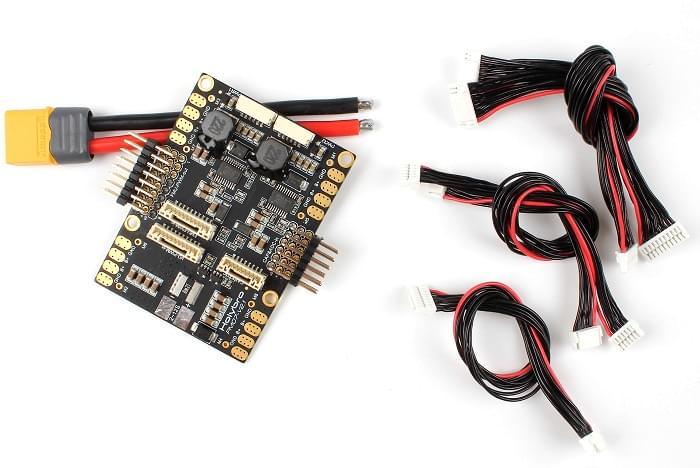

# Holybro Pixhawk 4 전원 모듈 (PM07)

전원 관리 보드(PM 보드)는 전원 모듈과 배전 보드 용도로 사용됩니다. Pixhawk 4와 ESC에 조정 전력을 제공하고, 비행 콘트롤러와 모터에 공급되는 배터리의 전압과 전류에 대한 정보를 자동조종장치에 전송합니다.

:::note
이 모듈은 [Pixhawk 4](../assembly/quick_start_pixhawk4.md)에 포함되어 있지만, 다른 비행 콘트롤러에도 사용 가능합니다.
:::

## 사양

- **PCB Current:** total 120A outputs (MAX)
- **UBEC 5v output current:** 3A
- **UBEC input voltage:** 7~51v (2~12s LiPo)
- **Dimensions:** 68*50*8 mm
- **Mounting Holes:** 45x45mm
- **Weight:** 36g

## Package Contents

- PM07 board (1)
- 80mm XT60 connector wire (1)

## Purchase

[Pixhawk 4 Power Module (PM07)](https://shop.holybro.com/pixhawk-4-power-module-pm07_p1095.html)

## Wiring/Connections

Wiring and connection information can be found in: [Pixhawk 4 > Power](../assembly/quick_start_pixhawk4.md#power).

## Further Information

[Quick Start Guide](http://www.holybro.com/manual/PM07-Quick-Start-Guide.pdf) (Holybro)
