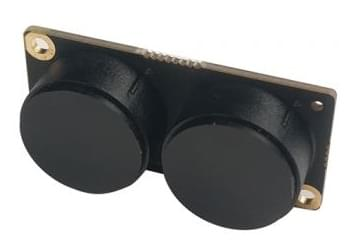
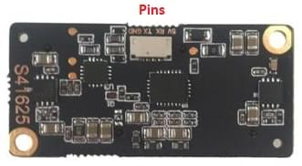

# Lanbao PSK-CM8JL65-CC5 ToF 적외선 거리 측정 센서

[Lanbao PSK-CM8JL65-CC5](https://www.seeedstudio.com/PSK-CM8JL65-CC5-Infrared-Distance-Measuring-Sensor-p-4028.html)는 0.17m-8m 범위와 밀리미터 분해능을 가진 초소형 IR 거리 센서입니다. UART/직렬 버스에 연결됩니다.

- 크기: 38 mm x 18mm x 7mm
- 중량: ≤10g




## 하드웨어 설정

PSK-CM8JL65-CC5는 사용하지 않는 *직렬 포트* (예 : TELEM2, TELEM3, GPS2 등)로 연결합니다.

핀배열은 센서 하단에 레이블이 있습니다.




## 매개변수 설정

[SENS_CM8JL65_CFG](../advanced_config/parameter_reference.md#SENS_CM8JL65_CFG)를 사용하여 LIDAR가 실행되는 [직렬 포트를 설정](../peripherals/serial_configuration.md)합니다.

:::note
*QGroundControl*에서 설정 매개변수를 사용할 수 없는 경우에는 [펌웨어에 드라이버를 추가](../peripherals/serial_configuration.md#parameter_not_in_firmware)하여야 합니다:
```
distance_sensor/cm8jl65
```
:::

센서를 *충돌 방지*에 사용하려면 [SENS_CM8JL65_R_0](../advanced_config/parameter_reference.md#SENS_CM8JL65_R_0)와 [CP_DIST](../advanced_config/parameter_reference.md#CP_DIST) 매개변수를 추가로 설정하여야 합니다. 자세한 내용은 [충돌 방지](../computer_vision/collision_prevention.md#rangefinder)를 참고하십시오.
