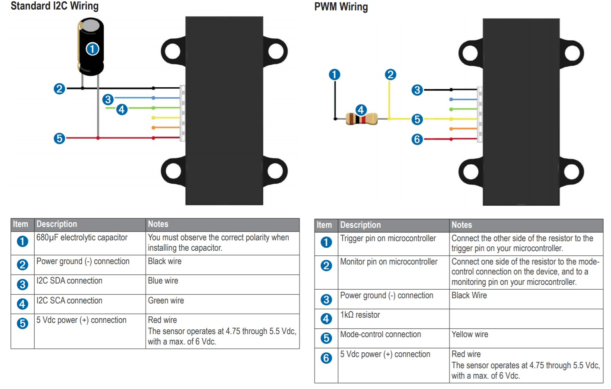
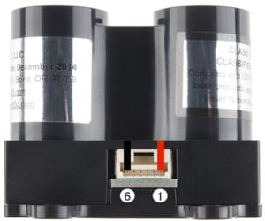
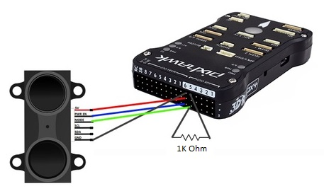
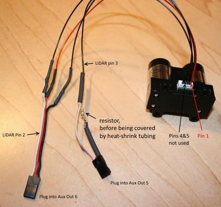

# Lidar-Lite

LIDAR-Lite는 드론, 로봇 또는 무인 차량용 소형 고성능 광학 원거리 측정 센서입니다. I2C 또는 PWM에 연결됩니다.

 

## 구매처

* [LIDAR-Lite v3](https://buy.garmin.com/en-AU/AU/p/557294) (5cm - 40m)

## 핀배열

Lidar-Lite (v2, v3) 핀배열은 아래와 같습니다.

| 핀 | 명칭       | 설명                                                                                                   |
| - | -------- | ---------------------------------------------------------------------------------------------------- |
| 1 | POWER_IN | 전원 공급. 4.75-5.5V DC 공칭, 최대 6V DC.                                                                    |
| 2 | POWER_EN | 액티브 하이는 3.3V 마이크로 컨트롤러 레귤레이터의 작동을 가능하게 합니다. Low puts board to sleep, draws <40 μA. (내장 100K pull-up) |
| 3 | 모드 선택 제어 | 트리거 (하이-로우 에지) PWM 출력 (하이) 제공                                                                        |
| 4 | SCL      | I2C Clock                                                                                            |
| 5 | SDA      | I2C 데이터                                                                                              |
| 6 | GND      | 신호/전원 접지.                                                                                            |

## 배선

*Lidar-Lite v3*는 PWM 또는 I2C와 함께 사용합니다. 구형 모델에서는 PWM을 권장합니다. 거리계는 일부 ESC/BEC(PWM 또는 I2C를 통해 연결됨)로 별도 전원이 공급되어야합니다.

:::note
블루 라벨이 아닌 Lidar-Lite (v1) 장치의 I2C 인터페이스에는 안정성 제한이 있으며, 따라서 모든 실버 라벨 세대의 Lidar-Lite 센서는 I2C 인터페이스에서 제외됩니다.
이러한 센서에는 PWM 인터페이스(아래에 자세히 설명)를 사용하는 것이 좋습니다.
파란색 레이블(v2) 장치는 일부 조건에서 5V 미만 전원을 사용하며, 일정한 오프셋을 나타낼 수 있습니다.
이는 현재 (2015 년 4 분기) 제조업체에서 조사 중이며, 특정 운영 조건을 준수하여 잠재적으로 해결 가능합니다.
권장되는 강력한 설정은 PWM 인터페이스를 가진 v1 장치입니다.
:::

Lidar-Lite 3([작동 설명서](http://static.garmin.com/pumac/LIDAR_Lite_v3_Operation_Manual_and_Technical_Specifications.pdf)에서)의 표준 배선 방법은 다음과 같습니다. Lidar-Lite v2와 v3은 커넥터의 핀 순서가 역전된다는 점을 제외하면 동일합니다 (즉, 커넥터가 뒤집힌 것처럼).

### PWM 인터페이스 배선

LidarLite를 *Pixhawk 1* AUX 포트 (PWM 인터페이스) 핀 연결은 아래와 같습니다.

| 핀 | Lidar-Lite (v2, v3) | Pixhawk AUX Servo | 설명                                                                      |
| - | ------------------- | ----------------- | ----------------------------------------------------------------------- |
| 1 | VCC                 | AUX 6 (중앙)        | 전원 공급. 4.75-5.5V DC 공칭, 최대 6V DC.                                       |
| 2 | RESET               | AUX 6 (하단)        | 센서의 재설정 라인                                                              |
| 3 | PWM                 | AUX 5 (하단)        | Lidar Lite의 PWM 출력. **470 Ohm 풀다운 (GND로)이 필요합니다. 1K0hm 저항을 사용하지 마십시오.** |
| 4 | SCL                 | -                 | 연결되지 않음                                                                 |
| 5 | SDA                 | -                 | 연결되지 않음                                                                 |
| 6 | GND                 | AUX 6 (상단)        | 접지                                                                      |

:::note
AUX 포트가 없는 비행 콘트롤러에서는 동등한 MAIN 핀이 사용됩니다 (예 : 라이더의 PWM 출력이 대신 MAIN 5에 매핑됨).
핀 번호는 하드 코딩되어 있습니다.
:::

LidarLite v2의 배선은 아래와 같습니다. Lidar-Lite v3는 커넥터의 핀 번호가 반대라는 점을 제외에는 유사하게 연결됩니다.

### I2C 인터페이스 배선

I2C 배선은 다른 거리 센서에 대해서도 동일합니다. SLA, SLC, GND 및 VCC를 비행 콘트롤러와 센서의 해당 (동일한) 핀에 연결하면 됩니다.

## 소프트웨어 설정

거리계/포트는 [SENS_EN_LL40LS](../advanced_config/parameter_reference.md#SENS_EN_LL40LS)를 사용하여 활성화됩니다. PWM의 경우 `1`, I2C의 경우 `2`로 설정됩니다.

:::note
이 거리계의 드라이버는 펌웨어에서 제공됩니다. 존재하지 않으면, 보드 설정에 드라이버(`drivers/ll40ls`)를 추가하여야 합니다.
:::

## 추가 정보

* [LIDAR_Lite_v3_Operation_Manual_and_Technical_Specifications.pdf](http://static.garmin.com/pumac/LIDAR_Lite_v3_Operation_Manual_and_Technical_Specifications.pdf) (Garmin)
