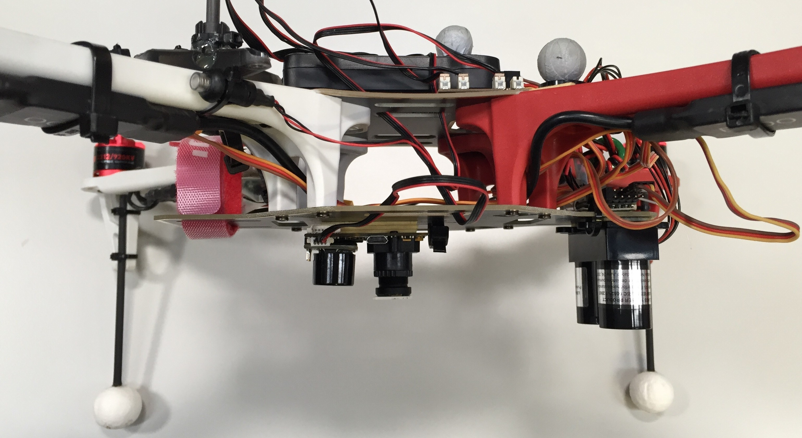
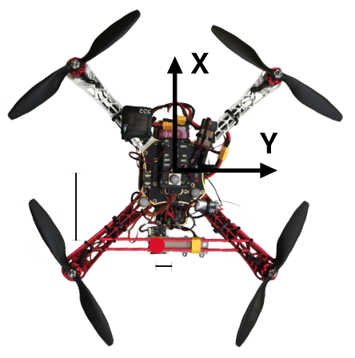
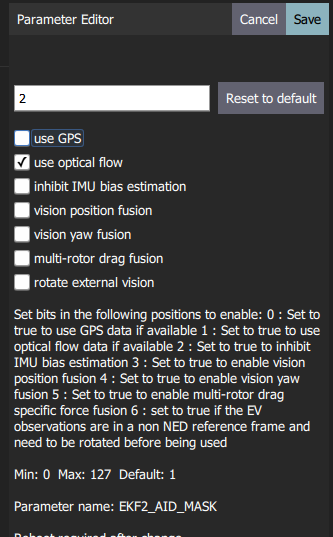

# 광류

*광류*는 속도 추정을 위하여 하향 카메라와 하향 거리 센서를 사용합니다.

@[유튜브](https://youtu.be/aPQKgUof3Pc) *동영상: 속도 추정을 위한 ARK Flow 센서를 사용한 PX4 고정 위치([위치 모드](../flight_modes/position_mc.md))* <!-- ARK Flow with PX4 Optical Flow Position Hold: 20210605 -->

## 설정

광류에는 하향 카메라와 [거리 센서](../sensor/rangefinders.md)(LiDAR가 더 좋음)가 필요합니다. 이들은 MAVLink, I2C 또는 다른 버스로 연결 가능합니다.

:::note MAVLink를 통해 PX4에 연결된 경우 광류 장치는 [OPTICAL_FLOW_RAD](https://mavlink.io/en/messages/common.html#OPTICAL_FLOW_RAD) 토픽을 퍼블리시 하여야하며, 거리 센서는 [DISANCE_SENSOR](https://mavlink.io/en/messages/common.html#DISTANCE_SENSOR) 토픽에 게시하여야합니다.
:::

다른 방향으로 이동할 때의 흐름 출력은 다음과 같아야합니다.

| 기체 이동 | 통합 흐름 |
| ----- | ----- |
| 전방    | + Y   |
| 후방    | - Y   |
| 우측    | - X   |
| 좌측    | + X   |

순수 회전의 경우 `integrated_xgyro`와 `integrated_x` (각각 `integrated_ygyro`와 `integrated_y`)는 동일하여야 합니다.

보편적인 설정은 아래와 같은 [PX4Flow](../sensor/px4flow.md)와 [Lidar-Lite](../sensor/lidar_lite.md)입니다.

광류 데이터는 다른 속도 데이터 소스와 융합됩니다. 센서 데이터와 차량 중앙으로부터의 오프셋을 융합 방식은 [추정기](#estimators)에서 설정합니다.

## 유량 센서/카메라

### PX4Flow

[PX4Flow](../sensor/px4flow.md)는 조명 LED 없이 실내외의 조명이 낮은 환경에서 작동하는 광류 카메라입니다. 광류를 계산하는 간편하고 가장 확립된 방법 중 하나입니다.

### ARK Flow 

[ARK Flow](../uavcan/ark_flow.md)는 [UAVCAN](../uavcan/README.md) 옵티컬 플로우 센서, [거리 센서](../sensor/rangefinders.md) 및 IMU입니다. PAW3902 광학 유량 센서, Broadcom AFBR-S50LV85D 30m 거리 센서 및 BMI088 IMU가 있습니다.

### PMW3901 기반 센서

[PMW3901](../sensor/pmw3901.md)은 컴퓨터 마우스와 유사한 광류 센서이지만, 80mm에서 무한대까지 작동합니다. Bitcraze, Tindie, Hex, Thone 및 Alientek의 일부 제품을 포함하여 여러 제품에 사용됩니다.

### 기타 카메라 / 센서

카메라 통합 보드를 사용할 수 있습니다. [Optical Flow repo](https://github.com/PX4/OpticalFlow)를 사용할 수도 있습니다 ([snap_cam](https://github.com/PX4/snap_cam) 참조).

## 거리 측정기

더 자세한 정보는 [거리 센서](../sensor/rangefinders.md)를 참고하십시오. 그러나 견고성과 정확성 측면에서는 음향 센서보다 LIDAR를 사용하는 것이 좋습니다.

## 추정기

추정기는 광학 흐름 센서 및 기타 소스의 데이터를 융합합니다. 융합 방법 설정과 차량 중심에 대한 상대적 오프셋이 사용되는 추정기를 지정하여야합니다.

오프셋은 아래와 같이 차량 방향 및 중심을 기준으로 계산됩니다.

광류 기반 탐색은 EKF2 및 LPE (더 이상 사용되지 않음) 추정기에서 활성화됩니다.

### 확장 칼만 필터 (EKF2)

EKF2를 사용하는 광류 융합의 경우 아래 QGroundControl을 사용하여 표시된대로 [EKF2_AID_MASK](../advanced_config/parameter_reference.md#EKF2_AID_MASK) 매개변수에서 광류 플래그 사용을 설정합니다.

광류 센서가 차량 중앙에서 오프셋된 경우 다음 매개변수를 사용하여 설정합니다.

| 매개변수                                                                                                | 설명                                |
| --------------------------------------------------------------------------------------------------- | --------------------------------- |
| [EKF2_OF_POS_X](../advanced_config/parameter_reference.md#EKF2_OF_POS_X) | 바디 프레임에서 광류 초점의 X 위치 (기본값은 0.0m). |
| [EKF2_OF_POS_Y](../advanced_config/parameter_reference.md#EKF2_OF_POS_Y) | 바디 프레임에서 광류 초점의 Y 위치 (기본값은 0.0m). |
| [EKF2_OF_POS_Z](../advanced_config/parameter_reference.md#EKF2_OF_POS_Z) | 바디 프레임에서 광류 초점의 Z 위치 (기본값은 0.0m). |