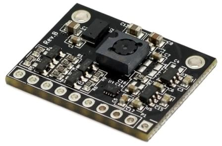
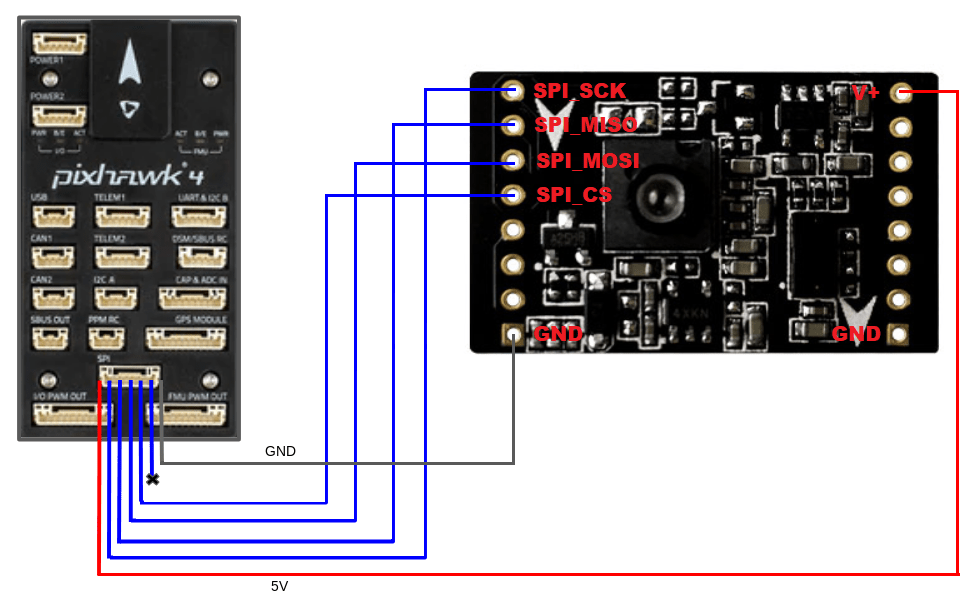
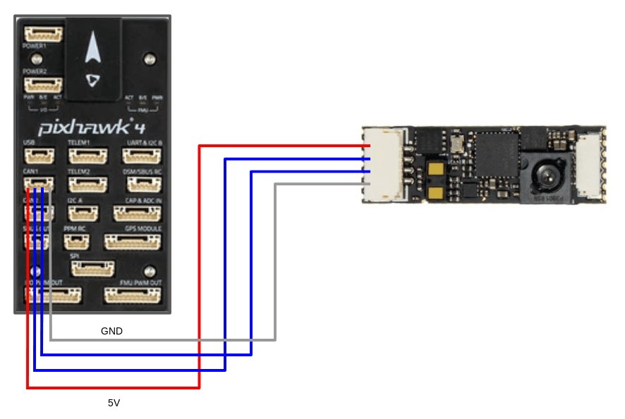

# PMW3901 기반 유량 센서

PMW3901은 내부적으로 흐름을 계산하고, 각 프레임 간의 픽셀 차이를 제공하는 [광류](../sensor/optical_flow.md) ASIC입니다. 컴퓨터 마우스와 유사한 추적 센서를 사용하지만 80mm에서 무한대 사이에서 작동하도록 조정되었습니다. PMW3901은 Bitcraze, Tindie, Hex, Thone 및 Alientek의 일부 제품을 포함하여 여러 제품에 사용됩니다.

장착 방법, PX4 설정 방법과 테스트 센서에 대한 링크를 제공합니다 (이 유형의 모든 센서에 공통임).

## PMW3901을 사용하는 보드

다음 표는이 센서를 사용하는 일부 보드를 보여 주며, 인터페이스 수, 센서 수, 입력 전압 및 크기를 나열합니다. 보드 이름은 배선 및 구매 정보가 포함된 보드 별 섹션으로 연결됩니다.

| 제조사      | 보드                                              | 인터페이스 | 흐름 | 거리 측정기 | 자이로 | 전압 (V)    | 크기 (mm)   | 최대 높이 (m) |
| -------- | ----------------------------------------------- | ----- | -- | ------ | --- | --------- | --------- | --------- |
| Bitcraze | [Flow breakout](#bitcraze_flow_breakout)        | SPI   | Y  | Y      | -   | 3 - 5     | 21x20     | 1         |
| Tindie   | [PMW3901 광류 센서](#tindie_pmw3901_flow_sensor)    | SPI   | Y  | -      | -   | 3 - 5     | AxB       | -         |
| Hex      | [HereFlow PMW3901 광류 센서](#hex_hereflow_pwm3901) | CAN   | Y  | Y      | Y   | 3 - 5     | AxB       | 4         |
| Thone    | [ThoneFlow-3901U](#thone_thoneflow_3901U)       | UART  | Y  | -      | -   | 3 - 5     | AxB       | -         |
| Alientek | [ATK-PMW3901](#alientek_atk-pwm3901)            | SPI   | Y  | -      | -   | 3.3 - 4.2 | 27.5x16.5 | 1         |

## 외부 거리계

거리계가 없는 센서 (예: *Tindie* 또는 *Thone*)에는 외부 거리계/거리 센서가 *필수*이며 *권장됩니다.* 다른 보드의 경우 (범위가 매우 제한되어 있으므로).

필요한 범위는 애플리케이션에 따라 다릅니다.
- 실내 비행 : ≈4m
- 실외 비행 : ≥10 미터 (예 : GPS에 문제가 있을 수 있는 환경에서 위치 제어를 지원)

PX4에서 지원하는 [거리계/거리 센서](../sensor/rangefinders.md)를 사용할 수 있습니다. 센서는 어디나 장착할 수 있지만, 아래를 향해야하며 평소와 같이 연결/설정하여야 합니다.

:::tip PX4 팀은 주로 대형 기체에 [Lidar Lite V3](../sensor/lidar_lite.md)를 사용하고 소형 기체에 [Lanbao CM8JL65](../sensor/cm8jl65_ir_distance_sensor.md)를 사용하여 테스트 하였습니다.
:::

## 장착 및 방향

흐름 모듈은 일반적으로 차량 중앙 근처에 장착됩니다. 중심을 벗어난 곳에 장착하는 경우 오프셋을 설정하여야 합니다. [Optical Flow > EKF2](../sensor/optical_flow.md#ekf2).

흐름 모듈은 차체 프레임과 관련된 모든 요 방향으로 장착 할 수 있지만 [SENS_FLOW_ROT](../advanced_config/parameter_reference.md#SENS_FLOW_ROT)에 사용 된 값을 설정하여야 합니다.

"제로"회전은 센서 보드와 [기체](../getting_started/px4_basic_concepts.md#heading-and-directions) X 축이 정렬되어 (즉, 기체 "전면"과 보드가 같은 방향에 있음) 회전이 시계 방향으로 증가하는 경우입니다.

PMW3901 모듈에는 보드 **후방**을 나타내는 작은 노치가 있습니다. 다이어그램은 `SENS_FLOW_ROT=0`에 해당하는 상대적인 보드 및 기체 방향을 나타냅니다 (뒷면의 노치 참조).

위의 다이어그램은 Bitcraze 보드입니다. 노치를 사용하여 같은 방법으로 다른 보드의 방향을 찾을 수 있습니다.

| &nbsp;                                                                                               | &nbsp;                                                                                                                        |
| ---------------------------------------------------------------------------------------------------- | ----------------------------------------------------------------------------------------------------------------------------- |
| Tindie             | Hex Hereflow                        |
| Thone  | Alientek (앞면을 나타내는 화살표도 있습니다!)  |

## PX4 설정

모든 PMW3901 기반 보드에 공통적인 PX4 설정:
- [ 광류 > EKF2](../sensor/optical_flow.md#ekf2)는 EKF2 추정기에서 광류 데이터를 융합하고 흐름 센서의 장착 위치에 대한 위치 오프셋을 설정 방법을 설명합니다.
- [SENS_FLOW_ROT](../advanced_config/parameter_reference.md#SENS_FLOW_ROT)는 기체 방향을 기준으로 유량 센서의 방향을 설정합니다.

추가:
- SPI 연결 센서 드라이버를 활성화하려면 [SENS_EN_PMW3901](../advanced_config/parameter_reference.md#SENS_EN_PMW3901)을 `1`로 설정하여야합니다.
- UART 연결 센서 (예 : ThoneFlow-3901UY)는 매개변수 [SENS_TFLOW_CFG](../advanced_config/parameter_reference.md#SENS_TFLOW_CFG)를 연결된 UART 포트의 값으로 설정하여 [관련 직렬 포트를 설정](../peripherals/serial_configuration.md)하여야합니다 (예 : 이 센서를 `TELEM 2`에 연결 한 경우 `SENS_TFLOW_CFG`를 `102`로 설정하여야합니다).
- UAVCAN 센서는 `UAVCAN_ENABLE`을 적절하게 설정하여야합니다. 자세한 내용은 [UAVCAN 주변 장치](../uavcan/README.md) (및 [아래의 HereFlow PMW3901 문서](#uavcan_wiring))를 참조하십시오.

개별 유량 센서는 아래 섹션에 설명대로 추가로 설정됩니다.

## Bitcraze Flow breakout

[Bitcraze Flow breakou](https://www.bitcraze.io/products/flow-breakout/)은 PMW3901 모듈에서 [SPI 인터페이스](#spi_wiring)를 직접 노출합니다.

이 보드는 또한 [Pixhawk I2C 포트](#i2c_wiring)에 연결된 거리 센서를 통합합니다. 이 거리 센서는 STMicroelectronics의 VL53L0x ToF 센서입니다. 센서 범위는 최소 (2m)이며 햇빛 아래에서 비행시 줄어듭니다. 따라서 [외부 거리 센서](#external_rangefinder)를 사용하는 것이 좋습니다.

### SPI Wiring

The PMW3901, if connected to the SPI port on a Pixhawk 4, will automatically detect the Bitcraze flow module. This device's driver was explicitly written to be plugged into the SPI port using the chip select 1. No parameters will have to be configured other than the [orientation and position of the sensor](#orientation).

The pinout mapping for the Pixhawk SPI port to Bitcraze Flow Board is shown below (the port mapping is the same for all Pixhawk FMU versions).

| Pixhawk SPI Port (from left to right) | Bitcraze flow board |
| ------------------------------------- | ------------------- |
| 1 (VCC)                               | VCC                 |
| 2 (SCK)                               | CLK                 |
| 3 (MISO)                              | MISO                |
| 4 (MOSI)                              | MOSI                |
| 5 (CS1)                               | Do not connect      |
| 6 (CS2)                               | CS                  |
| 7 (GND)                               | GND                 |

To connect the bitcraze flow board to the Pixhawk, you will need to solder the wires of the Pixhawk SPI cable to the flow board. An SPI cable has 7 wires, from which you need to connect 6 to the flow board.

The following diagram shows how to wire the sensor to a Pixhawk 4.

### I2C Wiring

The I2C wiring is the same for any other distance sensor. Simply connect the SLA, SLC, GND, and VCC to the corresponding (same) pins on the Pixhawk and the sensor. 

## Tindie PMW3901 Optical Flow Sensor

The Tindie [PMW3901 Optical Flow Sensor](https://www.tindie.com/products/onehorse/pmw3901-optical-flow-sensor/) exposes the SPI interface from the PMW3901 module exactly as on the Bitcraze module (see [SPI Wiring](#spi_wiring)).

The sensor doesn't have a distance sensor onboard, so you will need to use an [external distance sensor](#external_rangefinder).

## AlienTek ATK-PMW3901

The AlienTek [ATK-PMW3901](https://www.aliexpress.com/i/32979605707.html) exposes the SPI interface from the PMW3901 module in the same way as the Bitcraze module (see [SPI Wiring](#spi_wiring)).

The board also incorporates a distance sensor (we recommend that you use an [external distance sensor](#external_rangefinder)). You can wire the internal sensor to the Pixhawk I2C port [in the same way as any other I2C peripheral.](#i2c_wiring) A screenshot showing the I2C pins (SLA, SLC, GND, and VCC) is provided below.

## Hex HereFlow PMW3901 Optical Flow Sensor

The Hex [HereFlow PMW3901 Optical Flow Sensor](http://www.proficnc.com/all-products/185-pixhawk2-suite.html) is a tiny board containing the PMW3901 flow module, VL53L1X distance sensor, and an IMU (used to synchronize the flow data with the gyro data).

An onboard microcontroller samples the three sensors and publishes two UAVCAN messages containing all the information needed for the flow and distance sensor calculations.

The board can be connected to any CAN port on any Pixhawk board (see [UAVCAN wiring](#uavcan_wiring)).

As for the other optical flow boards, we recommend that you use an [external distance sensor](#external_rangefinder).

### UAVCAN Wiring/Setup

The diagram below shows how to connect the sensor to the Pixhawk 4 CAN bus.

In addition to any other configuration, you will need to set the parameter [UAVCAN_ENABLE](../advanced_config/parameter_reference.md#UAVCAN_ENABLE) to either 2 or 3, depending on your system:
- `UAVCAN_ENABLE=2`: UAVCAN sensors but no motor controllers.
- `UAVCAN_ENABLE=3`: UAVCAN sensors and motor controllers.

For general information about UAVCAN wiring and configuration see: [UAVCAN Peripherals](../uavcan/README.md).

## Thone ThoneFlow-3901U

The Thone [ThoneFlow-3901U](https://www.seeedstudio.com/ThoneFlow-3901U-UART-Serial-Version-PMW3901-Optical-Flow-Sensor-p-4040.html) exposes a PMW3901 optical flow module via a UART interface.

The board doesn't include a distance sensor onboard, so you will need to use an [external distance sensor](#external_rangefinder).

<!-- note, this will be set using SENS_TFLOW_CFG
Wiring is also required.
--> In addition to the general 

[PX4 configuration](#px4-configuration) you must also set the parameter [SENS_TFLOW_CFG](../advanced_config/parameter_reference.md#SENS_TFLOW_CFG) to the value of the UART port you connected (e.g. if the sensor is connected to `TELEM 2` then set `SENS_TFLOW_CFG=102`. For more information see [Serial Port Configuration](../peripherals/serial_configuration.md).

