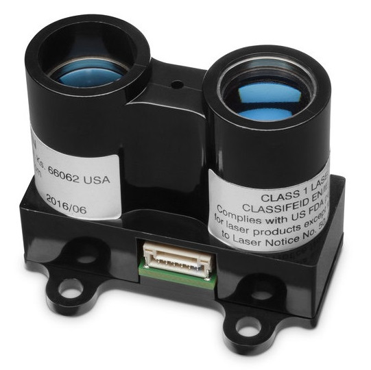
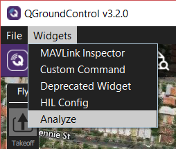
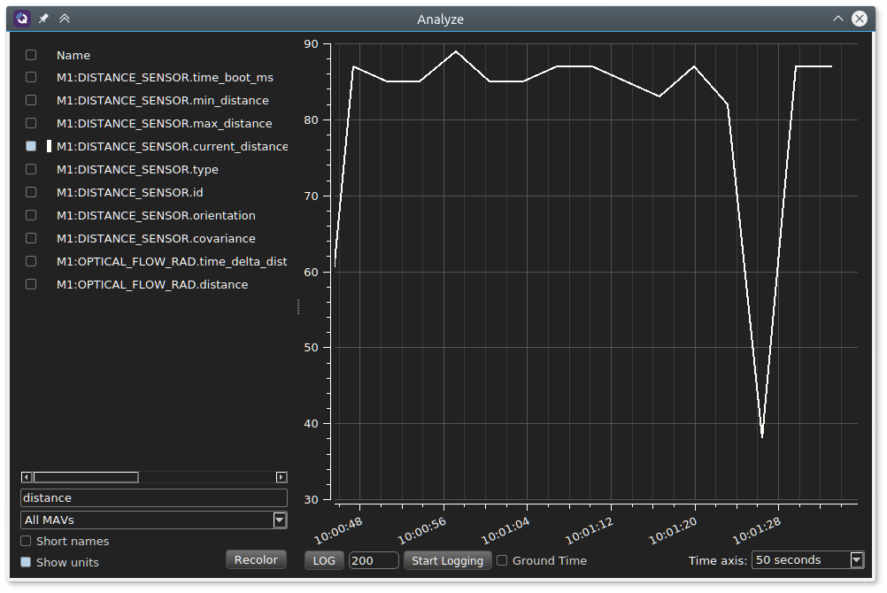

# 거리 센서 (거리 측정기)

거리 센서는 [지형 추적](../flying/terrain_following_holding.md#terrain_following), [지형 유지](../flying/terrain_following_holding.md#terrain_hold) (예 : 사진 촬영을 위한 정밀 호버링), 향상된 착륙 동작([거리 지원](../flying/terrain_following_holding.md#range_aid)), 규제 높이 제한 경고, 충돌 방지 등에서 사용할 수있는 거리측정 기능을 제공합니다.

이 섹션에는 PX4에서 지원하는 거리 센서(더 자세한 문서에 링크됨), 모든 거리 측정기에 필요한 [일반 설정](#configuration), [테스트](#testing)와 [시뮬레이션](#simulation)을 설명합니다. 보다 자세한 설정과 정보는 아래 링크(및 사이드 바)를 참고하십시오.



## 지원되는 거리 측정기

### Lidar-Lite

[Lidar-Lite](../sensor/lidar_lite.md)는 소형의 고성능 광학 원거리 거리계입니다. 센서 범위는 (5cm-40m)이며 PWM 또는 I2C 포트에 연결 가능합니다.

### MaxBotix I2CXL-MaxSonar-EZ

MaxBotix [I2CXL-MaxSonar-EZ](https://www.maxbotix.com/product-category/i2cxl-maxsonar-ez-products) 범위에는 보조 이착륙 및 충돌 방지에 적합한 단거리 수중 음파 탐지기 기반의 거리계가 많습니다. I2C 포트로 연결 가능합니다.

거리계는 [SENS_EN_MB12XX](../advanced_config/parameter_reference.md#SENS_EN_MB12XX) 매개변수로 활성화됩니다.

### Lightware LIDARs

[Lightware SFxx Lidar](../sensor/sfxx_lidar.md)는 드론 애플리케이션에 적합한 경량 "레이저 고도계"를 제공합니다.

PX4는 SF11/c와 SF/LW20을 지원합니다. PX4는 SF02, SF10/a, SF10/b, SF10/c 단종 모델에도 사용 가능합니다.

### TeraRanger 거리계

[TeraRanger](../sensor/teraranger.md)는 적외선 ToF (Time-of-Flight) 기반의 다양한 경량 거리측정 센서를 제공합니다. 일반적으로, 소나보다 더 빠르고 범위가 넓으며 레이저 기반 시스템보다 작고 가볍습니다.

PX4는 I2C 버스 타입의 다음 모델들을 지원합니다 : TeraRanger One, TeraRanger Evo 60m 및 TeraRanger Evo 600Hz.

### Ainstein US-D1 Standard Radar Altimeter

*Ainstein* [US-D1 표준 레이더 고도계](../sensor/ulanding_radar.md)는 UAV에 최적화된 소형 마이크로파 거리계입니다. 감지 범위는 약 50m입니다. 이 제품의 특별한 장점은 모든 기상 조건과 모든 지형 유형(물 포함)에서 잘 작동하는 것입니다.

### LeddarOne

 LeddarOne </ 0>은 좁지만 확산 빔이있는 소형 Lidar 모듈로, 견고하고 신뢰할 수 있으며, 비용 효율적인 패키지로 우수한 감지 범위를 제공합니다. 감지 범위는 1cm ~ 40m이며 UART/직렬 버스로 연결합니다.</p> 

### TFmini

[Benewake TFmini Lidar](../sensor/tfmini.md)는 12m 범위의 작고 저렴한 저전력 LIDAR입니다.

### PSK-CM8JL65-CC5

[Lanbao PSK-CM8JL65-CC5 ToF 적외선 거리측정 센서](../sensor/cm8jl65_ir_distance_sensor.md)는 0.17m-8m 범위와 밀리미터 분해능을 가진 매우 작은 (38mm x 18mm x 7mm, <10g) IR 거리 센서입니다. UART/직렬 버스에 연결하여야합니다. <10g) IR distance sensor with a 0.17m-8m range and millimeter resolution. It must be connected to a UART/serial bus.

### Avionics Anonymous UAVCAN Laser Altimeter Interface

[Avionics Anonymous UAVCAN Laser Altimeter Interface](../uavcan/avanon_laser_interface.md)는 여러 개의 일반거리계(예 : [Lightware SF11/c, SF30/D](../sensor/sfxx_lidar.md) 등)들을 I2C보다 더 강력한 인터페이스인 [UAVCAN](../uavcan/README.md) 버스에 연결할 수 있습니다.

<span id="configuration"></span>

## 설정

거리계는 일반적으로 직렬 (PWM) 또는 I2C 포트 (장치 드라이버에 따라 다름)에 연결되며, 특정 매개변수로 포트에서 활성화됩니다.

*각 거리 센서에 특정한* 하드웨어와 소프트웨어 설정은 개별 주제에서 설명합니다.

물리적 설정과 사용법에 관한 *모든 거리 센서에 공통적인* 설정 방법은 다음과 같습니다.

### 일반 설정

일반적인 거리계 설정은 [EKF2*RNG**](../advanced_config/parameter_reference.md#EKF2_RNG_AID) 매개변수를 사용합니다. 여기에는 아래의 내용들이 포함됩니다.

- [EKF2_RNG_POS_X](../advanced_config/parameter_reference.md#EKF2_RNG_POS_X), [EKF2_RNG_POS_Y](../advanced_config/parameter_reference.md#EKF2_RNG_POS_Y), [EKF2_RNG_POS_Z](../advanced_config/parameter_reference.md#EKF2_RNG_POS_Z) - 기체 무게 중심에서 X, Y, Z 방향의 오프셋
- [EKF2_RNG_PITCH](../advanced_config/parameter_reference.md#EKF2_RNG_PITCH) - 0도 (기본값) 값은 기체 수직 축 (즉, 아래로 똑바로 아래)에 정확히 정렬된 거리 측정기에 해당하고, 90도는 거리 측정기가 앞을 향하고 있음을 나타냅니다. 0이 아닌 피치가 사용되는 경우 간단한 삼각법을 사용하여 지면까지의 거리를 계산합니다.
- [EKF2_RNG_DELAY](../advanced_config/parameter_reference.md#EKF2_RNG_DELAY) - 센서에서 추정기에 도달하는 데이터의 대략적인 지연.
- [EKF2_RNG_SFE](../advanced_config/parameter_reference.md#EKF2_RNG_SFE) - 범위 파인더 범위 종속 노이즈 스케일러.
- [EKF2_RNG_NOISE](../advanced_config/parameter_reference.md#EKF2_RNG_NOISE) - 거리 측정기 융합을 위한 측정 노이즈

## 시험

거리계를 테스트하는 가장 간편한 방법은 범위를 변경하고 PX4에서 감지된 값과 비교하는 것입니다. 아래 섹션에서는 측정 범위를 재는 몇 가지 방법을 설명합니다.

### QGroundControl 분석 툴

*QGroundControl 분석 도구*와 *QGroundControl MAVLink Inspector*를 사용하여거리계의 `DISTANCE_SENSOR` 정보를 포함하여 기체에서 보낸 메시지를 조회할 수 있습니다. 도구 간의 주요 차이점은 *분석* 도구에서 그래프를 지원하는 점입니다.

:::note
전송되는 메시지는 차량 설정에 따라 달라집니다. 연결된 기체에 거리계가 설치되어 있고, 센서 값을 게시하는 경우에만 `DISTANCE_SENSOR` 메시지가 표시됩니다.
:::

거리계 출력을 보려면 :

1. **위젯 &gt; 분석** 메뉴를 오픈합니다.
    
    

2. `DISTANCE_SENSOR.current_value` 메시지를 선택합니다. 그러면, 도구가 결과를 플로팅합니다. 

### QGroundControl MAVLink Console

*QGroundControl MAVLink Console*을 사용하여 `distance_sensor` uORB 토픽을 관찰할 수 있습니다.

```sh
listener distance_sensor 5
```

:::note
*QGroundControl MAVLink Console*은 Pixhawk 또는 다른 NuttX 타겟에 연결시 작동하지만 ,시뮬레이터에는 연결되지 않습니다. 시뮬레이터에서는 터미널에서 직접 명령을 실행할 수 있습니다.
:::

자세한 내용은 [개발 &gt; 디버깅/로깅 &gt; 리스너 명령을 사용한 센서/토픽 디버깅](../debug/sensor_uorb_topic_debugging.md)을 참고하십시오.

## 시뮬레이션

Lidar 및 소나 거리계는 [Gazebo Simulator](../simulation/gazebo.md)에서 사용할 수 있습니다. 이렇게 하려면, 거리계가 포함된 기체 모델을 사용하여 시뮬레이터를 시작하여 합니다.

광류 모델에는 Lidar 거리계가 포함됩니다.

```sh
make px4_sitl gazebo_iris_opt_flow
```

typhoon_h480에는 소나 거리계가 포함되어 있습니다.

```sh
make px4_sitl gazebo_typhoon_h480
```

다른 기체를 사용하는 경우에는 설정 파일에 모델을 포함할 수 있습니다. 각각의 Iris 및 Typhoon 설정 파일에서 방법을 확인할 수 있습니다.

- [iris_opt_flow.sdf](https://github.com/PX4/sitl_gazebo/blob/master/models/iris_opt_flow/iris_opt_flow.sdf) 
        xml
        <include>
          <uri>model://lidar</uri>
          <pose>-0.12 0 0 0 3.1415 0</pose>
        </include>
        <joint name="lidar_joint" type="revolute">
          <child>lidar::link</child>
          <parent>iris::base_link</parent>
          <axis>
            <xyz>0 0 1</xyz>
            <limit>
              <upper>0</upper>
              <lower>0</lower>
            </limit>
          </axis>
        </joint>

- [typhoon_h480.sdf](https://github.com/PX4/sitl_gazebo/blob/master/models/typhoon_h480/typhoon_h480.sdf#L1144) 
        xml
        <include>
          <uri>model://sonar</uri>
        </include>
        <joint name="sonar_joint" type="revolute">
          <child>sonar_model::link</child>
          <parent>typhoon_h480::base_link</parent>
          <axis>
            <xyz>0 0 1</xyz>
            <limit>
              <upper>0</upper>
              <lower>0</lower>
            </limit>
          </axis>
        </joint>