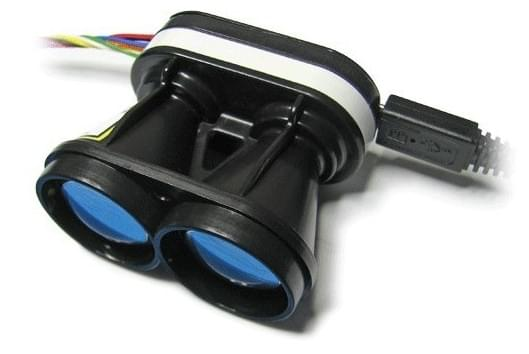

# 거리 센서 (거리 측정기)

거리 센서는 [지형 추적](../flying/terrain_following_holding.md#terrain_following), [지형 유지](../flying/terrain_following_holding.md#terrain_hold) (예 : 사진 촬영을 위한 정밀 호버링), 향상된 착륙 동작([거리 지원](../flying/terrain_following_holding.md#range_aid)), 규제 높이 제한 경고, 충돌 방지 등에서 사용할 수있는 거리측정 기능을 제공합니다.

이 섹션에는 PX4에서 지원하는 거리 센서(더 자세한 문서에 링크됨), 모든 거리 측정기에 필요한 [일반 설정](#configuration), [테스트](#testing)와 [시뮬레이션](#simulation)을 설명합니다. 보다 자세한 설정과 정보는 아래 링크(및 사이드 바)를 참고하십시오.



## 지원되는 거리 측정기

### Lidar-Lite

[Lidar-Lite](../sensor/lidar_lite.md)는 소형의 고성능 광학 원거리 거리계입니다. 센서 범위는 (5cm-40m)이며 PWM 또는 I2C 포트에 연결 가능합니다.

### MaxBotix I2CXL-MaxSonar-EZ

MaxBotix [I2CXL-MaxSonar-EZ](https://www.maxbotix.com/product-category/i2cxl-maxsonar-ez-products) 범위에는 보조 이착륙 및 충돌 방지에 적합한 단거리 수중 음파 탐지기 기반의 거리계가 많습니다. I2C 포트로 연결 가능합니다.

거리계는 [SENS_EN_MB12XX](../advanced_config/parameter_reference.md#SENS_EN_MB12XX) 매개변수로 활성화됩니다.

### Lightware LIDARs

[Lightware SFxx Lidar](../sensor/sfxx_lidar.md)는 드론 애플리케이션에 적합한 경량 "레이저 고도계"를 제공합니다.

PX4는 SF11/c와 SF/LW20을 지원합니다. PX4는 SF02, SF10/a, SF10/b, SF10/c 단종 모델에도 사용 가능합니다.

### TeraRanger 거리계

[TeraRanger](../sensor/teraranger.md)는 적외선 ToF (Time-of-Flight) 기반의 다양한 경량 거리측정 센서를 제공합니다. 일반적으로, 소나보다 더 빠르고 범위가 넓으며 레이저 기반 시스템보다 작고 가볍습니다.

PX4는 I2C 버스 타입의 다음 모델들을 지원합니다 : TeraRanger One, TeraRanger Evo 60m 및 TeraRanger Evo 600Hz.

### Ainstein US-D1 Standard Radar Altimeter

*Ainstein* [US-D1 표준 레이더 고도계](../sensor/ulanding_radar.md)는 UAV에 최적화된 소형 마이크로파 거리계입니다. 감지 범위는 약 50m입니다. 이 제품의 특별한 장점은 모든 기상 조건과 모든 지형 유형(물 포함)에서 잘 작동하는 것입니다.

### LeddarOne

 LeddarOne </ 0>은 좁지만 확산 빔이있는 소형 Lidar 모듈로, 견고하고 신뢰할 수 있으며, 비용 효율적인 패키지로 우수한 감지 범위를 제공합니다. 감지 범위는 1cm ~ 40m이며 UART/직렬 버스로 연결합니다.</p> 

### TFmini

[Benewake TFmini Lidar](../sensor/tfmini.md)는 12m 범위의 작고 저렴한 저전력 LIDAR입니다.

### PSK-CM8JL65-CC5

[Lanbao PSK-CM8JL65-CC5 ToF 적외선 거리측정 센서](../sensor/cm8jl65_ir_distance_sensor.md)는 0.17m-8m 범위와 밀리미터 분해능을 가진 매우 작은 (38mm x 18mm x 7mm, <10g) IR 거리 센서입니다. UART/직렬 버스에 연결하여야합니다. <10g) IR distance sensor with a 0.17m-8m range and millimeter resolution. It must be connected to a UART/serial bus.

### Avionics Anonymous UAVCAN Laser Altimeter Interface

[Avionics Anonymous UAVCAN Laser Altimeter Interface](../uavcan/avanon_laser_interface.md)는 여러 개의 일반거리계(예 : [Lightware SF11/c, SF30/D](../sensor/sfxx_lidar.md) 등)들을 I2C보다 더 강력한 인터페이스인 [UAVCAN](../uavcan/README.md) 버스에 연결할 수 있습니다.

<span id="configuration"></span>

## 설정

거리계는 일반적으로 직렬 (PWM) 또는 I2C 포트 (장치 드라이버에 따라 다름)에 연결되며, 특정 매개변수로 포트에서 활성화됩니다.

The hardware and software setup that is *specific to each distance sensor* is covered in their individual topics.

The generic configuration that is *common to all distance sensors*, covering both the physical setup and usage, is given below.

### Generic Configuration

The common rangefinder configuration is specified using [EKF2*RNG**](../advanced_config/parameter_reference.md#EKF2_RNG_AID) parameters. These include (non exhaustively):

- [EKF2_RNG_POS_X](../advanced_config/parameter_reference.md#EKF2_RNG_POS_X), [EKF2_RNG_POS_Y](../advanced_config/parameter_reference.md#EKF2_RNG_POS_Y), [EKF2_RNG_POS_Z](../advanced_config/parameter_reference.md#EKF2_RNG_POS_Z) - offset of the rangefinder from the vehicle centre of gravity in X, Y, Z directions.
- [EKF2_RNG_PITCH](../advanced_config/parameter_reference.md#EKF2_RNG_PITCH) - A value of 0 degrees (default) corresponds to the range finder being exactly aligned with the vehicle vertical axis (i.e. straight down), while 90 degrees indicates that the range finder is pointing forward. Simple trigonometry is used to calculate the distance to ground if a non-zero pitch is used.
- [EKF2_RNG_DELAY](../advanced_config/parameter_reference.md#EKF2_RNG_DELAY) - approximate delay of data reaching the estimator from the sensor.
- [EKF2_RNG_SFE](../advanced_config/parameter_reference.md#EKF2_RNG_SFE) - Range finder range dependant noise scaler.
- [EKF2_RNG_NOISE](../advanced_config/parameter_reference.md#EKF2_RNG_NOISE) - Measurement noise for range finder fusion

## Testing

The easiest way to test the rangefinder is to vary the range and compare to the values detected by PX4. The sections below show some approaches to getting the measured range.

### QGroundControl Analyze Tool

The *QGroundControl Analyze Tool* tool and *QGroundControl MAVLink Inspector* let you view messages sent from the vehicle, including `DISTANCE_SENSOR` information from the rangefinder. The main difference between the tools is that the *Analyze* tool can plot values in a graph.

:::note
The messages that are sent depend on the vehicle configuration. You will only get `DISTANCE_SENSOR` messages if the connected vehicle has a rangefinder installed and is publishing sensor values.
:::

To view the rangefinder output:

1. Open the menu **Widgets > Analyze**:
    
    

2. Select the message `DISTANCE_SENSOR.current_value`. The tool will then plot the result: 

### QGroundControl MAVLink Console

You can also use the *QGroundControl MAVLink Console* to observe the `distance_sensor` uORB topic:

```sh
listener distance_sensor 5
```

:::note
The *QGroundControl MAVLink Console* works when connected to Pixhawk or other NuttX targets, but not the Simulator. On the Simulator you can run the commands directly in the terminal.
:::

For more information see: [Development > Debugging/Logging > Sensor/Topic Debugging using the Listener Command](../debug/sensor_uorb_topic_debugging.md).

## Simulation

Lidar and sonar rangefinders can be used in the [Gazebo Simulator](../simulation/gazebo.md). To do this you must start the simulator using a vehicle model that includes the rangefinder.

The iris optical flow model includes a Lidar rangefinder:

```sh
make px4_sitl gazebo_iris_opt_flow
```

The typhoon_h480 includes a sonar rangefinder:

```sh
make px4_sitl gazebo_typhoon_h480
```

If you need to use a different vehicle you can include the model in its configuration file. You can see how in the respective Iris and Typhoon configuration files:

- [iris_opt_flow.sdf](https://github.com/PX4/sitl_gazebo/blob/master/models/iris_opt_flow/iris_opt_flow.sdf) 
        xml
        <include>
          <uri>model://lidar</uri>
          <pose>-0.12 0 0 0 3.1415 0</pose>
        </include>
        <joint name="lidar_joint" type="revolute">
          <child>lidar::link</child>
          <parent>iris::base_link</parent>
          <axis>
            <xyz>0 0 1</xyz>
            <limit>
              <upper>0</upper>
              <lower>0</lower>
            </limit>
          </axis>
        </joint>

- [typhoon_h480.sdf](https://github.com/PX4/sitl_gazebo/blob/master/models/typhoon_h480/typhoon_h480.sdf#L1144) 
        xml
        <include>
          <uri>model://sonar</uri>
        </include>
        <joint name="sonar_joint" type="revolute">
          <child>sonar_model::link</child>
          <parent>typhoon_h480::base_link</parent>
          <axis>
            <xyz>0 0 1</xyz>
            <limit>
              <upper>0</upper>
              <lower>0</lower>
            </limit>
          </axis>
        </joint>