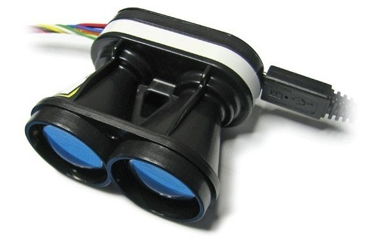
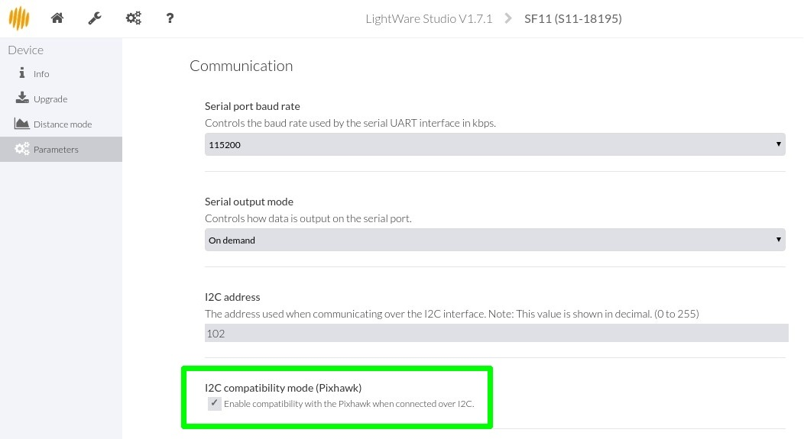

# LightWare SF1X/SF02/LW20 라이다

LightWare는 UAV에 장착에 적합한 경량의 범용 레이저 고도계( "라이다")를 개발합니다. 지형 추적, 정밀 호버링 (예 : 사진 촬영), 규제 높이 제한 경고, 충돌 방지 감지 등에 사용됩니다.

## 지원 모델

아래의 모델들은 PX4에서 지원되며, I2C 또는 직렬 버스에 연결할 수 있습니다 (아래 표는 각 모델에 사용할 수 있는 버스를 나타냄).

### 이용 가능

| 모델                                                                                     | 범위 (m) | 버스           | 설명                                  |
| -------------------------------------------------------------------------------------- | ------ | ------------ | ----------------------------------- |
| [SF11/C](https://lightware.co.za/collections/lidar-rangefinders/products/sf11-c-120-m) | 120    | 직렬 또는 I2C 버스 |                                     |
| [LW20/C](https://lightware.co.za/products/lw20-c-100-m)                                | 100    | I2C 버스       | 감지 및 회피 애플리케이션을 위한 서보가 있는 방수 (IP67) |

### 단종됨

다음 모델은 제조업체에서 더 이상 판매하지 않습니다.

| 모델                                                                                                 | 범위   | 버스                                          |
| -------------------------------------------------------------------------------------------------- | ---- | ------------------------------------------- |
| [SF02](http://documents.lightware.co.za/SF02%20-%20Laser%20Rangefinder%20Manual%20-%20Rev%208.pdf) | 50   | 직렬                                          |
| [SF10/A](http://documents.lightware.co.za/SF10%20-%20Laser%20Altimeter%20Manual%20-%20Rev%206.pdf) | 25   | 직렬 또는 I2C 버스                                |
| [SF10/B](http://documents.lightware.co.za/SF10%20-%20Laser%20Altimeter%20Manual%20-%20Rev%206.pdf) | 50   | 직렬 또는 I2C 버스                                |
| SF10/C                                                                                             | 100m | 직렬 또는 I2C 버스                                |
| LW20/B                                                                                             | 50   | I2C 버스 |감지 및 회피 애플리케이션을 위한 서보가 있는 방수 (IP67) |

## I2C 설정

I2C 포트에 연결 가능한 모델을 위의 표를 참고하십시오.

### 라이다 설정

이 하드웨어는 기본적으로 활성화된 Pixhawk I2C 호환성과 함께 제공되지 않습니다. 지원을 활성화하려면 [LightWare Studio](https://lightwarelidar.com/pages/lightware-studio)를 다운로드하고 **매개 변수 &gt; 통신**으로 이동하여 **I2C 호환 모드(Pixhawk)**를 선택하여야합니다.

### 하드웨어

아래 그림과 같이 자동조종장치 I2C 포트에 라이다를 연결합니다 (이 경우 [Pixhawk 1](../flight_controller/mro_pixhawk.md)의 경우).

:::note
일부 이전 버전은 PX4에서 사용할 수 없습니다. 특히 `0x55`와 같은 I2C 주소를 갖도록 잘못 설정되어 `rgbled` 모듈과 충돌할 수 있습니다. 리눅스 시스템에서는 [i2cdetect](http://manpages.ubuntu.com/manpages/bionic/en/man8/i2cdetect.8.html)를 사용하여 주소를 확인할 수 있습니다. I2C 주소가 `0x66`과 동일하면, 센서를 PX4와 함께 사용할 수 있습니다.
:::

### 매개변수 설정

거리계 모델과 일치하도록 [SENS_EN_SF1XX](../advanced_config/parameter_reference.md#SENS_EN_SF1XX) 매개변수를 설정후 재부팅 하십시오.

## 직렬 설정

### 하드웨어

LIDAR는 사용하지 않는 *직렬 포트* (UART) (예 : TELEM2, TELEM3, GPS2 등)에 연결할 수 있습니다.

<!-- Would be good to show serial setup! -->

### 매개변수 설정

[SENS_SF0X_CFG](../advanced_config/parameter_reference.md#SENS_SF0X_CFG)를 사용하여 LIDAR가 실행될 [직렬 포트를 설정](../peripherals/serial_configuration.md)합니다. 포트 전송속도는 드라이버에 의해 설정되므로, 추가로 설정할 필요는 없습니다.

:::note
*QGroundControl*에서 설정 매개변수를 사용할 수 없는 경우에는 [펌웨어에 드라이버를 추가](../peripherals/serial_configuration.md#parameter_not_in_firmware)하여야 합니다.
:::

그런 다음 [SENS_EN_SF0X](../advanced_config/parameter_reference.md#SENS_EN_SF0X) 매개변수를 거리계 모델과 일치하도록 설정하고 재부팅하십시오.

## 추가 정보

- [모듈 참고: 거리 센서 (드라이버) : sf1xx](../modules/modules_driver_distance_sensor.md#sf1xx)