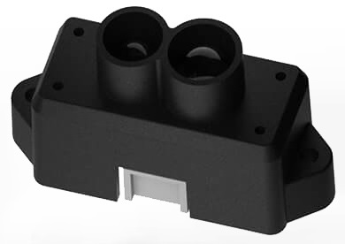

# Benewake TFmini 라이다

[Benewake TFmini Lidar](http://en.benewake.com/product/detail/5c345e26e5b3a844c472329c.html)는 12m 범위의 작고 저렴한 저전력의 라이다입니다. UART/직렬 버스에 연결됩니다.

## 하드웨어 설정

TFMini는 *직렬 포트* UART (예 : TELEM2, TELEM3, GPS2 등)에 연결됩니다.

## 매개변수 설정

[SENS_TFMINI_CFG](../advanced_config/parameter_reference.md#SENS_TFMINI_CFG)를 사용하여 LIDAR가 실행되는 [직렬 포트를 설정](../peripherals/serial_configuration.md)합니다. 전송 속도를 설정할 필요가 없습니다 (단 하나의 속도만 지원되므로 센서 드라이버에 하드 코딩됨).

:::note
*QGroundControl*에서 설정 매개변수를 사용할 수 없는 경우에는 [펌웨어에 드라이버를 추가](../peripherals/serial_configuration.md#parameter_not_in_firmware)하여야 합니다:

    drivers/distance_sensor/tfmini
    

:::