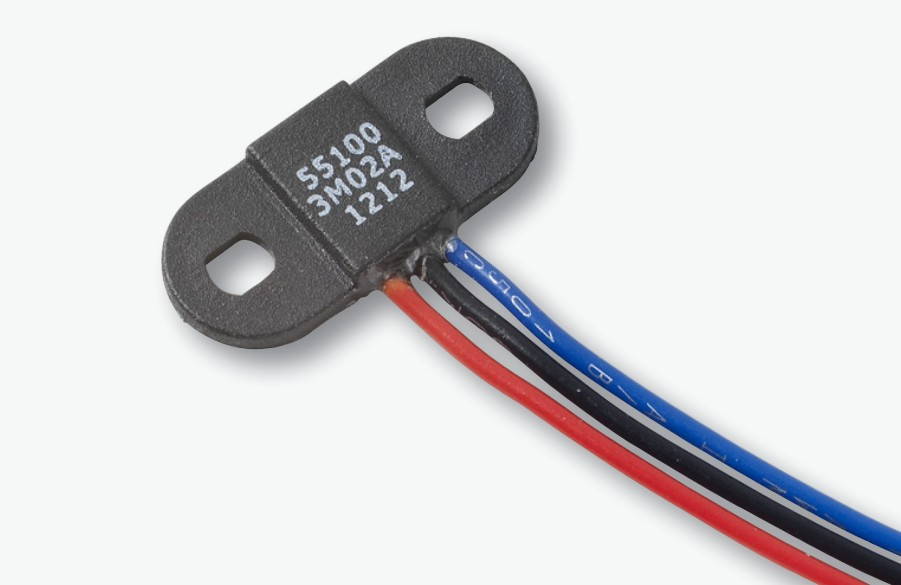
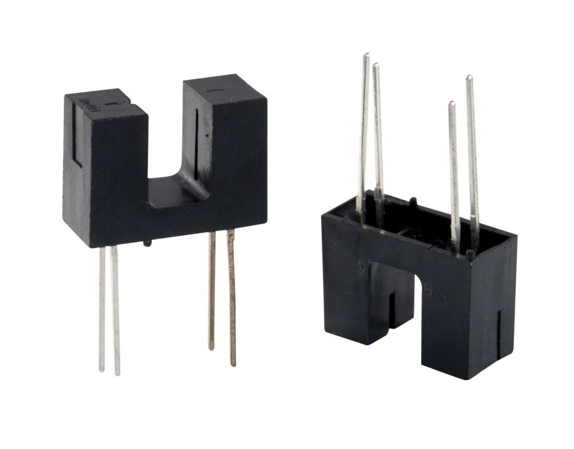

# ThunderFly TFRPM01 Revolution Counter

[TFRPM01](https://github.com/ThunderFly-aerospace/TFRPM01) 회전 속도계는 회전 카운터를 요구하는 작고 낮은 시스템입니다.

보드 자체에는 실제 센서가 포함되어 있지 않지만, 회전 계수를 위하여 다양한 센서/프로브 유형과 함께 사용할 수 있습니다. PX4 연결 I²C 커넥터가 있으며, 3핀 커넥터를 통하여 실제 센서에 연결됩니다. 기본 진단 정보를 제공하는 LED도 있습니다.


:::note TFRPM01 센서는 [ThunderFly s.r.o.](https://www.thunderfly.cz/)에서 판매중인 오픈 소스 하드웨어입니다 (제조 데이터는 [GitHub에서 사용 가능](https://github.com/ThunderFly-aerospace/TFRPM01)).
:::

## 하드웨어 설정

이 보드에는 PX4 연결 (투 스루 패스) I²C 커넥터가 장착되어 있으며, 다양한 센서에 연결용 3핀 커넥터가 있습니다.
- TFRPM01은 모든 I²C 포트에 연결 가능합니다.
- TFRPM01에는 다양한 프로브 유형에 연결 3핀 헤더 커넥터 (풀업 장착 입력 포함)가 있습니다.
  - 센서/프로브 하드웨어에는 펄스 신호가 필요합니다. 신호 입력은 +5V TTL 로직 또는 [오픈 콜렉터](https://en.wikipedia.org/wiki/Open_collector) 출력을 받습니다. 최대 펄스 주파수는 50% 듀티 사이클에서 20kHz입니다.
  - 프로브 커넥터는 I²C 버스에서 +5V 전원을 제공하며, 최대 전력은 RC 필터에 의해 제한됩니다 (자세한 내용은 회로도 참조).

TFRPM01A 전자 장치에는 프로브가 연결 여부를 표시하는 LED가 있습니다. 펄스 입력이 접지되거나 논리 0에 노출되면 LED가 켜지므로 로터를 수동으로 회전하는 것만으로 프로브가 올바르게 작동하는 지 확인할 수 있습니다.

### 홀 효과 센서 프로브

홀 효과 센서 (자기 적으로 작동)는 먼지, 먼지 및 물이 감지된 로터에 접촉할 수있는 열악한 환경에 이상적입니다.

다양한 홀 효과 센서가 시판중입니다. 예를 들어, [5100 미니어처 플랜지 장착 근접 센서](https://m.littelfuse.com/~/media/electronics/datasheets/hall_effect_sensors/littelfuse_hall_effect_sensors_55100_datasheet.pdf.pdf)는 좋은 선택입니다.




### 광학 센서 프로브

광학 센서도 사용할 수 있습니다 (측정 요구 사항에 따라 더 적합할 수 있음). 투과형 및 반사형 센서는 모두 펄스 생성에 사용될 수 있습니다.



## 소프트웨어 설정

### 드라이버 시작

드라이버는 자동으로 시작되지 않습니다 (어떤 기체에서도). [QGroundControl MAVLink 콘솔](https://docs.qgroundcontrol.com/master/en/analyze_view/mavlink_console.html)을 사용하거나 SD 카드의 [시작 스크립트](../concept/system_startup.md#customizing-the-system-startup)에 드라이버를 추가하여 수동으로 시작하여야 합니다.

#### 콘솔에서 드라이버 시작

다음 명령을 사용하여 [콘솔](https://docs.qgroundcontrol.com/master/en/analyze_view/mavlink_console.html)에서 드라이버를 시작합니다.
```
pcf8583 start -X -b <bus number>
```
여기서:
- `-X`는 외부 버스를 나타냅니다.
- `<bus number>`은 연결된 장치의 버스 번호입니다.

:::note
코드 `-b <bus number>`의 버스 번호는 자동조종장치의 버스 레이블과 일치하지 않을 수 있습니다. 예를 들어 CUAV V5 + 또는 CUAV Nano를 사용하는 경우:

| 자동조종장치 레이블 | -b 번호   |
| ---------- | ------- |
| I2C1       | -X -b 4 |
| I2C2       | -X -b 2 |
| I2C3       | -X -b 1 |

`pcf8583 start` 명령은 각 버스 번호에 해당하는 자동조종장치 버스 이름/레이블을 출력합니다.
:::

### 시험하기

여러 가지 방법을 사용하여 카운터가 작동 여부를 확인할 수 있습니다.

#### PX4 (NuttX) MAVLink 콘솔

The [QGroundControl MAVLink Console](https://docs.qgroundcontrol.com/master/en/analyze_view/mavlink_console.html) can also be used to check that the driver is running and the UORB topics it is outputting.

TFRPM01 드라이버의 상태를 확인하려면 다음 명령을 실행하십시오.
```
pcf8583 status
```
드라이버가 실행중인 경우 I²C 포트가 실행중인 인스턴스의 다른 기본 매개변수와 함께 인쇄됩니다. 드라이버가 실행 중이 아니면, 위에서 설명한 절차를 사용하여 시작할 수 있습니다.

[listener](../modules/modules_command.md#listener) 명령을 사용하면 실행중인 드라이버에서 RPM UORB 메시지를 모니터링할 수 있습니다.
```
listener rpm
```
주기적으로 표시하려면 명령 뒤에 `-n 50` 매개변수를 추가하여 다음 50 개의 메시지를 인쇄 가능합니다.

#### QGroundControl MAVLink 검사기

QGroundControl [Mavlink 검사기](https://docs.qgroundcontrol.com/master/en/analyze_view/mavlink_inspector.html)를 사용하여 드라이버가 전송한 [RAW_RPM](https://mavlink.io/en/messages/common.html#RAW_RPM)을 포함하여 PX4의 MAVLink 메시지를 관찰할 수 있습니다.

1. QGC 메뉴에서 인스펙터를 시작합니다 : **분석 도구 > Mavlink 검사기**
1. `RAW_RPM`이 메시지 목록에 있는 지 확인하십시오 (없으면 드라이버가 실행 중인 지 확인하십시오).


### 매개변수 설정

일반적으로 센서는 설정 없이도 사용할 수 있지만, RPM 값은 실제 RPM의 배수이어야 합니다.  이는 `PCF8583_MAGNET` 매개변수가 감지된 로터의 단일 회전당 실제 펄스 수와 일치하여야하기 때문입니다. 필요시 다음의 매개 변수들을 조정하여야 합니다.

* [PCF8583_POOL](../advanced_config/parameter_reference.md#PCF8583_POOL) — 카운트 숫자 판독 사이의 풀링 간격
* [PCF8583_RESET](../advanced_config/parameter_reference.md#PCF8583_RESET) — 계수된 숫자를 0으로 재설정해야하는 카운터 값입니다.
* [PCF8583_MAGNET](../advanced_config/parameter_reference.md#PCF8583_MAGNET) — 회전당 펄스 수 (예 : 로터 디스크의 자석 수).

:::note
위의 매개변수는 드라이버/PX4를 재부팅하면, QGC에 나타납니다.

재시작 후 설정 매개변수를 사용할 수 없는 경우에는 드라이버가 시작되었는 지 확인하십시오. [드라이버가 펌웨어에 없을 수 있습니다](../peripherals/serial_configuration.md#configuration-parameter-missing-from-qgroundcontrol).이 경우 보드에 추가하여야 합니다.
```
drivers/rpm/pcf8583
```
:::
