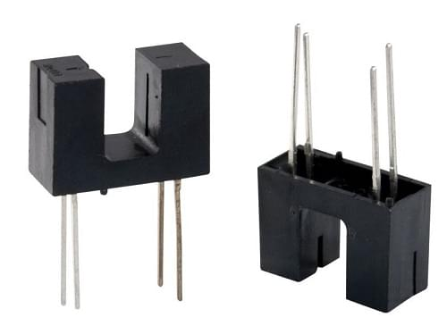

# ThunderFly TFRPM01 Revolution Counter

[TFRPM01](https://github.com/ThunderFly-aerospace/TFRPM01) 회전 속도계는 회전 카운터를 요구하는 작고 낮은 시스템입니다.

보드 자체에는 실제 센서가 포함되어 있지 않지만, 회전 계수를 위하여 다양한 센서/프로브 유형과 함께 사용할 수 있습니다. PX4 연결 I²C 커넥터가 있으며, 3핀 커넥터를 통하여 실제 센서에 연결됩니다. 기본 진단 정보를 제공하는 LED도 있습니다.


:::note TFRPM01 센서는 [ThunderFly s.r.o.](https://www.thunderfly.cz/)에서 판매중인 오픈 소스 하드웨어입니다 (제조 데이터는 [GitHub에서 사용 가능](https://github.com/ThunderFly-aerospace/TFRPM01)).
:::

## 하드웨어 설정

이 보드에는 PX4 연결 (투 스루 패스) I²C 커넥터가 장착되어 있으며, 다양한 센서에 연결용 3핀 커넥터가 있습니다.
- TFRPM01은 모든 I²C 포트에 연결 가능합니다.
- TFRPM01에는 다양한 프로브 유형에 연결 3핀 헤더 커넥터 (풀업 장착 입력 포함)가 있습니다.
  - 센서/프로브 하드웨어에는 펄스 신호가 필요합니다. 신호 입력은 +5V TTL 로직 또는 [오픈 콜렉터](https://en.wikipedia.org/wiki/Open_collector) 출력을 받습니다. 최대 펄스 주파수는 50% 듀티 사이클에서 20kHz입니다.
  - 프로브 커넥터는 I²C 버스에서 +5V 전원을 제공하며, 최대 전력은 RC 필터에 의해 제한됩니다 (자세한 내용은 회로도 참조).

TFRPM01A 전자 장치에는 프로브가 연결 여부를 표시하는 LED가 있습니다. 펄스 입력이 접지되거나 논리 0에 노출되면 LED가 켜지므로 로터를 수동으로 회전하는 것만으로 프로브가 올바르게 작동하는 지 확인할 수 있습니다.

### 홀 효과 센서 프로브

홀 효과 센서 (자기 적으로 작동)는 먼지, 먼지 및 물이 감지된 로터에 접촉할 수있는 열악한 환경에 이상적입니다.

다양한 홀 효과 센서가 시판중입니다. 예를 들어, [5100 미니어처 플랜지 장착 근접 센서](https://m.littelfuse.com/~/media/electronics/datasheets/hall_effect_sensors/littelfuse_hall_effect_sensors_55100_datasheet.pdf.pdf)는 좋은 선택입니다.


### 광학 센서 프로브

광학 센서도 사용할 수 있습니다 (측정 요구 사항에 따라 더 적합할 수 있음). 투과형 및 반사형 센서는 모두 펄스 생성에 사용될 수 있습니다.



## 소프트웨어 설정

### 드라이버 시작

드라이버는 자동으로 시작되지 않습니다 (어떤 기체에서도). [QGroundControl MAVLink 콘솔](https://docs.qgroundcontrol.com/master/en/analyze_view/mavlink_console.html)을 사용하거나 SD 카드의 [시작 스크립트](../concept/system_startup.md#customizing-the-system-startup)에 드라이버를 추가하여 수동으로 시작하여야 합니다.

#### 콘솔에서 드라이버 시작

다음 명령을 사용하여 [콘솔](https://docs.qgroundcontrol.com/master/en/analyze_view/mavlink_console.html)에서 드라이버를 시작합니다.
```
pcf8583 start -X -b <bus number>
```
where:
- `-X` means that it is an external bus.
- `<bus number>` is the bus number to which the device is connected

:::note
The bus number in code `-b <bus number>` may not match the bus labels on the autopilot. For example, when using CUAV V5+ or CUAV Nano:

| Autopilot label | -b number |
| --------------- | --------- |
| I2C1            | -X -b 4   |
| I2C2            | -X -b 2   |
| I2C3            | -X -b 1   |

The `pcf8583 start` command outputs the corresponding autopilot bus name/label for each bus number.
:::

### Testing

You can verify the counter is working using several methods

#### PX4 (NuttX) MAVLink Console

The [QGroundControl MAVLink Console](https://docs.qgroundcontrol.com/master/en/analyze_view/mavlink_console.html) can also be used to check that the driver is running and the UORB topics it is outputing.

To check the status of the TFRPM01 driver run the command:
```
pcf8583 status
```
If the driver is running, the I²C port will be printed along with other basic parameters of the running instance. If the driver is not running it can be started started using theprocedure described above.

The [listener](../modules/modules_command.md#listener) command allows you to monitor RPM UORB messages from the running driver.
```
listener rpm
```
For periodic display, you can add `-n 50` parameter after the command, which prints the next 50 messages.

#### QGroundControl MAVLink Inspector

The QGroundControl [Mavlink Inspector](https://docs.qgroundcontrol.com/master/en/analyze_view/mavlink_inspector.html) can be used to observe MAVLink messages from PX4, including [RAW_RPM](https://mavlink.io/en/messages/common.html#RAW_RPM) emitted by the driver:

1. Start the inspector from the QGC menu: **Analyze tools > Mavlink Inspector**
1. Check that `RAW_RPM` is present in the list of messages (if it is missing, check that the driver is running).


### Parameter Setup

Usually, sensors can be used without configuration, but the RPM values should correspond to multiples of real RPM.  It is because the `PCF8583_MAGNET` parameter needs to correspond to the real number of pulses per single revolution of the sensed rotor. If needed, the following parameters should be tweaked:

* [PCF8583_POOL](../advanced_config/parameter_reference.md#PCF8583_POOL) — pooling interval between readout the counted number
* [PCF8583_ADDR](../advanced_config/parameter_reference.md#PCF8583_ADDR) — I2C sensor address
* [PCF8583_RESET](../advanced_config/parameter_reference.md#PCF8583_RESET) — Counter value where the counted number should be reset to zero.
* [PCF8583_MAGNET](../advanced_config/parameter_reference.md#PCF8583_MAGNET) — Number of pulses per revolution e.g. number of magnets at a rotor disc.

:::note
The parameters above appear in QGC after the driver/PX4 are restarted.

If the configuration parameters are not available after restart then you should check that the driver has started. It may be that the [driver is not present in the firmware](../peripherals/serial_configuration.md#configuration-parameter-missing-from-qgroundcontrol), in which case it must be added to the board configuration:
```
drivers/rpm/pcf8583
```
:::
