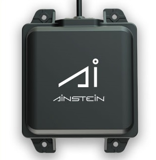

# Ainstein US-D1 Standard Radar Altimeter

:::tip
이것은 *Aerotenna uLanding Radar*(단종됨)를 대체하지만, 동일한 드라이버와 설정을 사용합니다.
:::

*Ainstein* [US-D1 표준 레이더 고도계](https://ainstein.ai/drone-makers-drone-service-providers/us-d1/)는 UAV에 최적화된 소형 마이크로파 거리계입니다. With a sensing range of about 50 metres, it is useful for applications including terrain following, precision hovering (e.g. for photography), anti-collision sensing etc. 이 제품의 특별한 장점은 모든 기상 조건과 모든 지형 유형(물 포함)에서 잘 작동한다는 점입니다. The user manual can be found [here](https://ainstein.ai/wp-content/uploads/2022/04/US-D1-Technical-User-Manual.pdf).



거리계는 대부분의 펌웨어에 자동으로 포함되지 않으므로, *QGroundControl*을 통하여 매개변수를 설정하는 것만으로는 사용할 수 없습니다 (다른 거리계에서 가능). 이를 사용하려면 펌웨어에 드라이버를 추가하고, 부팅시 드라이버를 시작하도록 설정 파일을 업데이트하여야합니다. 아래 섹션에서는 방법을 설명합니다.


## 하드웨어 설정

거리계는 NuttX 또는 Posix OS에서 직렬 포트를 제공하는 하드웨어에서 지원됩니다. 대부분의 [Pixhawk 시리즈](../flight_controller/pixhawk_series.md) 컨트롤러가 이에 해당됩니다.

LIDAR는 *직렬 포트* UART (예 : TELEM2, TELEM3, GPS2 등)에 연결됩니다.

## 매개변수 설정

[SENS_ULAND_CFG](../advanced_config/parameter_reference.md#SENS_ULAND_CFG)를 사용하여 LIDAR가 실행되는 [직렬 포트를 설정](../peripherals/serial_configuration.md)합니다. 포트 전송속도는 드라이버에 의해 설정되므로, 추가로 설정할 필요는 없습니다.

:::note
*QGroundControl*에서 설정 매개변수를 사용할 수 없는 경우에는 [펌웨어에 드라이버를 추가](../peripherals/serial_configuration.md#parameter_not_in_firmware)하여야 합니다:
```
CONFIG_DRIVERS_DISTANCE_SENSOR_ULANDING_RADAR=y
```
:::
