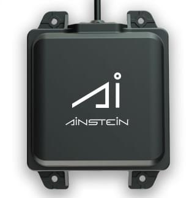

# Ainstein US-D1 Standard Radar Altimeter

:::tip
이것은 *Aerotenna uLanding Radar*(단종됨)를 대체하지만, 동일한 드라이버와 설정을 사용합니다.
:::

*Ainstein* [US-D1 표준 레이더 고도계](https://ainstein.ai/drone-makers-drone-service-providers/us-d1/)는 UAV에 최적화된 소형 마이크로파 거리계입니다. 감지 범위가 약 40 미터이므로 지형 추적, 정밀 호버링 (예 : 사진), 충돌 방지 감지 등의 응용 분야에 유용합니다. 이 제품의 특별한 장점은 모든 기상 조건과 모든 지형 유형(물 포함)에서 잘 작동한다는 점입니다.

거리계는 대부분의 펌웨어에 자동으로 포함되지 않으므로, *QGroundControl*을 통하여 매개변수를 설정하는 것만으로는 사용할 수 없습니다 (다른 거리계에서 가능). 이를 사용하려면 펌웨어에 드라이버를 추가하고, 부팅시 드라이버를 시작하도록 설정 파일을 업데이트하여야합니다. 아래 섹션에서는 방법을 설명합니다.

## 하드웨어 설정

The rangefinder is supported by any hardware which runs a NuttX or Posix OS and which can offer a serial port for the interface. Minimally this will include most, if not all, [Pixhawk Series](../flight_controller/pixhawk_series.md) controllers.

US-D1 can be connected to any unused *serial port* (UART), e.g.: TELEM2, TELEM3, GPS2 etc.

## Parameter Setup

[Configure the serial port](../peripherals/serial_configuration.md) on which the lidar will run using [SENS_ULAND_CFG](../advanced_config/parameter_reference.md#SENS_ULAND_CFG). There is no need to set the baud rate for the port, as this is configured by the driver.

:::note
If the configuration parameter is not available in *QGroundControl* then you may need to [add the driver to the firmware](../peripherals/serial_configuration.md#parameter_not_in_firmware):

    drivers/distance_sensor/ulanding
    

:::