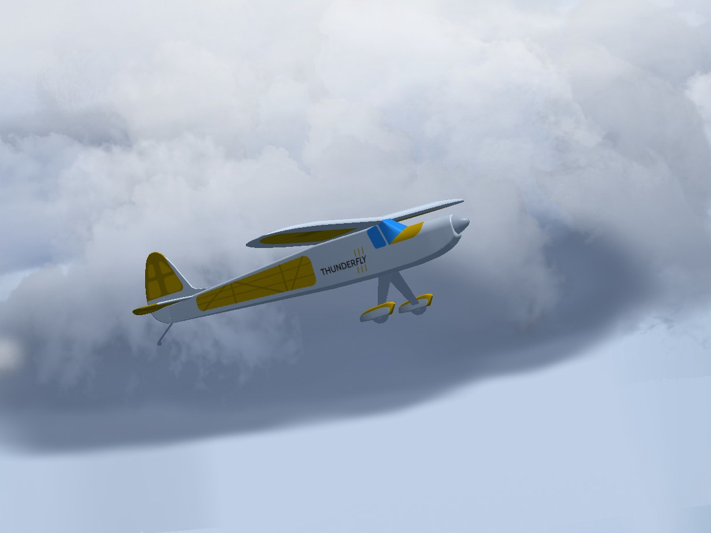
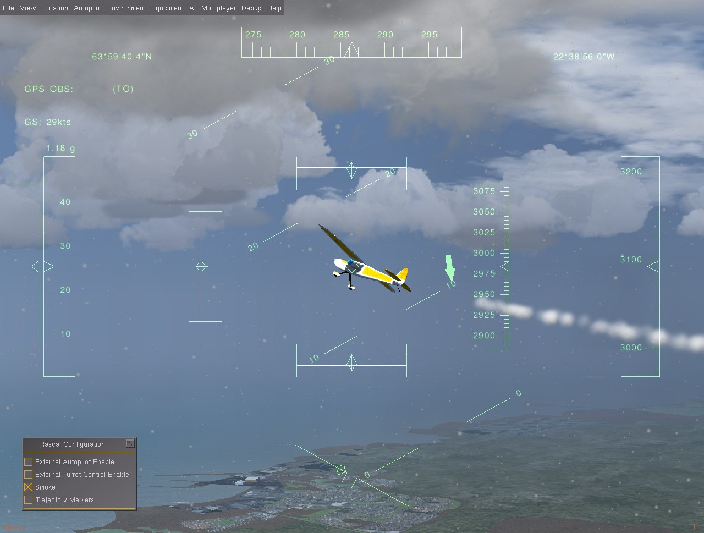
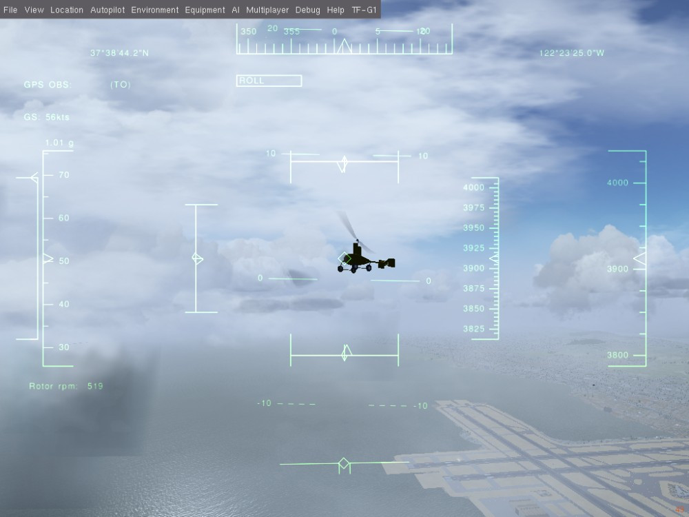

# FlightGear 차량

PX4 [FlightGear](../simulation/flightgear.md) 시뮬레이션이 지원하는 차량과 실행 `make` 명령을 설명합니다. 명령은 **PX4-Autopilot** 디렉토리의 터미널에서 실행됩니다. 지원되는 차량 유형은 고정익, 오토자이로와 로버입니다(이러한 유형 내에 특정 프레임이 있음).

:::tip
빌드 대상의 전체 목록을 보려면 `make px4_sitl list_vmd_make_targets`를 실행하십시오(`flightgear_`로 시작하는 대상 필터링).
:::

:::note
[FlightGear](../simulation/flightgear.md) 페이지에는 FlightGear 설치 및 사용 방법이 자세히 설명되어있습니다.(이 페이지는 차량별 기능 요약).
:::

<a id="standard_plane"></a>

## 표준 고정익

FlightGear는 많은 고정익 모델을 지원합니다. UAV 개발에 가장 적합한 모델은 [Rascal RC 비행기](https://github.com/ThunderFly-aerospace/FlightGear-Rascal)입니다(여러가지 변형이 존재함).



변형은 주로 [FDM](http://wiki.flightgear.org/Flight_Dynamics_Model) 모델에 따라 달라집니다. 모든 변형에는 컴퓨터 키보드에서 `=` 키를 눌러 활성화할 수 있는 공통 기능 선택 표가 있습니다.

고급 기능 활성화에 사용할 수 있는 팝업 테이블이 있습니다.



가장 관련성이 높은 옵션은 다음과 같습니다.

* 연기 - 공중에서 항공기의 가시성을 향상시키기 위해 연기 흔적을 생성합니다(연기와 입자 옵션은 **FG 보기 > 렌더링 옵션 > 입자 확인란**에서 활성화함).
* 궤적 마커 - 비행 궤적을 따라 직교 마커를 표시합니다.

궤적 마커는 세계 좌표의 절대 비행 경로를 보여주고, 연기 흔적은 기단의 상대 경로를 보여줍니다.

### Rascal 110 YASim

Rascal 모델의 주요 변형에는 연소 피스톤 엔진 모델이 있습니다. 이것은 공회전 엔진 RPM에서 프로펠러의 회전을 일으키는 0이 아닌 공회전 전력을 초래합니다.

실행 명령어는 다음과 같습니다.

```sh
make px4_sitl_nolockstep flightgear_rascal
```


### Rascal 110 Electric YASim

전기 엔진을 장착한 Rascal 차량.

```sh
make px4_sitl_nolockstep flightgear_rascal-electric
```

:::note
이 변종에는 최신 FlightGear 코드가 필요합니다(적어도 2020년 4월 26일부터 출처).
그렇지 않으면, 전기 엔진의 예기치 않은 정의로 인하여 FlightGear가 충돌합니다.
:::

### Rascal 110 JSBsim

Rascal JSBsim 변종.

이 변형에는 직접적인 `make` 옵션이 없지만, **rascal.json** 설정 파일([PX4-FlightGear-Bridge](https://github.com/ThunderFly-aerospace/PX4-FlightGear-Bridge)의 일부)에서 수동으로 선택할 수 있습니다. [이 파일](https://github.com/ThunderFly-aerospace/PX4-FlightGear-Bridge/blob/master/models/rascal.json#L2)에서 `Rascal110-YASim`을 `Rascal110-JSBSim`으로 변경하면 됩니다.

<a id="autogyro"></a>

## 오토자이로

FlightGear에서 지원하는 유일한 UAV 오토자이로 모델은 [TF-G1 Autogyro](https://github.com/ThunderFly-aerospace/TF-G1)입니다.

```sh
make px4_sitl_nolockstep flightgear_tf-g1
```




<a id="ugv"></a>

## Ackerman 차량 (UGV/Rover)

### TF-R1 지상 지원 로버

이 로버에는 견인 히치가 장착되어 있으며, 다른 차량의 항공 견인에 사용될 수 있습니다.

```sh
make px4_sitl_nolockstep flightgear_tf-r1
```


<a id="quadrotor"></a>

## 쿼드콥터

[불완전한 멀티콥터 모델](https://github.com/ThunderFly-aerospace/FlightGear-TF-Mx1)만 있습니다. 이것은 아직 사용할 수 없습니다(숫자적으로 불안정하고 추가 작업이 필요함).


# 신규 차량 추가

새 차량 모델은 [PX4-FlightGear-Bridge/models/](https://github.com/PX4/PX4-FlightGear-Bridge/tree/master/models) 디렉토리에 git 하위 모듈로 포함되어야 합니다. 이 디렉토리에는 제어 채널 정의 [JSON 파일](https://github.com/PX4/PX4-FlightGear-Bridge/blob/master/models/rascal.json)이 있습니다.

```json
{
    "FgModel":"Rascal110-YASim",
    "Url":"https://github.com/ThunderFly-aerospace/FlightGear-Rascal/archive/master.zip",
    "Controls": [
                ["5","/controls/flight/aileron","-1"],
                ["7","/controls/flight/elevator","-1"],
                ["2","/controls/flight/rudder","1"],
                ["4","/controls/engines/engine/throttle","1"]
                ]
}
```

파일 내용 의미는 다음과 같습니다.

* `FgModel` - 모델 디렉토리의 "XXXX-set.xml"에 해당하는 FlightGear 모델의 정확한 대소문자 구분 이름입니다(여기서 XXXX는 모델 이름).
* `URL`은 선택 사항이며 현재 사용되지 않습니다. 웹에서 모델을 자동으로 다운로드하는 것이며, 차후 사용하기 위한 것입니다.
* `컨트롤` - 차량을 추가하는 과정에서 가장 중요한 부분입니다. 이 섹션에는 PX4 믹서 파일과 [FlightGear 속성 트리](http://wiki.flightgear.org/Property_tree) 간의 매핑이 포함되어 있습니다.
  * 목록의 첫 번째 숫자는 PX4 믹서 출력을 선택합니다.
  * 경로 문자열은 속성 트리의 FlightGear 변수 위치입니다.
 * 목록의 마지막 숫자는 믹서 입력의 반전 또는 크기 조정을 허용하는 승수입니다.

이 모든 파일을 준비한 후에는, 새 차량을 PX4 make 시스템에 포함하여야 합니다.

PX4 설정은 [/platforms/posix/cmake/sitl_target.cmake](https://github.com/PX4/PX4-Autopilot/blob/c5341da8137f460c84f47f0e38293667ea69a6cb/platforms/posix/cmake/sitl_target.cmake#L164-L171)에 있습니다. 새 차량의 json 이름이 목록에 추가되어야 합니다.
