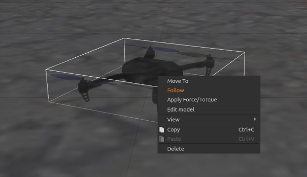
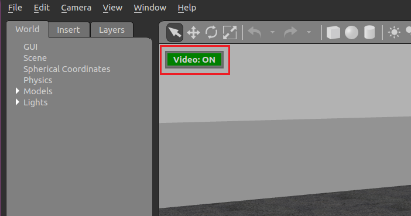
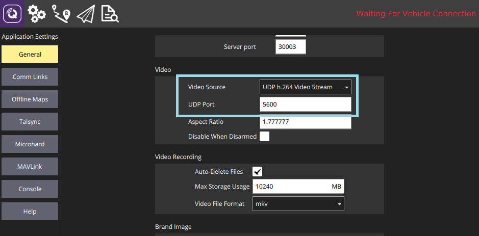

# Gazebo 시뮬레이션

[Gazebo](http://gazebosim.org)는 물체 회피 및 컴퓨터 비전 테스트에 적합한 자율 로봇을 위한 강력한 3D 시뮬레이션 환경입니다. 이 페이지에서는 SITL과 단일 차량과 함께 사용하는 방법을 설명합니다. Gazebo는 [HITL](../simulation/hitl.md) 및 [다중 차량 시뮬레이션](../simulation/multi-vehicle-simulation.md)과 함께 사용할 수 있습니다.

**지원 차량:** 쿼드([Iris](../airframes/airframe_reference.md#copter_quadrotor_wide_3dr_iris_quadrotor) 및 [솔로](../airframes/airframe_reference.md#copter_quadrotor_x_3dr_solo), Hex(Typhoon H480), [일반 쿼드 델타 VTOL](../airframes/airframe_reference.md#vtol_standard_vtol_generic_quad_delta_vtol), 테일시터, 비행기, 로버, 잠수함/UUV.

:::warning
Gazebo는 차량제어 자동화를 위한 툴킷/오프보드 API인 [ROS](../ros/README.md)와 함께 자주 사용됩니다. ROS와 함께 PX4를 사용하려면, [ROS 지침](../simulation/ros_interface.md)을 따라 ROS와 Gazebo를 모두 **설치**하여야 합니다(따라서 설치 충돌을 피해야 함).
:::

@[유투브](https://www.youtube.com/watch?v=qfFF9-0k4KA&vq=hd720)

[](https://mermaid-js.github.io/mermaid-live-editor/#/edit/eyJjb2RlIjoiZ3JhcGggTFI7XG4gIEdhemViby0tPlBsdWdpbjtcbiAgUGx1Z2luLS0-TUFWTGluaztcbiAgTUFWTGluay0tPlNJVEw7IiwibWVybWFpZCI6eyJ0aGVtZSI6ImRlZmF1bHQifSwidXBkYXRlRWRpdG9yIjpmYWxzZX0)


<!-- original graph info
graph LR;
  Gazebo-- >Plugin;
  Plugin-- >MAVLink;
  MAVLink-- >SITL;
-->

:::note
시뮬레이터, 시뮬레이션 환경 및 시뮬레이션 설정(예: 지원 차량)에 대한 일반 정보는 [시뮬레이션](../simulation/README.md)을 참고하십시오.
:::

## 설치

Gazebo 9 설정은 표준빌드방법에 포함되어 있습니다.
- **MacOS:** [Mac 개발 환경](../dev_setup/dev_env_mac.md)
- **Linux:** [Ubuntu LTS/Debian Linux의 개발 환경 > Gazebo, JMAVSim 및 NuttX(Pixhawk) 대상](../dev_setup/dev_env_linux_ubuntu.md#gazebo-jmavsim-and-nuttx-pixhawk-targets)
- **Windows:** 지원되지 않음.

추가 설치 방법은 [gazebosim.org](http://gazebosim.org/tutorials?cat=guided_b&tut=guided_b1)을 참고하십시오.


## 시뮬레이션 실행

로드할 기체 환경에서 PX4 SITL 및 Gazebo를 시작하여 시뮬레이션을 실행합니다(멀티콥터, 비행기, VTOL, 광학 흐름 및 다중 차량 시뮬레이션 지원).

가장 편리한 방법은 PX4 *PX4-Autopilot* 저장소의 루트 디렉토리에서 터미널을 열고 원하는 대상에 대해 `make`를 호출하는 것입니다. 예를 들어 쿼드로터 시뮬레이션을 시작하려면(기본값):
```sh
cd /path/to/PX4-Autopilot
make px4_sitl gazebo
```

지원되는 차량 및 `make` 명령은 아래에 나열되어 있습니다. 차량 이미지를 보려면 링크를 클릭하십시오.

:::note
빌드 대상의 전체 목록을 보려면 `make px4_sitl list_vmd_make_targets`를 실행하십시오(그리고 `gazebo_`로 시작하는 대상에서 필터링).
:::

| 차량                                                                                                              | 명령어                                    |
| --------------------------------------------------------------------------------------------------------------- | -------------------------------------- |
| [쿼드콥터](../simulation/gazebo_vehicles.md#quadrotor)                                                              | `make px4_sitl gazebo`                 |
| [광류센서 장착 쿼드콥터](../simulation/gazebo_vehicles.md#quadrotor_optical_flow)                                         | `make px4_sitl gazebo_iris_opt_flow`   |
| [3DR Solo (쿼드콥터)](../simulation/gazebo_vehicles.md#3dr_solo)                                                    | `make px4_sitl gazebo_solo`            |
| <span id="typhoon_h480"></span>[Typhoon H480(헥스로터)](../simulation/gazebo_vehicles.md#typhoon_h480)(동영상 스트리밍 지원) | `make px4_sitl gazebo_typhoon_h480`    |
| [표준 항공기](../simulation/gazebo_vehicles.md#standard_plane)                                                       | `make px4_sitl gazebo_plane`           |
| [표준 비행기 (투석기 발사 포함)](../simulation/gazebo_vehicles.md#standard_plane_catapult)                                  | `make px4_sitl gazebo_plane_catapult`  |
| [표준 VTOL](../simulation/gazebo_vehicles.md#standard_vtol)                                                       | `make px4_sitl gazebo_standard_vtol`   |
| [테일시터 VTOL](../simulation/gazebo_vehicles.md#tailsitter_vtol)                                                   | `make px4_sitl gazebo_tailsitter`      |
| [Ackerman UGV (Rover)](../simulation/gazebo_vehicles.md#ackermann-ugv)                                          | `make px4_sitl gazebo_rover`           |
| [Differential UGV (Rover)](../simulation/gazebo_vehicles.md#differential-ugv)                                   | `make px4_sitl gazebo_r1_rover`        |
| [HippoCampus TUHH (UUV: 무인 수중 차량)](../simulation/gazebo_vehicles.md#uuv)                                        | `make px4_sitl gazebo_uuv_hippocampus` |
| [보트 (USV: 무인 수상 차량)](../simulation/gazebo_vehicles.md#usv)                                                      | `make px4_sitl gazebo_boat`            |
| [클라우드쉽 (비행선)](../simulation/gazebo_vehicles.md#airship)                                                         | `make px4_sitl gazebo_cloudship`       |


:::note
[파일 및 코드 설치](../dev_setup/dev_env.md) 가이드는 빌드 오류가 있는 경우 참고하십시오.
:::

위의 명령은 전체 UI로 단일 차량을 시작합니다. 기타 옵션은 다음과 같습니다.
- [PX4와 Gazebo를 별도로 시작](#start_px4_sim_separately)하여 Gazebo를 계속 실행하고, 필요하면 PX4를 다시 시작할 수 있습니다(둘 다 다시 시작하는 것보다 빠름).
- Gazebo UI를 시작하지 않는 [헤드리스 모드](#headless)에서 시뮬레이션을 실행합니다(이는 적은 리소스를 사용하고 훨씬 빠름).


## 하늘로 띄우기

위의 `make` 명령은 먼저 PX4를 빌드한 다음, Gazebo 시뮬레이터를 실행합니다.

PX4가 시작되면 아래와 같은 PX4 셸이 시작됩니다.

```
______  __   __    ___ 
| ___ \ \ \ / /   /   |
| |_/ /  \ V /   / /| |
|  __/   /   \  / /_| |
| |     / /^\ \ \___  |
\_|     \/   \/     |_/

px4 starting.

INFO  [px4] Calling startup script: /bin/sh etc/init.d-posix/rcS 0
INFO  [param] selected parameter default file eeprom/parameters_10016
[param] Loaded: eeprom/parameters_10016
INFO  [dataman] Unknown restart, data manager file './dataman' size is 11798680 bytes
INFO  [simulator] Waiting for simulator to connect on TCP port 4560
Gazebo multi-robot simulator, version 9.0.0
Copyright (C) 2012 Open Source Robotics Foundation.
Released under the Apache 2 License.
http://gazebosim.org
...
INFO  [ecl/EKF] 5188000: commencing GPS fusion
```
콘솔은 PX4가 기체 고유의 초기화 및 매개변수 파일을 로드하고, 시뮬레이터가 실행되기를 기다리며(연결할 때) 상태를 출력합니다. [ecl/EKF]가 `GPS 융합을 시작`한다는 정보가 인쇄되면 차량은 시동 준비가 된 것입니다.


:::note
쿼드로터 모델을 마우스 오른쪽 버튼으로 클릭하면, 컨텍스트 메뉴에서 팔로우 모드를 활성화할 수 있어 보기에 편리합니다.
:::



다음을 입력하여 공중에 띄울 수 있습니다.

```sh
pxh> commander takeoff
```

## 사용법/설정 옵션

모든 시뮬레이터에 적용되는 옵션은 최상위 [시뮬레이션](../simulation/README.md#sitl-simulation-environment)에서 설명합니다(일부는 아래에서 중복될 수 있음).

### 센서/하드웨어 오류 시뮬레이션

[안전장치 시뮬레이션](../simulation/failsafes.md)에서는 GPS 오류와 배터리 소모와 같은 안전 비상안전장치를 트리거하는 방법을 설명합니다.

<a id="headless"></a>

### 헤드리스 모드

Gazebo는 Gazebo UI가 실행되지 않는 *headless* 모드에서 실행될 수 있습니다. 헤드리스 모드는 시작이 빠르고 시스템 리소스를 적게 사용합니다(즉, 시뮬레이션을 실행하는 데 더 "가벼운" 방법입니다).

다음과 같이 일반 `make` 명령에 `HEADLESS=1` 접두어를 붙이면 됩니다.
```bash
HEADLESS=1 make px4_sitl gazebo_plane
```

<a id="custom_takeoff_location"></a>

### 사용자 지정 이륙 위치 설정

SITL Gazebo의 이륙 위치는 환경 변수를 사용하여 설정합니다. 기본 이륙 위치와 [세계에 대해 설정된](#set_world_location) 값이 모두 재정의됩니다.

설정할 변수는 `PX4_HOME_LAT`, `PX4_HOME_LON` 및 `PX4_HOME_ALT`입니다.

예:
```
export PX4_HOME_LAT=28.452386
export PX4_HOME_LON=-13.867138
export PX4_HOME_ALT=28.5
make px4_sitl gazebo
```


### 시뮬레이션 속도 변경

시뮬레이션 속도는 환경 변수 `PX4_SIM_SPEED_FACTOR`를 사용하여 실시간으로 증가 또는 감소할 수 있습니다.

```
export PX4_SIM_SPEED_FACTOR=2
make px4_sitl_default gazebo
```

자세한 내용은 [시뮬레이션 > 실시간보다 빠른 시뮬레이션 실행](../simulation/README.md#simulation_speed)편을 참고하십시오.


### 풍속 변경

To simulate wind speed, add this plugin to your world file and set `windVelocityMean` in m/s (replace `SET_YOUR_WIND_SPEED` with your desired speed). If needed, adapt the `windVelocityMax` parameter so that it is greater than `windVelocityMean`:

```xml
  <plugin name='wind_plugin' filename='libgazebo_wind_plugin.so'>
      <frameId>base_link</frameId>
      <robotNamespace/>
      <xyzOffset>1 0 0</xyzOffset>
      <windDirectionMean>0 1 0</windDirectionMean>
      <windVelocityMean>SET_YOUR_WIND_SPEED</windVelocityMean>
      <windGustDirection>0 0 0</windGustDirection>
      <windGustDuration>0</windGustDuration>
      <windGustStart>0</windGustStart>
      <windGustVelocityMean>0</windGustVelocityMean>
      <windPubTopic>world_wind</windPubTopic>
    </plugin>
```
Wind direction is passed as a direction vector (standard ENU convention), which will be normalized in the gazebo plugin. Additionally you can state wind velocity variance in (m/s)² and direction variance based on a normal distribution to add some random factor into the simulation. Gust is internally handled in the same way as wind, with the slight difference that you can state start time and duration with the following two parameters `windGustStart` and `windGustDuration`.

You can see how this is done in [PX4/PX4-SITL_gazebo/worlds/windy.world](https://github.com/PX4/PX4-SITL_gazebo/blob/main/worlds/windy.world#L15-L31).

### 조이스틱 사용법

현재 기본 세계는 고도 맵을 지면으로 사용하는 [PX4/sitl_gazebo/worlds/**iris.world**](https://github.com/PX4/sitl_gazebo/tree/master/worlds))입니다.


### 거리 센서 성능 향상

The current default world is [PX4/sitl_gazebo/worlds/**iris.world**](https://github.com/PX4/sitl_gazebo/tree/master/worlds)), which uses a heightmap as ground.

Gazebo는 실제 시스템에서 일반적으로 발견되는 것과 유사한 GPS 잡음을 시뮬레이션할 수 있습니다(그렇지 않으면 보고된 GPS 값은 잡음이 없고 완벽한 것입니다). 이것은 GPS 노이즈의 영향을 받을 수 있는 응용 프로그램(예: 정밀 포지셔닝)에서 작업할 때 유용합니다.


<a id="gps_noise"></a>

### GPS 노이즈 시뮬레이션

대상 차량의 SDF 파일에 `gpsNoise` 요소 값이 포함된 경우(즉, `<gpsNoise>true</gpsNoise>` 행이 있음) GPS 노이즈가 활성화됩니다. 많은 차량 SDF 파일에서 기본적으로 활성화되어 있습니다: **solo.sdf**, **iris.sdf**, **standard_vtol.sdf**, **delta_wing.sdf **, **plane.sdf**, **typhoon_h480**, **tailsitter.sdf**.

GPS noise is enabled if the target vehicle's SDF file contains a value for the `gpsNoise` element (i.e. it has the line: `<gpsNoise>true</gpsNoise>`). It is enabled by default in many vehicle SDF files: **solo.sdf**, **iris.sdf**, **standard_vtol.sdf**, **delta_wing.sdf**, **plane.sdf**, **typhoon_h480**, **tailsitter.sdf**.

다음에 Gazebo를 빌드/재시작하면 새로운 GPS 노이즈 설정이 사용됩니다.
1. SDF 파일(모든 차량용)을 생성하기 위해 가제보 대상을 구축합니다. 예:
   ```
   make px4_sitl gazebo_iris
   ```
   :::tip
SDF 파일은 후속 빌드에서 덮어 쓰지 않습니다.
:::

2. 대상 차량에 대한 SDF 파일을 엽니다(예: **./Tools/sitl_gazebo/models/iris/iris.sdf**).
3. `gpsNoise` 요소를 검색합니다.
   ```xml
   <plugin name='gps_plugin' filename='libgazebo_gps_plugin.so'>
     <robotNamespace/>
     <gpsNoise>true</gpsNoise>
   </plugin>
   ```
   * GPS가 있으면, GPS가 활성화된 것입니다. `<gpsNoise>true</gpsNoise>` 줄을 삭제하여 비활성화 됩니다.
   * If it is not present, GPS is disabled. 위의 그림과 같이, `gps_plugin` 섹션에 `gpsNoise` 요소를 추가하여 활성화할 수 있습니다.

PX4는 [PX4/sitl_gazebo/worlds](https://github.com/PX4/sitl_gazebo/tree/master/worlds)에 저장된 다수의 [Gazebo Worlds](../simulation/gazebo_worlds.md)를 지원합니다. 기본적으로 Gazebo는 [empty.world](https://github.com/PX4/sitl_gazebo/blob/master/worlds/empty.world)에 정의된 것처럼 평평한 특징 없는 평면을 표시합니다.


<a id="set_world"></a>

## 특정 세계 로드

PX4 구성 대상에서 최종 옵션으로 지정하여 모든 세계를 로드할 수 있습니다.

예를 들어, *창고* 세계를 로드하려면 다음과 같이 추가할 수 있습니다.

For example, to load the *warehouse* world, you can append it as shown:
```
make px4_sitl_default gazebo_plane_cam__warehouse
```

`PX4_SITL_WORLD` 환경 변수를 사용하여, 로드할 세계의 전체 경로를 지정할 수 있습니다. 이것은 PX4에 아직 포함되지 않은 새로운 세계를 테스트할 때 유용합니다.
:::

:::tip
로드된 세계가 지도와 일치하지 않으면 [세계 위치를 설정](#set_world_location)하여야 합니다. This is useful if testing a new world that is not yet included with PX4.

:::tip
If the loaded world does not align with the map, you may need to [set the world location](#set_world_location).
:::

<a id="set_world_location"></a>

## 세계 위치 설정

The vehicle gets spawned very close to the origin of the world model at some simulated GPS location.

실제 위치(예: 특정 공항)를 재현하는 세계를 사용하는 경우에는 시뮬레이션된 세계에 표시되는 것과 지상국 지도에 표시되는 것에 불일치가 발생할 수 있습니다. 이 문제를 극복하기 위해 세계 원점의 위치를 "실제" GPS 좌표로 설정할 수 있습니다.

:::note
동일한 작업을 수행하는 [맞춤 이륙 위치](#custom_takeoff_location)를 설정할 수 있습니다. To overcome this problem you can set the location of the world origin to the GPS coordinates where it would be in "real life".

세계의 위치는 `spherical_coordinates` 태그를 사용하여, 원점의 위치를 지정하여 **.world** 파일에 정의합니다. 위도, 경도, 고도가 모두 지정되어야 합니다(이것이 유효하려면).
:::

The location of the world is defined in the **.world** file by specifying the location of the origin using the `spherical_coordinates` tag. The latitude, longitude, elevation must all be specified (for this to be a valid).

다음 `make` 명령을 사용하여 [Sonoma Raceway World](../simulation/gazebo_worlds.md#sonoma-raceway)에서 로버를 생성하여 테스트할 수 있습니다. 모델 데이터베이스에서 다운로드하므로 최초 생성 시간이 오래 걸립니다.
```
    <spherical_coordinates>
      <surface_model>EARTH_WGS84</surface_model>
      <latitude_deg>38.161479</latitude_deg>
      <longitude_deg>-122.454630</longitude_deg>
      <elevation>488.0</elevation>
    </spherical_coordinates>
```

아래 비디오는 환경의 위치가 전망대 세계와 일치함을 보여줍니다.
```
make px4_sitl gazebo_rover__sonoma_raceway
```

[유투브](https://youtu.be/-a2WWLni5do)

@확장된 개발 세션의 경우 Gazebo와 PX4를 별도로 시작하거나, IDE 내에서 시작하는 것이 더 편리할 수 있습니다.


<a id="start_px4_sim_separately"></a>

## Gazebo와 PX4를 각각 시작

For extended development sessions it might be more convenient to start Gazebo and PX4 separately or even from within an IDE.

In addition to the existing cmake targets that run `sitl_run.sh` with parameters for px4 to load the correct model it creates a launcher targets named `px4_<mode>` that is a thin wrapper around original sitl px4 app. This thin wrapper simply embeds app arguments like current working directories and the path to the model file.

이 접근 방식은 시뮬레이터(예: Gazebo)가 항상 백그라운드에서 실행되고 매우 가벼운 px4 프로세스만 다시 실행하기 때문에 디버그 주기 시간을 크게 줄여줍니다.

* Run gazebo (or any other sim) server and client viewers via the terminal specifying an `_ide` variant:
  ```sh
  make px4_sitl gazebo___ide
  ```
  또는
  ```sh
  make px4_sitl gazebo_iris_ide
  ```
* IDE에서 디버그할 대상 `px4_<mode>`을 선택합니다(예: `px4_iris`).
* IDE에서 직접 디버그 세션을 시작합니다.

This approach significantly reduces the debug cycle time because simulator (e.g. Gazebo) is always running in background and you only re-run the px4 process which is very light.


## 모의 측량 카메라

카메라는 이미지가 캡처될 때마다 [CAMERA_IMAGE_CAPTURED](https://mavlink.io/en/messages/common.html#CAMERA_IMAGE_CAPTURED) 메시지를 전송합니다. The camera also supports video streaming. It can be used to test camera capture, in particular within survey missions.

The camera emits the [CAMERA_IMAGE_CAPTURED](https://mavlink.io/en/messages/common.html#CAMERA_IMAGE_CAPTURED) message every time an image is captured. The captured images are saved to: **PX4-Autopilot/build/px4_sitle_default/tmp/frames/DSC_n_.jpg** (where _n_ starts as 00000 and is iterated by one on each capture).

To simulate a plane with this camera:
```
make px4_sitl_default gazebo_plane_cam
```

:::note
시뮬레이션 카메라는 [PX4/PX4-SITL_gazebo/master/src/gazebo_camera_manager_plugin.cpp](https://github.com/PX4/PX4-SITL_gazebo/blob/master/src/gazebo_camera_manager_plugin.cpp)에서 구현됩니다.
:::

:::note
The simulated camera is implemented in [PX4/PX4-SITL_gazebo/master/src/gazebo_camera_manager_plugin.cpp](https://github.com/PX4/PX4-SITL_gazebo/blob/master/src/gazebo_camera_manager_plugin.cpp).
:::

<a id="flight_termination"></a>

## 낙하산/비행 종료 시뮬레이션

*Gazebo* can be used to simulate deploying a [parachute](../peripherals/parachute.md) during [Flight Termination](../advanced_config/flight_termination.md) (flight termination is triggered by the PWM command that is simulated in *Gazebo*).

차량을 비행 종료 상태로 전환하기 위하여, 비상 안전 조치로 비행 종료가 설정된 [안전 확인](../config/safety.md)을 강제로 실패하도록 할 수 있습니다. 예를 들어 강제로 [지오펜스 위반](../config/safety.md#geofence-failsafe)을 수행하여 이를 실행할 수 있습니다.
```
make px4_sitl gazebo_if750a
```

To put the vehicle into flight termination state, you can force it to fail a [safety check](../config/safety.md) that has flight termination set as the failsafe action. For example, you could do this by forcing a [Geofence violation](../config/safety.md#geofence-failsafe).

For more information see:
- [비행 종료](../advanced_config/flight_termination.md)
- [낙하산](../peripherals/parachute.md)
- [안전장치 설정(사고 방지)](../config/safety.md)

<a id="video"></a>

## 동영상 스트리밍

PX4 SITL for Gazebo supports UDP video streaming from a Gazebo camera sensor attached to a vehicle model. When streaming is enabled, you can connect to this stream from *QGroundControl* (on UDP port 5600) and view video of the Gazebo environment from the simulated vehicle - just as you would from a real camera. The video is streamed using a *gstreamer* pipeline and can be enabled/disabled using a button in the Gazebo UI.

The Gazebo camera sensor is supported/enabled on the following frames:
* [Typhoon H480](#typhoon_h480)


### 준비 사항

:::note
참고로 종속 항목에는 `gstreamer1.0-plugins-base`, g`streamer1.0-plugins-good`, `gstreamer1.0-plugins-bad`,  `gstreamer1.0-plugins-ugly`, `libgstreamer-plugins-base1.0-dev`가 포함됩니다. The required dependencies should already have been [installed when you set up Gazebo](#installation) (they are included in the standard PX4 installation scripts/instructions for macOS and Ubuntu Linux).

대상 차량이 지원하는 경우에는, 비디오 스트리밍이 자동으로 시작됩니다. Typhoon H480에서 비디오 스트리밍을 시작하려면 다음 명령어를 입력하십시오.

### 동영상 스트리밍 시작/중지

Video streaming is automatically started when supported by the target vehicle. For example, to start streaming video on the Typhoon H480:
```
make px4_sitl gazebo_typhoon_h480
```

Streaming can be paused/restarted using the Gazebo UI *Video ON/OFF* button..




### 가제보 동영상 조회 방법

The easiest way to view the SITL/Gazebo camera video stream is in *QGroundControl*. Simply open **Application Settings > General** and set **Video Source** to *UDP h.264 Video Stream* and **UDP Port** to *5600*:



The video from Gazebo should then display in *QGroundControl* just as it would from a real camera.


*Gstreamer Pipeline*을 사용하여 동영상 조회할 수 있습니다. 터미널에서 아래의 명령어를 입력하면 됩니다.

SITL은 Gazebo 모델에 문제가 있는 경우 조용히 실패/종료합니다. 다음과 같이 `VERBOSE_SIM`을 사용하여 더 자세한 로깅을 활성화할 수 있습니다.
```sh
gst-launch-1.0  -v udpsrc port=5600 caps='application/x-rtp, media=(string)video, clock-rate=(int)90000, encoding-name=(string)H264' \
! rtph264depay ! avdec_h264 ! videoconvert ! autovideosink fps-update-interval=1000 sync=false
```

### 상세 로깅

SITL fails silently when there is something wrong with the gazebo model. You can enable more verbose logging using `VERBOSE_SIM`, as shown:

```
export VERBOSE_SIM=1
make px4_sitl gazebo
```

or

```
VERBOSE_SIM=1 make px4_sitl gazebo
```


## 확장 및 사용자 정의

:::note
빌드 시스템은 시뮬레이터를 포함하여 올바른 GIT 하위 모듈을 적용합니다. 디렉토리에 있는 파일의 변경 사항을 덮어쓰지 않습니다.

:::note
The build system enforces the correct GIT submodules, including the simulator.
It will not overwrite changes in files in the directory.
:::

## 추가 정보

* [Gazebo 시뮬레이션이 있는 ROS](../simulation/ros_interface.md)
* [Gazebo 옥토맵](../simulation/gazebo_octomap.md)
