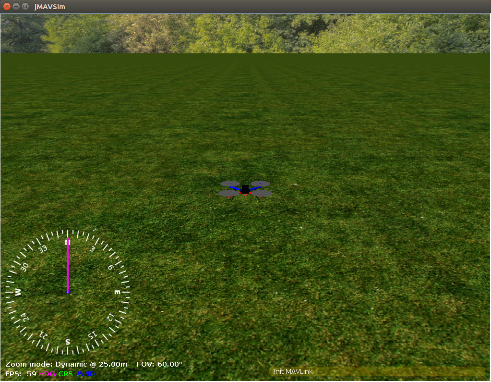

# jMAVSim SITL

jMAVSim은 시뮬레이션된 세계에서 PX4를 실행하는 *콥터* 유형의 기체를 비행할 수 있는 간단한 멀티콥터 시뮬레이터입니다. 설정이 쉽고, 기체가 이륙, 비행, 착륙할 수 있으며, 다양한 장애 조건(예: GPS 장애)에 적절하게 반응을 테스트할 수 있습니다.

<strong>지원 기체:</strong>

* 쿼드콥터

jMAVSim에서 PX4 SITL과 연결 설정 방법을 설명합니다.

:::tip
jMAVSim은 HITL 시뮬레이션이 가능합니다.([여기에 표시된 대로](../simulation/hitl.md#jmavsim_hitl_configuration)).
:::

## 설치

jMAVSim 설정은 [표준 빌드 지침](../dev_setup/dev_env.md)(macOS, Ubuntu Linux, Windows용)에 설명되어 있습니다.

## 시뮬레이션 환경

루프 시뮬레이션 소프트웨어는 호스트 시스템에서 전체 시스템을 실행하고 자동조종장치를 시뮬레이션합니다. 로컬 네트워크에서 시뮬레이터에 연결합니다. 설정은 다음과 같습니다.

[](https://mermaid-js.github.io/mermaid-live-editor/#/edit/eyJjb2RlIjoiZ3JhcGggTFI7XG4gIFNpbXVsYXRvci0tPk1BVkxpbms7XG4gIE1BVkxpbmstLT5TSVRMOyIsIm1lcm1haWQiOnsidGhlbWUiOiJkZWZhdWx0In0sInVwZGF0ZUVkaXRvciI6ZmFsc2V9)


<!-- original graph
graph LR;
  Simulator-- >MAVLink;
  MAVLink-- >SITL;
-->

## SITL 실행

[시뮬레이션 전제 조건](../dev_setup/dev_env.md)이 시스템에 설치를 확인후 실행하면 됩니다. 편리한 make 대상은 POSIX 호스트 빌드를 컴파일하고 시뮬레이션을 실행합니다.

```sh
make px4_sitl_default jmavsim
```

그러면 다음과 같은 PX4 셸이 출력됩니다.

```sh
[init] shell id: 140735313310464
[init] task name: px4

______  __   __    ___
| ___ \ \ \ / /   /   |
| |_/ /  \ V /   / /| |
|  __/   /   \  / /_| |
| |     / /^\ \ \___  |
\_|     \/   \/     |_/

Ready to fly.


pxh>
```


또한 [jMAVSim](https://github.com/PX4/jMAVSim) 시뮬레이터의 3D 보기를 보여주는 창이 나타납니다.




## 하늘로 띄우기

시스템이 상태 정보를 인쇄하기 시작합니다. 위치 잠금이 설정되면 비행을 시작할 수 있습니다(콘솔에 *EKF commending GPS fusion* 메시지가 표시된 직후).

이륙하려면 콘솔에 다음 명령어를 입력하십시오.

```sh
pxh> commander takeoff
```

*QGroundControl*을 사용하여 임무를 수행하거나, [조이스틱](#joystick)에 연결할 수 있습니다.

## 사용법/설정 옵션

모든 시뮬레이터에 적용되는 옵션은 최상위 [시뮬레이션](../simulation/README.md#sitl-simulation-environment)편에서 설명합니다(일부는 아래에서 중복될 수 있음).

### 센서/하드웨어 오류 시뮬레이션

[안전장치 시뮬레이션](../simulation/failsafes.md)에서는 GPS 오류와 배터리 소모와 같은 안전 비상안전장치를 트리거하는 방법을 설명합니다.

### 사용자 지정 이륙 위치 설정

기본 이륙 위치는 `PX4_HOME_LAT`, `PX4_HOME_LON` 및 `PX4_HOME_ALT` 환경변수를 사용하여 재정의할 수 있습니다.

예를 들어 위도, 경도 및 고도를 설정은 아래와 같습니다.
```
export PX4_HOME_LAT=28.452386
export PX4_HOME_LON=-13.867138
export PX4_HOME_ALT=28.5
make px4_sitl_default jmavsim
```

### 시뮬레이션 속도 변경

시뮬레이션 속도는 환경 변수 `PX4_SIM_SPEED_FACTOR`를 사용하여 실시간으로 증가 또는 감소할 수 있습니다.

```
export PX4_SIM_SPEED_FACTOR=2
make px4_sitl_default jmavsim
```

자세한 내용은 [시뮬레이션 > 실시간보다 빠른 시뮬레이션 실행](../simulation/README.md#simulation_speed)편을 참고하십시오.

<a id="joystick"></a>

### 조이스틱 사용법

조이스틱과 썸 조이스틱 지원은 *QGroundControl*에서 지원됩니다([설정 방법](../simulation/README.md#joystick-gamepad-integration) 참고).


### Wi-Fi 드론 시뮬레이션

There is a special target to simulate a drone connected via Wifi on the local network:

```sh
make broadcast jmavsim
```

The simulator broadcasts its address on the local network as a real drone would do.

### Start JMAVSim and PX4 Separately

You can start JMAVSim and PX4 separately:

```
./Tools/jmavsim_run.sh -l
make px4_sitl none
```

This allows a faster testing cycle (restarting jMAVSim takes significantly more time).

### Headless Mode

To start jMAVSim without the GUI, set the env variable `HEADLESS=1` as shown:
```bash
HEADLESS=1 make px4_sitl jmavsim
```


## Multi-Vehicle Simulation

JMAVSim can be used for multi-vehicle simulation: [Multi-Vehicle Sim with JMAVSim](../simulation/multi_vehicle_jmavsim.md).

## Extending and Customizing

To extend or customize the simulation interface, edit the files in the **Tools/jMAVSim** folder. The code can be accessed through the[jMAVSim repository](https://github.com/px4/jMAVSim) on Github.

:::note
The build system enforces the correct submodule to be checked out for all dependencies, including the simulator. It will not overwrite changes in files in the directory, however, when these changes are committed the submodule needs to be registered in the Firmware repo with the new commit hash. To do so, `git add Tools/jMAVSim` and commit the change. This will update the GIT hash of the simulator.
:::

## Interfacing to ROS

The simulation can be [interfaced to ROS](../simulation/ros_interface.md) the same way as onboard a real vehicle.

## Important Files

* The startup script is in the [posix-configs/SITL/init](https://github.com/PX4/Firmware/tree/master/posix-configs/SITL/init) folder and named `rcS_SIM_AIRFRAME`, the default is `rcS_jmavsim_iris`.
* The root file system (the equivalent of `/` as seen by the) is located inside the build directory: `build/px4_sitl_default/src/firmware/posix/rootfs/`

## Troubleshooting

### java.long.NoClassDefFoundError

```
Exception in thread "main" java.lang.NoClassDefFoundError: javax/vecmath/Tuple3d
at java.base/java.lang.Class.forName0(Native Method)
at java.base/java.lang.Class.forName(Class.java:374)
at org.eclipse.jdt.internal.jarinjarloader.JarRsrcLoader.main(JarRsrcLoader.java:56)
Caused by: java.lang.ClassNotFoundException: javax.vecmath.Tuple3d
at java.base/java.net.URLClassLoader.findClass(URLClassLoader.java:466)
at java.base/java.lang.ClassLoader.loadClass(ClassLoader.java:566)
at java.base/java.lang.ClassLoader.loadClass(ClassLoader.java:499)
... 3 more
Exception in thread "main" java.lang.NoClassDefFoundError: javax/vecmath/Tuple3d
at java.base/java.lang.Class.forName0(Native Method)
at java.base/java.lang.Class.forName(Class.java:374)
at org.eclipse.jdt.internal.jarinjarloader.JarRsrcLoader.main(JarRsrcLoader.java:56)
Caused by: java.lang.ClassNotFoundException: javax.vecmath.Tuple3d
at java.base/java.net.URLClassLoader.findClass(URLClassLoader.java:466)
at java.base/java.lang.ClassLoader.loadClass(ClassLoader.java:566)
at java.base/java.lang.ClassLoader.loadClass(ClassLoader.java:499)
```

This error should no longer occur once the jMAVSim submodule is [updated to newer jar libs](https://github.com/PX4/jMAVSim/pull/119) and Java 11 or Java 14 should work fine.


### An illegal reflective access operation has occured

This warning can be ignored (it will probably be displayed but the simulation will still work correctly).

```
WARNING: An illegal reflective access operation has occurred
WARNING: Illegal reflective access by javax.media.j3d.JoglPipeline (rsrc:j3dcore.jar) to method sun.awt.AppContext.getAppContext()
WARNING: Please consider reporting this to the maintainers of javax.media.j3d.JoglPipeline
WARNING: Use --illegal-access=warn to enable warnings of further illegal reflective access operations
WARNING: All illegal access operations will be denied in a future release
Inconsistency detected by ld.so: dl-lookup.c: 112: check_match: Assertion version->filename == NULL || ! _dl_name_match_p (version->filename, map)' failed!
```

### java.awt.AWTError: Assistive Technology not found: org.GNOME.Accessibility.AtkWrapper

```
Exception in thread "main" java.lang.reflect.InvocationTargetException
at sun.reflect.NativeMethodAccessorImpl.invoke0(Native Method)
at sun.reflect.NativeMethodAccessorImpl.invoke(NativeMethodAccessorImpl.java:62)
at sun.reflect.DelegatingMethodAccessorImpl.invoke(DelegatingMethodAccessorImpl.java:43)
at java.lang.reflect.Method.invoke(Method.java:498)
at org.eclipse.jdt.internal.jarinjarloader.JarRsrcLoader.main(JarRsrcLoader.java:58)
Caused by: java.awt.AWTError: Assistive Technology not found: org.GNOME.Accessibility.AtkWrapper
at java.awt.Toolkit.loadAssistiveTechnologies(Toolkit.java:807)
at java.awt.Toolkit.getDefaultToolkit(Toolkit.java:886)
at java.awt.Window.getToolkit(Window.java:1358)
at java.awt.Window.init(Window.java:506)
at java.awt.Window.(Window.java:537)
at java.awt.Frame.(Frame.java:420)
at java.awt.Frame.(Frame.java:385)
at javax.swing.JFrame.(JFrame.java:189)
at me.drton.jmavsim.Visualizer3D.(Visualizer3D.java:104)
at me.drton.jmavsim.Simulator.(Simulator.java:157)
at me.drton.jmavsim.Simulator.main(Simulator.java:678)
```

If you see this error, try this workaround:

Edit the **accessibility.properties** file:
```
sudo gedit /etc/java-8-openjdk/accessibility.properties
```

and comment out the line indicated below:
```
#assistive_technologies=org.GNOME.Acessibility.AtkWrapper
```

For more info, check [this GitHub issue](https://github.com/PX4/PX4-Autopilot/issues/9557). A contributor found the fix in [askubuntu.com](https://askubuntu.com/questions/695560).

### Exception in thread "main" java.lang.UnsupportedClassVersionError:
When compiling jMAVsim, you might encounter the following error:

```
Exception in thread "main" java.lang.UnsupportedClassVersionError: me/drton/jmavsim/Simulator has been compiled by a more recent version of the Java Runtime (class file version 59.0), this version of the Java Runtime only recognizes class file versions up to 58.0
```

This error is telling you, you need a more recent version of Java in your environment. Class file version 58 corresponds to jdk14, version 59 to jdk15, etc.

To fix it under macOS, we recommend installing OpenJDK through homebrew
```sh
brew install --cask adoptopenjdk15
```