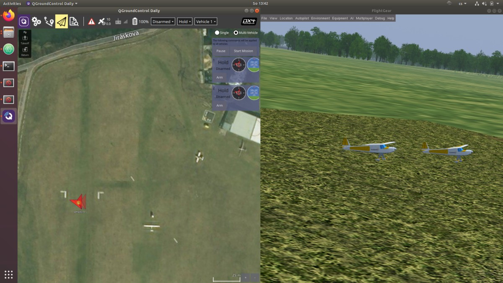

# FlightGear 다중 차량 시뮬레이션

SITL에서 FlightGear를 사용하여 다중 차량 시뮬레이션 방법을 설명합니다. 모든 차량 인스턴스에는 시작 스크립트에 의해 정의된 매개변수가 있습니다.

:::note
이것은 PX4 차량을 시뮬레이션하는 환경적으로 제일 현실적인 방법이며,  다향한 유형의 차량을 쉽게 테스트할 수 있습니다. *QGroundControl*, [MAVSDK](https://mavsdk.mavlink.io/) 등에서 다중 차량 지원을 테스트하는 데 적합합니다.

[Gazebo를 사용한 다중 차량 시뮬레이션](../simulation/multi-vehicle-simulation.md)은 대신 많은 차량을 사용한 그룹 시뮬레이션 및 Gazebo에서만 지원되는 컴퓨터 비전과 같은 기능을 테스트에 사용하여야 합니다.
:::

## 다중 인스턴스 시작 방법

다중 인스턴스를 시작하려면(별도의 포트와 ID에서):

1. [다중 차량을 지원 PX4 브랜치](https://github.com/ThunderFly-aerospace/PX4Firmware/tree/flightgear-multi)를 체크아웃합니다(ThunderFly-aerospace에서):
   ```bash
   git clone https://github.com/ThunderFly-aerospace/PX4Firmware.git
   cd PX4Firmware
   git checkout flightgear-multi  
   ```
1. 표준 도구 체인(FlightGear가 설치된 상태)을 사용하여 PX4 펌웨어를 빌드합니다.
1. [사전 정의된 스크립트](https://github.com/ThunderFly-aerospace/PX4-FlightGear-Bridge/tree/master/scripts)를 사용하여 첫 번째 인스턴스를 시작합니다.
   ```bash
   cd ./Tools/flightgear_bridge/scripts
   ./vehicle1.sh
   ```
1. 다른 스크립트를 사용하여 후속 인스턴스를 시작합니다.
   ```bash
   ./vehicle2.sh
   ```

각 인스턴스에는 완전히 다른 차량 유형을 나타낼 수 있는 자체 시작 스크립트가 있어야 합니다. 준비된 스크립트의 경우 다음 보기가 표시되어야 합니다.



*QGroundControl*과 같은 지상국은 일반 UDP 포트 14550(모든 트래픽이 동일한 포트로 이동)을 사용하여 모든 인스턴스에 연결합니다.

동시에 실행되는 인스턴스의 수는 주로 컴퓨터 리소스에 종속됩니다. FlightGear는 단일 스레드 응용 프로그램이지만, 공기 역학 솔버는 많은 메모리를 사용합니다. 따라서 *다중 차량* 인스턴스를 실행하려면, 여러 컴퓨터로 분할하고 [멀티플레이어 서버](https://wiki.flightgear.org/Howto:Multiplayer)를 사용하여야 합니다.

## 추가 자료

* 포트 설정에 대한 자세한 내용은 [시뮬레이션](../simulation/README.md)을 참고하십시오.
