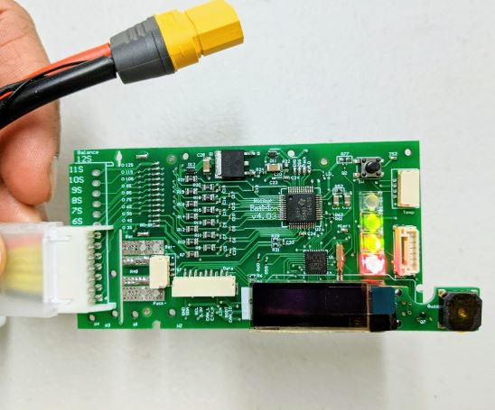
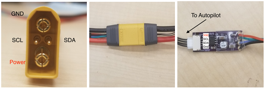

# Rotoye Batmon

[Rotoye Batmon](https://rotoye.com/batmon/)은 기성품인 리튬 이온 및 LiPo 배터리에 스마트 배터리 기능을 추가하는 키트입니다. 독립형 장치로 또는 공장에서 조립된 스마트 배터리의 일부로 구입할 수 있습니다.

:::note
작성 당시에는 [PX4의 사용자 지정 분기를 구축](#build-px4-firmware)함으로써만 Batmon을 사용할 수 있습니다. 코드라인의 지원은 [PR 승인](https://github.com/PX4/PX4-Autopilot/pull/16723) 대기 중입니다.
:::





## 구매

[Rotoye Store](https://rotoye.com/batmon/): Batmon 키트, 맞춤형 스마트 배터리 및 액세서리


## 배선

Rotoye Batmon 시스템은 I2C 핀이 있는 XT-90 배터리 커넥터와 광절연기 보드를 사용하여 데이터를 전송합니다.



자세한 내용은 [여기](https://github.com/rotoye/batmon_reader)를 참고하십시오.


## 소프트웨어 설정

### PX4 펌웨어 빌드

1. [ Rotoye의 PX4 포크](https://github.com/rotoye/PX4-Autopilot/tree/batmon_4.03) 복제 또는 다운로드:
   ```bash
   git clone https://github.com/rotoye/PX4-Autopilot.git
   cd PX4-Autopilot
   ```
1. *batmon_4.03* 브랜치 확인
   ```bash
   git fetch origin batmon_4.03
   git checkout batmon_4.03
   ```
1. 대상 보드의 [펌웨어 빌드 및 업로드](../dev_setup/building_px4.md)

### Configure Parameters

*QGroundControl* 에서:
1. 다음 [매개변수](../advanced_config/parameters.md)를 설정합니다.
   - `BATx_SOURCE`를 `External`,
   - `SENS_EN_BAT`를 `true`,
   - `BAT_SMBUS_MODEL`를 `3:Rotoye`
1. [MAVLink 콘솔](https://docs.qgroundcontrol.com/master/en/analyze_view/mavlink_console.html)을 엽니다.
1. 콘솔에서 [batt_smbus 드라이버](../modules/modules_driver.md)를 시작합니다. 예를 들어 동일한 버스에서 두 개의 BatMon을 실행하려면:
   ```sh 
   batt_smbus start -X -b 1 -a 11 # External bus 1, address 0x0b  
   batt_smbus start -X -b 1 -a 12 # External bus 1, address 0x0c
   ```

## 추가 정보

[빠른 시작 가이드](https://rotoye.com/batmon-tutorial/) (Rotoye)
