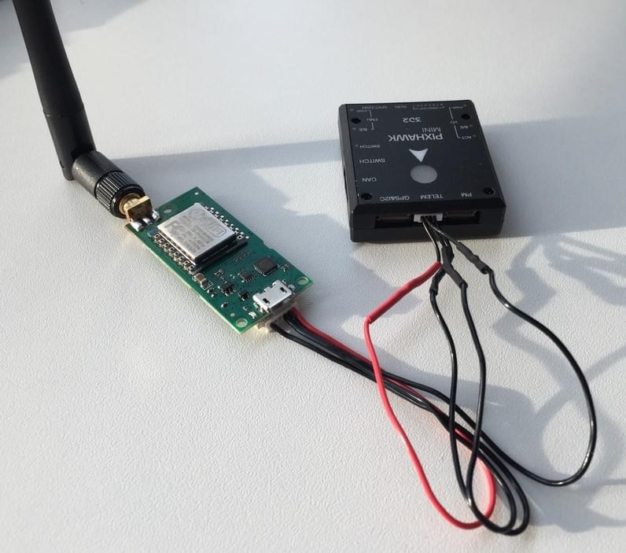
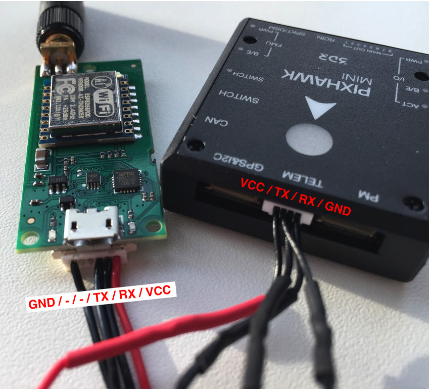

# 3DR WiFi 텔레메트리 (단종됨)

::::note </ 0>이 제품은 더 이상 제조되지 않거나 3DR에서 구매할 수 없습니다.
:::

*3DR WiFi Telemetry Radio*는 PX4에서 지원됩니다. 비행 콘트롤러의 `TELEM1` 포트에 연결하면 아래의 세부 정보가 있는 차량용 WiFi "핫스팟"이 생성됩니다.

```sh
essid: APM_PIX
비밀번호: 12345678
```

지상 관제소를 위의 WiFi에 연결합니다. 연결 후 기체는 자동으로 감지되어 *QGroundControl*에 연결됩니다.

 