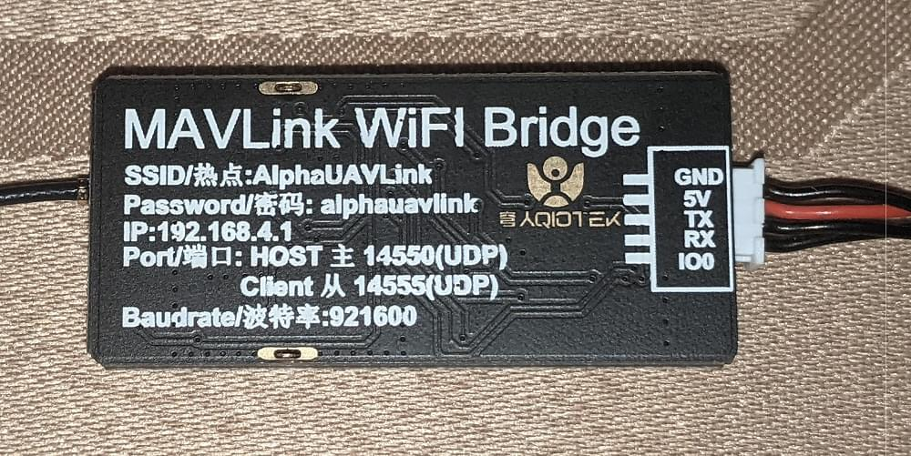
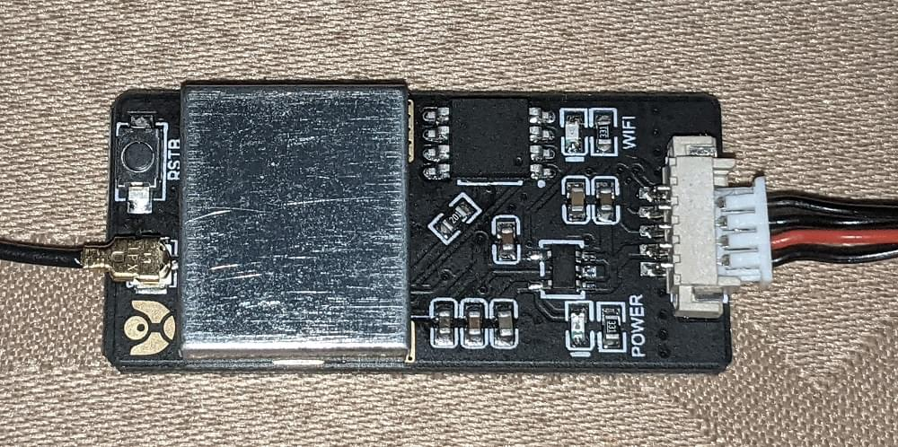

# ESP8266 WiFi 모듈

ESP8266와 유사품은 전체 TCP/IP와 마이크로 컨트롤러 기능을 제공하는 저렴한 Wi-Fi 모듈입니다. 모든 Pixhawk 시리즈 콘트롤러에서 사용 가능합니다.

:::tip ESP8266은 [Pixracer](../flight_controller/pixracer.md)와 함께 사용되는 *실제적인* 기본 WiFi 모듈입니다 (일반적으로 번들로 함꼐 제공됨).
:::

## 구매처

ESP8266 모듈은 여러 곳에서 쉽게 구매할 수 있습니다. 몇 군데의 구매처는 아래에 나열되어 있습니다.

대부분의 모듈은 3.3V 입력 (전용)을 지원하지만 일부 비행 콘트롤러(예 : Pixhawk 4)는 5V에서 출력됩니다 (호환성을 확인하고 필요한 경우 전압을 낮추어야합니다).

3.3V 사용 모듈:

* [WRL-17146](https://www.sparkfun.com/products/13678) (Sparkfun)
* [AI 클라우드](https://us.gearbest.com/boards-shields/pp_009604906563.html) - 단종됨 (GearBeast)

5.0V 사용 모듈:

* [AI Thinker](https://www.banggood.com/Wireless-Wifi-to-Uart-Telemetry-Module-With-Antenna-for-Mini-APM-Flight-Controller-p-1065339.html) (Banggood)
* [AlphaUAVLink](https://www.banggood.com/MAVLink-Wifi-Bridge-2_4G-Wireless-Wifi-Telemetry-Module-with-Antenna-for-Pixhawk-APM-Flight-Controller-p-1428590.html) (Banggood)

## Pixhawk/PX4 설정

:::tip
먼저 PX4 호환 ESP8266 펌웨어([아래 참조](#esp8266-flashing-firmware-advanced))로 라디오를 *업데이트*할 수 있습니다. 제조 매뉴얼에 업데이트가 필요한 지 확인하십시오.
:::

무료 UART에서 ESP8266을 Pixhawk 시리즈 비행 콘트롤러(예 : Pixracer)에 연결합니다.

USB로 비행 컨트롤러를 지상국에 연결합니다 (WiFi가 아직 완전히 설정되지 않았으므로).

*QGroundControl* 사용법:

* [최신 PX4 펌웨어를 비행 컨트롤러에 로드합니다](../config/firmware.md).
* ESP8266 연결용 [직렬 포트를 설정](../peripherals/serial_configuration.md)합니다. ESP8266에 설정된 값과 일치하려면 전송 속도를 921600으로 설정하여야 합니다.

무선 연결용 비행 콘트롤러 직렬 포트를 설정후에는 지상국과 기체간의 물리적 USB 연결을 해제할 수 있습니다.

## ESP8266을 통한 QGC 연결

The module exposes a WiFi hotspot that your ground station computer can use to connect to the vehicle.

:::note
The settings for the ESP8266 hotspot should be provided with the board (e.g. typically printed on the reverse side of the board or on the packaging).

A common factory network setting is:

* **SSID:** PixRacer
* **Password:** pixracer
* **WiFi Channel:** 11
* **UART speed:** 921600

Other modules may use settings like this:

* **SSID:** IFFRC_xxxxxxxx
* **Password:** 12345678
* **IP:** 192.168.4.1
* **Port:** 6789 (TCP)

Examples of boards from AlphaUILink and DOITING are shown below:

   
:::

On your wifi-enabled *QGroundControl* ground station computer/tablet, find and connect to the open wireless network for your ESP8266. On a Windows computer the connection settings for a network with name **Pixracer** and default password **pixracer** point will look like this:

 

*QGroundControl* will automatically connect to the vehicle when the ground station computer is attached to a WiFi access point named "Pixracer".

If you're using a module with any other WiFi name you will need to manually set up the QGroundControl WiFi connection, as shown in the following section.

## Configure QGC with non-standard WiFi connections

*QGroundControl* will automatically connect to the vehicle when the ground station computer is attached to the "Pixracer" WiFi access point. For any other access point name you will need to manually create a custom comm link:

1. Go to [Application Settings > Comm Links](https://docs.qgroundcontrol.com/master/en/SettingsView/SettingsView.html)
2. Add new connection with appropriate settings.
3. Select the new connection, and click **Connect**.
4. The vehicle should now connect

## Verify

You should now see HUD movement on your QGC computer via wireless link and be able to view the summary panel for the ESP8266 WiFi Bridge (as shown below).

:::tip
If you have any problem connecting, see [QGC Installation/Configuration Problems](https://docs.qgroundcontrol.com/en/Support/troubleshooting_qgc.html#waiting_for_connection).
:::

## ESP8266 Flashing/Firmware (Advanced)

ESP8266 modules from different manufacturers may not have appropriate ESP8266 firmware pre-installed. The instructions below explain how to update radios with the correct version.

### Pre Built Binaries

[MavLink ESP8266 Firmware V 1.2.2](http://www.grubba.com/mavesp8266/firmware-1.2.2.bin)

### Build From Sources

The [firmware repository](https://github.com/dogmaphobic/mavesp8266) contains instructions and all the tools needed for building and flashing the ESP8266 firmware.

### Updating the Firmware OTA

If you have firmware 1.0.4 or greater installed, you can do the update using the ESP's *Over The Air Update* feature. Just connect to its AP WiFi link and browse to: `http://192.168.4.1/update`. You can then select the firmware file you downloaded above and upload it to the WiFi Module.

:::tip
This is the easiest way to update firmware!
:::

### Flashing the ESP8266 Firmware

Before flashing, make sure you boot the ESP8266 in *Flash Mode* as described below. If you cloned the [MavESP8266](https://github.com/dogmaphobic/mavesp8266) repository, you can build and flash the firmware using the provided [PlatformIO](http://platformio.org) tools and environment. If you downloaded the pre-built firmware above, download the [esptool](https://github.com/espressif/esptool) utility and use the command line below:

    esptool.py --baud 921600 --port /dev/your_serial_port write_flash 0x00000 firmware_xxxxx.bin
    

Where:

* **firmware_xxxxx.bin** is the firmware you downloaded above
* **your_serial_port** is the name of the serial port where the ESP8266 is connected to (`/dev/cu.usbmodem` for example)

### Wiring for Flashing the Firmware

:::warning
Most ESP8266 modules support 3.3 volts (only), while some flight controllers (e.g. Pixhawk 4) output at 5V. Check compatibility and step down the voltage if needed.
:::

There are various methods for setting the ESP8266 into *Flash Mode* but not all USB/UART adapters provide all the necessary pins for automatic mode switching. In order to boot the ESP8266 in *Flash Mode*, the GPIO-0 pin must be set low (GND) and the CH_PD pin must be set high (VCC). This is what my own setup looks like:

I built a cable where RX, TX, VCC, and GND are properly wired directly from the FTDI adapter to the ESP8266. From the ESP8266, I left two wires connected to GPIO-0 and CH_PD free so I can boot it either normally or in flash mode by connecting them to GND and VCC respectively.

#### ESP8266 (ESP-01) Pinout

#### Flashing Diagram using an FTDI USB/UART Adapter

