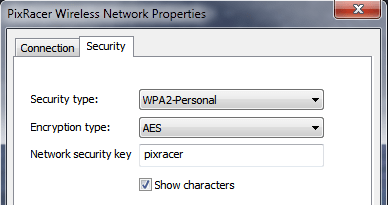

# ESP8266 WiFi 모듈

ESP8266와 유사품은 전체 TCP/IP와 마이크로 컨트롤러 기능을 제공하는 저렴한 Wi-Fi 모듈입니다. 모든 Pixhawk 시리즈 콘트롤러에서 사용 가능합니다.

:::tip ESP8266은 [Pixracer](../flight_controller/pixracer.md)와 함께 사용되는 *실제적인* 기본 WiFi 모듈입니다 (일반적으로 번들로 함꼐 제공됨).
:::

## 구매처

ESP8266 모듈은 여러 곳에서 쉽게 구매할 수 있습니다. 몇 군데의 구매처는 아래에 나열되어 있습니다.

대부분의 모듈은 3.3V 입력 (전용)을 지원하지만 일부 비행 콘트롤러(예 : Pixhawk 4)는 5V에서 출력됩니다 (호환성을 확인하고 필요한 경우 전압을 낮추어야합니다).

3.3V 사용 모듈:

* [WRL-17146](https://www.sparkfun.com/products/13678) (Sparkfun)
* [AI 클라우드](https://us.gearbest.com/boards-shields/pp_009604906563.html) - 단종됨 (GearBeast)

5.0V 사용 모듈:

* [AI Thinker](https://www.banggood.com/Wireless-Wifi-to-Uart-Telemetry-Module-With-Antenna-for-Mini-APM-Flight-Controller-p-1065339.html) (Banggood)
* [AlphaUAVLink](https://www.banggood.com/MAVLink-Wifi-Bridge-2_4G-Wireless-Wifi-Telemetry-Module-with-Antenna-for-Pixhawk-APM-Flight-Controller-p-1428590.html) (Banggood)

## Pixhawk/PX4 설정

:::tip
먼저 PX4 호환 ESP8266 펌웨어([아래 참조](#esp8266-flashing-firmware-advanced))로 라디오를 *업데이트*할 수 있습니다. 제조 매뉴얼에 업데이트가 필요한 지 확인하십시오.
:::

무료 UART에서 ESP8266을 Pixhawk 시리즈 비행 콘트롤러(예 : Pixracer)에 연결합니다.

USB로 비행 컨트롤러를 지상국에 연결합니다 (WiFi가 아직 완전히 설정되지 않았으므로).

*QGroundControl* 사용법:

* [최신 PX4 펌웨어를 비행 컨트롤러에 로드합니다](../config/firmware.md).
* ESP8266 연결용 [직렬 포트를 설정](../peripherals/serial_configuration.md)합니다. ESP8266에 설정된 값과 일치하려면 전송 속도를 921600으로 설정하여야 합니다.

무선 연결용 비행 콘트롤러 직렬 포트를 설정후에는 지상국과 기체간의 물리적 USB 연결을 해제할 수 있습니다.

## ESP8266을 통한 QGC 연결

이 모듈은 지상국과 기체 연결용 WiFi 핫스팟을 노출합니다.

:::note ESP8266 핫스팟 설정은 보드와 함께 제공됩니다. 일반적으로 보드 뒷면 또는 포장지에 인쇄되어 있습니다.

일반적인 공장 네트워크 설정은 다음과 같습니다.

* **SSID:** PixRacer
* **비밀번호:** pixracer
* **WiFi Channel:** 11
* **UART 속도:** 921600

다른 모듈은 다음과 같은 설정을 사용할 수 있습니다.

* **SSID:** IFFRC_xxxxxxxx
* **비밀번호:** 12345678
* **IP:** 192.168.4.1
* **포트:** 6789 (TCP)

AlphaUILink 및 DOITING의 보드 예는 다음과 같습니다.

   
:::

Wi-Fi가 활성화된 *QGroundControl* 지상국 컴퓨터/태블릿에서 ESP8266용 무선 네트워크를 연결합니다. Windows 컴퓨터에서 이름이 **Pixracer**이고 암호가 **pixracer**인 네트워크 연결 설정은 다음과 같습니다.

 

*QGroundControl*은 지상국 컴퓨터가 "Pixracer"라는 이름의 WiFi에 연결되면 자동으로 기체에 연결됩니다.

다른 WiFi 이름을 가진 모듈을 사용하는 경우에는, 다음 섹션에 표시된대로 QGroundControl WiFi 연결을 수동으로 설정하여야 합니다.

## 비표준 WiFi 연결 QGC 설정

*QGroundControl*은 지상국 컴퓨터가 "Pixracer"라는 이름의 WiFi에 연결되면 자동으로 기체에 연결됩니다. 다른 이름의 액세스 포인트에는 사용자 지정 통신 연결을 수동으로 생성하여야 합니다.

1. [애플리케이션 설정 &gt; 통신 링크](https://docs.qgroundcontrol.com/master/en/SettingsView/SettingsView.html)로 이동합니다.
2. 적절한 설정으로 새 연결을 추가합니다.
3. 새 연결을 선택하고, **연결**을 클릭합니다.
4. 이제 기체에 연결되어야 합니다.

## 확인

이제 무선 링크를 통해 QGC 컴퓨터에서 HUD 이동을 확인하고, ESP8266 WiFi 브리지에 대한 요약 패널을 볼 수 있습니다 (아래 그림 참조).

:::tip
연결 문제가 발생하면 [QGC 설치/설정 문제](https://docs.qgroundcontrol.com/en/Support/troubleshooting_qgc.html#waiting_for_connection)를 참고하십시오.
:::

## ESP8266 플래싱/펌웨어 (고급)

다른 제조업체의 ESP8266 모듈에는 사전에 적절한 ESP8266 펌웨어가 설치되어 있지 않을 수 있습니다. 아래 지침은 적절한 버전으로 라디오를 업데이트 방법을 설명합니다.

### 사전 빌드 바이너리

[MavLink ESP8266 Firmware V 1.2.2](http://www.grubba.com/mavesp8266/firmware-1.2.2.bin)

### 소스 빌드

[펌웨어 저장소](https://github.com/dogmaphobic/mavesp8266)에는 ESP8266 펌웨어 빌드와 플래시 지침과 도구들이 있습니다.

### 펌웨어 OTA 업데이트

펌웨어 1.0.4 이상에서는 ESP의 *무선 업데이트* 기능을 사용하여 업데이트 가능합니다. AP WiFi 링크에 연결하고 `http://192.168.4.1/update`로 이동합니다. 위에서 다운로드한 펌웨어 파일을 WiFi 모듈에 업로드할 수 있습니다.

:::tip
이것은 펌웨어를 업데이트하는 가장 손쉬운 방법입니다.
:::

### ESP8266 펌웨어 플래싱

플래싱전에 아래 설명대로 *플래시 모드*에서 ESP8266을 부팅합니다. [MavESP8266](https://github.com/dogmaphobic/mavesp8266) 저장소를 복제한 경우 제공된 [PlatformIO](http://platformio.org) 도구 및 환경을 사용하여 펌웨어를 빌드하고 플래시할 수 있습니다. 위에서 사전 빌드 펌웨어를 다운로드한 경우에는 [esptool](https://github.com/espressif/esptool) 유틸리티를 다운로드후 아래 명령어를 실행하십시오.

    esptool.py --baud 921600 --port /dev/your_serial_port write_flash 0x00000 firmware_xxxxx.bin
    

여기서:

* **firmware_xxxxx.bin**은 위에서 다운로드 한 펌웨어입니다.
* **your_serial_port**는 ESP8266이 연결된 직렬 포트의 이름입니다 (예 : `/dev/cu.usbmodem`).

### 펌웨어 플래싱을 위한 배선

:::warning
대부분의 ESP8266 모듈은 3.3V (전용)를 지원하지만, 일부 비행 콘트롤러(예 : Pixhawk 4)는 5V에서 출력됩니다. 호환성을 확인하고, 필요한 경우 전압을 낮추어야 합니다.
:::

ESP8266을 *플래시 모드*로 설정하는 다양한 방법이 있지만, 모든 USB/UART 어댑터가 자동 모드 전환에 필요한 모든 핀을 제공하는 것은 아닙니다. *플래시 모드*에서 ESP8266을 부팅하려면, GPIO-0 핀을 로우(GND)로 설정하고 CH_PD 핀을 하이(VCC)로 설정합니다. 설정 예은 다음과 같습니다.

RX, TX, VCC 및 GND가 FTDI 어댑터에서 ESP8266으로 연결되는 케이블을 직접 제작하였습니다. ESP8266에서 GPIO-0 및 CH_PD에 연결된 두 개의 와이어를 여분으로 남겨 두었습니다. 각각 GND 및 VCC에 연결하여 플래시 모드로 부팅 가능합니다.

#### ESP8266 (ESP-01) 핀배열

#### FTDI USB / UART 어댑터를 사용한 플래싱 다이어그램

