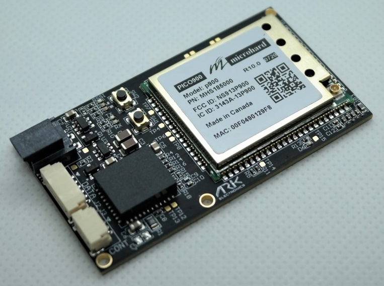
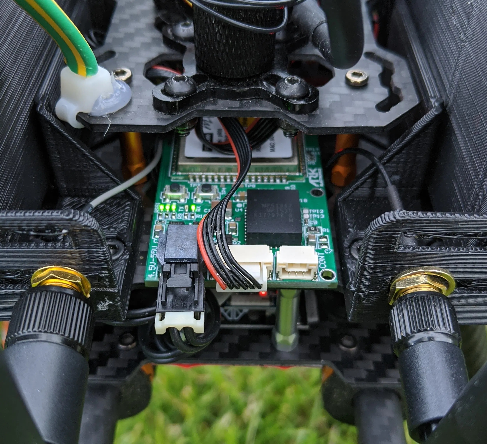
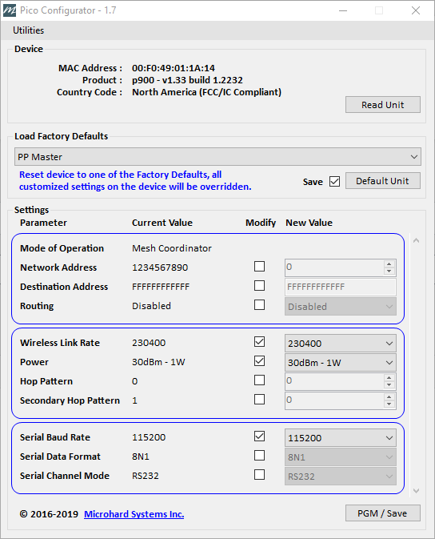
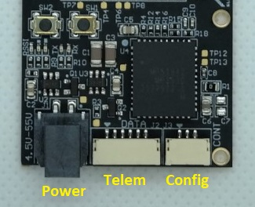

# Microhard 직렬 라디오

[Microhard Pico Serial](http://microhardcorp.com/P900.php) 무전기는 차량 무전기와 GCS 간의 MAVLink 통신이 가능합니다. Microhard Pico 직렬 라디오는 포인트 투 포인트, 포인트 투 멀티 포인트와 메시 모드를 지원하는 최대 1W 출력의 라디오입니다. Microhard Pico 라디오는 AES-256 암호화로 주문할 수도 있습니다.

기본 설정을 사용시, 출력이 1W로 설정의 대략적인 범위는 8km (5 마일)입니다. 단일 지상국 라디오를 사용하여 지점 대 다중 지점 또는 메시를 사용하여 여러 기체와 통신 가능합니다. 기체의 MAVLINK ID는 각기 달라야 합니다.

## 구매:

* [1W 900MHz 직렬 텔레메트리 라디오](https://arkelectron.com/product/1w-900mhz-serial-telemetry-air-radio/) (기체)
* [1W 900MHz 직렬 텔레메트리 라디오](https://arkelectron.com/product/1w-900mhz-serial-telemetry-ground-radio/) (지상국)
* [1W 2.4GHz 직렬 텔레메트리 라디오](https://arkelectron.com/product/1w-2400mhz-serial-telemetry-radio/) (기체)
* [1W 2.4GHz 직렬 텔레메트리 라디오](https://arkelectron.com/product/1w-2400mhz-usb-serial-telemetry-radio/) (지상국)

## 연결

### 기체 라디오
차량 라디오를 비행 콘트롤러 `TELEM1` 포트에 연결합니다 (모든 무료 직렬 포트를 사용할 수 있음). 이를 위하여 Pixhawk 표준 6핀 JST GH 텔레메트리 케이블이 제공됩니다.

라디오의 출력 전력이 100mW 미만으로 설정된 경우에는 텔레메트리 케이블로 전원을 공급할 수 있습니다. 더 높은 출력의 라디오는 2 핀 Molex Nano-Fit (즉, 배터리에서)를 통하여 별도로 전원을 공급하여야 합니다.

### 지상국 라디오

USB C를 통하여 지상 라디오를 지상국에 연결합니다. USB PD를 사용하는 경우에는 라디오에 별도로 전원을 공급할 필요가 없습니다 (1W 전원 공급 가능).

## 설정

지상 라디오, 에어 라디오, PX4와 QGroundControl은 모두 동일한 전송 속도로 설정되어야합니다.

PX4는 텔레메트리 라디오에 `TELEM1`을 사용하도록 설정되며, 기본전송속도는 57600 (권장)입니다. 이 포트 및 전송 속도를 사용하는 경우에는 추가로 PX4 설정할 필요는 없습니다.

:::note
[MAVLink 주변기기](../peripherals/mavlink_peripherals.md) 지침에 따라 다른 직렬 포트로 설정하거나 전송속도를 변경할 수 있습니다.
:::

라디오는 [Pico Config](https://arkelectron.com/wp-content/uploads/2021/04/PicoConfig-1.7.zip)를 사용하여 설정합니다 (Windows 에만 해당).

차량 라디오 설정에는 라디오의 3핀 JST-GH Config 포트와 *Pico Config*를 실행하는 Windows PC 간에 FTDI 어댑터를 연결하여합니다 (라디오에 전원이 공급되어야 하며 배터리 또는 비행 콘트롤러의 `TELEM1` 포트에 대한 데이터 연결). *Pico Config*는 자동으로 라디오를 감지합니다. 전송속도를 PX4 (및 지상국 라디오)와 일치하도록 설정합니다.

지상국 라디오 USB C 연결은 라디오 설정(및 원격 측정 데이터)에 사용할 수 있습니다. *Pico Config*는 설정 포트를 자동으로 감지하고 연결합니다. 전송속도가 PX4와 일치하도록 설정하십시오.

라디오와 PX4가 동일한 전송속도로 설정되면, 라디오로 QGroundControl을 기체에 연결할 수 있습니다. *QGroundControl*은 라디오를 자동으로 감지하지 않으므로 먼저 [응용 프로그램 설정 > 통신 링크에서 새 "직렬 연결"을 만듭니다.](https://docs.qgroundcontrol.com/master/en/SettingsView/SettingsView.html) (PX4/라디오에서 사용하는 것과 동일한 전송속도 설정).
