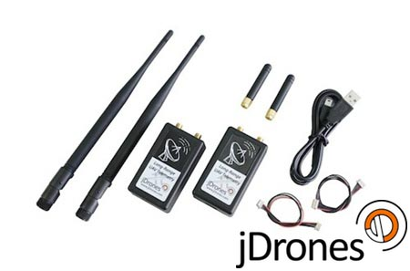

# RFD900 장거리 텔레메트리

[jDrones ](http://store.jDrones.com) 및 [ RFDesign ](http://rfdesign.com.au/)에서는 * 장거리* [ SiK](../telemetry/sik_radio.md) 호환 텔레메트리 무선 통신 장치를 제공합니다. 라디오는 정상 안테나와 5km 이상의 범위에서 신뢰할 수 있는 연결성을 제공합니다(더 큰 범위를 달성했다고 보고됨).

:::tip
*jDrones* have productized *RFDesign* modems (added a casing with power management, filtering and other electronics inside, along with cables to connect to popular flight controllers, and individually validated antennas). The first such modem was the *RFD900*, but both *RFDesign* and *jDrones* have since iterated to new versions.
:::

The *jDrones* radios have a JST-GH connector, and come with cables for: *JST-GH to JST-GH* and *JST-GH to DF-13*. They can therefore be used in a "plug-n-play" way with most [Pixhawk Series](../flight_controller/pixhawk_series.md) controllers (you might have to change/use an appropriate connector for some "non-standard" boards).

There are a number of versions available:

* jD-RF900Plus Longrange (900Mhz)</a> (미국)
* jD-RF868Plus Longrange (868Mhz)</a> (유럽)
* [RFD 900+ 모뎀](http://store.rfdesign.com.au/rfd-900p-modem/)
* [RFD 868+ 모뎀](http://store.rfdesign.com.au/rfd-868-modem/)
* RFD900u</a> \(작은\)