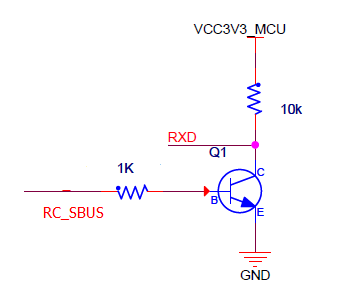
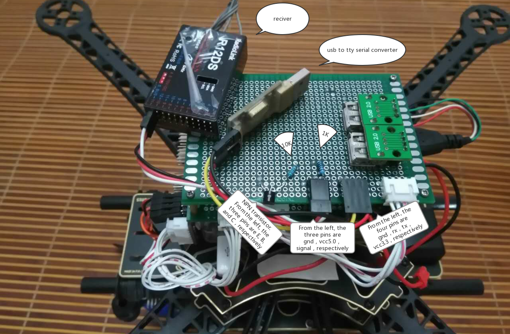

# Linux에서 RC 수신기 연결(S.Bus 포함)

직렬 포트에서 [지원되는 RC 수신기](../getting_started/rc_transmitter_receiver.md)를 연결하고 사용하도록, PX4 Linux 기반 자동조종장치 설정 방법을 설명합니다.

S.Bus 이외의 RC 유형의 경우 수신기는 직렬 포트에 직접 연결하거나 USB-TTY 직렬 케이블(예: PL2302 USB-직렬 TTL 변환기)을 통하여 USB에 연결할 수 있습니다.

:::note
For an S.Bus receiver (or encoder - e.g. from Futaba, RadioLink, etc.) you will usually need to connect the receiver and device via a [signal inverter circuit](#signal_inverter_circuit), but otherwise the setup is the same.
:::

그런 다음, 아래와 같이 기기에서 [PX4 RC 드라이버를 시작](#start_driver)합니다.


<a id="start_driver"></a>

## 드라이버 시작

특정 UART에서 RC 드라이버를 시작하려면(예: 이 경우 `/dev/ttyS2`):
```
rc_input start -d /dev/ttyS2
```

기타 드라이버 사용 정보는 [rc_input](../modules/modules_driver.md#rc-input)을 참고하십시오.


<a id="signal_inverter_circuit"></a>

## 신호 반전 회로(S.Bus 전용)

S.Bus는 *반전된* UART 통신 신호입니다.

일부 직렬 포트/비행 컨트롤러는 반전된 UART 신호를 읽을 수 있지만, 대부분은 신호 반전을 복원하기 위하여 수신기와 직렬 포트 사이에 신호 인버터 회로가 필요합니다.

:::tip
이 회로는 직렬 포트 또는 USB-TTY 직렬 변환기를 통해 S.Bus 원격 제어 신호 수신에 필요합니다.
:::

이 섹션에서는 적절한 회로를 만드는 방법을 설명합니다.

### 필수 부품

* 1x NPN 트랜지스터 (예: NPN S9014 TO92)
* 1x 10K 저항
* 1x 1K 저항

:::note
전류 드레인이 매우 낮으므로, 모든 유형/모델의 트랜지스터를 사용할 수 있습니다.
:::

### 회로 구성도/연결

아래에 설명(그리고 회로 구성도)하는 바와 같이 회로 소자를 연결하십시오:

* S.Bus 신호선 &rarr; 1K 저항 &rarr; NPN 트랜지스터 베이스
* NPN 트랜지스터 방출 &rarr; GND
* 3.3VCC &rarr; 10K 저항 &rarr; NPN 트랜지스터 컬렉션 &rarr; USB-to-TTY rxd
* 5.0VCC &rarr; S.Bus VCC
* GND &rarr; S.Bus GND



아래 이미지에서는 빵판에서 연결된 모습을 보여줍니다.


