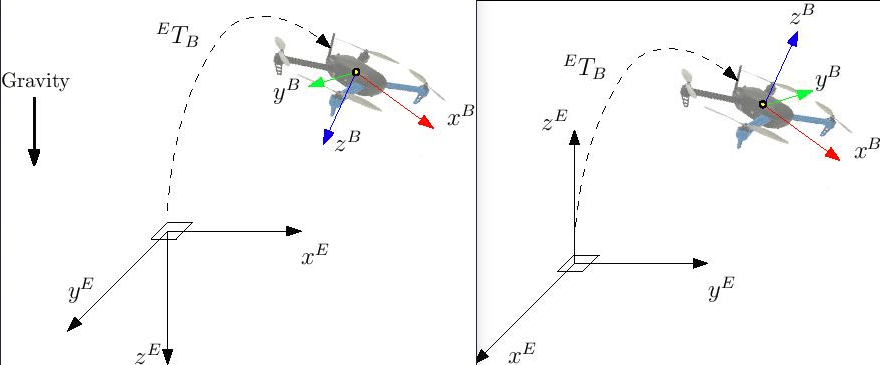

# 움직임 감지 기술로 비행하기 (VICON, 광추적)

:::warning
**작성중입니다**.

이 주제에서는 [외부 위치 추정(ROS)](../ros/external_position_estimation.md)과 약간 겹칩니다.
:::

VICON이나 광추적 같은 실내 움직임 감지 체계는 기체 상태 추정시 위치와 자세 정보를 제공하거나, 분석시 실제 값으로 활용할 수 있습니다. 움직임 감지 데이터는 지역 원점을 기준으로 PX4의 지역 위치 추정치 업데이트에 활용할 수 있습니다. 선택에 따라 움직임 감지 체계의 방위(Yaw)값도 자세 추정기에 통합할 수 있습니다.

움직임 감지 체계 가져온 자세 (위치 및 방향) 데이터는 MAVLink의 [ATT_POS_MOCAP](https://mavlink.io/en/messages/common.html#ATT_POS_MOCAP) 메시지에 실어 자동 비행 장치로 전달합니다. 데이터 표현 방식용 좌표 프레임은 아래 절을 참고하십시오. [mavros](../ros/mavros_installation.md) ROS-Mavlink 인터페이스에는 이 메시지를 보낼 기본 플러그인이 있습니다. 순수한 C/C++ 코드와 MAVLink 라이브러리를 직접 사용하여 보낼 수도 있습니다.

## 처리 구조

온전한 통신 수행을 위해 **내장 컴퓨터**(예: 라즈베리 파이, 오드로이드 등)로의 동영상 촬영 데이터 전송 방식을 **강력 추천**합니다. The onboard computer can be connected to the motion capture computer through WiFi, which offers reliable, high-bandwidth connection.

Most standard telemetry links like 3DR/SiK radios are **not** suitable for high-bandwidth motion capture applications.

## 좌표 프레임

이 절에서는 적당한 참조 프레임 체계의 설정 방법을 알려드리겠습니다. 다양한 표현법이 있지만 ENU와 NED 방식을 활용하겠습니다.

* ENU is a ground-fixed frame where **X** axis points East, **Y** points North and **Z** up. The robot/vehicle body frame is **X** towards the front, **Z** up and **Y** towards the left.
* NED has **X** towards North, **Y** East and **Z** down. The robot/vehicle body frame has **X** towards the front, **Z** down and **Y** accordingly.

Frames are shown in the image below. NED on the left, ENU on the right: 

With the external heading estimation, however, magnetic North is ignored and faked with a vector corresponding to world *x* axis (which can be placed freely at mocap calibration); yaw angle will be given respect to local *x*.

:::warning
When creating the rigid body in the motion capture software, remember to first align the robot with the world **X** axis otherwise yaw estimation will have an initial offset.
:::

## Estimator choice

### LPE and Attitude Estimator Q

### EKF2

The ROS topic for motion cap `mocap_pose_estimate` for mocap systems and `vision_pose_estimate` for vision. Check [mavros_extras](http://wiki.ros.org/mavros_extras) for further info.

## Testing

## Troubleshooting
